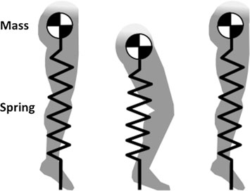
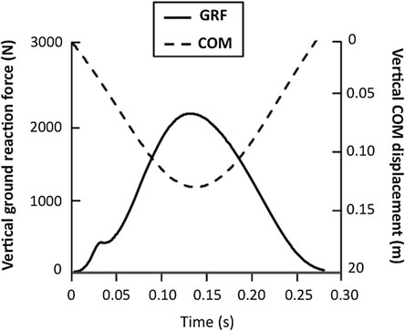
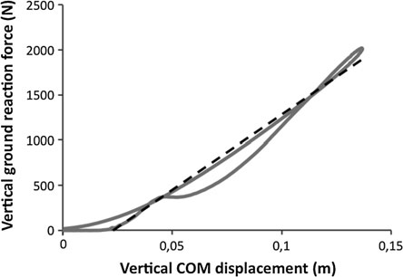

# 第 6 章：测量跳跃时下肢刚度的简单方法

测量下限的简单方法

跳跃时肢体僵硬

Teddy Caderby 和 Georges Dalleau 摘要 下肢僵硬引起了科学界和体育界的极大兴趣，因为它对运动表现和肌肉骨骼损伤风险有影响。 在文献中，跳跃过程中下肢僵硬已被广泛研究，因为它构成了简单的弹跳步态。 跳跃时下肢刚度的表征通常基于称为“弹簧质量模型”的生物力学模型。 该模型将整个身体同化为一个由单个弹簧支撑的质量组成的振荡系统，它代表了跳跃的地面接触阶段下肢的机械行为。 弹簧的刚度，称为“腿部弹簧”，代表下肢肌肉骨骼系统的整体刚度。 在本章中，我们将描述与跳跃时腿部刚度概念相关的生物力学方面，并将提出一种简单的测量方法。 该方法可以仅根据个体的体重以及跳跃期间的接触和飞行时间来计算腿部刚度，这两者都可以通过简单的技术设备获得。 这种简单的方法对于评估现场环境以及实验室条件下的腿部刚度可能特别有利。

## 6.1

简介 跳跃测试通常用于体育领域，用于评估运动员的身体素质，特别是确定其下肢的机械特性（Joyce 和 Lewindon 2016）。 最流行的跳跃测试可能是垂直跳跃，例如反向运动跳跃、蹲跳或跳伞，其中包括运动员将其重心尽可能提高到离地面更高的位置。 因为它需要在身体活动和运动科学系 IRISSE EA4075, 留尼汪大学, 117 Rue Du Général Ailleret, 97430 Le Tampon, La Réunion, France 上产生高力量水平电子邮件：georges.dalleau@univ-reunion.fr

在短时间间隔中，垂直弹跳被认为是最具爆炸性的任务之一（Samozino et al. 2008）。 因此，垂直弹跳已被广泛用于评估下肢的机械力量，并且文献中提出了各种方法来在野外环境中测量它（例如 Bosco 等人，1983 年；Gray 等人，1962 年；Samozino 等人，2008 年，参见第 4 章和第 5 章）。 另一种经常用于评估下肢机械性能的跳跃测试是垂直跳跃。 垂直跳跃，以下简称“跳跃”，是通过最小化腿部关节（即髋关节、膝关节和踝关节）的角位移，在双腿1上重复原地弹跳（Lamontagne 和 Kennedy 2013）。 鉴于跳跃频率高，与重复的反向运动跳跃测试相比大约是两倍（Bosco 1999），下肢在跳跃过程中比其他跳跃过程中保持更僵硬。 这使得它成为评估下肢僵硬的相关任务（Kuitunen et al. 2011）。 刚度通常被定义为物体抵抗变形的能力（Serpell 等人，2012），它表征了结构的弹性行为。 它通常与身体储存和返回弹性应变能的能力相关，这是一个潜在影响人体运动效率和表现的因素（Cavanagh 和 Kram 1985；Komi 和 Bosco 1978）。 确实有越来越多的证据表明下肢僵硬与运动表现有关（有关评论，请参见 Brazier 等人，2014 年；Butler 等人，2003 年；McMahon 等人，2012 年）。 例如，人们发现下肢僵硬与耐力跑（Dalleau et al. 1998；Dutto and Smith 2002；Heise and Martin 1998；Kerdok et al. 2002；McMahon et al. 1987）、短跑（Bret et al. 2002；Chelly and Denis 2001）以及跳远（Seyfarth）的表现有关。 等人，1999 年，2000 年）。 尽管在这个话题上还没有明确的共识，但似乎可能存在一个最佳的腿部刚度水平来最大化运动表现（Arampatzis et al. 2001；McMahon et al. 2012；Pearson and McMahon 2012；Seyfarth et al. 1999）。 硬度太大或太小都可能是有害的，并可能导致肌肉骨骼损伤（Butler 等人，2003 年；Flanagan 等人，2008 年；Williams 等人，2001 年）。 鉴于其对运动表现和受伤风险的影响，下肢僵硬是科学和体育界的一个重要课题。 在本章中，我们将首先介绍与跳跃时下肢僵硬的概念和评估相关的生物力学方面。 在此背景下，我们将描述通常用于研究下肢刚度的生物力学模型、参考测量方法及其局限性。 其次，我们将介绍一种测量跳跃时下肢刚度的简单方法，并讨论该方法的应用和局限性。 1虽然垂直跳跃也可以用单腿进行，但我们在本章中仅讨论与两条腿跳跃相关的方面。

## 6.2

跳跃时下肢僵硬

## 6.2.1

刚度的机械定义 从力学的角度来看，刚度是指物体抵抗长度变化的能力。 对于弹性体2（例如弹簧），刚度可以根据施加到弹性体的力与产生的长度变化之间存在的关系来确定。 这就是所谓的胡克定律。 根据该定律，使弹性体变形（例如拉伸或压缩它）所需的力与所产生的变形成正比，即 长度的变化以及身体刚度的变化。 那是：

$$ F = K \Delta L \quad (6.1) $$

其中 F 是施加的力（以牛顿为单位），K 是刚度（以牛顿米−1 为单位），DL 是长度变化（以米为单位）。 因此，刚度表示力与长度变化的比率：

K 1/4 F

DL ð6:2Þ 根据这个原理，刚度越高，使物体变形所需的力就越大。

## 6.2.2

人类跳跃中的类似弹簧的腿部行为人类跳跃经常使用弹簧质量模型来描述（Blickhan 1989；McMahon 和 Cheng 1990）。 该模型将整个身体同化为一个振荡系统，该系统由一个相当于身体质量的质量组成，并由一个表征下肢行为的无质量弹簧支撑。 在每次跳跃时，弹簧在地面接触阶段的前半段（腿部关节弯曲）期间压缩，并在地面接触阶段的后半段（腿部关节伸展）伸长，然后再进行后续的飞行阶段（图 6.1）。 因此，弹簧的刚度通常称为“腿部弹簧”，反映了下肢抵抗长度变化的能力。 尽管弹簧质量模型表面上是一个相当简单的模型，但它非常好地描述和预测了人类弹跳步态的力学，例如跳跃和跑步（例如 Blickhan 1989；Farley 和 Gonzalez 1996；He 等人 1991；McMahon 和 Cheng 1990）。 该模型的实验验证为 2 弹性体是指当引起变形的力被移除时，可变形的材料体恢复到其原始形状和尺寸。

测量下肢的简单方法……

跳跃主要通过跳跃期间的力平台测量来完成（Blickhan 1989；Farley 等人 1991；McMahon 和 Cheng 1990）。 测力平台是测量地面提供的反作用力，即地面反力的装置。 根据力平台测量，还可以计算身体质心的位移（Cavagna 1975）。 第一个分析力平台上跳跃的研究表明，垂直力和垂直质心位移（反映腿弹簧长度的变化）在地面接触阶段表现出典型的模式（例如 Blickhan 1989；McMahon 和 Cheng 1990）。 具体来说，这些研究表明，在接触阶段的前半段，垂直力增加，而质心向下移动，从而反映了腿弹簧的压缩。 最大垂直质心位移，即最大腿部弹簧压缩，大约在接触阶段的中间达到。 在接触阶段的后半段，垂直力减小，而质心向上移动，表明弹簧拉长。 简而言之，在接触阶段，垂直力信号和垂直质心位移都表现为正弦波（图 6.2）。 这种力-时间信号的正弦模式是线性弹簧-质量系统行为的特征，因此证实了跳跃的地面接触阶段的类似弹簧的腿部行为（Blickhan 1989；McMahon 和 Cheng 1990）。 图 6.1 弹簧质量模型的图示，通常用于描述人类跳跃的整体生物力学。 在这个模型中，整个身体由一个质量（相当于身体质量）和一个代表下肢行为的无质量线性弹簧来表示。 在地面接触的初始点，腿弹簧未受压缩。 在地面接触阶段的前半段，腿部弹簧随着腿部关节的弯曲而压缩，并且在接触阶段的大约中间达到最大压缩。 在地面接触阶段的后半段期间，在随后的空中阶段之前，腿部弹簧随着腿部关节的伸展而拉长。 3术语“线性”意味着弹簧的变形与所施加的力成线性比例。

## 6.2.3

跳跃时腿部刚度的调节腿部弹簧刚度代表着地接触阶段下肢肌肉骨骼系统的整体刚度（Farley 和 Morgenroth 1999）。 各种解剖结构都会导致这种僵硬，例如与地面接触的四肢的肌肉、肌腱、韧带、软骨和骨骼。 具体来说，腿部刚度对应于这些结构的所有基本刚度值的组合（Butler 等人，2003）。 然而，值得注意的是，腿部僵硬是可以调节的。 事实上，文献结果表明，人类能够使腿部僵硬适应不同的情况。 跳跃高度。 文献结果表明，腿部刚度随着跳跃高度的变化而变化（例如 Farley 和 Morgenroth 1999；Farley 等人 1991）。 准确地说，当个体在给定的跳跃频率下增加跳跃高度时，腿部僵硬会增加。 例如，Farley 和 Morgenroth (1999) 发现，在给定频率 (2.2 Hz) 下，当受试者以最大高度（他们的研究中为 9 厘米）跳跃时，腿部僵硬程度是其首选跳跃高度（3 厘米）时的两倍。 优选的跳跃高度是个体以给定频率自然跳跃的高度。 相反，值得注意的是，当不强加跳跃频率（即自由选择）时，腿部刚度不会随着跳跃高度而增加（Kuitunen 等人，2011）。 跳跃频率。 除了跳跃高度之外，大量研究表明跳跃频率也会影响腿部僵硬（Blickhan 1989；Dalleau et al. 2004；Farley et al. 1991；Granata et al. 2002；Hobara et al. 2010；Rapoport et al. 2003）。 事实上，已经观察到腿部刚度随着跳跃频率的增加而线性增加。 有趣的是，据观察，当受试者自由选择其跳跃频率时，他们会自发地采用大约 2 Hz 的首选频率（Ferris 和 Farley 1997；Granata 等人 2002；Melvill Jones 和 Watt 1971）。

图6.2 跳跃接触地面阶段垂直地面反作用力（GRF）和质心垂直位移（COM）的典型时间过程。 获得一名受试者（质量 = 58 kg）以 2.2 Hz 频率跳跃的轨迹

测量下肢的简单方法……

联系时间。 改变跳跃频率通常会导致触地时间发生变化。 准确地说，跳跃频率的增加通常与地面停留时间的减少相关（Austin et al. 2003; Chang et al. 2008; Farley et al. 1991; Ferris and Farley 1997; Hobara et al. 2008, 2010; Rapoport et al. 2003）。 然而，可以针对相同的跳跃频率来调制接触时间。 这种接触时间的调节可以例如通过给予受试者的指令来进行（Arampatzis等人，2001；Hobara等人，2007；Voigt等人，1998a，b）。 霍原等人。 (2007) 研究了在以首选频率跳跃期间改变接触时间对腿部僵硬的影响。 为此，他们比较了两种跳跃条件下的腿部刚度：首选接触时间（他们的研究中为 238 毫秒）和最短接触时间（203 毫秒）。 与跳跃频率影响的研究结果一致，这些作者发现，当接触时间减少时，腿部僵硬会增加。 地面特性。 腿部刚度还受到脚下表面机械特性的影响（Farley et al. 1998；Ferris and Farley 1997；Moritz and Farley 2003、2005；Moritz et al. 2004）。 准确地说，已经发现，当地面硬度降低时，即当在比正常表面更软的表面上进行跳跃时，腿部硬度会增加。 腿部刚度的这种适应使总刚度保持恒定，即腿部表面组合的刚度，从而保持相似的质心运动，特别是在飞行阶段质心达到的高度方面。 然而，当表面高度阻尼时，人类会放弃弹簧质量行为（Moritz and Farley 2003，2005）。 事实上，在这些条件下，需要改变下肢力学，以防止表面决定质心运动。 当在这种非常潮湿的表面上进行跳跃时，下肢在接触阶段的第一部分伸展，然后在站立阶段的第二部分缩回。 这种调整保持质心运动不变（Moritz 和 Farley 2003，2005）。 装载条件。 文献研究结果表明，腿部刚度对负载条件很敏感。 最近，Carretero-Navarro 和 Marquez (2015) 观察到，在 3 Hz 频率的跳跃条件下，受试者在携带超过其体重 (BW) 10% 的超载（加重背心）时会增加腿部僵硬。 相比之下，当跳跃频率低于 3 Hz 或负载低于体重的 10% 时，这些作者没有观察到负载对腿部刚度有任何影响。 与这些结果一致，Donoghue 和 Steele (2009) 还发现，当受试者以 2.2 Hz 频率跳跃时，无论是否有 10% 体重的过载，腿部僵硬没有显着差异。 简而言之，似乎增加负载可能会增加跳跃过程中的腿部僵硬，特别是当负载超过受试者体重的 10% 且跳跃频率升高（3 Hz）时。

6.2.4 调节跳跃时腿部僵硬的机制 为了更好地了解人类如何调节跳跃时的腿部僵硬，许多研究正在研究关节层面的僵硬（例如 Farley 和 Morgenroth 1999；Hobara 等人 2009；Kuitunen 等人 2011）。 事实上，腿部僵硬作为一般情况取决于腿部各个关节的僵硬，包括髋关节、膝关节和踝关节（Farley 和 Morgenroth 1999）。 较硬的关节在接触阶段将经历较小的角位移，从而减少腿部弹簧压缩，从而增加腿部刚度。 在大多数这些研究中，腿部关节被认为是弹簧，称为扭转弹簧，具有恒定的刚度。 关节刚度精确地代表了关节对角位移变化的抵抗力（Brazier et al. 2014）。 它的计算方式为关节力矩与角关节位移之比。 关节运动学通常通过高速摄像机（Farley 和 Morgenroth 1999）或运动捕捉系统（Mrdakovic 等人 2014）获得。 关节力矩是使用运动学和动力学（即力平台）数据根据逆动力学计算得出的。 检查跳跃时关节刚度的研究结果差异很大。 一些研究表明，腿部僵硬主要是通过在给定频率跳跃期间调节踝关节僵硬来调节的（Farley 和 Morgenroth 1999；Farley 等人 1998）。 特别是，这些作者观察到受试者主要增加踝关节僵硬，从而在 2.2 Hz 跳跃期间增加腿部僵硬。 相比之下，其他研究表明，在以首选频率跳跃期间增加腿部僵硬的主要决定因素是膝关节僵硬，而不是踝关节僵硬或髋关节僵硬（Hobara 等人，2009 年；Kuitunen 等人，2011 年）。 研究之间的这些相互矛盾的结果可能是由于任务限制的差异，特别是跳跃频率的差异。 事实上，最近的研究表明，踝关节或膝关节僵硬对腿部僵硬的相对贡献是频率依赖性的（Hobara 等人，2011 年；Mrdakovic 等人，2014 年）。 根据这些最新研究，当跳跃频率增加时，腿部僵硬的主要决定因素从膝盖僵硬转变为脚踝僵硬。 上述研究强调，可以通过调节关节水平的刚度来调节腿部刚度。 关节刚度调整可以通过调节肌肉活动来完成，包括地面接触之前的肌肉激活水平（Arampatzis et al. 2001; Hobara et al. 2007）和地面接触的早期阶段（Kuitunen et al. 2011）、触地瞬间的短潜伏期牵张反射反应（Komi and Gollhofer 1997; Voigt et al. 1998a, b）和 肌肉协同收缩水平（Hortobagyi 和 DeVita 2000）。 然而，应该指出的是，除了关节刚度之外，腿部刚度也可以通过改变着陆瞬间的关节角度来调节。 事实上，通过在接地时进一步伸展腿部关节，地面反作用力矢量将与关节更紧密地对齐，同时减少关节力矩但增加腿部刚度（Farley 和 Morgenroth 1999；Farley 等人 1998）。

测量下肢的简单方法……

## 6.2.5

跳跃时腿部刚度的测量：

参考方法 在文献中，跳跃时的下肢僵硬已使用力平台进行了广泛评估。 人们提出了基于弹簧质量模型的各种方法，用于根据力平台测量值计算刚度（有关评论，请参阅 Brughelli 和 Cronin 2008；Butler 等人 2003；Serpell 等人 2012）。 McMahon 和 Cheng (1990) 提出了计算跳跃时腿部刚度的最简单且最常用的方法之一。 该方法包括通过将峰值垂直地面反作用力除以质心的最大垂直位移来计算腿部刚度，两者大约发生在地面接触阶段的中间：

韩国卢比 1/4

最大频率

DCOM ð6:3Þ 其中 KR 是腿部刚度，Fmax 是峰值垂直地面反作用力，DCOM 是质心的最大垂直位移。 质心的垂直位移可以通过质心垂直加速度的二重积分来计算（Cavagna 1975），可以使用牛顿第二定律（F = ma）从垂直地面反作用力获得。 目标是确定位移，积分常数任意设置为零。 然后根据位移曲线的最大值和最小值之间的差确定质心的最大垂直位移。 Cavagna (1975) 提出的用于根据力平台数据确定垂直质心位移的程序已被证明对于大范围的跳跃频率是准确的 (Ranavolo 等人 2008)。 Farley 和 Gonzalez (1996) 详细介绍了第二种方法，该方法也广泛用于计算跳跃时的腿部刚度。 该方法需要绘制地面接触阶段垂直地面反作用力与垂直质心位移的关系图，如图 6.3 所示。 然后将腿部刚度计算为该力与位移关系的线性回归的斜率（Farley 和 Gonzalez 1996）。 McMahon 等人提出了第三种计算腿部刚度的方法。 （1987）。 在该方法中，腿部刚度是根据总体质量和质量-弹簧系统的固有频率4计算的。 振荡的固有频率由 COM 的垂直速度以及接触和空中阶段的持续时间（分别即接触和飞行时间）决定。 所有这些参数 4 自然频率是弹簧质量系统自由振荡的频率，即在没有任何外力的情况下，一旦开始运动。 该固有频率取决于系统的质量和刚度。

由垂直地面反作用力得出。 然后通过以下公式计算腿部刚度：

$$ KR = mx2 \quad (6.4) $$

其中 KR 是腿部刚度，m 是受试者的总体质量，x2 0 是振动的固有频率。 Cavagna 等人描述了计算腿部刚度的第四种方法。 （1988）。 在此方法中，还使用与 McMahon 等人相同的公式（方程 6.4）根据体重和振动固有频率计算刚度。 （1987）。 这两种方法之间的唯一区别在于振动固有频率的计算。 在他们的方法中，Cavagna 等人。 (1988) 使用垂直地面反作用力历史来确定振动的固有频率。 更准确地说，固有频率是从有效接触时间获得的，有效接触时间对应于地面接触阶段垂直力大于体重的时间量。 通过假设垂直力-时间曲线是正弦曲线，可以认为有效接触时间相当于振荡周期的二分之一(P/2)，其中P等于弹簧-质量系统的振荡周期。 然后固有频率可以计算为： x0 1/4 2p P ð6:5Þ 其中 x0 是振荡的固有频率，P 是振荡周期。 将6.4中的方程代入，腿部刚度可直接用下式表示：

图 6.3 跳跃地面接触阶段垂直地面反作用力与垂直质心 (COM) 位移的典型图。 该曲线是针对一名受试者（质量 = 58 kg）以 2.2 Hz 频率跳跃而获得的。 该曲线的斜率（虚线）代表腿部刚度

测量下肢的简单方法……

$$ KR = m 2p P 2 \quad (6.6) $$

其中 KR 是腿部刚度，m 是受试者的体重，P 是振荡周期。 研究比较了从上述一些参考方法获得的腿部刚度值（Hébert-Losier 和 Eriksson 2014；Hobara 等人 2014）。 霍原等人。 (2014) 发现将腿部刚度描述为垂直力与垂直质心位移之比的方法 (McMahon 和 Cheng 1990) 与 Cavagna 等人基于频率的方法之间的腿部刚度测量没有差异。 （1988）。 相比之下，Hébert-Losier 和 Eriksson（2014）的研究结果表明，McMahon 和 Cheng（1990）提出的方法比 Cavagna 等人描述的方法更可靠。 （1988）。 有趣的是，其他研究发现，McMahon 和 Cheng (1990) 提出的方法在 2.2 和 3.2 Hz 跳跃期间表现出良好的日间可靠性（Joseph et al. 2013；McLachlan et al. 2006），并且在首选频率跳跃期间表现出中等的日间可靠性（Joseph et al. 2013）。

## 6.2.6

参考方法的局限性 文献中描述的用于测量跳跃时腿部刚度的各种参考方法存在一些局限性。 这些限制之一是这些不同方法所依赖的弹簧质量模型所固有的。 事实上，人的腿并不构成完美的线性弹簧（Blickhan 1989；Farley 和 Gonzalez 1996；McMahon 和 Cheng 1990）。 事实上，下肢由由一组肌肉驱动的多个关节（主要是髋部、膝部和踝部）组成，这些肌肉可以被视为一组可变阻力弹簧（Bobbert 和 Casius 2011；Rapoport 等人 2003）。 然而，尽管腿部的机械行为并不完全由线性弹簧表征，但弹簧质量模型代表了研究跳跃时腿部刚度的充分且广泛接受的模型。 除了与模型相关的限制之外，参考方法还受到其他限制，限制了它们在体育和研究中的使用。 首先，这些不同的方法需要一个力平台，这是一种昂贵的设备，因此对于大多数教练和运动员来说不容易使用。 其次，这些方法的使用还受到所需数据处理和计算复杂性的限制。 为了克服这些限制，我们开发了一种简单的方法，通过易于获取的参数来测量下肢刚度。

## 6.3

测量跳跃时腿部刚度的简单方法

## 6.3.1

该方法的理论基础这里提出的简单方法依赖于一般假设，即跳跃的地面接触阶段的垂直力-时间信号可以通过简单的正弦函数建模（Cavagna 等人，1988 年；McMahon 和 Cheng，1990 年），它由以下方程描述：

$$ F t( ) = F_{max} sin p TC t \quad (6.7) $$

其中 Fmax 是最大垂直力（以 N 为单位），TC 是接触时间（以 s 为单位），代表正弦波的半周期。 假设正弦曲线下的面积相当于接触时间内垂直力信号的脉冲，则可以计算出最大垂直力如下（详细信息请参见 Dalleau et al. 2004）：

Fmax 1/4 米克 p 2

TF

TC × 1 ð6:8Þ 其中 m 是个体的质量（单位为 kg），g 是重力加速度（g = 9.81 m s−1），TF 是飞行时间。 接触阶段的最大垂直质心位移 DCOM（单位为 m ð Þ）可通过以下等式获得：

DCOM ¼ F最大米

T2 C p2 × g T2 C ð6:9Þ 刚度是最大垂直力与最大垂直质心位移之比，可计算为：

KN ¼ m p TF + $TC ( ) T2C TF$ ×

$$ TC p TC \quad (6.10) $$

因此，腿部刚度可以仅根据以下参数计算：受试者的体重 (m)、接触时间 (TC) 和飞行时间 (TF)。

测量下肢的简单方法……

## 6.3.2

该方法的实验验证这种简单的方法已经针对依赖于力平台数据的参考方法进行了验证。 为此，我们进行了两次实验并招募了八名受试者。 在第一阶段中，受试者以大范围的频率进行次最大的两足跳跃。 他们被指示在一个由单个接触垫覆盖的力平台上跳跃 10 秒，频率范围为 1.8 至 4.0 Hz（增量为 0.2 Hz）。 在第二阶段中，受试者进行十次最大双腿跳跃，双手放在臀部，双腿尽可能伸直。 在这两个会话中，力平台（瑞士 Kistler）和接触垫（德国 Mayser）记录的数据均以 500 Hz 采样。 接触垫检测脚与地面的接触，从而提供跳跃过程中的接触时间和飞行时间。 通过简单方法（KN）估计的腿部刚度是根据这些接触和飞行时间使用方程计算的。 6.10。 将估计的刚度与基于力平台数据的参考方法测量的刚度进行比较。 参考刚度（KR）计算为峰值垂直地面反作用力与质心最大垂直位移之比（McMahon 和 Cheng 1990）。 结果表明，在次最大跳跃测试期间，两种方法之间的绝对差异范围为 0.1 kN m−1（即 KR 的 0.2%，在 2.8 Hz 下获得）到 4.6 kN m−1（即 KR 的 7.2%，在 3.6 Hz 下获得；表 6.1）。 两种方法之间的绝对平均差（包括所有频率）为 1.8 kN m−1，即 KR 的 3.8%。 表 6.1 每个跳跃频率的参考法（KR）和简单法（KN）获得的腿部刚度平均值和标准差（SD）

跳跃频率 (Hz)

KR (kN·m−1)

平均值±标准差

KN (kN·m−1)

平均值±标准差

平均差 (kN m−1)

协议的限制

平均值±2SD

## 1.8 21.8±11.6 23.3±10.2

## 1.5 -7.719 至 3.993 29.2 ± 12.9 28.1 ± 9.2 -1.1 -5.83 至 1.614

## 2.2 33.9 ± 10.6 33.4 ± 8.5 −0.5 −6.086 至 1.098

## 2.4 40.0 ± 10.1 37.7 ± 6.3 -2.3 -6.284 至 2.44

## 2.6 42.1 ± 7.8 41.8 ± 5.5 -0.3 -7.047 至 3.621

2.8 45.0 ± 4.5 44.9 ± 5.7 -0.1 -8.434 至 4.47 52.8 ± 6.7 50.2 ± 4.8 -2.5 -8.56 至 5.636

## 3.2 54.9 ± 8.2 52.3 ± 5.8 −2.5 −8.794 至 5.878

## 3.4 58.6 ± 4.2 55.2 ± 5.8 -3.4 -15.222 至 9.15

## 3.6 63.8 ± 8.5 59.3 ± 5.7 -4.6 -8.565 至 6.779

3.8 62.4 ± 9.9 61.8 ± 6.0 −0.6 −7.121 至 5.859 68.4 ± 6.7 66.8 ± 5.8 −1.6 −5.927 至 6.693 还给出了两种方法之间的平均差和一致限度

此外，在次最大跳跃测试中发现 KN 和 KR 之间存在高度显着相关性（r = 0.94；p < 0.001）。 在最大跳跃测试中，KN 和 KR 之间也发现了很强的相关性。 在最大跳跃试验中，简单方法获得的平均刚度（±标准差）为30.6±10.0，参考方法为34.0±13.1 kN·m−1。 综上所述，这些结果表明，这种简单的方法对于评估次最大和最大跳跃条件下的腿部刚度是有效的。

## 6.3.3

该方法的优点和局限性 这种简单的方法可以通过简单的参数来测量腿部刚度：个体的体重、接触时间和飞行时间。 与力台法相比，数据存储量极少，数据处理和计算大大简化，且无需标定。 因此，该方法对于评估现场环境以及实验室条件下的腿部刚度可能特别有利。 此外，这种方法简单且便宜，因此大多数教练和运动员都可以使用。 然而，必须认识到这种简单方法存在一些局限性。 首先，鉴于该方法依赖于弹簧质量模型，与该模型相关的限制（参见 6.2.6）也适用于简单方法。 第二个限制与通过正弦函数对垂直力-时间曲线进行建模相关。 对于纯弹簧质量系统，理论上垂直力在地面接触阶段应具有钟形曲线（McMahon and Cheng 1990；McMahon et al. 1987），但现实情况并不完全如此。 与该钟形曲线相比，对于相同的脉冲量，正弦形模型呈现出较低的最大力（Dalleau 等人，2004 年）。 正弦波对垂直力信号曲线的这种近似可能因此限制简单方法的准确性。 特别是，这可以解释当跳跃频率高于 1.8 Hz 时，与参考刚度相比，通过此方法获得的刚度略有低估（见表 6.1）。 在对该方法进行初步验证后，另一项研究（Hobara 等人，2014 年）也观察到了简单方法略微低估腿部刚度的趋势。 这种简单方法的第三个局限性与输入参数（即体重、接触和飞行时间）必须精确测量有关，以确保腿部刚度测量的准确性。 莫林等人。 (2005) 采用了这种简单的方法来测量跑步时的腿部刚度（详细信息请参见第 8 章）。 通过进行敏感性分析，这些作者指出对刚度影响最大的参数是接触时间。 具体来说，接触时间的变化对刚度的影响约为 1:2，这意味着该参数变化 10% 会导致腿部刚度变化 20%。 至于其他参数，我们发现体重对刚度的影响比例约为 1:1，对于飞行时间的影响甚至更小。 这些发现使我们注意到在以下情况下准确测量这些输入参数的必要性：

测量下肢的简单方法……

使用简单的方法。 目前有几种系统可以精确测量接触和飞行时间，例如接触垫、光学测量系统（例如 OptojumpTM）、加速度计和高速相机。 读者可参阅本章。 8 了解有关测量这些时间参数的可用设备和技术的详细信息。

## 6.3.4

方法的应用开发这种简单方法的目的是促进腿部刚度评估，以便教练或运动员自己可以在现场环境中进行评估。 此外，该方法还被开发用于研究，特别是研究优化运动表现中的刚度调节。 大量研究表明，腿部僵硬与表现有关，特别是在涉及拉伸-缩短循环的体育活动中，例如跑步和跳跃（Brazier 等人，2014 年；Butler 等人，2003 年）。 然而，对于性能的最佳刚度还没有明确的共识。 一些研究表明，较高的刚度水平有利于运动表现（Chelly 和 Denis 2001；Dalleau 等人 1998）。 相反，其他研究表明，较低的刚度水平可以改善弹性应变能的存储和利用，从而提高性能（Laffaye 等，2005）。 此外，一些作者指出，存在一个最佳的刚度水平，增加这个水平不一定会提高性能（Seyfarth 等人，2000）。 因此，刚度和性能之间的关系尚未完全了解。 在此背景下，我们使用简单的方法来研究训练有素的运动员（包括短跑运动员和滑雪运动员）的腿部刚度与另一个性能参数（即无功功率）之间的关系（Dalleau et al. 2007）。 无功功率，也称为机械功率，是通过 Bosco 等人开发的方法测量的。 （1983）。 为此，受试者被指示在特定时期（本研究中为 7 秒）进行最大跳跃。 无功功率可使用以下公式根据接触时间和飞行时间简单计算：

$$ PR = g2TFTT 4TC \quad (6.11) $$

其中 PR 是无功功率（以 W kg−1 为单位），g 是重力加速度（g = 9.81 m s−1），TF 是飞行时间，TC 是接触时间，TT 是总时间 (TF + TT)。

结果表明

塞内加尔短跑运动员的腿部刚度（21.6 ± 3.7 kN m−1）低于意大利短跑运动员（34.9 ± 5.3 kN m−1）和滑雪运动员（33.0 ± 5.4 kN m−1），而意大利短跑运动员和滑雪运动员之间没有发现显着差异（p > 0.05）。 关于无功功率，我们观察到

意大利短跑运动员产生的无功功率（64.1 ± 4.6 W kg−1）高于塞内加尔短跑运动员（49.5 ± 7.5 W kg−1）和滑雪运动员

(50.0 ± 7.1 W kg−1)。 相比之下，塞内加尔短跑运动员和滑雪运动员之间的无功功率没有显着差异（p > 0.05）。 在短跑运动员中发现腿部刚度和无功功率之间存在显着相关性（r2 = 0.68；p < 0.001，意大利和塞内加尔短跑运动员的总和），但在滑雪运动员中则不然（p > 0.05）。 这些结果表明，腿部僵硬与受过训练以在类似条件下产生力量的运动员的无功功率有关。 与滑雪比赛相反，最大跳跃和冲刺确实可以被视为特别涉及拉伸-缩短循环的活动。 因此，可能由于训练的特殊性，短跑运动员似乎更倾向于利用拉伸-缩短周期。 由于具有相似的刚度，意大利短跑运动员能够比滑雪运动员产生更高的功率。 由于刚度较小，塞内加尔短跑运动员产生的力量与滑雪运动员相似。 这些发现强调运动专业或训练类型会影响腿部僵硬控制。 其他研究已经证实，训练类型会影响腿部僵硬的调节。 例如，Hobara 等人。 (2008) 研究了力量训练运动员和长跑运动员在 1.5 赫兹和 3 赫兹跳跃期间的差异。 他们发现，在两种跳跃频率下，力量运动员表现出比耐力训练运动员（1.5 Hz 28 kN m−1 和 3 Hz 48 kN m−1）更大的腿部刚度（1.5 Hz 时 38 kN m−1 和 3 Hz 62 kN m−1）。 作为参考，不同运动项目的运动员通过简单方法（最大跳跃）获得的其他腿部刚度值如下表 6.2 所示。

## 6.4

结论 本章介绍的方法是评估次最大和最大跳跃条件下腿部刚度的有效方法。 该方法仅根据个人的体重以及跳跃期间的接触和飞行时间来计算腿部刚度，这可以通过基本技术设备获得。 这种简单的方法对于评估现场环境以及实验室条件下的腿部刚度可能特别有利。 表 6.2 不同项目运动员简单法（最大跳跃）腿部刚度平均值和标准差

运动员

腿部刚度 (kN·m−1)

体重（公斤）

国家级男子短跑运动员 31.7 ± 4.0 72.8 ± 7.9

国家级男子铁饼运动员 40.7 ± 2.0 96.2 ± 8.5

国家级男子链球运动员 39.4±2.1 97.2±12.2

国家级男子铅球运动员 42.0±2.4 107.0±23.7

测量下肢的简单方法……

参考文献 Arampatzis A、Schade F、Walsh M、Bruggemann GP (2001) 腿部刚度的影响及其对肌动力跳跃性能的影响。 J Electromyogr Kinesiol 11(5):355–364 Austin GP,​​ Tiberio D, Garrett GE (2003) 增加质量对三个频率下人类单足跳跃的影响。 Percept Mot Skills 97(2):605–612 Blickhan R (1989) 跑步和跳跃的弹簧质量模型。 J Biomech 22:1217–1227 Bobbert MF, Richard Casius LJ (2011) 类似弹簧的腿部行为、肌肉骨骼力学以及人类跳跃最大和次最大高度的控制。 Philos Trans R Soc Lond B

Biol Sci 366(1570):1516–1529 Bosco C (1999) 使用 Bosco 测试进行强度评估​​。 意大利运动科学学会，

意大利罗马 Bosco C、Luhtanen P、Komi PV (1983) 一种测量跳跃机械功率的简单方法。 Eur J Appl Physiol Occup Physiol 50(2):273–282 Brazier J, Bishop C, Simons C, Antrobus M, Read PJ, Turner AN (2014) 下肢僵硬：对表现和损伤的影响以及对训练的影响。 力量

Conditioning J 36(5):103–112 Bret C, Rahmani A, Dufour AB, Messonnier L, Lacour JR (2002) 腿部力量和刚度作为 100 m 短跑跑的能力因素。 J Sports Med Phys Fitness 42(3):274–281 Brughelli M, Cronin J (2008) 跑步和跳跃机械刚度研究综述：方法论和影响。 Scand J Med Sci Sports 18(4):417–426 Butler RJ, Crowell HP, Davis IM (2003) 下肢僵硬：对表现和伤害的影响。 Clin Biomech 18(6):511–517 Carretero-Navarro G, Márquez G (2015) 在不同频率下跳跃时不同负载条件对腿部刚度的影响。 Sci Sports 31(2):e27–e31 Cavagna GA (1975) 作为测力计的测力平台。 J Appl Physiol 39(1):174–179 Cavagna GA, Franzetti P, Heglund NC, Willems P (1988) 人类和其他脊椎动物跑步、小跑和跳跃的步频的决定因素。 J Physiol 399:81–92 Cavanagh PR, Kram R (1985) 影响人体运动效率的机械和肌肉因素。 Med Sci Sports Exerc 17(3):326–331 Chang YH, Roiz RA, Auyang AG (2008) 肢体内补偿策略取决于人类跳跃中关节扰动的性质。 J Biomech 41(9):1832–1839 Chelly SM, Denis C (2001) 腿部力量和跳跃刚度：与冲刺跑表现的关系。 Med Sci Sports Exerc 33(2):326–333 Dalleau G, Belli A, Bourdin M, Lacour JR (1998) 弹簧质量模型和跑步机跑步的能量成本。 Eur J Appl Physiol Occup Physiol 77(3):257–263 Dalleau G, Belli A, Viale F, Lacour JR, Bourdin M (2004) 一种现场测量跳跃时腿部刚度的简单方法。 Int J Sports Med 25(3):170–176 Dalleau G, Rahmani A, Verkindt C (2007) 高水平运动员力量与肌腱刚度之间的关系。 Sci Sports 22(2):110–116 Donoghue O, Steele L (2009) 穿着加重背心跳跃对垂直刚度的急性影响。 在：

ISBS 会议记录存档 1(1) Dutto DJ, Smith GA (2002) 跑步机运行至力竭期间弹簧质量特性的变化。 Med Sci Sports Exerc 34(8):1324–1331 Farley CT, Blickhan R, Saito J, Taylor CR (1991) 人类跳跃频率：弹簧如何设置弹跳步态步幅频率的测试。 J Appl Physiol 71(6):2127–2132 Farley CT, Gonzalez O (1996) 人体跑步中的腿部僵硬和步频。 J Biomech 29 (2):181–186 Farley CT, Houdijk HH, Van Strien C (1985) Louie M (1998) 在不同刚度表面上跳跃的腿部刚度调整机制。 J Appl Physiol 85(3):1044–1055 Farley CT, Morgenroth DC (1999) 腿部僵硬主要取决于人体跳跃时脚踝的僵硬。 生物力学杂志 32(3):267–273

Ferris DP、Farley CT (1997) 人类跳跃过程中腿部刚度和表面刚度的相互作用。 J Appl Physiol 82(1):15–22 Flanagan EP, Galvin L, Harrison AJ (2008) 前十字韧带重建后的力产生和反应强度能力。 J Athl Train 43(3):249–257 Granata KP, Padua DA, Wilson SE (2002) 主动肌肉骨骼僵硬的性别差异。 第二部分。 功能性跳跃任务期间腿部僵硬的量化。 J Electromyogr Kinesiol 12(2):127–135 Gray R, Start K, Glenross D (1962) 腿部力量测试。 Res Q 33:44–50 He JP, Kram R, McMahon TA (1991) 模拟低重力下跑步的力学。 应用杂志

Physiol 71(3):863–870 Hébert-Losier K, Eriksson A (2014) 腿部刚度测量取决于计算方法。

J Biomech 47(1):115–121 Heise GD, Martin PE (1998)“腿弹簧”特征和跑步的有氧需求。 医学

Sci Sports Exerc 30(5):750–754 Hobara H, Inoue K, Kobayashi Y, Ogata T (2014) 跳跃过程中腿部刚度计算方法的比较。 J Appl Biomech 30(1):154–159 Hobara H, Inoue K, Muraoka T, Omuro K, Sakamoto M, Kanosue K (2010) 针对人类一系列跳跃频率的腿部刚度调整。 J Biomech 43(3):506–511 Hobara H, Inoue K, Omuro K, Muraoka T, Kanosue K (2011) 跳跃过程中腿部僵硬的决定因素是频率相关的。 Eur J Appl Physiol 111(9):2195–2201 Hobara H, Kanosue K, Suzuki S (2007) 跳跃过程中肌肉活动随着腿部僵硬的增加而变化。 Neurosci Lett 418(1):55–59 Hobara H, Kimura K, Omuro K, Gomi K, Muraoka T, Iso S, Kanosue K (2008) 耐力训练和力量训练运动员之间腿部僵硬差异的决定因素。 J Biomech 41 (3):506–514 Hobara H, Muraoka T, Omuro K, Gomi K, Sakamoto M, Inoue K, Kanosue K (2009) 膝盖僵硬是最大跳跃过程中腿部僵硬的主要决定因素。 J Biomech 42 (11):1768–1771 Hortobagyi T, DeVita P (2000) 向下迈步过程中的肌肉预运动和协同活动与衰老过程中腿部僵硬有关。 J Electromyogr Kinesiol 10(2):117–126 Joseph CW, Bradshaw EJ, Kemp J, Clark RA (2013) 跳跃和地上跑步期间踝关节、膝关节、腿部和垂直肌肉骨骼刚度的日间可靠性。 J Appl Biomech 29(4):386–394 Joyce D, Lewindon D (2016) 运动损伤预防和康复：整合医学和科学以提供性能解决方案。 Routledge、纽约 Kerdok AE、Biewener AA、Mcmahon TA、Weyand PG、Herr HM (2002) 人体在不同刚度表面上跑步的能量学和力学。 J Appl Physiol (1985) 92 (2):469–478 Komi PV, Bosco C (1978) 男性和女性对腿部伸肌中储存的弹性能量的利用。 Med Sci Sports 10(4):261–265 Komi PV, Gollhofer A (1997) 牵张反射在 SSC 练习期间的力量增强中发挥着重要作用。 J Appl Biomech 13:451–460 Kuitunen S、Ogiso K、Komi PV (2011) 人类跳跃时的腿部和关节僵硬。 扫描医学杂志

Sports 21(6):e159–e167 Laffaye G, Bardy BG, Durey A (2005) 腿部僵硬和男子跳跃的专业知识。 医学科学运动

Exerc 37(4):536–543 Lamontagne M, Kennedy MJ (2013) 垂直跳跃的生物力学：综述。 体育运动

Med 21(4):380–394 McLachlan KA, Murphy AJ, Watsford ML, Rees S (2006) 腿部和踝关节肌肉肌腱硬度测量的日间可靠性。 J Appl Biomech 22(4):296–304 McMahon JJ、Comfort P、Pearson SJ (2012) 下肢僵硬：对表现和训练注意事项的影响。 力量调节 J 34(6):94–101 McMahon TA, Cheng GC (1990) 跑步的力学：刚度如何与速度耦合？ 生物力学杂志 23（增补 1）：65–78

测量下肢的简单方法……

McMahon TA、Valiant G、Frederick EC (1987) Groucho 跑步。 J Appl Physiol 62(6): 2326–2337 Melvill Jones G, Watt DG (1971) 对人类迈步和跳跃运动控制的观察。 J Physiol 219(3):709–727 Morin JB, Dalleau G, Kyrolainen H, Jeannin T, Belli A (2005) 一种测量跑步过程中刚度的简单方法。 J Appl Biomech 21(2):167–180 Moritz CT, Farley CT (2003) 人体在阻尼表面上跳跃：调整腿部力学的策略。 Proc Biol Sci 270(1525):1741–1746 Moritz CT, Farley CT (2005) 人类在非常柔软的弹性表面上跳跃：对运动中肌肉预拉伸和弹性能量存储的影响。 J Exp Biol 208(Pt 5):939–949 Moritz CT, Greene SM, Farley CT (2004) 在一系列阻尼表面上跳跃的神经肌肉变化。 J Appl Physiol (1985) 96(5):1996–2004 Mrdakovic V, Ilic D, Vulovic R, Matic M, Jankovic N, Filipovic N (2014) 以不同强度和频率跳跃期间的腿部刚度调整。 Acta Bioeng Biomech 16 (3):69–76 Pearson SJ, McMahon J (2012) 下肢机械性能：决定因素及其对表现的影响。 Sports Med 42(11):929–940 Ranavolo A, Don R, Cacchio A, Serrao M, Paoloni M, Mangone M, Santilli V (2008) 计算人类在不同频率跳跃时质心垂直位移的运动学和动力学方法的比较。 J Appl Biomech 24(3):271–279 Rapoport S, Mizrahi J, Kimmel E, Verbitsky O, Isakov E (2003) 人类跳跃中腿部关节的恒定和可变刚度和阻尼。 J Biomech Eng 125(4):507–514 Samozino P, Morin JB, Hintzy F, Belli A (2008) 一种测量深蹲跳过程中力、速度和功率输出的简单方法。 J Biomech 41(14):2940–2945 Serpell BG、Ball NB、Scarvell JM、Smith PN (2012) 对成人跑步、跳跃或跳跃任务的垂直、腿部和膝盖僵硬模型的回顾。 J Sports Sci 30(13):1347–1363 Seyfarth A, Blickhan R, Van Leeuwen JL (2000) 跳远的最佳起跳技术和肌肉设计。 J Exp Biol 203(Pt 4):741–750 Seyfarth A, Friedrichs A, Wank V, Blickhan R (1999) 跳远动力学。 J Biomech 32 (12):1259–1267 Voigt M, Chelli F, Frigo C (1998a) 经过 4 周的跳跃训练后，人类跳跃过程中比目鱼肌短潜伏期牵张反射的兴奋性变化。 欧洲应用生理学杂志

Occup Physiol 78(6):522–532 Voigt M, Dyhre-Poulsen P, Simonsen EB (1998b) 人类跳跃过程中短潜伏期牵张反射的调节。 Acta Physiol Scand 163(2):181–194 Williams DS, 3rd, McClay IS, Hamill J (2001) 跑步者足弓结构和损伤模式。 临床

生物力学 16(4):341–347