# 第 7 章：测量上肢力、速度、功率和 FV 轮廓的简单方法

测量力的简单方法，

上肢的速度、力量和力-速度曲线 Abderrahmane Rahmani、Baptiste Morel 和 Pierre Samozino 摘要 上肢能力可以通过不同类型的练习（例如摇动、俯卧撑和实心球推举测试）进行评估。 由于卧推是许多运动项目中大多数运动员在日常训练中使用的一种非常常见的练习，因此在过去的二十年里，人们对卧推的兴趣引起了科学文献的兴趣。 正如前几章在跳跃或骑自行车期间所介绍的那样，通过针对不同负载进行的几次卧推，教练和运动员可以简单而准确地定义他们的上肢力-速度（F-v）曲线。 他们可以估计理论最大力 (F0)、速度 (V0) 和功率 (Pmax)。 本章的目的是介绍优化卧推作为常规测试的使用时必须考虑的要点。 在第一部分中，本章将重点讨论考虑卧推练习中涉及的所有机械惯性的重要性。 在计算运动期间产生的力时不考虑上肢质量意味着 F-v 曲线的低估，Pmax 可能达到 30%。 这可能会导致训练期间最佳负载的错误选择，从而限制性能的提高。 在本章的第二部分中，我们提出了一个简单的卧推力学模型，以研究上肢加速度在估计所产生的力中的重要性。 移动系统（即举升的质量和上肢）是根据刚性段建模的，并且可以通过四个简单的测量来确定力：举升负载的垂直位移、使用测角仪测量的肘部角度、手臂和前臂的长度以及物体的恒定水平位置。

A. Rahmani (&) B. Morel 实验室“运动、互动、表现”，体育科学系，科学与技术学院，勒芒大学，EA 8 4334，勒芒，法国 电子邮件：abdel.rahmani@univ-lemans.fr 运动生物学大学间实验室，萨瓦勃朗峰大学，Campus Scientifique，73000 Le Bourget du法国尚贝里拉克电子邮件：pierre.samozino@univ-smb.fr

手放在杠铃上。 该模型的有效性已通过力平台获得的实验数据得到证实。 重要的一点是，该模型的运动学和动力学可以证明移动系统的加速度与杠铃的加速度相似。 最后，基于前面的陈述，本章的最后部分提出了一种简单的方法，用于评估在传统引导杠铃上进行弹道卧推时的力量、速度和功率，该方法基于牛顿定律和仅三个简单参数：（i）上肢质量估计为体重的 10%； (ii) 用尼龙扎带记录杠铃飞行高度和 (iii) 用卷尺测量推离距离。 因此，教练和运动员可以准确地确定他们的 F-v 曲线并推断出可靠的机械参数（F0、v0、Sfv 和 Pmax），以便最大限度地提高上肢表现并管理现场条件下的训练计划。

## 7.1

简介 前面的章节介绍了各种简单的方法来评估弹道推离期间下肢的肌肉力量和 F-v 曲线。 大多数针对下肢的研究都是通过跳跃练习进行的。 虽然这些练习代表了许多体育活动的关键动作，但上肢在许多活动（例如投掷、击球和划船）中也很重要。 人们提出了不同的方法来评估上肢无氧能力，包括全力曲柄运动（Vanderthommen等人，1997年；Driss等人，1998年）、健身球推举测试（Stockbrugger和Haennel，2001年、2003年）和手臂跳跃（Laffaye等人，2014年）。 虽然这些测试的有效性和可靠性已经得到证明，但卧推的优点是成为许多运动项目中大多数运动员训练中最常用的练习之一。 事实上，卧推是增强前躯干（胸大肌和胸小肌）、手臂（肱三头肌）和肩部（三角肌前束和内侧）的最佳训练动作（Wilson 等人，1989 年；Barnett 等人，1995 年）。 科学文献中也观察到人们越来越关注使用卧推练习作为评估上肢力量的简单测试（Pearson et al. 2007；Padulo et al. 2012；Buitrago et al. 2013；Sreckovic et al. 2015；García-Ramos et al. 2016）。 卧推有两种子类型：传统的卧推，在运动的推进阶段结束时，杠铃必须保持在运动员手中（即杠铃自愿减速，以免投掷）；以及弹道卧推（也称为弹道卧推），在整个推起阶段，杠铃加速，从而引发飞行阶段，如跳跃期间。 无论考虑哪种卧推，上肢的肌肉参数通常是使用力平台（Rahmani et al. 2009；Young et al. 2015）或运动学系统确定的，例如光学编码器（Rambaud et al. 2008；Jandaĉka and Vaverka 2009）或线性传感器（Garnacho-Castaño et al. 2014；Sreckovic et al. 2015）。 2015；加西亚-拉莫斯等人，2016）。 A.拉赫马尼等人。

考虑到相似的负荷，与传统卧推相比，弹道卧推可以产生更高的力、速度、功率和肌肉激活值（Newton et al. 1996）。 传统卧推练习期间发生的减速阶段似乎是造成这些结果的原因（Cormie 等人，2011）。 事实上，桑切斯-梅迪纳等人。 (2010) 报道称，当在传统卧推过程中举起轻量和中量负载时，运动结束时的减速度大于重力独特效应的预期减速度。 施加到杠铃上的净力（即测量的机械输出）可能会低估由于拮抗肌的激活而由主动肌产生的力，拮抗肌在与负载运动相反的方向上施加力以停止运动（Jarić et al. 1995）。 然而，当进行高负荷时，弹道卧推就变得不够了。 在这种情况下，运动不再是弹道式的，并且无法投掷杠铃。 尽管存在这些差异，传统卧推和弹道卧推的力-速度曲线都是线性的，从而可以确定前几章中提到的参数（理论最大力、速度和功率，更不用说单个 Sfv）。 然后，选择用于训练或测试的卧推类型取决于要实现的目标。 在力量训练中，弹道卧推是首选，因为运动员能够在轻至中等负荷下产生更高的速度、力量和功率值。 弹道卧推也可以被认为是更能代表生态弹道运动。 从定义上来说，传统卧推是唯一一种可用于高负荷的卧推，因此可以评估单次重复次数最大值 (1-RM)。 本章将重点关注卧推练习的上肢评估。 首先，我们将从之前的实验数据中讨论考虑上肢质量的重要性。 然后，将提出卧推练习的机械模型，以强调考虑所涉及的肢体部分（即手臂和前臂）的重要性。 最后，将详细介绍一种简单的方法来评估上肢能力，这得益于仅三个简单的参数（上肢质量、杠铃飞行高度和推离距离），这些参数很容易在实验室外测量，无需特定设备。

## 7.2

力、速度、功率机械轮廓

## 7.2.1

卧推期间上肢惯性的重要性 如前所述，无论考虑哪种卧推练习（即传统与弹道），力-速度 (F-v) 和功率-速度 (P-v) 曲线分别适合线性模型和二次多项式模型（图 7.1；Rambaud 等人，2008 年；Sreckovic 等人，2015 年；García-Ramos） 等人，2016）。 在研究测量力、速度、功率的简单方法时，F-v 关系和爆炸最大功率是广泛使用的参数……

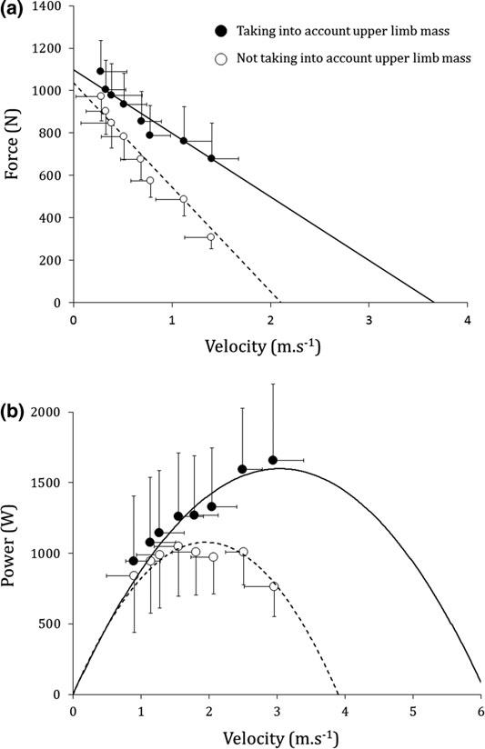

肌肉或肌肉群的机械特性。 在投掷等爆发性项目中，下肢和上肢的力量以及最大力量已被证明有助于最终表现（Bourdin et al. 2010）。 准确确定最大功率对于组织运动员的训练非常重要。 应该记住，大多数研究都使用运动学系统来研究肌肉力量。 这些系统可以根据运动过程中举起的负载位移来评估肌肉力量。 来自外部负载，图 7.1 平均力-速度 (a) 和功率-速度 (b) 关系，考虑（空心圆圈）或不考虑（实心圆圈）上肢质量 A. Rahmani 等人。

一旦知道了它的位移和到达它的时间，就可以使用牛顿定律来估计平均功率。 为了评估运动学参数，必须仔细确定整个机械系统惯性（即提升负载的质量加上杠杆或相关身体部分的惯性），以精确计算优化力量训练时的负载（Rambaud et al. 2008）。 几位作者表明，如果不考虑杠杆臂和腿部惯性，下肢单关节伸展过程中产生的力就会被低估（Winter et al. 1981；Nelson and Duncan 1983；Rahmani et al. 1999）。 这可能导致低估从 F-v 和 P-v 关系推断的最大功率、最大力和最大速度（Rahmani 等人，1999）。 在几项卧推研究中（Cronin 等人，2000 年；Shim 等人，2001 年；Izquierdo 等人，2002 年；Cronin 和 Henderson，2004 年；Sánchez-Medina 等人，2014 年；García-Ramos 等人，2016 年），力的计算仅基于负载（即，不考虑系统负载的总惯量加上 上肢肿块）。 这样做是为了“评估可用于常规测试的最简单的方法”（García-Ramos et al. 2016）。 然而，这意味着忽略了上肢质量和加速所需的努力，如上所述，这可能导致低估最大功率产生。 这种方法上的偏差可以解释为什么团队运动运动员使用运动装置获得的平均最大力值（Izquierdo等人，2002年；Cronin等人，2003年）低于用力平台测量的值（Wilson等人，1991a，b，1994；Murphy等人，1994年）。 为了说明这一事实，之前的一项研究（Rambaud et al. 2008）旨在将运动编码器计算的力与固定在工作台下的力平台同时测量的力进行比较（图 7.2）。 传统的卧推练习是在水平杠铃引导下完成的。 然后，我们假设前后轴和中外侧轴上产生的力可以忽略不计。 杠铃的瞬时速度和加速度是根据每次举升的连续位移时间导数来计算的。 瞬时力（F，单位 N）计算如下：

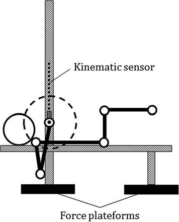

$$ F = M a + g ( ) + Ff \quad (7.1) $$

其中 M 是考虑的移动质量，g 是重力加速度 (9.81 m s−2)，a 是计算的加速度 (m s−2)，Ff 是通过添加到同心相的自由落体测试确定的摩擦力。 F 的确定仅考虑举升负载 (Fpeakb) 或总移动质量（举升负载加上根据 Winter 人体测量表（2009 年冬季）估计的上肢质量 (Fpeakt)。瞬时功率（以 W 为单位）计算为任何给定时间的力和速度的乘积。上肢的平均质量约占受试者总体质量的 10%。由于举升质量范围为 7 至 74 kg，因此忽略 上肢质量对力的计算有明显的影响，当忽略上肢质量时，无论举升负载如何，用运动装置计算的力都明显低于用测力平台测量力、速度、功率的简单方法......

（图 7.3）。 对于较轻的负载，这种低估程度更大，因为随着举升负载的增加，上肢质量对总惯性的相对贡献降低（分别从 7 公斤和 74 公斤时的 54% 降至 10%）。 在力计算中考虑到上肢质量，用测力平台直接测量的力与牛顿定律计算的力没有区别。 力显着相关（r = 0.91；p < 0.001），接近恒等线（图 7.4）。

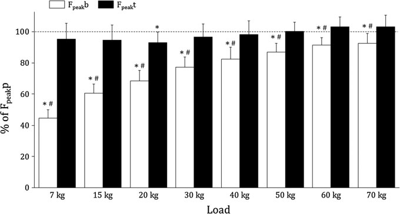

## 7.2.2

上肢惯性对力-速度曲线的影响 无论是否考虑上肢质量，F-v 均呈显着线性（图 7.1a，r = 0.75–0.98，p < 0.05），并且 P-v 明显由二阶多项式回归描述（图 7.1b，r = 0.88–0.99，p < 0.05）。 忽略上肢质量会对推断的力-速度参数产生影响。 忽略上肢时，F0、V0、Pmax 和 Vopt 的低估分别为 6%、41%、32% 和 35%。 即使差异很大，对 F0 的低估也很弱。 这是由于上肢惯性对重物提升总惯性的贡献相对较低。 低估 Pmax 的问题更大，因为该参数是在轻提升负载下获得的。 当考虑上肢时，理论上的最佳负载对应于 36 公斤的举升负载，而当忽略上肢质量时，该最佳负载大约低两倍（15 公斤）。 这可能有

图 7.2 卧推练习中使用的引导水平杠铃的图片 A. Rahmani 等人。

这在爆发力训练中具有重要意义，因为这种训练是基于应达到最大功率的最佳负荷（Caiozzo 等人，1981 年；Kanehisa 和 Miyashita，1983 年；Kaneko 等人，1983 年）。 图 7.3 根据运动传感器计算的峰值力值，考虑（Fpeakt；黑色）和不考虑（Fpeakb，灰色）上肢质量，并以力平台测量的峰值力值的百分比表示（FpeakP，参考方法）。 星号：与 100% Fpeakp 显着不同 (P < 0.001)； 散列：Fpeakb 与 Fpeakt 显着不同（P < 0.001） 图 7.4 用力平台测量的力峰值（Fpeakp）与考虑上肢惯性的运动装置获得的数据计算的峰值力值（Fpeakt）之间的关系。 虚线代表身份线测量力、速度、功率的简单方法......

## 7.3

卧推练习的简单模型

## 7.3.1

卧推过程中肩部的重要性 在评估的背景下，上一节强调了上肢惯性的重要性。 然而，先前研究中使用的模型将上肢视为点状肿块，仅垂直移动。 兰博等人。 （2008）没有给出任何关于上肢加速度及其在力估计中的重要性的信息。 卧推练习涉及两个关节（肘部和肩部）和几个逐渐参与的肌肉群（胸大肌和胸小肌、肱三头肌、三角肌前肌和内侧肌）。 因此，分离参与运动的每个部分（即手臂和前臂）是了解它们各自对整个运动运动学和动力学的影响的资本。 第一种方法是考虑仅包括肘关节的卧推模型（即肩部和腕部假设静止）（图 7.5）。 可以通过四个简单的测量来确定力：使用运动装置记录的提升负载的垂直位移，使用测角仪测量的肘部角度，使用冬季表（2009年冬季）估计的手臂和前臂长度以及使用卷尺测量的手在杠铃上的恒定水平位置。 然而，运动的计算机模拟证明，手臂和前臂长度的总和并未达到举起负载的最大高度（个人数据）。 这意味着肩部必须包含在上肢模型中（图 7.5c）。 图 7.5 上肢机械模型：起始位置。 假定肩部 S 静止，b 杆无法达到实验测量的最大高度。 必须将肩部垂直位移引入模型 (c)。 E：肘部，W：手腕 A. Rahmani 等人。

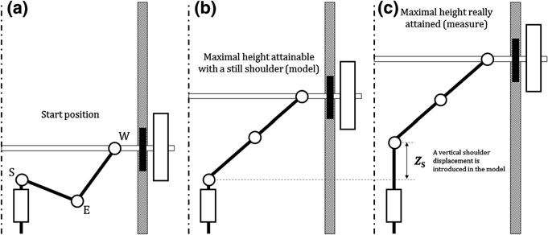

## 7.3.2 基于三段的简单模型：肩部、

手臂和前臂 模型的描述。 由于卧推练习是在水平杠铃引导下进行的，因此假设两个上肢的动作是对称的。 该模型具有三个自由度。 使用两个旋转关节来模拟肩部和肘部的旋转，并通过引入棱柱关节来表示垂直肩部位移（ZS）（图7.6a）。 记录受试者手的位置（x0，Z）。 坐标 x0 代表手的水平位置，该位置是恒定的，因为运动是在垂直引导的杠铃下进行的。 Z 是杠铃的垂直位移，Z0 是手在静止时相对于水平轴的垂直位置。 上臂 (ha) 和前臂 (ha + hf) 的绝对角度是相对于水平轴表示的。 hf 是根据上臂和前臂之间测量的角度计算得出的，即 hf = 180 −h，其中肘部的解剖角度 h 通过测角法测量。 逆运动学模型。 使用逆运动学模型 q 来计算从垂直位移 Z 和肘部角度 hf 导出的关节坐标 ha（以 rad 为单位）和 ZS（以 m 为单位）： q ¼ ha hf

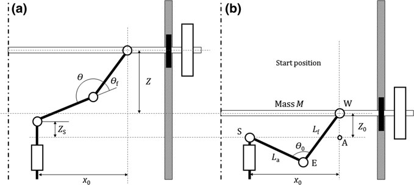

ZS ð7:2Þ 图 7.6 a 卧推练习期间上肢的机械模型，其中 3 个肢体段由 2 个旋转关节和一个棱柱关节连接：x0，手腕的水平位置； Z0，手腕相对于水平轴的初始垂直位置； Z，提升质量的垂直位移； La，上臂长度； Lf，前臂长度； h：弯头角度； ha，绝对上臂角度； hf，前臂相对于手臂位置的角度。 b. 受试者的初始位置：S，肩； E、弯头； W，手腕； A、手腕在水平轴上的正交投影； h0，初始肘角 测量力、速度、功率的简单方法……

ha 和 ZS 是根据手部坐标计算得出的，其写法如下：

$$ x0 = La cos ha + Lf cos(ha + hf ) Z + Z0 ZS = La sin ha + Lf sin(ha + hf ) \quad (7.3) $$

其中 La 是上臂的长度（以米为单位），Lf 是前臂的长度（以米为单位），两者都是根据 Winter 的表（2009 年冬季）估算的，Z0 是手的初始垂直位置。 臂的绝对角度 ha（以 rad 为单位）由方程 1 导出。 7.3：公顷 1/4 棕褐色 1

Bx0 × $A Cx2p Ax0$ × $B Cx2p$ ！ ð7:5Þ 其中 A ¼ La + Lf cos hf , $B = Lf sin hf$ , C ¼ A2 + B2。 肩部的垂直位移由等式导出。 7.4. 首先，我们需要计算Z0。 这可以从几何上从静止位置完成（图 7.6b）。 在三角形 SAW 中应用勾股定理（A 是一个虚拟点，可以表示距已知距离的 SW 距离），我们可以写成：

$$ x2 0 + Z2 0 = SW2 \quad (7.6) $$

三角形 SEW 的 SW 边可以表示为：

SW2 ¼ L2 a + L2 f 2LaLf cos h0 从方程。 8.4和8.6中，Z0可写为：

Z0 1/ $4 L2 a$ +

$$ L2 f 2LaLf cos h0 x2 q ZS \quad (7.7) $$

则等于：

ZS ¼ Z + $Z0$ $$ C x2 q \quad (7.8) $$

有关详细信息，请参阅（Rahmani 等人，2009 年）中的附录 A。 组合质心的加速度。 在该模型中，人体被认为是两个不同的机械刚性系统：（i）由举升质量M、上肢（手臂和前臂，不考虑手）和肩部（忽略肩部质量）组成的运动系统； (ii)由躯干、头部和下肢组成的休息系统，在卧推练习过程中被认为保持固定。 力计算中不考虑后一个系统。 A.拉赫马尼等人。

为了确定举升质量、手臂和前臂的组合质心的垂直位置 ZG，有必要计算运动系统单元的每个质心的垂直位置（即 ZGM、ZGa 和 ZGf 分别为举升质量、手臂和前臂的垂直位置）（图 7.7a​​）。 ZGM、ZGa 和 ZGf 可写为：

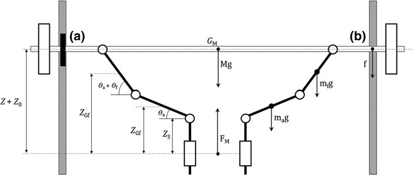

ZGM ¼ ZS +

$$ Z0 ZGa 1 \quad (7.9) $$

⁄

$$ 4 ZS + aa sin ha ZGf = ZS \quad (7.10) $$

× La sin ha × af sin ha × hf ð7:11Þ 其中 aa 和 af 分别是手臂和前臂相对于近端关节的质心位置。 aa 和 af 是根据 Winter 的表（2009 年 Winter）估算的。 则ZG可表示为：

$$ ZG = M Z + Z0 ( ) + 2maZGa + 2mf ZGf m + 2ma + 2mf \quad (7.12) $$

其中 ma 和 mf 分别是手臂和前臂的质量，根据冬季人体测量表（2009 年冬季）确定。 对 ZG 进行两次求导以计算组合质心加速度 €ZG 的加速度。 图7.7a 手臂（ZGa）、前臂（ZGf）和杠铃（ZGM）质心垂直位置图； b 卧推练习时一只手施加到四肢和杠铃系统的外力图。 FM，主体产生的力； f、摩擦力； mag、mfg 和 Mg，分别为上臂、前臂和提升质量的重量； ha，相对于水平轴的绝对角度； ha + hf，上臂和前臂之间的绝对角度测量力、速度、功率的简单方法......

力计算。 卧推过程中肩部产生的力 FM 由力学模型确定（图 7.7b），并表示为：

FM ¼ M€Z + 2ma€ZGa + 2mf €ZGf + M + 2ma + 2mf g + Ff ð7:13Þ 其中 €Z; €ZGa 和 €ZGf 分别是提升质量 M、手臂和前臂部分的加速度，Ff 是摩擦力。 ma 和 mf 乘以 2 以考虑两个上肢，假设运动是对称的。 ZGM、ZGa 和 ZGf 被两次推导以确定加速度 €Z； 分别为 €ZGa 和 €ZGf 。

## 7.3.3

运动学参数 提升质量 Z、运动系统质心 ZG、手臂质心 ZGa 和前臂 ZGf 以及肩部 ZS 的位移-时间过程相同，但不等于 Z（图 7.8）。 对于给定的举升质量，Z 和 ZG 之间的垂直差在整个卧推练习中是恒定的。 因此，在卧推练习中，组合质心和举起质量的垂直速度和加速度是相同的（图 7.9）。 模型确定的加速度遵循力平台测量的加速度，就像在引导杠铃下进行深蹲练习时的情况一样（Rahmani 等人，2000）。 曲线末端的差异主要是由于软件处理造成的（详细信息参见Rahmani et al. 2009）。 然而，这部分曲线对应于垂直位移的末端，当上肢为图 7.8 举重质量 (Z + Z0)、整体质心 ZG、前臂质心 ZGf、上臂质心 ZGa 和肩部 (ZS) 的典型垂直位移-时间曲线，重量为 44 kg 的卧推练习时 A. Rahmani 等人。

拉伸和减速杠铃。 这部分不在推动阶段，在力计算中不予考虑。 此外，Z和ZG之间的差异随着提升质量的增加而减小。 提升的质量越重，系统的质心与提升的质量的中心之间的距离越短。 这是由于移动系统的质心位置始终位于最大质量（即提升质量）附近。 我们可以假设，对于超过 74 kg 的提升负载，Z 和 ZG 的垂直位移将叠加。 对于垂直位移 Z 和 ZGf，无论对象或提升质量如何，它们之间的差值在整个位移-时间曲线上都是恒定的 (0.016 ± 0.01 m)。 该结果表明，在运动结束时主要由肱三头肌执行的肘部伸展太短，不足以影响质心位移。 前臂的运动可以被认为本质上是平移运动。 卧推练习的主要部分是由胸大肌和三角肌前束执行的手臂旋转。 这可以通过手臂 (ZGa) 和肩部 (ZS) 的垂直位移来说明。 无论物体或举升质量如何，Z 与 ZS 和 ZGa 之间的差异都遵循相同的轮廓。 这些差异在总位移的 65% 期间逐渐增加，描述了手臂和肩部抬起的质量的去除。 此后，这些差异将保持不变，直到练习结束。 这一运动瞬间对应于手臂与前臂的对齐。 无论提升的质量如何，所有受试者都观察到了这一结果。 图 7.9 由运动装置 (€ZG) 和测力平台 (€ZP) 测量的典型加速时间曲线 测量力、速度、功率的简单方法……

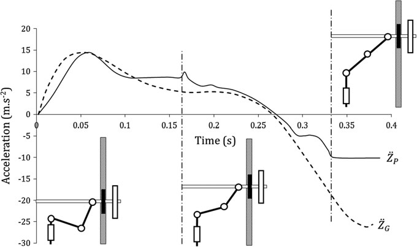

## 7.3.4

动力学参数——模型验证 如上所述，运动系统的加速度和力平台计算的加速度是相同的（图 7.9）。 因此，从模型计算的力（FM）与用力平台直接测量的力（FP）之间没有显着差异。 考虑到每个提升质量的所有测量结果，两个值之间的绝对差异小于 2.5%。 两种方法之间低于 1% 的变异系数也支持了模型的有效性。 此外，无论提升质量如何，FM 与 FP 显着相关（r = 0.99，p < 0.001），回归斜率与 1 没有不同，并且线性回归的 y 截距在统计上与 0 没有差异（图 7.10）。 为了完整起见，FM 与 Rambaud 等人估计的力在统计上没有差异。 (2008) 使用运动装置（参见第 7.2 节；表 7.1）。 使用本模型和实验结果可以轻松构建逆动力学模型，从而可以确定关节力和扭矩。 为此，需要确定手臂和前臂的加速度。 运动科学家可以轻松地使用这种模型来确定卧推锻炼期间每个肌肉群的相对重要性，从而提高对上肢损伤发生情况的理解并允许评估实际康复计划的效率。 图7.10 模型计算的力（FM）与测力平台直接测量的力（FP）之间的关系。 虚线代表身份线 A. Rahmani 等人。

## 7.4

卧推练习中测量力、速度和功率的简单方法

## 7.4.1

理论基础和方程该方法（Rahmani 等人，2017 年）基于 Samozino 等人开发的简单方法。 2008 年深蹲跳（见第 4 章）。 因此，这些计算只需要三个简单的参数：研究系统的质量（即上肢加上提升的质量）、自由落体阶段的垂直位移（h）以及从弹道卧推中提取的垂直推离距离（hpo）（图7.11）。 先前的假设适用于该方法：杠铃的加速度代表了所研究系统的加速度，并且在计算产生的力时考虑了上肢的质量。

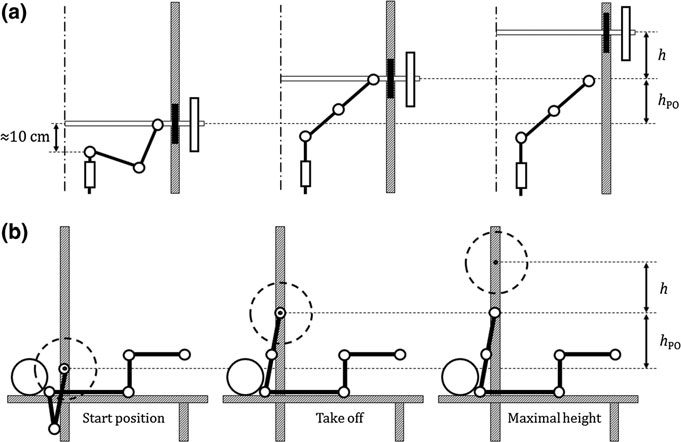

表 7.1 用测力平台 (FPF) 测得的力的平均值（±标准差），以及用卧推模型 (FM) 和运动装置 (FK) 估算的力的平均值（±标准差）（如第 7.2 节所述）

质量（公斤）

FPF（中）

调频（中）

FK（牛） 621 ± 99 619 ± 97 620 ± 95 694 ± 95 697 ± 95 698 ± 96 805 ± 85 804 ± 85 804 ± 86 829 ± 108 829 ± 109 827 ± 105 875 ± 102 875 ± 103 875 ± 101 942 ± 91 943 ± 91 943 ± 93 图 7.11 使用引导杠铃进行卧推投掷过程中的三个关键位置以及建议计算中使用的两个距离（h、hPO）。 正面视图（仅显示一个上肢）。 b 矢状视图 测量力、速度、功率的简单方法……

由于运动是在带有摩擦力的引导杠铃机上进行的，因此自由落体期间的加速度 (aff) 不是重力加速度。 假设自由落体过程中摩擦力恒定，则 aff 可以用牛顿第二定律估算为： aff ¼ g:mb + Ff mb ð7:14Þ 将等式中的 g 替换为 aff 。 Samozino 等人的 4 和 8。 （2008）给出：

F ¼ mul × b g:mb × Ff mb h hpo ×

$$ 1 v = g:mb \quad (7.15) $$

×

$$ Ff mb h s \quad (7.16) $$

在此方法中，h 是用固定在引导杠铃机轨道上的尼龙扎带测量的（图 7.12），这样可以读取杠铃达到的最高高度。 当运动员投掷杠铃时，该系带沿着轨道向上移动，但当杠铃向下移动时，该系带保持在其最大高度位置。 最后，hpo 被测量为杠铃的初始位置（即与安全锁接触）和推离结束时达到的最大高度之间的差异（图 7.11）。 所有尺寸均可使用非柔性卷尺测量，精度为 0.1 厘米。 图 7.12 固定在引导杠铃机导轨周围的尼龙扎带在静止位置 (a) 和飞行阶段之后 (b) 的图片 A. Rahmani 等人。

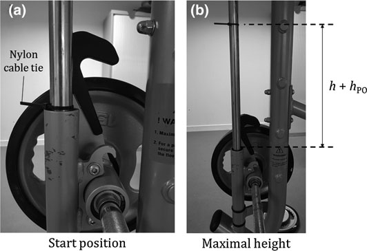

按照方程计算力和速度。 7.15 和 7.16 对于在不同附加负荷下进行的卧推给出了力-速度关系的不同点：移动质量（上肢质量 + 杠铃质量）越大，力就越大，速度越低，就像深蹲跳时一样。 然后外推 F-v 曲线以获得 F0 和 v0，它们分别对应于 F-v 曲线与力和速度轴的截距。 F-v 线性关系 (Sfv) 的斜率也被考虑用于进一步分析。 功率-速度关系的最大功率值 (Pmax) 的计算方法先前已验证（Vandewalle 等人，1987 年；Samozino 等人，2012 年）：

$$ Pmax = F0 v0 \quad (7.17) $$

## 7.4.2

方法验证 计算方法的有效性是通过比较 (i) 通过计算方法获得的 F 和 v 与固定在杠铃上的加速度计（Myotest® Pro；Myotest SA，锡永，瑞士）同时测量的值进行比较来确定的。 (ii) 从这两种方法获得的 F-v 关系（即 F0、V0、Sfv 和 Pmax）推断出的机械参数。 在这项研究中，12 名健康且身体活跃的男性在不同的负荷（体重的 30%、40%、50%、60% 和 70%）下进行了两次弹道卧推。 关于结果，两种方法估计的力 (r = 0.95，p < 0.001) 和速度 (r = 0.89，p < 0.001) 观察到的几乎完美的关系支持了该方法的有效性。 回归线的方程与恒等线的方程没有不同。 观察到的力的相关性大小与在深蹲和反向运动跳跃期间观察到的相关性大小一致（r 从 0.95 到 1）（Samozino 等人，2008 年；Giroux 等人，2014 年；Jiménez-Reyes 等人，2017 年）。 对于速度，相关系数略低于力的相关系数，这再次如之前在深蹲跳跃期间观察到的那样 (0.87–0.94) (Giroux et al. 2014)。 然而，两种方法测量的力和速度之间没有差异（力的系统偏差约为 30 N，速度的系统偏差为 0.07 m s−1；CV% < 10%）。 此外，对于给定的负荷，力和速度的组内相关系数 (ICC) 高于 0.8，发现试验间可靠性非常高，这与之前针对弹道卧推 (Alemany 等人，2005) 和经典卧推练习 (Comstock 等人，2011；Garnacho-Castaño 等人，2014) 的研究报告的结果一致。 此处获得的 CV% 表明 F 和 v（范围分别为 0.8 至 1.7% 和 1.4 至 6.3%）具有足够的绝对可靠性（即 <10%），与上述先前的研究一致。 因此，这些结果证明了该计算方法的试验间可靠性较高。 测量力、速度、功率的简单方法……

最后，与加速度计方法一致，通过简单方法估计的力和速度之间的关系可以通过负线性关系很好地描述（图7.13），正如之前在经典卧推（Rambaud et al. 2008；García-Ramos et al. 2015）和卧推（Sreckovic et al. 2015；García-Ramos et al. 2016）中所显示的那样。 力-速度斜率 (r2 = 0.99，p < 0.001)、F0 (r2 = 0.93，p < 0.001)、v0 (r2 = 0.59，p < 0.05) 和 Pmax (r2 = 0.87，p < 0.001；均与统一没有区别) 的强相关性支持了简单方法的有效性。

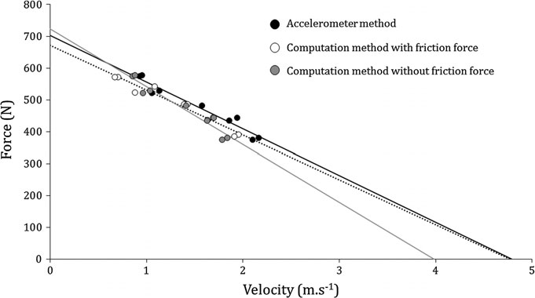

## 7.4.3

该方法的局限性 为了验证该方法，根据方程估计的力和速度。 7.15 和 7.16 与使用加速度计而不是力平台（称为“金标准”）同时获得的测量结果进行了比较。 做出这种选择是因为加速度计直接测量举起的杠铃的运动，包括飞行阶段。 使用力平台有两个主要缺点。 首先，在弹道卧推投掷过程中，移动系统（上肢和举起的质量）在释放时分为两个独立的系统。 这使得很难跟踪与深蹲跳期间发生的情况相反的真实释放时刻（力平台信号为零）。 其次，力平台监测运动过程中发生的所有反作用力，以及“寄生收缩”（例如下肢运动、腹部肌肉收缩）产生的反作用力，图 7.13 加速度计方法获得的 F-v 关系的典型轨迹（黑色​​）、考虑所有机械惯性的计算方法（白色）和忽略摩擦力的计算方法（灰色） A. Rahmani 等人。

很难估计施加到移动系统的净力。 使用加速度计的优点是可以精确确定杠铃投掷的时间，并仅估计上肢为加速系统而产生的力（Comstock 等人，2011）。 另一个限制涉及需要估计由于引导杠铃系统而产生的摩擦力。 由于卧推是在垂直引导杠铃下进行的，因此考虑所有机械参数以及引导杠铃系统产生的摩擦力 (Ff) 似乎很重要。 我们承认，一些教练可能不熟悉确定 Ff 的程序，但不幸的是，如果忽略 Ff，即使更现代的机器具有较低的摩擦力，F-v 参数也可能会出现错误。 典型个体计算中包含或不包含 Ff 的力-速度曲线如图 7.13 所示。 考虑到整个实验群体，V0 被高估了 16 ± 6%，F0 被低估了 5 ± 5%，Sfv 被低估了 25 ± 10%。 在卧推期间考虑这种偏差很重要，因为与负重深蹲期间举起的质量相比，举起的质量（包括上肢质量）较低。 另一种说法是，当考虑卧推过程中施加到系统的力的总和时，摩擦力的比例很高。 在本研究中，Ff 与总提升质量之间的比率范围在 24%（对于最轻的提升负载）和 10%（对于最重的负载）之间。 该比率随提升载荷的变化解释了为什么当忽略 Ff 时斜率的估计受到的影响最大。 相比之下，如果所研究的运动是深蹲，则该比率将介于 5%（对于最重的运动）和 6%（对于最轻的举起负载）之间，这可以解释为什么在这种情况下 Ff 通常被忽略。 幸运的是，通过测量杠铃在给定位移 d 上下落的时间，可以轻松确定摩擦损失的加速度 (aFf)。 可以假设在跌落试验期间摩擦力是恒定的。 因此，aFf 也可以被视为常数，等于：

$$ aFf = 2 d t2 \quad (7.18) $$

时间 t 可以使用智能手机轻松测量，包括具有 240 Hz 采样率的内置摄像头，可以以足够的精度测量时间，并使用非柔性卷尺测量 d。

## 7.4.4

实际应用 这里使用的模型与之前提出的跳跃模型相同（参见第 4 章），并且呈现与这些研究中讨论的相同的实际应用（即最大化发电量）。 同样，（García-Ramos 等人，2016）观察到，F0 与在测量力、速度、功率的简单方法中测得的 1-RM 密切相关……

卧推练习（r = 0.92–0.94）。 力-速度关系可用于评估上半身产生力、速度和功率的最大能力。 热身。 如第 1 章所示。 如图5所示，在典型的一般热身（例如跑步或骑自行车）5-10分钟后，具体的热身必须包括逐渐增加强度的弹道卧推投掷（例如：20公斤时次最大次数10次，30公斤时8次，40公斤时6次，50公斤时4次，60公斤时3次，70公斤时2次）。 用上肢投掷杠铃并不是一种“自然”的运动，应该消除对这种运动的担忧，以确保为客观评估个人的力量和力量能力提供最佳条件。 显然，如果运动员不习惯弹道卧推，则应安排熟悉课程。 推离距离。 应该解决的一个主要问题是正确确定推出距离 (hpo)。 参与者仰卧在长凳上。 杠铃位于胸大肌上方乳头水平处，横跨胸部，由测量装置的下部机械挡块支撑（胸部上方 5 厘米）。 参与者握住杠铃，选择最舒适的位置。 该握力是在热身期间确定的，并且必须用胶带标记在杠铃上以确保可重复性。 hpo 被测量为杠铃的初始位置（即与安全锁接触）和推出后达到的最大高度之间的差异（图 7.11）。 为了达到后一个距离，参与者被要求最大程度地拉紧上肢，包括肩部前推力。 动作应尽可能平稳，背部应与长凳保持接触。 起始位置。 在该方法的验证过程中，要求参与者交叉双腿以标准化位置，并避免下肢推压地板所产生的地面反作用力的影响。 这是在测试期间推荐的，但在实际训练期间不是强制性的，可以根据需要进行。 话虽如此，由于该方法基于在引导杠铃下测量的 hpo，因此无论考虑的起始位置如何，力、速度和功率的确定都保持相同。 应该考虑的一个实际问题可能涉及杠铃的起始位置。 该位置通常位于胸大肌上方的乳头水平位置（胸部上方 5 厘米）。 最好从较高的高度（舒适的高度，例如 10 或 15 厘米）开始弹道卧推。 通过这种方式，运动员处于更舒适和最佳的位置，以克服主要在运动开始时遇到的最大惯性（特别是对于最重的举起负载或不习惯弹道卧推的参与者）。 培训个性化。 考虑到力量训练计划，本文提出的卧推简单方法可用于比较运动员、监测并根据他们的 F-v 曲线和任务要求进行个性化训练。 图 7.14 显示了年轻的 A. Rahmani 等人之间 F-v 关系的巨大差异。

同年龄的高水平篮球运动员，V0 值的变异性高于 F0 值。 我们可以观察到，表现出最高最大力量（F0）的玩家并不是那些在高移动速度（V0）下产生最高力量的玩家。 当力量训练的目的是提高弹道上肢伸展能力（例如，提高爆发性传球或长距离投篮）时，专注于增加 V0 比 F0 更有效，特别是考虑到篮球的重量为 *600 g。 因此，在这种情况下，F0 值较高的运动员需要基于速度的力量训练。 相反，V0 值较高的球员应遵循针对整个 F-v 谱的训练。 这凸显了运动从业者对确定 F-v 曲线以进行个性化上肢力量训练的浓厚兴趣。

## 7.5

结论本章介绍了评估卧推练习时上肢力量的简单方法。 应特别注意卧推练习中涉及的不同惯性。 在力计算中忽略上肢质量会导致低估力，更不用说低估个体可以产生的最大功率。 这会导致低估执行训练计划的最佳负荷。 卧推练习的简单模型表明，移动系统的加速度（举起的质量加上上肢质量）与杠铃的加速度相似。 因此，通过四个简单的测量，逆动力学模型在力估计方面表现出极大的有效性：垂直图 7.14 使用简单方法对法国年轻高水平篮球运动员在不同负载下进行板凳投掷获得的力-速度关系。 灰色区域突出了最大力 (F0) 和速度 (V0) 能力的个体间高度差异测量力、速度、功率的简单方法……

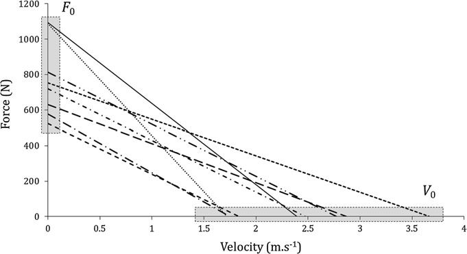

提升负载的位移、肘部角度、手臂和前臂的长度以及手的水平位置。 通过该模型计算的力与用测力平台测量的力的比较表明，两个分数之间没有显着差异。 这导致我们需要一种简单的方法来评估在实验室外进行弹道卧推时产生的力、速度和功率，这要归功于牛顿定律和三个简单的参数：(i) 上肢质量估计为体重的 10%，(ii) 通过尼龙扎带记录的杠铃飞行高度，以及 (iii) 用卷尺测量的推离距离。 为跳跃运动开发的方法也可以有效地估计上肢的机械特性，只需稍作调整（即考虑上肢质量和摩擦力）。 因此，教练和运动员可以准确确定他们的 F-v 曲线，推断可靠的机械参数（F0、V0、Sfv 和 Pmax），以便最大限度地提高上肢表现，并在现场条件下管理和个性化训练计划。

参考文献 Alemany JA、Pandorf CE、Montain SJ、Castellani JW、Tuckow AP、Nindl BC (2005) 弹道跳深蹲和卧推投掷的可靠性评估。 J强度Cond研究19：33-38。 https://doi.org/10.1519/14783.1 Barnett C、Kippers V、Turner P (1995) 卧推练习变化对五块肩部肌肉肌电图活动的影响。 J强度Cond研究9：222-227。 https://doi.org/10。 1519/00124278-199511000-00003 Bourdin M、Rambaud O、Dorel S、Lacour JR、Moyen B、Rahmani A (2010) 投掷性能与肌肉力量相关。 国际运动医学杂志31：505–510。 https://doi.org/10.1055/s-0030-1249622 Buitrago S, Wirtz N, Yue Z, Klienider H, Mester J (2013) 卧推练习中四种不同阻力训练方法的机械负荷和生理反应。 J 强度条件

Res 27：1091–1100 Caiozzo VJ、Perrine JJ、Edgerton VR (1981) 训练引起的人体肌肉体内力-速度关系的改变。 J Appl Physiol 51：750–754 Comstock BA，Solomon-Hill G，Flanagan SD，Earp JE，Luk HY，Dobbins KA，Dunn-Lewis C，Fragala MS，Ho J-Y，Hatfield DL，Vingren JK，Denegar CR，Volek JS，Kupchak BR，Maresh CM，Kraemer WJ（2011） Myotest 在测量深蹲和卧推中的力量和功率产生方面的有效性。 J Strength Cond Res 25：2293–2297 Cormie P、McGuigan MR、Newton RU (2011) 发展最大神经肌肉力量：第 2 部分：提高最大力量产生的训练注意事项。 运动医学四十一：125-146。 Cronin JB, Henderson ME (2004) 新手举重训练者的最大力量和爆发力评估。 J Strength Cond Res 18:48–52 Cronin JB、McNair PJ、Marshall RN (2000) 最大力量和负荷对初始发电量的作用。

和

科学

运动的

练习 32：1763–1769。 200010000-00016 Cronin JB、McNair PJ、Marshall RN (2003) 力量训练技术和负荷的力速度分析：对训练策略和研究的影响。 J 强度条件研究 17:148。 https://doi.org/10.1519/1533-4287(2003)017<0148:FVAOST>2.0.CO;2 A. Rahmani 等人。

Driss T、Vandewalle H、Monod H (1998) 排球运动员骑自行车和曲柄练习时的最大功率和力-速度关系：与垂直跳跃测试的相关性。

J Sports Med Phys Fitness 38：286–293 García-Ramos A、Jaric S、Padial P、Feriche B (2015) 上半身肌肉的力-速度关系：传统与弹道卧推。 应用生物力学杂志 1-44。 doi：https://doi.org/10。 1123/jab.2015-0162 García-Ramos A、Jaric S、Padial P、Feriche B (2016) 上身肌肉的力-速度关系：传统卧推与弹道卧推。 应用生物力学杂志 32：178–185。 doi：https://doi。 org/10.1123/jab.2015-0162 Garnacho-Castaño MV、López-Lastra S、Maté-Muñoz JL (2014) 线性位置传感器的可靠性和有效性评估。 J Sport Sci Med 14:128–136 Giroux C, Rabita G, Chollet D, Guilhem G (2014) 评估下肢力-速度关系的最佳方法是什么？ 国际运动医学杂志三十六：143–149。 https://doi.org/10.1055/s-0034Izquierdo M、Häkkinen K、Gonzalez-Badillo JJ、Ibanez J、Gorostiaga EM (2002) 长期训练特异性对不同运动项目运动员上肢和下肢最大力量和爆发力的影响。 欧洲应用生理学杂志87：264-271。 https://doi.org/10。 1007/s00421-002-0628-y Jandaĉka D, Vaverka F (2009) 卧推练习中机械功率输出测量的有效性。 J Hum Kinet 21：33-40。 https://doi.org/10.2478/v10078 Jarić S、Ropret R、Kukolj M、Ilić DB (1995) 主动肌和拮抗肌力量在快速运动中的作用。 欧洲应用生理学杂志职业生理学71：464–468。 https://doi. 组织/10.1007/BF00635882

希门尼斯-雷耶斯 P,

萨莫津 P,

情侣-白F,

康塞桑 F,

Cuadrado-Penafiel V、Gonzales-Badillo JJ、Morin JB (2017) 测量反向运动跳跃中力-速度-功率曲线的简单方法的有效性。 Int J Sports Physiol Perform 12:36–43。https://doi.org/10.1123/IJSPP.2015-0484 Kanehisa H, Miyashita M (1983) 力量训练中速度的特异性。 欧洲应用生理学杂志职业生理学 52：104–106。 https://doi.org/10.1007/BF00429034 Kaneko M, Fuchimoto T, Toji H, Suei K (1983) 不同负载对人体肌肉力-速度关系和机械功率输出的训练效果。 Scand J Sport Sci 5:50–55 Laffaye G, Collin JM, Levernier G, Padulo J (2014) 攀岩中的上肢力量测试。 国际运动医学杂志35：670–675。 https://doi.org/10.1055/s-0033-1358473 Murphy AJ、Wilson GJ、Pryor JF (1994) 使用等惯性力质量关系预测动态人类表现。 欧洲应用生理学杂志职业生理学 69：250–257。 Nelson SG, Duncan PW (1983) 针对重力影响校正等速和等长扭矩记录。 临床报告。 Phys Ther 63:674–676 Newton RU、Kraemer WJ、Hakkinen K、Humphries BJ、Murphy AJ (1996) 上半身爆发性运动过程中的运动学、动力学和肌肉激活。 J Appl Biomech 12:37–43 Padulo J, Mignogna P, Mignardi S, Tonni F, D’Ottavio S (2012) 不同推力速度对卧推的影响。 国际运动医学杂志33：376–380。 https://doi.org/10.1055/s-0031-1299702 Pearson S、Cronin J、Hume P、Slyfield D (2007) 接受力量训练的体育人群中卧推和卧推练习的运动学和动力学。 Symp A Q J Mod Foreign Lit, 27–30 Rahmani A, Belli A, Kostka T, Dalleau G, Bonnefoy M, Lacour J-R (1999) 老年受试者非等速条件下膝关节伸肌的评估。 J Appl Biomech 15:337– 344。 https://doi.org/10.1123/jab.15.3.337 Rahmani A, Dalleau G, Viale F, Hautier CA, Lacour J-R (2000) 用于测量深蹲过程中产生的力的运动装置的有效性和可靠性。 J Appl Biomech 16:26–35 Rahmani A, Rambaud O, Bourdin M, Mariot JP (2009) 卧推练习的虚拟模型。 生物力学杂志 42：1610–1615。 https://doi.org/10.1016/j.jbiomech.2009.04.036 测量力、速度、功率的简单方法......

Rahmani A、Samozino P、Morin J-B、Morel B (2017) 一种评估卧推上肢力-速度曲线的简单方法。 Int J Sports Physiol Perform 1-23。 doi：https://doi.org/10。 1123/ijspp.2016-0814 Rambaud O、Rahmani A、Moyen B、Bourdin M (2008) 上肢惯性在计算同心卧推力中的重要性。 J强度Cond研究22：383-389。 https://doi.org/10。 1519/JSC.0b013e31816193e7 Samozino P、Morin JB、Hintzy F、Belli A (2008) 一种测量深蹲跳过程中的力、速度和功率输出的简单方法。 生物力学杂志 41：2940–2945。 https://doi.org/10.1016/j。 jbiomech.2008.07.028 Samozino P、Rejc E、Di Prampero PE、Belli A、Morin JB (2012) 弹道运动中的最佳力-速度曲线 - Altius：Citius 还是 Fortius？ 医学科学运动锻炼四十四：313–322。 https://doi. org/10.1249/MSS.0b013e31822d757a Sánchez-Medina L、Perez CE、Gonzalez-Badillo JJ (2010) 力量评估中推进阶段的重要性。 国际运动医学杂志三十一：123-129。 https://doi.org/10.1055/s-0029-1242815 Sánchez-Medina L、González-Badillo JJ、Pérez CE、Pallarés JG (2014) 卧推与卧推练习的速度和功率负荷关系。 国际运动医学杂志35：209-216。 https://doi.org/10.1055/s-0033-1351252 Shim a L、Bailey ML、Westings SH (2001) 开发上身力量现场测试。 J强度Cond研究15：192-197。 doi：https://doi.org/10.1519/1533-4287(2001)015<0192：

DOAFTF>2.0.CO;2 Sreckovic S、Cuk I、Djuric S、Nedeljkovic A、Mirkov D、Jaric S (2015) 手臂肌肉的力-速度和功率-速度关系的评估。 欧洲应用生理学杂志 115：1779–1787。 Stockbrugger B, Haennel RG (2001) 健身球爆炸力测试的有效性和可靠性。 J 强度条件研究 15：431–438。 https://doi.org/10.1519/1533-4287(2001)015<0431：

VAROAM>2.0.CO;2 Stockbrugger B, Haennel R (2003) 健身球爆发力测试表现的影响因素：跳跃运动员和非跳跃运动员之间的比较。 J 强度条件研究 17：768–774。 https://doi.org/10.1519/1533-4287(2003)017<0768:CFTPOA>2.0.CO;2 Vanderthommen M, Francaux M, Johnson D, Dewan M, Lewyckyj Y, Sturbois X (1997) 全力臂曲柄运动加速阶段的功率输出测量。 Int J Sports Med 18:600–606 Vandewalle H、Peres G、Heller J、Panel J、Monod H (1987) 自行车测力计上的力-速度关系和最大功率与垂直跳跃高度的相关性。 欧洲应用生理学杂志职业生理学 56：650–656。 doi:https://doi.org/10.1007/BF00424805 Wilson G, Elliott BC, Kerr GK (1989) 卧推最大和次最大负荷的杠铃路径和力量分布特征。 国际体育生物技术杂志21：450–462。 https://doi.org/10.1123/ijsb.5.4.390 Wilson GJ、Elliott BC、Wood GA (1991a) 在拉伸-缩短循环运动期间施加延迟对性能的影响。 医学科学运动锻炼23：364–370。 https://doi.org/10.1249/ 00005768-199103000-00016 Wilson GJ、Wood G a、Elliott BC (1991b) 拉伸-缩短循环活动中串联弹性组件的最佳刚度。 J Appl Physiol 70:825–833 Wilson GJ, Murphy AJ, Pryor JF (1994) 肌腱硬度：与偏心、等长和同心性能的关系。 J Appl Physiol 76:2714–2719 Winter DA (2009) 人体运动的生物力学和运动控制。 Wiley, 纽约 Winter DA, Wells RP, Orr GW (1981) 使用等速测力计的错误。 欧洲应用生理学杂志职业生理学 46：397–408。 https://doi.org/10.1007/BF00422127 Young KP、Haff GG、Newton RU、Gabbett TJ、Sheppard JM (2015) 评估和监测运动员的弹道和最大上身力量素质。 Int J Sports Physiol Perform 10：232–237。 https://doi.org/10.1123/ijspp.2014-0073 A. Rahmani 等人。