# 第 8 章：测量跑步时下肢僵硬的简单方法

测量下限的简单方法

跑步时四肢僵硬

Jean-Benoit Morin 摘要 在跑步过程中，下肢肌肉肌腱系统的表现就像一个弹簧质量系统。 从外部力学的角度来看，跑步运动的复杂性（涉及臀部、膝盖和脚踝水平的力量产生、运动和协调，以确保推进和平衡）可以通过单个线性弹簧质量系统的行为来很好地描述。 在与地面接触期间，随着时间的推移，垂直地面反作用力呈现出正弦波行为，并且质心的垂直向下位移呈现出伴随的 U 形行为。 在该模型中，弹簧中的压缩力与长度变化之间的关系是线性的，并且这种关系的斜率相当于弹簧的刚度。 由于该模型于 20 世纪 80 年代末首次开发，因此已被用作研究人类和动物跑步力学的实用方法，主要用于地面反作用力测量（测力台或仪表跑步机）和高速运动分析。 本章介绍了该模型的理论基础，以及计算运行期间主要弹簧质量变量的简单场方法。 该方法基于地面反作用力轨迹的正弦波建模，仅需要五个简单的输入变量：跑步速度、跑步者的体重、下肢长度以及接触和腾空时间。 在本章中，我们还详细介绍了如何测量这些输入变量，以及在研究和培训实践中使用正弦波方法的示例。 科学用简单的不可见事物代替复杂的可见事物

让·佩兰，物理学家（1870–1942）

Jean-Benoit Morin (&) 人类运动、教育运动与健康实验室，Université Côte d'Azur, 261 Route de Grenoble, 06205 Nice, France 电子邮件：jean-benoit.morin@unice.fr

## 8.1

简介 跑步是数百万人每周（甚至每天）都会做的事情。 几千年前，我们的祖先通过奔跑来寻找自己的食物，也可能是为了躲避掠食者。 如今，人们跑步是为了锻炼和健康，为了比赛训练，或者只是为了跑步的乐趣。 在操场上的长凳上坐几分钟，你会发现小孩子几乎从不到处走动。 尽管与骑自行车或其他运动技能相反，他们从未真正学会如何跑步，但他们还是跑步。 正如一本名著（McDougall 2010）和《自然》杂志上的论文（Bramble and Lieberman 2004）所指出的，我们“生来就是为了跑步”。 这项活动是自然的，大多数跑步者可能没有意识到让他们“只是跑步”的极其复杂的机制。 跑步可以被定义为将地面上的身体质量从一条腿的姿势推到另一条腿的姿势。 这是一种“单腿向前弹跳”运动，它意味着平衡、肌肉活动和四肢协调、肌肉产生的力、肌腱将力传递到骨骼系统等方面的非常复杂的调整，再加上运动矢状面中下肢三个主要关节（髋、膝、踝）的和谐屈曲和伸展。1 跑步时，这种机械组织得如此之快，以至于它允许典型的跑步步速约为每秒 3 步，并带有地面接触阶段 通常小于 300 毫秒。 在以 10 km h−1 的速度慢跑一小时的过程中，这个步骤循环大约发生 10.000 次。 事实上，跑步运动的神经肌肉、肌腱和骨关节特征非常复杂，以至于世界上最好的工程师仅在几年前就可以设计和建造跑步的双足或四足机器人。 将这一点与其他技术实力（例如人类登上月球（1969 年））结合起来，您就会更好地了解这个看似简单的运动有多么复杂。 由于这些原因，尽管跑步者长期以来一直是观察和研究的对象（例如代表跑步运动员的古希腊绘画），但对人体跑步力学的科学研究仍然是一个非常年轻的学科。 为了采用宏观方法并“见树不见森林”，生物力学学家和生理学家使用简单的综合模型来描述和分析两足动物的运动（Dickinson et al. 2000）。 用于描述和研究跑步力学的模型是弹簧质量模型（SMM）。 在本章中，我们将定义该模型、所涉及的典型测量以及我们开发的用于计算该模型的机械特征的简单方法。 然后，我们将展示使用和应用程序的示例，并讨论主要内容。 1尽管跑步涉及身体在所有三个空间平面上的运动，但我们将在本章中将我们的方法限制在矢状运动平面上。 2 例如，参见代尔夫特理工大学的跑步机器人 Phides：http://www. 3me.tudelft.nl/en/about-the-faculty/departments/biomechanical-engineering/research/dbl-delftbiorobotics-lab/bipedal-robots/。 3 例如，参见麻省理工学院猎豹机器人：http://biomimetics.mit.edu。

让·伯努瓦·莫兰

可用于测量这种简单方法的机械输入的技术。

## 8.2

跑步的弹簧质量模型 SMM（图 8.1）将跑步者建模为一个加载线性弹簧的质量（等于总体质量），该弹簧代表下肢（大腿、小腿和脚部、髋关节、膝关节和踝关节）。 在每一步中，当跑步者着陆在地面上时，质量在其向下运动期间压缩弹簧，然后在随后的空中阶段之前，弹簧在地面接触阶段的第二部分中延伸。 与反弹垂直跳跃和跳跃（参见第 6 章）相反，跑步的 SMM 意味着在压缩-伸展循环期间向前振荡。 图 8.1 左：跑步时弹簧质量模型的示意图。 质心轨迹可以通过大转子处的白色圆圈粗略地描述。 右图：支撑阶段弹簧质量系统的简化几何结构。 L：初次接触时的下肢长度； h：在每半个支撑阶段的向前运动期间系统扫过的角度。 假设跑步速度恒定（v，单位为 m s−1），支撑阶段质心的水平位移等于 v tc/2，tc 为接触时间，单位为 s 跑步期间测量下肢刚度的简单方法

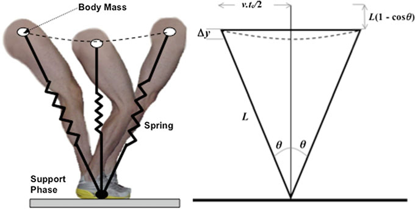

## 8.2.1

弹簧刚度 从机械角度来说，可变形系统的刚度4是使该系统变形所施加的力与所产生的变形（长度变化）的比率。 在纯线性弹簧的情况下，施加的压缩力（F，单位为 N）与产生的变形（ΔL，单位为 m）之间的关系是线性的，这种线性关系的斜率就是系统的刚度（k，单位为 N·m−1）（图 8.2）。 如果线性弹簧的刚度为 k = 1000 N m−1，则需要施加 10 N 的力（即相当于地球上 1 kg 质量的重量）才能将其压缩 1 cm。

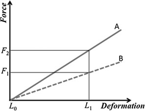

## 8.2.2

弹跳和跑步过程中的弹簧质量行为首次对人类跳跃和跑步运动进行研究的一个主要发现是，受试者在测力板上跳跃和跑步（Blickhan 1989；McMahon 和 Cheng 1990），垂直 GRF 随时间的记录显示出类似正弦波的行为。 尽管人类跑步运动可能很复杂，但支撑阶段（正弦波）期间的垂直 GRF 行为和空中阶段（抛物线）期间质心的空中运动遵循非常简单的数学行为。 运行支撑阶段的垂直 GRF 随时间的变化可以通过以下方程很好地拟合（图 8.3）： 图 8.2 两个完美线性弹簧的力-变形关系示意图。 A 比 B 更硬（反过来 B 比 A 更柔顺）。 当施加给定的压缩力（例如 F1）时，弹簧 A 产生的变形小于弹簧 B 的变形。对于长度 L1 的相同变化，弹簧 A 需要比弹簧 B 更高的压缩力。弹簧 A 的刚度计算为 kA = F2/L1，弹簧 B 的刚度计算为 kB = F1/L1。 在本例中，kA > kB 4 虽然它具有间接关系，但这种僵硬与有时称为“肌肉僵硬”或“关节僵硬”的不同。 后者通常表明运动范围丧失以及可能相关的疼痛。

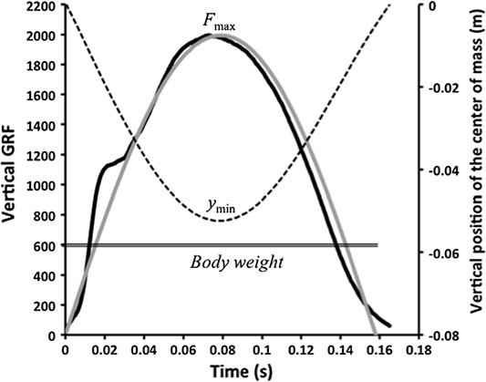

让·伯努瓦·莫兰

$$ F(t) = F_{max} sin p t_c t \quad (8.1) $$

了解垂直 GRF 数据和跑步者的体重 m 可以使用运动定律计算支撑阶段质心的垂直位移（Cavagna 1975）。 然后，使用图 8.1 所示的简化站立阶段几何形状，可以计算接触过程中腿长的变化（McMahon 和 Cheng 1990；Farley 和 González 1996）。 然后，如图 8.3 所示，垂直 GRF 与腿长度变化的关系图显示出非常线性的轨迹。 在此基础上，跑步的 SMM 已被用于分析人类以及两足动物和四足动物的跑步运动力学（Alexander 1991、2003、2004；Farley 等人 1993；Kram 和 Dawson 1998）。

## 8.2.3 运行中的弹簧质量刚度：

定义和假设 由于下肢压缩和长度变化在站立阶段遵循整体异相行为，因此计算下肢刚度 (kleg) 的简单方法是将最大压缩力除以相应的最大腿部长度变化（Farley 和 González 1996）。 这两个值对应于图 8.3 使用测力台（2000 Hz 采样率）测量的 62 kg 男性跑步者以 5 m s−1 的恒定速度跑步时的垂直 GRF。 灰色轨迹显示了该站立阶段的垂直 GRF 的正弦波模型。 虚线表示质心的垂直轨迹 跑步时测量下肢僵硬的简单方法

力与长度变化之间线性关系的最大值如图 8.2 所示：

$$ k_{leg} = F_{max} \cdot \Delta L^{-1} \quad (8.2) $$

此外，为了描述质心的垂直运动并仅关注垂直弹跳机构，提出了垂直刚度 (kvert) (Farley et al. 1993; Farley and González 1996; Farley and Ferris 1998)。 它的计算方式为最大压缩（地面反作用力）力与质心最大向下位移（对应于图 8.3 中的位置 ymin）的比率：

$$ k_{vert} = F_{max} \cdot \Delta y^{-1} \quad (8.3) $$

用于跑步的 SMM 是一个简单的集成模型，具有两个主要机械特征（及其子组件）：kleg 和 kvert。 正如引言中提到的，这些机械变量是综合性的，包含大量复杂的神经肌肉和机械现象，同时表征跑步系统（Farley 和 Ferris 1998）。 对于所有旨在简化生物现象以更好地描述和解​​释它们的模型，它隐含着几个假设： • 下肢不是完美的线性弹簧。 它由三个主要部分（大腿、小腿、脚）组成，基本上允许基于关节角度运动（臀部、膝盖、脚踝）的跑步运动。 关节角刚度已经在量化下肢刚度的其他方法中进行了讨论（Brughelli 和 Cronin 2008a），一些作者建议使用术语“准刚度”（Latash 和 Zatsiorsky 1993）。 然而，这个复杂的多段系统的整体行为和机械输出在运行和垂直弹跳方面都非常接近线性弹簧质量系统（参见第 6 章）。 • SMM 和下面介绍的简单方法的基本假设是垂直GRF 时间信号在运行期间接近正弦波方程。 正如限制部分所讨论的，这对于大范围的跑步速度（即从大约 10 到大约 25 km h−1）来说是正确的，对于这些速度，数学拟合的整体质量很高（Morin 等人，2005）。 这一假设在非常低的跑步速度（<8 km h−1，个人未发表的观察）下无效，并且最近在世界级短跑运动员的最高跑步速度（>36 km h−1）方面受到挑战（Clark 和 Weyand 2014）。 • 将在下一段中详细介绍的 SMM 和刚度计算基于以下事实：最大压缩力 (Fmax) 和下肢最小长度（对应于图 8.3 中的 ymin，用于计算腿部长度变化 ΔL）。 如图 8.3 的典型示例所示，这两个时刻之间的延迟非常短（Silder 等人，2015）。

让·伯努瓦·莫兰

• 使用SMM 进行跑步时做出的两个主要假设与站立期间下肢运动的几何表示有关（图8.1）。 首先，假设在站立过程中施加在地面上的力点是固定的。 现实情况并非如此，因为在接触过程中压力中心会在脚下移动约 10-20 厘米。 这已被证明会影响刚度计算（Bullimore 和 Burn 2006），并且可以应用修正，根据运行速度估计“施力点的前向平移”的长度（Lee 和 Farley 1998）。 这里重要的一点是，在使用相同计算方法（训练过程或其他类似研究）进行受试者内比较或受试者间比较的情况下，该假设不会对所获得的结果提出质疑。 其次，假设跑步过程中下肢扫过的角扇区围绕垂直中间站姿位置对称（图8.1），并且假设足部着地时下肢的长度L等于解剖位置中从大转子到地面测量的参考值。 这种简化已经被讨论过，并且视频分析证实了经典 SMM 中足部着地时的下肢长度被高估了（Arampatzis 等人，1999）。 我们认为的要点是，这种在支撑阶段扫描的对称角度的假设使得SMM在加速/减速运行以及上坡/下坡运行期间无效。 使用 SMM 来描述和分析跑步力学需要承认这些假设，我们的观点是，尽管它们是由于非常复杂的现实的简化而产生的，但它们基本上不会挑战在训练或研究环境中所做的观察（见下面的应用部分），前提是所有测量和比较都是使用相同的程序和计算进行的。

## 8.2.4

参考方法和典型值 除了简单的人体测量学（体重和腿长）和跑步速度之外，使用 SMM 计算刚度还需要测量垂直 GRF 和质心位置随时间的变化。 尽管将高频视频分析与 GRF 数据同步可以随着时间的推移精确测量质心位置，但 Fmax 和 Δy 都可以使用 Cavagna (1975) 详细介绍的方法从唯一的 GRF 信号中导出。 简而言之，该方法利用力学定律计算质心随时间的垂直加速度，然后通过对该加速度信号积分获得速度和位置（图8.4）。 测量跑步时下肢僵硬度的简单方法

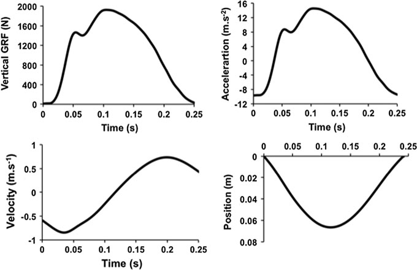

然后，根据图 8.1 所示的下肢几何形状计算 ΔL，如下所示（Farley 等人，1993 年；Farley 和 González，1996 年；Farley 和 Ferris，1998 年）：

$$ L2 vt_c 2 r + \Delta y \quad (8.4) $$

请注意，L 可以使用 Winter (1979) 的人体测量模型根据主体高度 H 进行估计：

$$ L = 0:53H \quad (8.5) $$

地面反作用力数据通常使用嵌入跑步场地的测力台系统（例如 Slawinski 等人，2008b；Rabita 等人，2011）或仪表跑步机（例如 Dutto 和 Smith，2002）来测量。 报告人类跑步中 SMM 刚度值的大量研究一致表明，kleg 在很宽的跑步速度范围内基本恒定，而 kvert 则随着跑步速度的增加而增加（图 8.5）。 有趣的是，这种现象也在狗、山羊或袋鼠等多种动物中观察到。 图 8.4 垂直 GRF 数据（左上图）是在仪器跑步机上测量的（1000 Hz 采样率），对象为 70 kg 的男性跑步者，以 3.33 m s−1 的恒定速度跑步。 质心的垂直加速度（右上图）的计算公式为 a(t) = F(t)/m-g，其中 m 为主体的体重，g 为重力加速度（地球上为 9.81 m s−2）。 然后，如 Cavagna (1975) 所提出的，通过对加速度信号进行积分，可以获得随时间变化的质心速度（左下）和位置（右下）

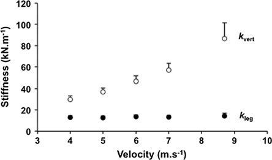

让·伯努瓦·莫兰

[法利等人。 (1993) 研究了几种动物，从 0.1 公斤的老鼠到 130 公斤的马]。 尽管它在各种跑步速度下都是一致的（这显示了跑步者的下肢系统如何适应速度限制）（Brughelli 和 Cronin 2008b），但 kleg 已被证明在一些特定条件下会发生变化。 步频和接触时间。 首先，当跑步者改变其步频时，其 kleg 会发生变化（Farley and González 1996；Morin et al. 2007）：当步频增加时，kleg 会增加，反之亦然。 事实上，这主要是由于增加或减少步频时接触时间发生变化所致（Morin 等人，2007 年）。 我们观察到，通过在恒定的跑步速度下分别控制步频和接触时间，接触时间是这种条件下 kleg 变化的主要决定因素。 在 kleg 和接触时间的百分比变化之间发现了大约 2 的系数。 例如，如果接触时间减少 10%，kleg 就会增加约 20-25%，反之亦然 (Morin et al. 2007)。 运行表面。 引起 kleg 变化的另一个外部因素是跑步表面的刚度。 至于跳跃，在比正常表面更软或更硬的表面上跑步分别与更高和更低的 kleg 相关（Ferris 和 Farley 1997；Ferris 等人 1998、1999）。 神经肌肉系统能够非常快速地调整刚度以适应跑步表面的变化（Ferris 等人，1999）。 当考虑跑道表面（McMahon 和 Greene 1978、1979）以及对能量学的影响（Kerdok 等人 2002）时，跑步表面刚度对 SMM 力学的明显影响可能很重要。 装卸。 尽管在典型跑步练习中这不是关键点，但负载（即卸载或减轻重力和额外负载）对 SMM 力学有影响。 在重力减小（卸载）条件下，He 等人。 (1991) 观察到只有在极端卸载 (0.2 g) 下 kleg 才会减少，Silder 等人。 （2015）最近表明负荷与腿部僵硬的增加有关。 kleg 的这种变化与膝盖的增加有关。 图 8.5 一组男性中长跑运动员在 4、5、6、7 m s−1 和最大速度下的垂直和腿部刚度典型值。 数据是用地面嵌入测力板测量的 跑步期间测量下肢僵硬的简单方法

弯曲，以及整体蹲伏的跑步模式，麦克马洪等人将其称为“格劳奇跑步”。 （1987）。 疲劳。 最后，研究了跑步疲劳对 SMM 力学的影响，根据所考虑的运动强度和持续时间得出对比结果。 事实上，短距离（冲刺，通常长达 10-12 秒）、中距离（中距离，约 5-15 分钟）或超长距离（超耐力，超过 2-4 小时）引起的疲劳与弹簧质量行为的不同变化有关。 请注意，由于跑步疲劳在实际实践中可能与跑步速度的降低相关，因此下面讨论的研究包括在类似的固定跑步速度下进行测试，或者超出 kvert 与跑步速度之间预期关系的变化，如图 8.5 所示。 反复冲刺。 重复冲刺约 5 秒后，恢复时间短（约 25 秒），这是足球或橄榄球等团队运动的典型体能需求，疲劳的主要影响是 kvert 和 kleg 均下降（Girard et al. 2011a, b, c, 2015, 2016）。 这主要与步频减少、接触时间延长以及接触过程中质心向下位移较大有关。

换句话说，重复最大强度冲刺和短时间恢复会导致弹簧质量行为和运动员在地面上有效弹跳的整体能力受损，这可能反过来会改变他们的冲刺表现和进行团队运动中至关重要的复杂动作的能力：改变方向、加速、跳跃和切入。 关于较长的冲刺，当要求运动员进行四次全力以赴的 100 米冲刺并进行 120 秒的被动恢复时，我们发现了类似的结果（除了 kleg 没有显着下降）（Morin 等人，2006 年）。 最后，霍原等人。 2010 年（Morin 等人，2006 年）观察到在 400 米全力冲刺中垂直和腿部刚度都有所下降。 中距离。 与非常短（冲刺）和非常长（超耐力，见下文）练习相反，

由中等持续时间最大努力引起的 SMM 力学（典型的中距离跑或奥林匹克长距离铁人三项）在研究中并不一致。 事实上，一些研究报告称，测试组的弹簧质量行为平均没有变化（Hunter and Smith 2007；Slawinski et al. 2008b；Le Meur et al. 2013），而其他研究则观察到变化，就短跑而言，两种类型的刚度都有所下降（Dutto and Smith 2002）。 其他一些研究报告了一种刚度的变化，而不是另一种刚度的变化（Rabita 等人，2011 年；Girard 等人，2013 年）。 这种对比结果可能是由于测试方案的差异（直到力竭前的恒定速度与给定距离的计时赛）、测试的时刻和速度（跑步前与跑步过程中）的差异，或更可能是由于个人对疲劳影响的反应而变化，正如 Hunter 和 Smith（2007 年）所讨论的那样。 超耐力。 随着“超级马拉松”和“超轨”赛事的日益普及，即长度超过 42 公里（最多超过 300 公里）的赛事

让·伯努瓦·莫兰

由于进行了大量的上坡和下坡跑步，5 最近的研究重点关注这种高强度跑步运动对神经生理学和生物力学的影响。 研究一致表明，在这种情况下，疲劳对弹簧质量行为的影响是整体向更高或不变的腿部刚度和更高的垂直刚度变化，这主要是由于接触过程中质心向下位移较小和步进频率较高（Morin 等人，2011a，b；Degache 等人，2013，2016）。 我们的假设是，这种变化可能是受试者以更平稳、更安全的跑步模式跑步的一种方式，即减少每一步的空中时间和面临的整体冲击，从而有可能减少每一步腿部的肌肉、关节和肌腱疼痛（Morin 等人，2011b；Millet 等人，2012）。 有趣的是，当肌肉结构和/或功能在其他情况下发生改变时，也观察到了类似的适应：剧烈下坡跑后引起延迟性肌肉酸痛（Morin et al. 2011b；Millet et al. 2012）、股四头肌活检后（Morin et al. 2009）或衰老（Cavagna et al. 2008）。 请注意，弹簧质量力学的变化与这些超耐力研究中观察到的肌肉力量能力的大幅下降无关（Martin 等人，2010；Millet 等人，2011；Morin 等人，2012b）。

## 8.2.5

参考方法的局限性 正如本章开头所详述的，弹簧质量模型已用于描述和预测跑步者在各种情况下的机械行为。 尽管它受到了讨论和批评，但它是一个总体上被接受的人类跑步运动的综合模型。 然而，除了上面列出的模型的基本局限性之外，经典的参考方法对于在研究性运动实践中更广泛的使用也存在一些限制：首先，这些参考方法需要昂贵的特定设备来测量GRF：测力台或仪表跑步机。 这些是典型的研究实验室设备，尽管一些跑步诊所或理疗中心配备了此类设备，但大多数跑步教练或运动员并非如此。 • 结果是，除了罕见的研究方案（例如Slawinski et al. 2008b; Rabita et al. 2011），跑步力学和弹簧质量行为是在实验室条件下研究的，受试者在地面嵌入的测力板上跑一两步，或者在仪器跑步机上跑几步。 在这两种情况下，测量协议仅模拟现实生活中的跑步实践。 5 例如，参见最著名的之一，有 160 公里和超过 9000 米的正海拔变化：http://www.ultrarailmb.com。 测量跑步时下肢僵硬度的简单方法

• 最后，如前所述，需要进行数据处理，以根据 GRF 数据计算 kvert、kleg 及其分量 Fmax、Δy 和 ΔL，这阻碍了许多运动员和从业者使用 SMM。 为了消除这些限制，我们提出了一种简单的现场方法，根据跑步模式的几个变量来计算弹簧质量力学，这些变量在典型的训练实践中更容易获得。

## 8.3

测量刚度的简单方法

跑步

## 8.3.1

理论基础和方程 该简单方法基于这样的假设：运行期间垂直 GRF 随时间变化呈正弦波行为，如图 8.3 所示。 然后，根据正弦波方程： (8.1)，并根据运动定律[详细计算，参见Morin et al. (2005)]，该方法的最终方程如下：

$$ k_{leg} = F_{max} \cdot \Delta L^{-1} \quad (8.2) $$

和

$$ k_{vert} = F_{max} \cdot \Delta y^{-1} \quad (8.3) $$

其中

 $Fmax = mg p ta tc$ +

$$ 1 \Delta y = F_{max} m t_c \pi^2 \quad (8.6) $$

× g tc2 ð8:7Þ 和

\n\n$$ \Delta L = L - \sqrt{L^2 - (\frac{v t_c}{2})^2} + \Delta y \quad (8.4) $$\n\n 计算这些 SMM 特性所需的五个输入变量是跑步者的体重 m（单位为 kg）和腿长 L（单位为 m）、跑步速度 v（单位为 m·s−1）以及接触时间和空中时间（tc 和 ta，单位为 s）。

让·伯努瓦·莫兰

## 8.3.2

方法的验证执行了两个协议以验证简单的方法。 对于第一个方案，8 名男性跑步者在仪器跑步机上以 3.33 至 6.67 m s−1 范围内的 7 种不同速度进行 30 秒的跑步比赛（ADAL，HEF Tecmachine，Andrézieux-Bouthéon，法国，图 13.4）。 垂直 GRF 的机械数据以 1000 Hz 的频率连续 10 个步骤进行采样，并在每个运行速度下的所有步骤的参考方法和建议方法之间进行统计比较。 对于第二个方案，10 名接受过训练的男性中长跑运动员自愿在安装在跑道上的测力台（瑞士奇石勒）上以 5 种不同的速度（4、5、6、7 m·s−1 及其个人最大冲刺速度）跑步。 每个速度下的一个步骤的数据以 1800 Hz 采样，并在参考方法和所提出的方法之间进行比较。 总体而言，该方法显示出可接受到非常好的并发有效性[有关完整的详细信息和统计数据，请参阅 Morin 等人。 （2005）]。 对于 kvert 和 kleg，我们在跑步机跑步期间获得的方法之间的平均绝对偏差分别为 0.12%（范围从 6.67 m s−1 时的 1.53% 到 6.11 m s−1 时的 0.07%）和 6.05%（从 3.33 m s−1 时的 9.82% 到 6.67 m s−1 时的 3.88%）。 对于地上运行条件，kvert 的偏差为 2.30%（从 5 m s−1 时的 3.64% 到 6 m s−1 时的 0.25%），kleg 的偏差为 2.54%（从 5 m s−1 时的 3.71% 到最大速度时的 1.11%）。 此外，对于跑步机和地上协议中的 kvert 和 kleg，参考方法和建议方法之间的线性回归显着且较高（R2 = 0.89-0.98）。 SMM 的其他机械变量（Fmax、Δy 和 ΔL）也显示出较低的绝对偏差（0.67-6.93%，表 8.1）。 除了这一初步验证之外，一些研究还为这种正弦波方法的可靠性和兴趣提供了额外的支持（Coleman 等人，2012 年；Pappas 等人，2014 年）。

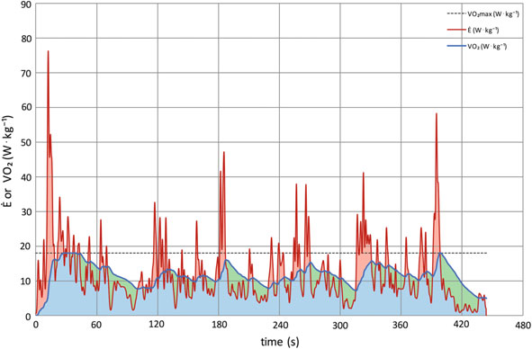

## 8.3.3

输入变量和接触时间的重要性 正如上面等式所详述的，所提出的简单方法基于必须精确测量的五个输入（体重、跑步速度、下肢长度、接触和飞行时间）。 为了估计 kleg 和 kvert 最终计算中每个变量的相对重要性（权重），我们进行了敏感性分析，模拟这五个变量中每个变量的变化，同时保持所有其他变量不变。 该分析的结果揭示了哪些变量对最终刚度值影响最大，从而揭示了哪些变量需要最仔细、最准确的测量。 根据参考值，所有变量的变化幅度高达 +10 或 -10%，并计算所得的刚度。 该理论分析清楚地表明，在其他条件不变的情况下，接触时间对 kleg 计算影响最大，并且接触时间和空中时间有一种测量跑步期间下肢刚度的简单方法

表 8.1 SMM 机械变量的参考值与用所提出的方法计算的值之间的平均绝对偏差

多变的

直径（厘米）

DL（厘米）

Fmax (kN) kvert (kN m−1) kleg (kN m−1)

跑步机协议

参考值 5.37±1.02 20.2±3.0 2.05±0.34 37.7±8.8 10.4±2.34

简单法 5.20 ± 0.91 20.0 ± 3.0 1.91 ± 0.32 37.7 ± 8.9 9.75 ± 2.19

偏差 (%) 3.28 ± 1.10 0.93 ± 0.43 6.93 ± 2.52 0.12 ± 0.53 6.05 ± 3.02

测力台协议

参考值 4.71±1.48 16.2±1.7 2.13±0.21 51.4±21.5 13.3±1.9

简单法 4.60±1.33 16.1±1.7 2.06±0.24 50.2±20.4 13.0±2.54

偏差 (%) 2.34 ± 2.42 0.67 ± 1.09 3.24 ± 2.08 2.30 ± 1.63 2.54 ± 1.16 平均绝对偏差计算如下： 偏差 $= (model-reference)$ =reference j j 100

让·伯努瓦·莫兰

对垂直刚度影响较大。 例如，理论上，接触时间变化 10% 将导致 kleg 或 kvert 变化 20-25%。 在实践中，这意味着如果跑步者的接触时间缩短 10%（例如 180 毫秒与 200 毫秒），他将以高 25% 的 kleg 跑步，反之亦然。 正如下面的应用所示，这种变化可能是由训练、疲劳、受伤或跑步模式的自愿改变引起的。 为了通过实验测试该理论模拟的结果，我们进行了一项研究，其中我们能够控制和隔离跑步过程中步频和接触时间对刚度的影响（Morin 等人，2007 年）。 我们要求受试者在多种条件下以 3.33 m s−1 的速度在仪器跑步机上跑步，包括由音频设置的更高和更低的步进频率。 考虑到接触时间和步频之间的直接关系，我们还要求受试者以更短和更长的接触时间跑步，同时遵循音频所施加的他们偏好的步频。 在后一种情况下，我们可以隔离接触时间对弹簧质量刚度的影响，独立于步进频率的相关影响（Farley 和 González 1996），正如我们在图 8.6 所示的理论模拟中所做的那样。 本实验研究的结果基本证实了接触时间对kleg的显着且实质性的影响，tc和kleg之间线性关系的整体斜率约为2，这与图8.6所示的tc对kleg的1:2-2.5相对权重一致。 这表明使用此方法时准确测量接触时间的根本重要性。

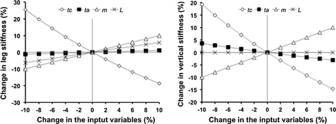

## 8.3.4

弹簧质量模型的方法假设的局限性。 这里介绍的简单方法基于跑步的弹簧质量模型的使用。 因此，提出了简单方法的所有局限性和图8.6的灵敏度分析。 模型的机械输入根据相应的腿（左图）和垂直（右图）变化绘制 跑步期间测量下肢刚度的简单方法

与该模型的使用相关的假设（参见第 8.2.4 节）也适用于该方法的使用。 运行条件：加速度、速度和坡度。 线性弹簧质量模型基于站立阶段下肢的几何考虑，其主要特征是中间站立前后扫过的角度的对称性（图8.1）（Blickhan 1989；McMahon 和 Cheng 1990；Farley 和 González 1996；Bullimore 和 Burn 2006）。 因此，所有明显诱发违反模型基本假设的运行模式的实验条件都会导致有问题的数据。 尽管可以在任何运行条件下测量所使用的简单方法的所有输入，但如果不遵守模型的基本假设，则计算出的弹簧质量变量（例如垂直和腿部刚度）没有多大意义。 这些条件特别包括非恒定速度（即加速或减速）和倾斜（上坡或下坡）跑步。 在这些情况下，质心扫过的角度围绕中间立场点（质心高于压力中心）不对称，因此方程： （8.4）和其他人没有给出正确的值。 最后，这里提出的简单方法最初已经过验证（Morin 等人，2005），适用于 12 至约 28 km h−1 的跑步速度。 在本文发表后进行的一些测量（参见第 8.5.2 节）表明，在 10 km h−1 的较低速度下，这种有效性仍然可以接受，但在更低的速度（8 km h−1，接近走跑过渡速度）下则较差。 最后，最近的一项研究（Clark 和 Weyand 2014）讨论了世界级短跑运动员在最高跑步速度（即高于 36 km h−1）下使用的正弦波建模方法的有效性，并表明在这种极端条件下，在仪表跑步机上测量的地面反作用力偏离正弦波轨迹。 输入变量测量的准确性。 正如模型的理论模拟（图 8.6）和我们的实验研究（Morin et al. 2007）所示，跑步过程中接触时间和空中时间的测量对于通过这种简单方法获得的刚度数据的整体精度至关重要。 尽管重要性较低，但跑步速度也应尽可能准确地测量。 最后，还应准确测量体重和下肢长度的人体测量变量。 对于后者，一对精确的秤和卷尺就足够了。 因此，确保使用此方法时获得的数据的准确性和可靠性的最重要因素是用于测量接触时间、空中时间以及跑步速度的技术。

## 8.4

技术和输入测量 如前几节所述，用于获取模型主要机械输入（接触、空中时间和运行速度）的设备和技术必须足够准确，以确保刚度计算的有效性。 例如，由于典型的接触时间持续约 0.2 秒（范围从高速冲刺的约 0.1 秒到低速慢跑的约 0.3 秒），因此以

让·伯努瓦·莫兰

100 Hz 的采样频率将具有 0.01 s 的时间分辨率，这表示测量 0.2 s 事件时可能存在 5% 的误差。 对于 200 Hz 设备，该误差降至 2.5%；对于 50 Hz 设备，该误差达到 10%。 请注意，标准电视镜头和摄像机在大多数情况下以较低的每秒帧数运行。 测力台和仪表跑步机。 尽管可以期望研究人员和从业者在测力台或仪表跑步机可用时使用标准（参考）方法（参见第 8.2.3 节）进行跑步的弹簧质量模型分析，但这些设备可用于测量接触时间和空中时间。 这些设备通常以 1000 Hz 或更高的采样频率运行，确保测量准确。 因此，只要准确测量跑步速度（跑步机传感器或用于测力板测量的定时门），这些接触和空中时间数据就可以使用本方法精确计算弹簧质量变量。 接触垫和光学装置设置在地面上。 测量接触和飞行时间以及跑步速度的实用方法是直接在地面上设置接触/压力垫（例如 Gaitrite™）或光学设备（例如 Optojump™）（图 8.7）。 主要优点是可以准确获得输入变量，而不会干扰跑步者的技术，因为跑步者没有携带任何传感器并且（自由地上跑步条件）。 另一个有趣之处是测量可以直接在训练或比赛现场进行，而不必在实验室进行，对于中长跑或短跑，可以直接进行田径测量，如图 8.7 和第 7 节所示。 8.5。 脚踏开关、压力鞋底和加速度计设置在脚部。 图 8.7 测量脚接触地面时间（以及腾空时间）的实用方法 图 8.7 在 100 米短跑或撑竿跳助跑过程中，使用安装在跑步地板上的接触/压力垫（左，Gaitrite™）或安装在跑道上的光学设备（中和右，Optojump™）的典型测量设置 跑步期间测量下肢刚度的简单方法

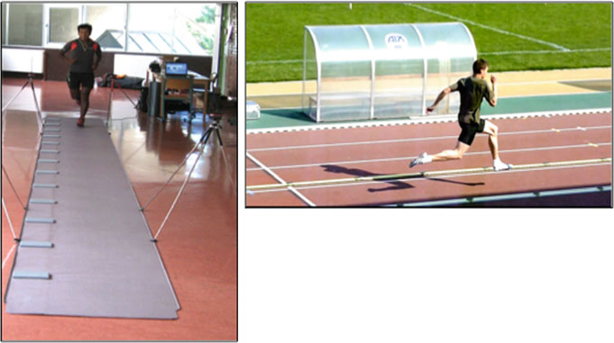

跑步是将压力传感器直接贴在跑步者的脚上，或者为了更舒适而贴在鞋垫上。 该设置已用于临床评估受试者脚趾上贴有脚踏开关的步行步态（Aminian 等人，2002 年），并且我们在野外冲刺研究中使用了它（参见第 8.5 节，Morin 等人，2006 年），如图 8.8 所示。 尽管施加的压力量不够准确，但这些脚踏开关（力感应电阻器类型）很轻、很薄，而且价格也不贵。 他们对跑步步骤的时间特征（接触时间和空中时间，图 8.9）的测量非常准确和可靠（如我们与仪表跑步机数据的比较的个人数据所示）。 另一个优点是图8.8左：跑鞋鞋垫上的力传感电阻器，位于跟骨和第一跖骨的骨头处。 右图：在 12 km h−1 跑步过程中，压力信号（采样率为 400 Hz）被求和并与表面肌电图测量同步。 运动员通过特殊服装和医用长袜携带灯线和数据采集设备。 图 8.9 左：运动员通过特殊服装和医用长袜携带灯线和数据采集设备。 右：在两个连续的冲刺步骤中使用脚踏开关测量的接触时间和空中时间（采样率为 400 Hz）（最高速度约为 10 m s−1）

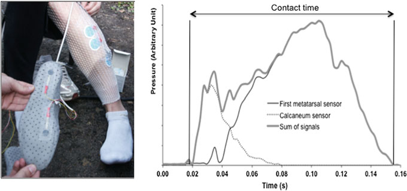

让·伯努瓦·莫兰

它们可以与其他设备连接和同步，例如我们在冲刺研究中使用的肌肉活动传感器（表面肌电图）（Slawinski 等人，2008a，图 8.8）。 使用类似的方法，一些制造商和作者建议在鞋子上安装小而轻的加速度计，如图12.1所示（Hoyt等人，1994年，2000年；Weyand等人，2001年；Giandolini等人，2014年）。 虽然通过这种方法可以获得有效且准确的信号（例如参见图 8.10），但原始数据采集、存储和处理通常比脚踏开关更复杂，如果只测量接触时间和空中时间。 运动手表和加速度计设置在后备箱上。 最近，出现了另一种类型的系统，可以测量接触、空中时间和相关的跑步步骤时空变量。 这些基于放置在胸部（例如 Garmin HRM-Run™ 监视器，图 8.11）或臀部（例如 Myotest™）的加速度计。 基本上，这些光传感器被携带在跑步者的身体上，距离质心不远。 理论上，一旦跑步者离开地面，从一次接触到下一次接触，质心的垂直加速度就等于重力加速度。 当跑步者在几百秒后接触地面时，情况就不再是这样了。 因此，如果设备经过正确校准且足够准确（并且已知体重、下肢长度和跑步速度），则可以测量接触时间和空中时间。 反过来，应用本章中提出的落体定律和/或方程，所有其他弹簧质量变量都可以根据这个简单的基础进行计算6（Gindre 等人，2016 年）（图 8.12）。 据我们所知，关于图 8.10 在 16 km h−1 跑步期间获得的原始加速度和地面反作用力的典型信号（前脚掌着地模式），仅发表了一项研究。 加速度计紧紧地贴在鞋的外侧第五跖骨头处（如图 12.1 所示）。 6 专利：Flaction P、Quievre J、Morin JB (2013) 专利。 实现用于分析步幅的生物力学参数的加速度计的集成便携式设备和方法。 US20130190657。 测量跑步时下肢僵硬度的简单方法

Garmin HRM-Run™ 监视器的有效性（Watari 等人，2016 年）。 这项研究的结果显示了接地时间的有效测量，这与我们自己的测试（未发表的数据）一致，与仪表跑步机和 Optojump™ 数据相比，显示了可接受的有效性和可靠性。 Myotest™Run 加速度计设备已在两项类似的研究中进行了测试，总体结论是它是可重复的，并且对于步速测量有效，尽管在接触时间和空中时间方面与参考设备存在显着差异（Gouttebarge 等人，2015 年；Gindre 等人，2016 年）。 因此，如果使用相同设备进行数据比较，这些设备对于运动环境中的训练和长期监测目的非常有趣。 与其他技术相比，它们的易用性、舒适性和低成本是明显的优势。 视频分析。 对于安装在跑步场地上的设备，测量跑步中接触和腾空阶段持续时间的一种简单而直接的方法是拍摄并记录步数，前提是每秒的帧数足够高以确保准确性。 这在一些研究中已经完成，特别是在真实的性能环境中。 例如，（Le Meur et al. 2013）使用具有 300 fps 慢动作模式的相机 (Casio™Exilim EX-F1) 来测量接触时间和空中时间，并研究在国际铁人三项比赛中弹簧质量变量如何随疲劳和比赛策略而变化。 标准电视镜头（不超过 100 fps，通常约为 30 或 60）已被用于根据顶级比赛录像来估计世界级运动员的弹簧质量变量（Taylor 和 Beneke 2012）。 然而，正如上面所解释的，我们认为这些条件不允许准确。 图 8.11 一些运动手表，例如 Garmin Forerunner 620™，包括一个放在胸部（右）的加速度计 (Garmin HRM-Run™)。 然后，对跑步的所有步骤（左图，标准慢跑的示例）的接触时间和其他机械变量进行监控，从而可以详细跟踪跑步力学，并使用此处介绍的简单方法计算弹簧质量变量。 在这个典型的跑步训练中，以最大有氧速度（20 km h−1）进行五次 1’ 跑步，接触时间和质心垂直振动的相关变化出现在红色方块中

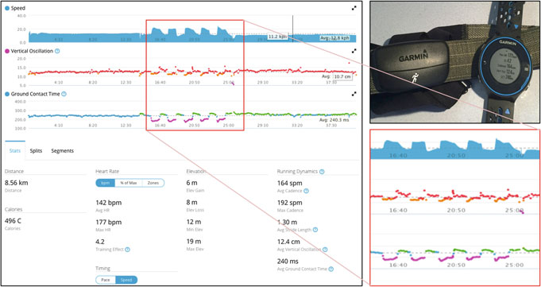

让·伯努瓦·莫兰

接触时间的可靠测量，进而导致使用此处介绍的简单方法得出的弹簧质量变量值存在问题。 智能手机应用程序。 一些智能手机现在配备的摄像头支持高达 240 fps 的慢动作模式（Apple iPhone 6™ 及后续型号）。 因此，如果人们能够以一种能够清晰地视觉检测足部地面接触开始和结束的方式拍摄和记录跑步者的脚步，那么这种高拍摄率可能会导致准确的测量。 这是名为“Runmatic”7 的新应用程序的基础，该应用程序根据接触、飞行时间、跑步速度以及体重和身高输入，计算所有弹簧质量变量以及左右不对称性并监控它们随时间的变化（长期监控）。 如图 8.13 所示，应该对跑步者的脚的几个步骤进行拍摄，然后只需在屏幕上单击屏幕即可直观地识别脚的触地和起跳，就可以计算出所有的触地和腾空时间。 反过来，可以导出所有弹簧质量变量并计算左右不对称性。 该应用程序的验证包括将两名观察者测量的接触时间和腾空时间（观察者间可靠性）与使用光电设备（Optojump™）在跑步机上设置的两个受试者以 10 至 18 km h−1 的速度连续 8 步测量的参考数据进行比较（约 100 分）。 图 8.12 左：跑步时 Myotest™ 加速度计设备位于躯干下端。右：跑步力学和 “跑步检查”测试后显示弹簧质量变量（例如垂直刚度）7https://itunes.apple.com/us/app/runmatic/id1075902287?l=es&ls=1&mt=8 跑步期间测量下肢刚度的简单方法。

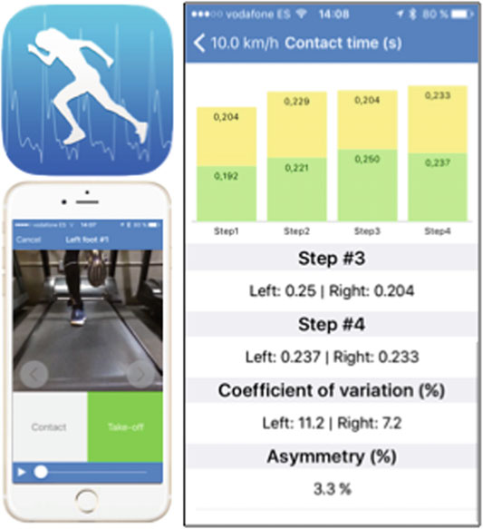

总计比较）。 总体而言，结果表明与光电设备相比，应用程序测量具有非常高的有效性和可靠性（BalsalobreFernandez 等人，2017 年）。

## 8.5

应用开发、验证和发布本章介绍的简单方法的主要目的是将其用于研究和运动训练实践。 在过去的十年里，我们这样做了，我们很荣幸看到其他学者或教练将这种方法添加到他们的跑步分析工具箱中。 在这里，我们将详细介绍应用此方法的两个示例，以研究不同环境下的跑步力学和弹簧质量行为：最大速度（冲刺）和最大持续时间（超耐力）条件。 图8.13 iPhone应用程序“Runmatic”使用高速视频慢动作模式来识别接触和空中时间。 然后，计算跑步模式力学并显示在屏幕上

让·伯努瓦·莫兰

## 8.5.1

冲刺跑 由于人体以 10 m s−1 或更高的最高速度（尤塞恩·博尔特在他的 9.58 s 100 米世界纪录中达到了超过 12 m s−1 的最大速度）在一秒钟内跑了大约 10 m，因此研究冲刺跑力学长期以来一直是一个挑战。 因此，如第 1 章所述。 10、短跑仪表跑步机已经被使用，而地面实验长期以来仅限于研究测力板上的一两个步骤。 在我们于 2004 年进行的原始实验中，我们能够使用此处介绍的简单方法计算体育学生在整个 100 米冲刺期间的主要弹簧质量变量（Morin 等，2006）。 使用经典设备测量受试者的质量和下肢长度，使用以 35 Hz 运行的雷达设备（Stalker ATS，Applied Concepts，普莱诺，德克萨斯州）测量跑步速度，最后使用贴在跑鞋鞋垫上的脚踏开关以 400 Hz 的采样率测量接触时间和空中时间。 实验时，我们无法使用目前常见的闪存卡或类似技术来记录和保存压力数据，因此原始数据通过电缆传输到与跑步者并排驾驶摩托车的实验者背包中的电脑上。 这位飞行员技术娴熟，能够准确跟踪跑步者在 100 米比赛中的加速度。 这个实验使我们能够展示实际地面冲刺跑步期间的第一个弹簧质量数据。 表 8.2 显示了短跑 20 米路段的主要变量（除了 20-40 米路段外），因为受试者在此路段处于加速状态。 在同一个实验中，我们研究了疲劳对弹簧质量力学的影响，以便更好地了解（i）由于重复最大强度任务而在疲劳影响下人体如何改变其弹簧质量特性，以及（ii）潜在地指导涉及长距离和/或重复冲刺的运动中的训练实践。 表 8.2 显示了重复 4 次 100 米且被动休息 2 分钟时观察到的疲劳变化。 随着性能以及平均和最大跑步速度的预期下降，弹簧质量模型中显示出最实质性变化的两个组成部分是站立期间质心的垂直振动和垂直刚度。 观察到的变化幅度比从速度-kvert 关系中预期的要大（图 8.5），这表明限制站立期间质心向下位移的能力和疲劳下 kvert 的损失可能是这种情况下的表现因素（类似于足球、橄榄球、篮球或手球等团体运动中反复冲刺和方向变化时发生的情况）。 2011 年进行了另一项田野实验，参加者包括 2010 年欧洲 100 米、200 米和 4 100 米接力冠军（图 8.7 右）。 在这项研究中（Morin 等人，2012a），我们使用 Optojump™ 轨道设置在 100 米赛跑 40-60 m 部分的赛道上，测量了短跑运动员在最大速度阶段的弹簧质量行为（数据未公布）。 测量跑步时下肢僵硬度的简单方法

表 8.3 显示了本次实验中测试的世界级运动员连续几个步数的数据。 请注意，除了对运动员的力学进行准确研究和长期跟踪（应在一个赛季中重复测量）之外，该方法还可以进行更深入的分析，例如左右不对称计算和伤前测试，以改善重返运动和康复过程。 这些是我们当前的一些项目，例如最近一项关于前十字韧带手术的研究（Mazet 等人，2016 年）。 我们还考虑了其​​他以短跑为关键的运动，例如，我们可以研究精英撑杆跳运动员助跑的最后阶段，包括当前的世界纪录保持者（Cassiram 等人，2015），以及高架跑道对精英运动员的弹簧质量行为、助跑终端速度和表现的影响。 表 8.2 8 名接受过训练的体育学生在 100 米跑步中主要跑步力学和弹簧质量变量的平均值±标准差

可变 20–40 m 40–60 m 60–80 m 80–100 m

第一个和第四个 100 米之间的疲劳变化 (%) tc (ms) 111 ± 14 108 ± 15 110 ± 12 113 ± 11 +14.7 ± 0 7.2* tv (ms) 137 ± 13 141 ± 13 142 ± 11 146 ± 16 +3.87 ± 4.19 v (m s−1) 7.93 ± 0.34 8.33 ± 0.34 8.24 ± 0.24 7.89 ± 0.40 −11.6 ± 3.1* kleg (kN m−1) 19.7 ± 4.8 19.8 ± 5.2 18.9 ± 3.5 19.5 ± 4.3 −9.53 ± 9.62 kvert (kN·m−1) 93.9 ± 14.6 98.3 ± 16.6 93.8 ± 10.2 89.6 ± 9.8 −20.6 ± 7.9*

最大扭矩（千牛） 2.54 ± 0.25 2.63 ± 0.27 2.60 ± 0.20 2.60 ± 0.21 −4.88 ± 3.67

镝（厘米） 2.8 ± 0.4 2.8 ± 0.4 2.8 ± 0.3 3.0 ± 0.3 +21.2 ± 9.4*

DL (cm) 13.8 ± 2.7 14.2 ± 2.8 14.5 ± 2.3 14.2 ± 2.2 +6.88 ± 7.78 第一个和第四个 100 米之间的变化（以 % 为单位）显示变量如何随疲劳而变化 *表示显着变化 (P < 0.05)，如方差分析所示 表 8.3 世界级个人 100 米冲刺测试中 40 米和 60 米之间连续 6 步的弹簧质量变量平均值（个人最好成绩 9.92 秒） tc (ms) tv (ms)

Dy (cm) kvert (kN m−1) kleg (kN m−1)

左1

## 2.44

## 14.3

右1

## 2.51

## 13.1

左2

## 2.38

## 16.7

右2

## 2.41

## 14.3

左3

## 2.40

## 15.6

右3

## 2.41

## 13.3

平均所有

## 2.43

## 14.5

变异系数 (%)

## 2.9

## 2.2

## 1.8

## 4.4

## 9.5

平均剩余时间

## 2.41

## 15.5

平均权利

## 2.51

14.3 在这些步骤中，运行速度恒定在约 11.0 m s−1 。 运动员使用了田径钉鞋和起跑器

让·伯努瓦·莫兰

## 8.5.2

超耐力虽然超耐力赛事（例如公路 24 小时或 100 公里、山地 100 英里等）可能看起来与短距离最大冲刺（例如 100 米）完全相反，但一个共同的特点是难以进行现场实验来研究跑步力学。 我们开始了在仪器跑步机上采用 24 小时方案进行超长时间跑步力学研究（Morin 等人，2011a）。 然后，为了更深入地了解实际的超越野练习（一项日益流行的活动），我们想要研究典型比赛的结果（Ultrarail du Mont Blanc®，160 公里，约 9000 米正海拔变化）。 研究设计（Morin 等人，2011b）是一项事前测量，要求受试者在靠近比赛起终点线的实验室地面（图 8.7）上以恒定速度跑步。 为了消除跑步速度对计算数据的影响，他们被要求在压力垫上跑步时保持恒定的 12 km h−1 配速。 在最初招募的 34 名受试者中，22 名完成了比赛，18 名可以接受测试（4 名由于疼痛和/或疲劳而无法完成 12 km h−1 的跑步比赛）。 表 8.4 显示，这种超耐力疲劳环境中的主要变化与冲刺跑中观察到的变化相反（表 8.2）。 特别是，山地超级马拉松后的受试者在接触时间不变的情况下表现出较低的空中时间，而反复冲刺后的疲劳会导致更大的接触时间，而空中时间几乎不变。 此外，在连续四次100米冲刺后，跑步姿势期间质心的垂直位移较大，而在160公里山地超级马拉松后则减小。 这些对比结果表明，根据所考虑的运动的持续时间和强度，疲劳对跑步生物力学的影响有很大不同。 我们将这些结果解释为随着冲刺跑中疲劳的发展，推动地面和抵抗冲击以及“反弹”所需的高力量的能力下降。 相反，在 160 公里超跑之后观察到的弹簧质量行为的变化与表 8.4 山地超级马拉松前后主要跑步力学和弹簧质量变量的平均值±SD 一致

多变的

预超越野

后超步

赛前和赛后疲劳变化 (%) tc (ms) 249 ± 16 252 ± 17 +1.40 ± 7.21 tv (ms) 118 ± 19 96 ± 22 −18.5 ± 17.4* kleg (kN m−1) 9.87 ± 1.45 9.44 ± 1.10 −3.71 ± 8.78 kvert (kN·m−1) 25.1 ± 2.3 26.6 ± 3.3 +5.64 ± 11.7

最大扭矩（千牛） 2.32 ± 0.16 2.17 ± 0.16 −6.30 ± 7.03*

Dy（厘米） 6.6 ± 0.05 5.9 ± 0.08 −11.6 ± 10.5*

DL (cm) 16.9 ± 1.4 16.4 ± 1.4 −2.90 ± 7.55 测试对象的跑步时间范围为 25 至 43 小时 *表示显着变化 (P < 0.05)，如配对样本的 t 检验所示 跑步期间测量下肢僵硬的简单方法

在两倍长的Tor des Geants®（意大利）比赛中，我们进行了类似的研究（Degache et al. 2016），并将其解释为受试者跑步时髋部、膝盖和脚踝屈曲（以及相关的偏心肌肉动作）较少且在地面上“弹跳”较少的一种方式。 这使得他们能够减少每一步制动身体落地时向下运动所需的制动脉冲量，并且还可能减少每一步相关的关节、肌腱和肌肉疼痛。 在超耐力实验中一致观察到的这种“更平稳”和“更安全”的跑步模式与膝关节伸肌或踝关节跖屈肌力量的大幅下降并不相关（Millet 等人，2011 年），我们认为这可能是跑步者（有意或无意）使用的一种策略，以“保存腿部”并跑完全程（Millet 等人，2012 年）。 有趣的是，当肌肉结构或功能改变时，也会观察到与超耐力比赛（尤其是山地比赛）后观察到的非常相似的变化：剧烈下坡跑后（Chen 等人，2007 年，2009 年）、股外侧肌肌肉活检（Morin 等人，2009 年）或衰老（Karamanidis 和 Arampatzis 2005 年；Cavagna 等人，2005 年）。 2008）。 相比之下，一系列在跑步机上进行的最大短距离冲刺会导致力量大幅损失，但不会导致匀速跑步模式发生任何变化（Morin 等人，2012b）。 总之，尽管实验室设备和协议最初允许对跑步的弹簧质量模型分析进行验证和基础，但现在可以在现实生活中的锻炼和运动条件下进行实验。 随着时间的推移，这个简单的模型已经针对某些特定条件（例如非常高的冲刺速度）进行了改进和挑战，但它总体上允许对跑步生物力学进行合理的宏观分析，包括复杂的神经肌肉和骨腱机械的结果输出。

参考文献 Alexander RM (1991) 步行和跑步的节能机制。 J Exp Biol 160:55–69 Alexander RM (2003) 动物运动原理。 普林斯顿大学出版社，新泽西州普林斯顿 Alexander RM (2004) 双足动物及其与人类的差异。 J Anat 204:321–330 Aminian K、NajafiB、Büla C 等人 (2002) 使用微型陀螺仪的移动系统测量的步态时空参数。 J Biomech 35:689–699 Arampatzis A、Brüggemann GP、Metzler V (1999) 速度对人类跑步中腿部刚度和关节动力学的影响。 J Biomech 32:1349–1353 Balsalobre-Fernández C、Agopyan H、Morin J-B (2017) 用于测量跑步力学的 iPhone 应用程序的有效性和可靠性。 J Appl Biomech 33:222–226 Blickhan R (1989) 跑步和跳跃的弹簧质量模型。 J Biomech 22:1217–1227 Bramble DM, Lieberman DE (2004) 耐力跑和人类的进化。 Nature 432:345–352 Brughelli M, Cronin J (2008a) 跑步和跳跃机械刚度研究综述：方法论和影响。 Scand J Med Sci Sports 18:417–426 Brughelli M, Cronin J (2008b) 跑步速度对垂直、腿部和关节刚度的影响：建模和对未来研究的建议。 Sports Med 38:647–657 Bullimore SR, Burn JF (2006) 跑步力学中施力点向前平移的后果。 理论生物学杂志 238：211–219

让·伯努瓦·莫兰

Cassiram J、Sanchez H、Morin J-B (2015) 撑杆跳高架跑道，助跑表现的决定因素有何优势？ 见：第 33 届国际运动生物力学会议，网址：

法国普瓦捷。 Poitiers，第 1–5 页 Cavagna GA (1975) 将测力平台用作测力计。 J Appl Physiol 39:174–179 Cavagna GA, Legramandi MA, Peyré-Tartaruga LA (2008) 老人跑步：机械功和弹性弹跳。 Proc Biol Sci 275:411–418 Chen TC, Nosaka K, Tu J-H (2007) 下坡跑后跑步经济性的变化。

J Sports Sci 25:55–63 Chen TC, Nosaka K, Lin M-J et al (2009) 下坡跑后不同强度下跑步经济性的变化。 J Sports Sci 27:1137–1144 Clark KP, Weyand PG (2014) 通过简单弹簧站立机制是否可以最大化跑步速度？ J Appl Physiol 117:604–615 Coleman DR, Cannavan D, Horne S, Blazevich AJ (2012) 人体跑步中的腿部僵硬：从先前发布的模型得出的估计值与直接运动学-动力学测量值的比较。 J Biomech 45：1987–1991 Degache F、Guex K、Fourchet F 等人 (2013) 5 小时的丘陵跑步引起的跑步力学和弹簧质量行为的变化。 J Sports Sci 31:299–304 Degache F、Morin J-B、Oehen L 等人 (2016) 世界上最具挑战性的山地超级马拉松比赛中的跑步力学。 Int J Sports Physiol Perform 11:608–614 Dickinson MH, Farley CT, Full RJ et al (2000) 动物如何移动：综合观点。 Science 288:100–106 Dutto DJ, Smith GA (2002) 跑步机跑步至力竭期间弹簧质量特性的变化。 Med Sci Sports Exerc 34:1324–1331 Farley CT, González O (1996) 人类跑步中的腿部僵硬和步频。 J Biomech 29:181–186 Ferris DP, Farley CT (1997) 人体跳跃过程中腿部刚度和表面刚度的相互作用。 J Appl Physiol 82:15–22–4 Farley CT, Ferris DP (1998) 步行和跑步的生物力学：肌肉动作的质心运动。 Exerc Sport Sci Rev 26：253–285 Farley CT、Glasheen J、McMahon TA (1993) 跑步弹簧：速度和动物体型。 J Exp Biol 185:71–86 Ferris DP, Louie M, Farley CT (1998) 在现实世界中跑步：调整不同表面的腿部刚度。 Proc R Soc B Biol Sci 265：989–994 Ferris DP、Liang K、Farley CT (1999) 跑步者在新的跑步表面上迈出第一步时调整腿部刚度。 J Biomech 32:787–794 Giandolini M, Poupard T, Gimenez P et al (2014) A simple field method to identify foot strike pattern during running. J Biomech 47:1588–1593 Gindre C、Lussiana T、Hebert-Losier K、Morin J-B (2016) Myotest® 用于测量跑步步幅运动学的可靠性和有效性。 J Sports Sci 34:664–670 Girard O, Mendez-Villanueva A, Bishop D (2011a) 重复冲刺能力 - 第 I 部分。 Sport Med 41:673–694 Girard O, Micallef J-P, Millet GP (2011b) 重复跑步冲刺期间弹簧质量模型特性的变化。 Eur J Appl Physiol 111:125–134 Girard O, Racinais S, Kelly L et al (2011c) 在天然草地上反复冲刺会损害垂直刚度，但不会改变足球运动员的足底负荷。 Eur J Appl Physiol 111:2547 – Girard O、Millet G、Slawinski J 等人 (2013) 5 公里计时赛中跑步力学和弹簧质量行为的变化。 Int J Sports Med 34:832–840 Girard O, Brocherie F, Morin J-B et al (2015) 用于分析重复跑步机冲刺期间跑步力学变化的四个部分的比较。 J Appl Biomech 31:389–395 Girard O、Brocherie F、Morin J-B、Millet GP (2016) 在炎热与缺氧环境中重复跑步机冲刺期间进行机械改造。 一项试点研究。 J Sports Sci 34：1190–1198 跑步时测量下肢僵硬的简单方法

Gouttebarge V、Wolfard R、Griek N 等人 (2015) 用于测量休闲跑步者的步频和触地时间的 myotest 的再现性和有效性。 J Hum Kinet 45: 19–26 He JP, Kram R, McMahon TA (1991) 模拟低重力下跑步的力学。 应用杂志

Physiol 71:863–870 Hobara H, Inoue K, Gomi K, et al (2010) 400 m 冲刺期间弹簧质量特性的连续变化。 J Sci Med Sport 13：256–261。 doi:10.1016/j.jsams.2009.02.002 Hoyt RW、Knapik JJ、Lanza JF 等人 (1994) 动态足部接触监测器，用于估计人体运动的代谢成本。 J Appl Physiol 76:1818–1822 Hoyt DF, Wickler SJ, Cogger EA (2000) 接触时间和步长：肢体长度、跑步速度、负重和倾斜度的影响。 J Exp Biol 203:221–227 Hunter I, Smith GA (2007) 首选和最佳步频、刚度和经济性：1 小时高强度跑步期间疲劳的变化。 Eur J Appl Physiol 100:653–661 Karamanidis K, Arampatzis A (2005) 下肢不同肌肉肌腱单位的机械和形态特性以及跑步力学：衰老和体力活动的影响。 J Exp Biol 208:3907–3923 Kerdok AE, Biewener AA, McMahon TA et al (2002) 人体在不同刚度表面上跑步的能量学和力学。 J Appl Physiol 92:469–478 Kram R, Dawson TJ (1998) 红袋鼠 (Macropus rufus) 运动的能量学和生物力学。 Comp Biochem Physiol B Biochem Mol Biol 120:41–49 Latash ML, Zatsiorsky VM (1993) 关节僵硬：神话还是现实？ Hum Mov Sci 12:653–692 Le Meur Y, Thierry B, Rabita G et al (2013) 国际铁人三项比赛中的春季质量行为。 Int J Sports Med 34:748–755 Lee CR, Farley CT (1998) 人类步行和跑步质心轨迹的决定因素。 J Exp Biol 201:2935–2944 Martin V, Kerherve H, Messonnier LA et al (2010) 24 小时跑步机跑步引起的神经肌肉疲劳的中枢和外周贡献。 J Appl Physiol 108:1224–1233 Mazet A, Morin J-B, Semay B et al (2016) Modifications du pattern mécanique de course dans les suites d’une plastie du ligament croisé antérieur. Sci Sports 31:219–222 McDougall C (2010) 为跑步而生：隐藏的部落、超级跑步者和世界上从未见过的最伟大的比赛。 Profile Books Ltd.，伦敦，英国 McMahon TA, Greene PR (1978) 快速跑道。 Sci Am 239:148–163 McMahon TA, Greene PR (1979) 跑道顺应性对跑步的影响。 J Biomech 12:893–904 McMahon TA, Cheng GC (1990) 跑步的力学：刚度如何与速度耦合？ J Biomech 23（增补 1）：65–78 McMahon TA，Valiant G，Frederick EC（1987）Groucho 跑步。 J Appl Physiol 62:2326–2337 Millet GY, Tomazin K, Verges S et al (2011) 极限山地超级马拉松的神经肌肉后果。 PLoS ONE 6:e17059 Millet GY、Hoffman MD、Morin JB (2012) 牺牲经济性来提高跑步成绩——超级马拉松的现实吗？ J Appl Physiol 113:507–509 Morin JB, Dalleau G, Kyröläinen H et al (2005) 一种测量跑步过程中刚度的简单方法。 J Appl Biomech 21:167–180 Morin J-B、Jeannin T、Chevallier B、Belli A (2006) 冲刺跑期间的弹簧质量模型特征：与表现和疲劳引起的变化的相关性。 Int J Sports Med 27:158–165 Morin JB、Samozino P、Zameziati K、Belli A (2007) 改变步频和接触时间对人类跑步中腿部弹簧行为的影响。 J Biomech 40:3341–3348 Morin J-B, Samozino P, Féasson L et al (2009) 肌肉活检对跑步力学的影响。 Eur J Appl Physiol 105:185–190 Morin J-B, Samozino P, Millet GY (2011a) 24 小时跑步中跑步运动学、动力学和弹簧质量行为的变化。 Med Sci Sport Exerc 43:829–836 Morin JB、Tomazin K、Edouard P、Millet GY (2011b) 山地超级马拉松比赛引起的跑步力学和弹簧质量行为的变化。 生物力学杂志 44：1104–1107

让·伯努瓦·莫兰

Morin J-B、Bourdin M、Edouard P 等人 (2012a) 100 米冲刺跑表现的机械决定因素。 Eur J Appl Physiol 112:3921–3930 Morin J-B, Tomazin K, Samozino P et al (2012b) 高强度冲刺疲劳不会改变恒定次最大速度跑步力学和弹簧质量行为。 欧洲应用杂志

Physiol 112:1419–1428 Pappas P, Paradisis G, Tsolakis C et al (2014) 跑步机跑步期间腿部和垂直刚度的可靠性。 Sport Biomech 13:391–399 Rabita G, Slawinski J, Girard O et al (2011) 优秀铁人三项运动员匀速力竭跑过程中的弹簧质量行为。 Med Sci Sport Exerc 43:685–692 Silder A, Besier T, Delp SL (2015) 负重跑步会增加腿部僵硬。 J Biomech 48:1003–1008 Slawinski J, Dorel S, Hug F et al (2008a) 精英长距离冲刺跑：倾斜训练和水平训练之间的比较。 Med Sci Sport Exerc 40:1155–1162 Slawinski J, Heubert R, Quievre J et al (2008b) 赛道跑步至力竭期间弹簧质量模型参数和能量成本的变化。 J 力量调节研究 22:930–936 Taylor MJ, Beneke R (2012) 地球上跑得最快的人的弹簧质量特征。 国际体育

Med 33:667–670 Watari R, Hettinga B, Osis S, Ferber R (2016) 验证躯干安装的加速度计，用于测量跑步机跑步期间的垂直振动和地面接触时间。 应用杂志

Biomech 32:306–310 Weyand PG、Kelly M、Blackadar T 等人 (2001) 根据跑步者的脚与地面接触时间和心率动态估计最大有氧功率。 J Appl Physiol 91:451–458 Winter D (1979) 人体运动的生物力学。 Wiley，纽约 一种测量跑步过程中下肢僵硬度的简单方法