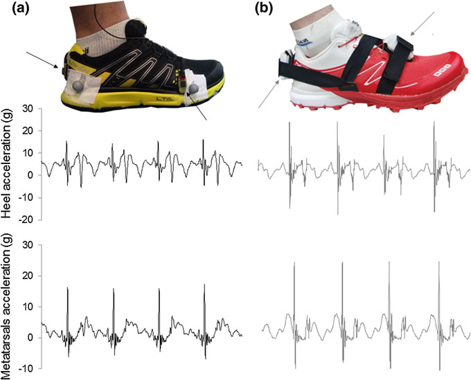
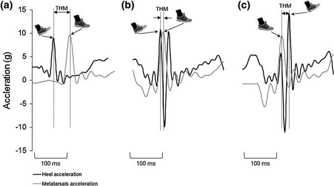
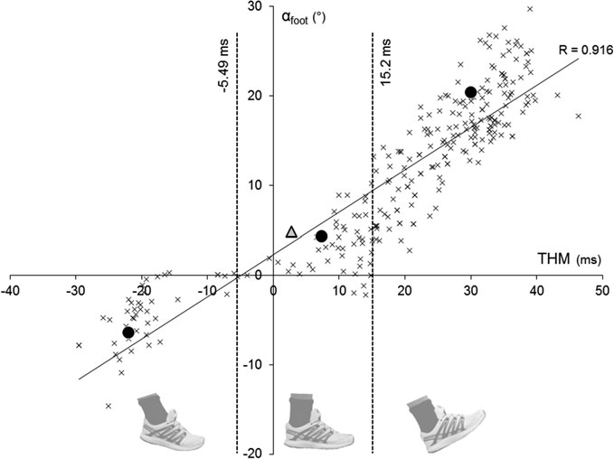
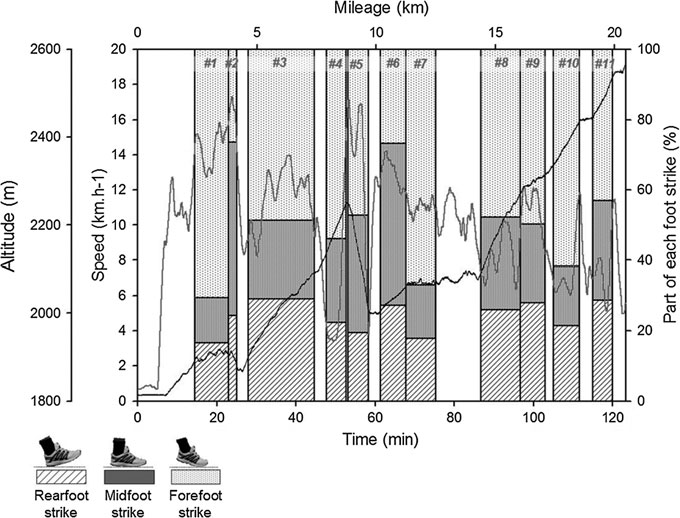
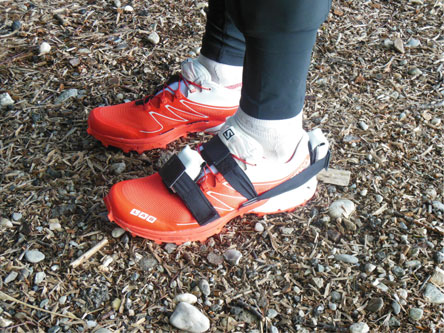
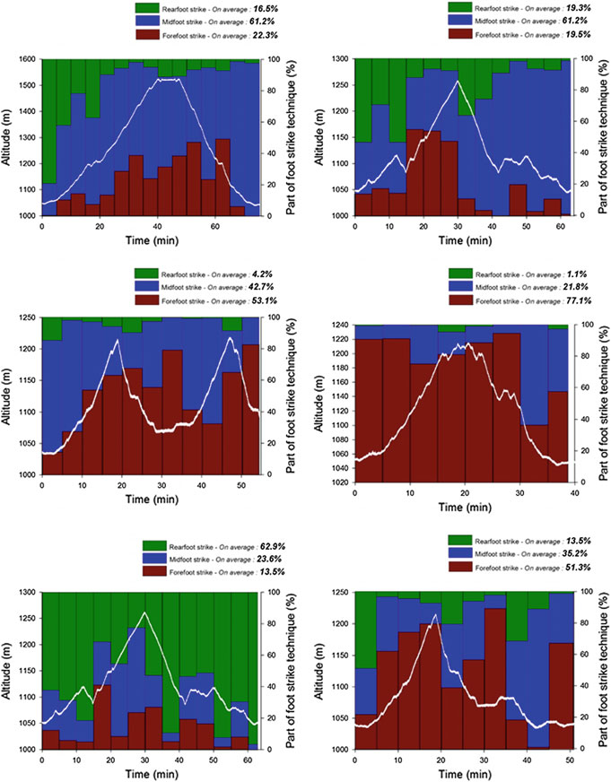

# 第 9 章：确定跑步时足部触地模式的简单方法

确定脚的简单方法

跑步时的击球模式

Marlene Giandolini 摘要 跑步者，尤其是长跑运动员面临各种过度使用损伤，例如跟腱病、胫骨夹板或应力性骨折。 这些过度使用损伤部分是由于肌肉骨骼结构上的重复负载造成的。 另外，跑步时的负荷分配与所采用的足部着地模式密切相关。 通常可识别三种足部着地模式：脚跟着地、中足着地和前足着地。 根据所采用的足部着地模式，施加在跑步者身体上的负荷的强度和位置会有所不同，因此间接导致某些过度使用伤害的风险也会有所不同。 因此，识别跑步者的足部着地模式轮廓是有意义的，以便根据跑步者特定的受伤史提供训练和/或鞋类建议来预防受伤。 本章旨在提出一种简单的方法来确定原位连续的足部触地模式。 这种方法需要两个加速度计来记录脚跟和前脚的加速度。 根据这些信号，可以测量脚跟和跖骨撞击之间的延迟（由它们各自的峰值加速度表示）。 根据这个时间变量，可以评估比赛或训练期间每个脚部着地模式的百分比。 通过将加速度计与 GPS 装置同步，该方法还可以研究疲劳、坡度、表面等与给定跑步者的足部着地模式轮廓之间的相互作用。 这种简单的方法不仅引起了基础研究的兴趣，也引起了临床医生、教练或跑鞋制造商的兴趣。

9.1 简介：为什么要评估足部触地模式？ 个体的跑步运动学可以通过与飞行阶段或接触阶段相关的大量变量来表征，例如飞行和接触时间、步频、步长、关节运动范围、腿部压缩、

M. Giandolini (&) Amer Sports Innovation and Sport Sciences Lab, Salomon SAS, 14 Chemin Des Croiselets, 74370 Metz-Tessy, France 电子邮件：marlene.giandolini@salomon.com

其中，足部着地模式的类型最近引起了研究领域的极大兴趣。 已经确定了三种足部着地技术： 后足着地（RFS），其中首先与地面接触的点是脚跟或鞋底的后三分之一部分，并且中足和前足部分在足部着地时不接触地面； 前足着地（FFS），其中第一次接触的点是前足或鞋底的前半部，并且在足部着地时脚跟不接触地面，但在中间时缓慢下降接触地面； 中足着地（MFS），其中脚后跟和脚掌准同时着地，因此第一次接触点可以是后脚或前脚部分（Altman 和 Davis 2012；Hasekawa 等人 2007）。 基本上，RFS 是主要的足部着地模式，但 RFS、MFS 和 FFS 跑步者的部分取决于所考虑的跑步活动，因此取决于跑步速度和要跑的距离。 例如，在 800-1500 米比赛中，27% 的 RFS 跑步者、42% 的 MFS 跑步者和 31% 的 FFS 跑步者被识别（Hayes 和 Caplan 2012）。 在半程马拉松比赛中，两项研究观察到大约 75-89% 的 RFS 跑步者、4-24% 的 MFS 跑步者和 1-2% 的 FFS 跑步者（Hasekawa 等人，2007 年；Larson 等人，2011 年）。 就马拉松比赛而言，大约有 88-94% 是后足着地者，3-5% 是中足着地者，1% 是前足着地者（Kasmer 等人，2013a；Larson 等人，2011）。 踏脚技术引起如此浓厚兴趣的原因是多方面的。 事实上，所使用的足部着地模式可能是某些类型的跑步相关损伤的病因学中的一个重要因素，并且可能会影响表现，因此有必要对其进行识别。

## 9.1.1

足部撞击模式和跑步相关损伤 流行病学调查表明，髌骨股骨疼痛综合征、跟腱病、胫骨内侧应力综合征（胫骨夹板）和胫骨应力性骨折是跑步者最常见的损伤（Lopes 等人，2012 年；Taunton 等人，2002 年）。 关于这些损伤的病因，有人认为髌骨股骨疼痛综合征可能部分归因于髋关节过度内收（Morgenroth 等人，2014 年），跟腱病和胫骨夹板可能部分由跖屈肌的高牵引力引起（Cibulka 等人，1994 年；Kader 等人，2002 年；McCrory 等人，1999 年；Moen 等人） al. 2009），并且重复冲击和高负载率可能导致胫骨应力性骨折（Ewers 等人，2002；Warden 等人，2014；Zadpoor 和 Nikooyan，2011）。 大量研究发现，采用 FFS 会导致垂直地面反作用力测量的垂直载荷率大幅下降（Divert 等人，2005 年；Giandolini 等人，2013 年；Kulmala 等人，2013 年；Lieberman 等人，2010 年；Shih 等人，2013 年）。 最近，与 RFS 相比，使用 FFS 跑步时观察到垂直峰值胫骨加速度下降，并且与冲击相关的频率范围（即 12 至 20 Hz）内的含量较低（Shorten 和 Winslow 1992）（Gruber 等人，2014 年）。 此外，最近发现，与 RFS 相比，FFS 的髌骨股关节处的压力更低（Kulmala 等人，2013 年；Vannatta 和 Kernozek，2014 年）。

M·詹多里尼

膝关节压力的降低可能与接触阶段髋部内收的减少有关（Davis 2005；Kulmala et al. 2013；McCarthy et al. 2014；Vannatta and Kernozek 2014）。 因此，人们可以认为，FFS 通过降低加载速率、最小化冲击频率内容的功率并限制髋部额状面运动，更有利于降低冲击严重程度和施加在膝关节处的应变。 因此，这可能会影响关节和骨损伤的风险。 否则，前脚掌着地需要在初始接触时使踝关节更加弯曲，事实上，在跨步周期中会引起更高的跖屈肌活动（Giandolini 等人，2013 年；Shih 等人，2013 年）。 这增加了跖屈肌对跟腱和胫骨骨膜施加的牵引力（Cibulka et al. 1994；Kader et al. 2002；McCrory et al. 1999；Moen et al. 2009）。 有趣的是，据观察，与 RFS 相比，FFS 会增加跟腱负荷（Almonroeder 等人，2013 年；Kulmala 等人，2013 年）。 因此，可以合理地假设，如果跑步者没有很好地适应，采用 FFS 会增加跟腱病和胫骨夹板的风险。 足部着地模式会影响跑步者身体所受压力的强度和位置，因此可能会影响某些类型的跑步相关损伤的发生率。 因此，足部着地技术可能对临床领域以及制鞋工业领域产生影响。

## 9.1.2

足部着地模式和表现 足部着地模式对表现因素的影响得到了广泛的讨论。 研究结果各不相同，目前没有人能够得出一致的结论，即足部击球技术是否会影响表现。 无论是原位实验还是实验室实验，结果都有很大差异。 例如，卡斯默等人。 Santos-Concejero 等人 (2013a) 报道称，随着比赛成绩的提高，马拉松比赛中 RFS 跑步者的比例有所下降。 （2014）最近报道了采用

MFS 或 FFS。 相比之下，Ogueta-Alday 等人。 （2013）发现了相反的结果：后足前锋比中足或前足前锋更经济。 否则，拉森等人。 (2011) 观察到跑步者的足部着地与其马拉松表现之间没有显着关系，并且在使用 RFS 或 FFS 跑步时也没有观察到跑步经济性、耗氧量或碳水化合物氧化方面的差异（Perl 等人，2012 年；Gruber 等人，2013 年）。 最后，长谷川等人。 （2007）强调，在半程马拉松比赛中排名较好的跑步者表现出较短的接触时间以及前脚前锋的运动学特异性。 因此，关于足部着地模式或其相关运动学对性能的影响，结论存在许多差异，并且不能否认这两个参数之间存在关系的可能性。 确定足部触地模式的简单方法……

## 9.2 评估足部触地模式的现有方法：

定义和限制 基本上，旨在识别跑步过程中足部撞击模式的实验者使用运动学或动力学方法。 事实上，通过 2D 运动分析测量脚与地面的角度或通过力或压力测量来评估初始接触时压力中心的位置是迄今为止最常用的两种方法。

## 9.2.1

通过 2D 运动分析测量足部撞击角度 运动学方法包括评估足部撞击角度，即在矢状平面中初始接触时跑步表面和足底表面之间的角度。 这种方法既可以在实验室跑步机上应用，通常通过在鞋或脚上的脚跟和第五跖骨处设置反光标记（Daoud et al. 2012；Lieberman et al. 2010），也可以在实际实践中应用，通过记录跑步者在比赛中的一个或几个点通过（Hasekawa et al. 2007；Kasmer et al. 2013a；Larson et al. 2013）。 2011）。 虽然实验室应用允许评估跑步机上几乎无限数量的步数，但现场应用允许评估实际练习中的足部着地模式，从而考虑外部因素（路面、坡度、速度变化、疲劳、竞争等），但仅评估每个跑步者一到三步。 另一个应该提到的问题是，脚步识别的可靠性可能会受到所使用的采样频率的影响。 当使用高速摄像机并将反光标记设置在受试者的脚上时，可以分别轻松、精确地检测和测量初始接触和脚着地角度。 根据该测量，可以使用 Altman 和 Davis 的标准（FFS < −1.6° < MFS < 8° < RFS）将脚着地模式分类为 RFS、MFS 或 FFS（Altman 和 Davis）

戴维斯，2012）。 然而，使用*120或240赫兹相机，基本上是在原位实验中，使得着陆检测不清楚。 因此，足部触地模式的识别变得相当主观且依赖于实验者。 请注意，为了弥补这一缺点，可以由两个或三个实验者重复逐步运动分析（Kasmer 等人，2013a；Lieberman 等人，2010）。

## 9.2.2

从动力学测量足部着地指数 动力学方法包括通过力或压力测量来评估着陆时压力中心相对于足长的位置（Cavanagh 和 Lafortune 1980）。 根据Cavanagh 和 Lafortune (1980) 提出的标准，根据该足部着地指数，步数被识别为 RFS、MFS 和 FFS：RFS 是

M·詹多里尼

足部着地指数低于 33%，MFS 为 34% 至 66%，FFS 为高于 67%。 至于运动学方法，在识别跑步模式时使用足部着地指数受到现场测量分析步数或实验室测量观察跑步运动学条件的限制。 当人们旨在研究足部着地模式时，有必要在原地分析尽可能多的步数，因为跑步运动学可能受到许多外部因素的影响，例如坡度（Buczek 和 Cavanagh 1990）、速度（Hayes 和 Caplan 2012）、表面（Muller 等人 2012）和疲劳（Hasekawa 等人 2007；Kasmer 等人 2013a、b； 拉森等人，2011；莫林等人，2011a，b）。 这可以使跑步模式或多或少发生变化。 考虑到上述运动学和动力学方法的局限性，最近提出了一种基于加速度的方法，允许通过在现场条件下对几乎无限数量的步数进行采样来评估足部触地模式。

## 9.3

一种基于加速的新场方法

测量 基于加速度的方法包括记录脚跟和跖骨的垂直加速度，并测量脚跟峰值加速度和跖骨峰值加速度之间的延迟，分别描述脚跟与地面的接触和前脚与地面的接触。

## 9.3.1

材料和数据分析 两个加速度计牢固地固定在跑鞋的后跟和跖骨处。 两个设置示例如图 9.1 所示。 后跟加速度计设置在鞋后部中底上方。 跖骨加速度计放置在鞋的外侧，中底上方第五跖骨的头部（图9.1a）。 前脚加速度计也可以放置在跖骨上方的脚背表面上（图 9.1b）。 比较两个跖骨加速度计的位置（即外侧或脚背），脚跟和跖骨撞击之间测量到的延迟存在 3 毫秒的差异。 因此，当使用脚背放置时，必须从测量的延迟中减去三毫秒。 小型轻量的单轴加速度计首先不会干扰跑步者，其次可以减少测量误差。 事实上，与骨安装加速度计相比，使用 6 克皮肤安装加速度计观察到了过冲峰值加速度（Hennig 和 Lafortune 1988）。 鞋的刚性和不可变形部件上的附着系统和设置加速度计的高张力也将提高信号质量。 确定足部触地模式的简单方法……

两个加速度计必须时间同步。 应以至少 1000 Hz 的频率对加速度进行采样，以便准确检测脚跟和跖骨的撞击。 30 Hz 高通滤波器应用于加速度信号，通过消除加速度的主动（<2 Hz）和冲击（12-20 Hz）分量，轻松检测加速度峰值。 根据脚跟和跖骨滤波后的加速度信号，计算脚跟峰值加速度和跖骨峰值加速度之间的持续时间，将脚跟峰值视为 t0 (THM)（图 9.2）。 然后可以使用提出的标准将每个步骤识别为 RFS、MFS 或 FFS

Giandolini 等人，即

FFS < -5.49 ms <MFS < 15.2 ms < RFS（图 9.3）（Giandolini 等人，2014 年）。 这些标准是根据 Altman 和 Davis 的黄金标准视频标准，从验证协议的数据库中提取与 MFS 相对应的所有个人数据而获得的，即脚部着地角度范围为 -1.6° 到 8°（Altman 和 Davis 2012）。 计算该子样本的平均 THM 和标准偏差，并获得 THM 下限和上限，如下所示： 图 9.1 脚跟和跖骨加速度计的放置。 面板 a 加速度计（ADXL150，Analog Device，美国）和用于验证简单方法的放置（Giandolini 等人，2014 年）。 b 组加速度计（Agile Fox，Hikob，法国）和用于现场应用的放置（Giandolini 等人，2015 年）。 对于每个位置，都呈现了典型的原始加速度信号

M·詹多里尼

THM 限制 ¼ 平均值 THMMFS 子样本 SD THMMFS 子样本

## 9.3.2

可靠性 对于各种坡度和速度，测量的时间参数 (THM) 已被证明与足部撞击角度高度相关（R = 0.916，P < 0.0001，n = 288，图 9.3），无论使用何种足部撞击模式、所穿的鞋子、鞋码或疲劳状态（表 9.1）（Giandolini 等人，2014 年）。 然而，当使用 FFS 以 14 或 16 km h−1 的速度跑步时，该方法并未得到验证，因为在这种“冲刺式”跑步模式（也称为“脚趾跑”）中，脚后跟从不或很少接触地面，因此无法计算 THM（表 9.1）。 关于分类标准的可靠性，在比较 Altman 和 Davis 提出的基于视频的分类（Altman and Davis 2012）和 Giandolini 等人提出的基于加速的分类时，在验证过程中发现了 86.3% 的匹配结果。 （2014）。 例如，在整个验证数据库（n = 288）中，61.2%的RFS、12.6%的MFS和26.3%的FFS是通过基于视频的方法（足部着地角度）识别的，而使用基于加速度的方法（THM）识别出67.3%的RFS、15.1%的MFS和17.6%的FFS。 图 9.2 典型的脚后跟（黑线）和跖骨（灰线）加速度信号，具有 RFS 模式（在典型受试者验证的级别 –PRS–RFS 条件下获得的原始数据，图 a）、MFS 模式（在典型受试者验证的级别 –PRS–MFS 条件下获得的原始数据，图 b）和 FFS 模式（在典型受试者验证的级别 –PRS–FFS 条件下获得的原始数据，图 c） 确定足部撞击的简单方法 图案…

## 9.4

现场应用 基于加速的方法的主要优点是允许在原位分析几乎无限数量的步骤。 这种现场方法可以让研究人员研究坡度、速度、跑步持续时间等对整个比赛中脚着地模式重新分配的影响，以便更好地理解脚着地模式对比赛表现的影响。 它还可以让跑鞋制造商在实际实践中研究鞋结构对足部着地模式的影响。 最后，通过这种简单的现场方法，临床医生可以使患者转向更适合其足部着地模式轮廓的鞋类模型，或转向更适合其受伤发生率的某种跑步技术。 本文介绍了基于加速度的方法的一些现场应用示例。 在这些实验中研究的所有跑步者都配备了两个带有气压传感器的加速度计（Hikob Agile Fox，Hikob，维勒班，法国），放置在左脚跟处，跖骨位于用松紧带牢固固定的合适口袋中。 图 9.3 根据验证数据库计算得出的 THM 和击球角度（脚）之间的总体相关性（n = 288，r = 0.916）。 黑色十字代表每个条件下每个参与者的平均值。 黑点代表方案 1 中两级运行条件的平均 RFS、MFS 和 FFS 条件值（见表 4.1）。 黑色三角形代表基于视频的 MFS 子样本。 虚线代表模式分类的 THM 限制（Giandolini et al. 2014）

M·詹多里尼

如图所示的带子。 9.1b 和 9.4。 这种设置可以保护它们免受岩石、水、泥土等的影响。加速度计通过通用采集系统（法国维勒班的 Hikob）进行时间同步。 加速度数据以 1344 Hz 采样，压力数据以 12 Hz 采样。 它们被收集在微型 SD 卡上。 使用 Scilab 5.4.1 软件（Scilab Entreprises，奥赛，法国）进行数据分析。 加速度信号经过 30 Hz 高通滤波，以便于检测峰值加速度。 计算所有步骤的 THM。 分析中删除了诉讼步骤。 使用 THM 标准（FFS < −5.49 ms <MFS < 15.2 ms < RFS），所有分析步骤均被识别为 RFS、MFS 或 FFS。 表 9.1 THM 和足部触地角之间的每个相关性和 Bravais-Pearson 相关系数的样本量：总体系数、每种条件的系数以及方案 1 的最大和最小个体内系数

正在进行的条件

三卤甲烷

验证总体 0.946** 8.37 ± 11.2 9.53 ± 20.8

自然图案

上坡 0.948** 5.08 ± 6.69 1.07 ± 21.7

下坡 0.951** 15.8 ± 12.2 17.9 ± 21.7

以首选跑步速度水平跑步

自然图案 0.964** 12.1 ± 9.40 17.0 ± 18.4

RFS 0.954** 20.4 ± 5.57 30.0 ± 9.46

MFS 0.923** 4.29 ± 4.40 7.35 ± 12.5

FFS 0.620* −6.46 ± 3.44 −22.0 ± 1.51

以 14 或 16 km h−1 水平运行

自然图案 0.908** 12.5 ± 8.77 15.8 ± 16.2

RFS 0.963** 19.1 ± 6.92 25.3 ± 9.35

MFS 0.856** 4.87 ± 4.46 8.56 ± 11.7

FFS

## 0.191−4.78±2.42−20.0±2.14

个体内部

最大 0.976**

最低 0.885**

应用总体 0.875** 13.0 ± 7.34 25.6 ± 12.1

超轨前 10 km h−1 0.897** 12.1 ± 7.97 25.2 ± 13.1 12 km h−1 0.885** 14.3 ± 7.96 25.5 ± 12.2

但 0.886** 14.5 ± 8.02 26.6 ± 12.8

超轨后 10 km h−1 0.894** 11.0 ± 5.78 24.9 ± 11.3

MAS 0.870** 12.4 ± 5.30 25.4 ± 11.0 还报告了方案 1 和方案 2 中 THM 和步行参数的平均值 ± SD 值。 显着相关性用 * (P < 0.05) 或 ** (P < 0.0001) 表示。 验证包括两个不同的协议。 在协议1期间，所使用的鞋子被标准化，并在不同的速度条件（首选跑步速度和14或16 km h−1，取决于受试者的性别）、坡度（水平，+10%、−10%）和足部撞击（自然模式、强制RFS、强制MFS和强制FFS）下测试该方法的可靠性。 在方案 2 期间，鞋子没有标准化，并且该方法在不同的疲劳条件（110 公里超跑比赛之前和之后）和速度（MAS，以 10% 坡度、10 和 12 km h−1 评估的最大有氧速度）下进行测试。 来自詹多里尼等人。 (2014) 确定足部撞击模式的简单方法……

该方法的首次现场应用是在越野跑比赛期间对越野跑世界领先者进行的（Giandolini 等，2015）。 该实验是在 Kilian’s Classik™2013（法国丰罗梅）举办的，这是一场 45 公里的官方越野跑比赛，海拔高度为 1627 米。 研究对象是目前越野跑和超越野跑的世界领先者（26 岁，体重 56.5 公斤，171 厘米）。 他以 4 小时 23 分 18 秒的成绩获得第一名。 除了脚跟和跖骨加速度计之外，跖骨加速度计（Hikob，维勒班，法国）还插入了 GPS，以根据海拔、纬度和经度数据计算跑步速度。 由于 GPS 装置的电池在比赛中途耗尽，因此只考虑了比赛的前 20 公里。 由于本研究的目的是调查速度、坡度和跑步持续时间对足部撞击模式重新分配的影响，因此在没有有关环境特征的同步信息的情况下，没有兴趣分析最后 20 公里的加速度数据。 获得*4.5小时的单次采集（即从比赛开始到结束）和*82分钟的数据，在11个部分进行分析，呈现典型的坡度和速度曲线（即5530个左步）（图9.5和表9.2）。 通过分析发现，在分析期间，跑步者平均表现出 23.7 ± 4.48% 的 RFS 步数、26.9 ± 11.8% 的 MFS 步数和 49.4 ± 14.2% 的 FFS 步数（图 9.5 和表 9.3）。 对于超耐力跑步者来说，这种 MFS-FFS 曲线非常不典型。 事实上，基本上比赛距离越长，后脚前锋的比例就越高（Hasekawa et al. 2007；Kasmer et al. 2013a；Larson et al. 2011）。 然而，这些发现是基于在比赛中的一个或两个点进行的测量，因此并不能提供比赛中脚步着地技术重新分配的概述。 在训练期间，世界级越野跑运动员也进行了相同的测量（图 9.6）。 尽管这些测量不是在正式比赛期间进行的，但这些测量提供了这些跑步者在实际练习中的足部着地模式流行程度的概述，即考虑越野跑者遇到的各种环境条件。 首先，这些观察证实了

图 9.4 现场实验中脚跟和跖骨加速度计的放置

M·詹多里尼

图 9.5 比赛前 20 公里的海拔（黑线）和速度（灰线）。 条形图表示十一个分析部分内足部撞击（RFS、MFS 和 FFS）的重新分配。

来自詹多里尼等人。 (2015) 表 9.2 分析的 11 个断面的特征

章节#

斜率 (%)

速度（公里·h−1）

持续时间（分钟）

分析步骤数 1.4 ± 5.6 14.2 ± 2.1

## 9.4 −6.3 ± 7.1 16.3 ± 1.7

## 1.7 6.8±4.8 11.7±2.0

## 16.7 34.7±11.6 4.3±1.4

## 4.9 −18.5 ± 6.8 15.8 ± 2.2

## 5.3 4.2±1.6 13±1.1

## 6.4 1.6±6.8 11.1±1.1

## 7.5 14.9±7.0 8.2±1.8 3.8±4.8 11.6±1.3

## 8.5 14.6±4.7 6.8±1.1

## 6.7 21.1±11.7 6.8±1.5 7.1±6.6 10.9±1.6

82.1 根据他们在比赛中出现的顺序对他们进行编号。 计算斜率和跑步速度的平均值±SD，以及分析的总持续时间和分析步数。 来自詹多里尼等人。 (2015) 确定足部撞击模式的简单方法……

先前注意到的越野跑者的足部着地模式或多或少存在明显的变化（Giandolini 等，2015）。 其次，这些报告可以就鞋子的结构提供一些建议，特别是在落差方面（即脚跟和跖骨之间的鞋底偏移），并且还可以启发受伤的发生率。 例如，图 9.6d 中显示的资料涉及一位面临慢性胫骨夹板的女运动员，如上所述，这种损伤部分与跖屈肌对胫骨骨膜的牵引有关，因此间接与前足着地模式的采用有关（Cibulka 等人，1994 年；Moen 等人，2009 年）。 因此，有趣的是，这位运动员在大约 1 小时的训练中呈现出 FFS 发生率 (53.1%)，而 RFS 步数仅为 4.2%。 另请注意，这位跑步者坚持穿轻便但低落差的鞋子。 尽管不能肯定足部着地模式会影响跑步表现，但我们可以合理地承认它会影响肌肉骨骼结构上的负荷分布，从而影响某些受伤的风险。 因此，识别跑步者的足部着地模式概况将使临床医生和教练能够了解与所采用的足部着地模式部分和间接相关的损伤的发生，然后提供针对跑步技术的训练计划，并就鞋类的选择提供一些建议。 表 9.3 十一个部分内的运动学和足部着地参数的平均值±标准差，包括步频 (SF)、脚跟和跖骨峰值加速度之间的时间 (THM) 以及每个足部着地模式的百分比（%RFS、%MFS、%FFS）

章节#

SF（赫兹）

THM（毫秒） %RFS %MFS %FFS 3.05 ± 0.21 −5.1 ± 14.6

## 16.6

## 12.9

## 70.5 3.01±0.26 3.6±14.1

## 24.4

## 49.3

## 26.4 2.91±0.13 0.3±17.5

## 29.1

## 22.3

## 48.6 1.72 ± 0.12 −2.3 ± 18.8

## 22.4

## 23.7

## 53.9 3.17±0.34 1.2±15.2

## 19.4

## 33.3

## 47.3 3.01±0.11 7.1±13.1

## 27.3

## 45.9

## 26.8 2.92 ± 0.2 −4.0 ± 16.4

## 17.9

## 15.1

## 67.0 2.78±0.16 1.1±17.9

## 26.0

## 26.3

## 47.7 2.84±0.16 2.4±16.7

## 27.9

## 22.3

## 49.8 2.73 ± 0.26 −2.7 ± 17.8

## 21.4

## 16.8

## 61.8 2.72±0.22 3.7±17.1

## 28.6

## 28.2

## 43.1 2.81±0.37 0.5±16.3 23.7±4.5 26.9±11.8 49.4±14.2

来自詹多里尼等人。 (2015)

M·詹多里尼

图 9.6 六位世界级越野跑运动员在训练期间记录的足部着地模式轮廓。 表示海拔高度（白线）。 条形图表示 5 分钟部分内足部撞击（RFS、MFS 和 FFS）的重新分配。 未发表的数据确定足部撞击模式的简单方法......

参考文献 Almonroeder T、Willson JD、Kernozek TW (2013) 跑步过程中足部着地模式对跟腱负荷的影响。 安生物医学工程 41(8):1758–1766。 https://doi.org/10.1007/s10439-013-0819-1 Altman AR, Davis IS (2012) 一种用于赤脚和穿鞋跑步者的足部撞击模式检测的运动学方法。 步态姿势35（2）：298–300。 https://doi.org/10.1016/j.gaitpost.2011.09.104 (S0966-6362(11)00401-2 [pii]) Buczek FL, Cavanagh PR (1990) 水平和下坡跑步期间的站立阶段膝关节和踝关节运动学和动力学。 Med Sci Sports Exerc 22(5):669–677 Cavanagh PR, Lafortune MA (1980) 长跑中的地面反作用力。 生物力学杂志 13 (5):397–406。 https://doi.org/10.1016/0021-9290(80)90033-0 (0021-9290(80)90033-0 [pii]) Cibulka MT, Sinacore DR, Mueller MJ (1994) 胫骨夹板和前足接触跑步：病例报告。 J Orthop Sports Phys Ther 20(2):98–102 Daoud AI, Geissler GJ, Wang F, Saretsky J, Daoud YA, Lieberman DE (2012) 耐力跑者的足部撞击和受伤率：一项回顾性研究。 Med Sci Sports Exerc 44(7):1325–1334。 https://doi.org/10.1249/MSS.0b013e3182465115 Davis IS (2005) 跑步者的步态再训练。 Orthop Pract 17:8–13 Divert C、Mornieux G、Baur H、Mayer F、Belli A (2005) 赤脚跑步和穿鞋跑步的机械比较。 国际运动医学杂志 26(7):593–598。 https://doi.org/10.1055/s-2004-821327 Ewers BJ、Jayaraman VM、Banglmaier RF、Haut RC (2002) 钝性冲击载荷的速率影响兔髌骨中髌骨后软骨和下方骨骼的变化。 生物力学杂志 35 (6):747–755。 https://doi.org/10.1016/S0021-9290(02)00019-2 (S0021929002000192 [pii]) Giandolini M, Arnal PJ, Millet GY, Peyrot N, Samozino P, Dubois B, Morin JB (2013) 跑步期间的影响减少：休闲中简单急性干预的效率 跑步者。 欧洲应用生理学杂志 113(3):599–609。 https://doi.org/10.1007/s00421-012-2465-y Giandolini M, Poupard T, Gimenez P, Horvais N, Millet GY, Morin JB, Samozino P (2014) 一种识别跑步过程中足部撞击模式的简单现场方法。 生物力学杂志 47(7):1588–1593。 Giandolini M、Pavailler S、Samozino P、Morin JB、Horvais N (2015) 越野跑比赛期间的足部着地模式和冲击连续测量：世界级运动员的概念证明。 鞋类科学。 https://doi.org/10.1080/19424280.2015.1026944 Gruber AH、Umberger BR、Braun B、Hamill J (2013) 采用后足和前足着地模式跑步时碳水化合物氧化的经济性和速率。 应用生理学杂志。 https://doi.org/10。 1152/japplphyol.01437.2012 (japplphyol.01437.2012 [pii]) Gruber AH, Boyer KA, Derrick TR, Hamill J (2014) 后足和前足跑步中的冲击频率分量和衰减。 运动健康科学杂志。 https://doi.org/10.1016/j.jshs。

2014.03.004 Hasekawa H, Yamauchi T, Kraemer WJ (2007) 精英级半程马拉松运动员在 15 公里处的足部着地模式。 J 强度条件研究 21(3):888–893。 https://doi.org/10。 1519/R-22096.1 (R-22096 [pii]) Hayes P, Caplan N (2012) 高水平中距离比赛中的足部着地模式和地面接触时间。 体育科学杂志 30(12):1275–1283。 https://doi.org/10.1080/02640414.2012。 Hennig EM, Lafortune MA (1988) 跑步过程中胫骨和皮肤的加速度。 见：加拿大学会第五届双年度会议暨人体运动研讨会论文集

生物力学协会，伦敦，ON Kader D、Saxena A、Movin T、Maffulli N (2002) 跟腱病：基础科学和临床管理的某些方面。 Br J Sports Med 36(4):239–249 Kasmer ME, Liu XC, Roberts KG, Valadao JM (2013a) 马拉松比赛中的足部着地模式和表现。 国际运动生理学杂志 8(3):286–292。 https://doi.org/10.1123/ijspp.8.3.286 (2012-0114 [pii])

M·詹多里尼

Kasmer ME、Wren JJ、Hoffman MD (2013b) 161 公里超级马拉松期间的足部着地模式和步态变化。 J 强度条件研究。 https://doi.org/10.1519/JSC.0000000000000282 Kulmala JP、Avela J、Pasanen K、Parkkari J (2013) 前足前锋比后足前锋表现出更低的跑步引起的膝盖负荷。 医学科学运动锻炼 45(12):2306–2313。 https://doi.org/10.1249/MSS.0b013e31829efcf7 Larson P、Higgins E、Kaminski J、Decker T、Preble J、Lyons D、McIntyre K、Normile A (2011) 长距离公路赛中休闲跑者和亚精英跑者的足部着地模式。 体育科学杂志 29(15):1665–1673。 https://doi.org/10.1080/02640414.2011.610347 Lieberman DE, Venkadesan M, Werbel WA, Daoud AI, D’Andrea S, Davis IS, Mang’eni RO, Pitsiladis Y (2010) 习惯性赤脚跑步者与穿鞋跑步者的足部撞击模式和碰撞力。 自然463（7280）：531–535。 https://doi.org/10.1038/nature08723 (nature08723 [pii]) Lopes AD, Hespanhol Junior LC, Yeung SS, Costa LO (2012) 与跑步相关的主要肌肉骨骼损伤有哪些？ 系统回顾。 运动医学42（10）：891–905。 https://doi.org/10。 2165/11631170-000000000-00000 McCarthy C、Fleming N、Donne B、Blanksby B (2014) 赤脚跑步和髋部运动学：对膝盖来说是好消息吗？ 医学科学运动锻炼。 https://doi.org/10.1249/MSS.0000000000000505 McCrory JL、Martin DF、Lowery RB、Cannon DW、Curl WW、Read HM Jr、Hunter DM、Craven T、Messier SP (1999) 与跑步者跟腱炎相关的病因因素。

Med Sci Sports Exerc 31(10):1374–1381 Moen MH, Tol JL, Weir A, Steunebrink M, De Winter TC (2009) 胫骨内侧应力综合征：批判性评论。 运动医学39（7）：523–546。 https://doi.org/10.2165/00007256-200939070000022 [pii] Morgenroth DC, Medverd JR, Seyedali M, Czerniecki JM (2014) 步行时膝关节负荷率与磁共振成像退行性变化之间的关系。 临床生物技术（布里斯托尔，雅芳）29（6）：664–670。 https://doi.org/10.1016/j.clinbiomech.2014.04。 008 (S0268-0033(14)00093-X [pii]) Morin JB、Samozino P、Millet GY (2011a) 24 小时跑步中跑步运动学、动力学和弹簧质量行为的变化。 医学科学运动锻炼 43（5）：829–836。 https://doi.org/10。 1249/MSS.0b013e3181fec518 Morin JB、Tomazin K、Edouard P、Millet GY (2011b) 山地超级马拉松比赛引起的跑步力学和弹簧质量行为的变化。 J Biomech 44(6):1104–1107 Muller R, Siebert T, Blickhan R (2012) 肌肉预激活控制：模拟在不平坦地面上跑步时触地时踝关节的调整。 应用生物力学杂志 28(6):718–725。 Ogueta-Alday A、Rodriguez-Marroyo JA、Garcia-Lopez J (2013) 后足前锋比中足前锋更经济。 医学科学运动锻炼。 https://doi.org/10.1249/MSS。 Perl DP、Daoud AI、Lieberman DE (2012) 鞋类和跑步类型对跑步经济性的影响。 医学科学运动锻炼 44（7）：1335–1343。 https://doi.org/10.1249/MSS.0b013e318247989e Santos-Concejero J, Tam N, Granados C, Irazusta J, Bidaurrazaga-Letona I, Zabala-Lili J, Gil SM (2014) 步幅角作为训练有素的跑步者跑步经济性的新指标。 J 强度条件研究 28(7):1889–1895。 https://doi.org/10.1519/JSC.0000000000000325 Shih Y, Lin KL, Shiang TY (2013) 跑步时，足部着地模式比赤足或穿鞋更重要吗？ 步态姿势。 https://doi.org/10.1016/j.gaitpost.2013.01.030 (S0966-6362(13)00117-3 [pii]) Shorten MR, Winslow DS (1992) 跑步过程中冲击波的频谱分析。 国际体育

Biomech 8：288–304 确定足部撞击模式的简单方法……

Taunton JE、Ryan MB、Clement DB、McKenzie DC、Lloyd-Smith DR、Zumbo BD (2002) 对 2002 年跑步损伤的回顾性病例对照分析。 Br J Sports Med 36(2):95–101 Vannatta NC, Kernozek TW (2014) 跑步过程中髌股关节应力随足部着地模式的改变。 Med Sci Sports Exerc [印刷前的电子版] Warden SJ、Davis IS、Fredericson M (2014) 长跑运动员骨应力损伤的管理和预防。 J Orthop Sports Phys Ther 44(10):749–765。 https://doi.org/10.2519/jospt.2014.5334 Zadpoor AB, Nikooyan AA (2011) 下肢应力性骨折与地面反作用力之间的关系：系统评价。 临床生物技术 26:23–28

M·詹多里尼