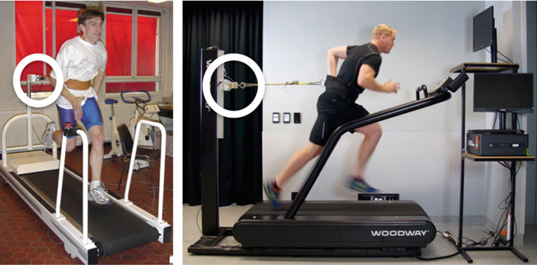
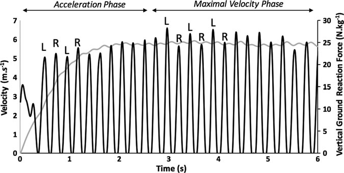
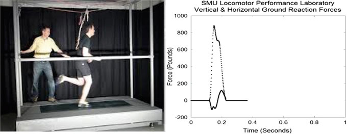
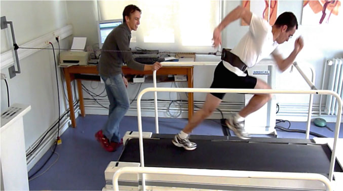
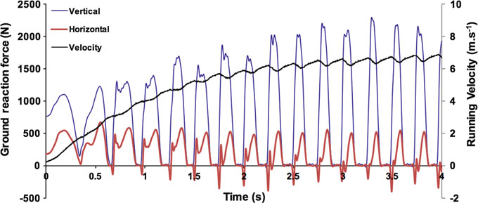
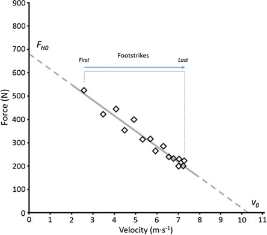
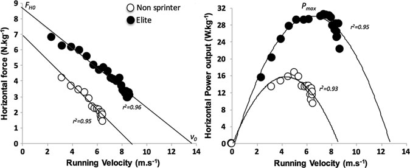
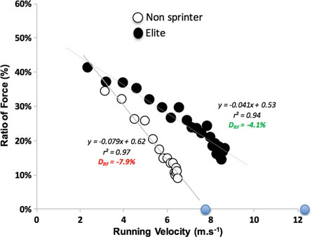
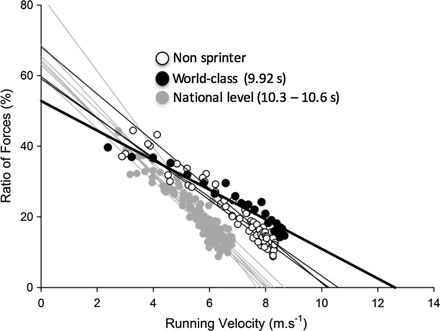
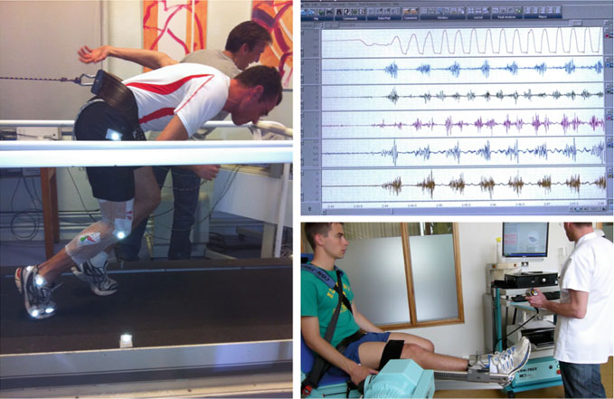

# 第 10 章：使用仪表跑步机测量冲刺力学

冲刺力学的测量

使用仪表跑步机 Jean-Benoit Morin、Scott R. Brown 和 Matthew R. Cross 摘要 由于短跑涉及非常快的运动速度（最好的运动员可达 12 m/s），因此该领域的实验研究一直是一个技术挑战。 虽然冲刺运动学和距离-时间或速度-时间变量在 19 世纪末首次被描述，但动力学，特别是地面反作用力和机械功率输出直到 20 世纪 70 年代和 80 年代才得到探索。 尖端的实验室装置现在允许使用轨道嵌入式测力台进行全长冲刺加速研究（单个或多个冲刺协议）。 然而，之前已经通过使用仪表化跑步机建立了大量的文献和知识。 这些最初是非机动的，不直接测量地面反作用力（20 世纪 80 年代末），但最新的设备允许在加速运行（从零到最大速度）期间研究冲刺力学和三维地面反作用力。 在本章中，我们将介绍这些设备的历史发展、它们的优点和局限性，以及电动加速跑步机获得的主要实验结果。 特别是，我们将介绍地面力应用的机械有效性的关键概念，以及它与冲刺性能的关系。 此外，我们将讨论机械效能的肌肉基础； 特别是髋部伸肌的作用。 最后，我们将讨论跑步机和跑道之间的比较 Laboratory of Human Motricity, Education Sport and Health, Université Côte D’Azur, 261 Route de Grenoble, Route de Grenoble Nice, France 电子邮件：jean-benoit.morin@unice.fr

S. R. Brown M. R. 新西兰跨运动表现研究所 (SPRINZ)，奥克兰理工大学，奥克兰，新西兰 电子邮件：scott.brown@aut.ac.nz

M. R. Cross 电子邮件：matt.cross@aut.ac.nz

短跑表现和力学，包括精英短跑运动员的数据，以及当前和未来对该主题的研究将如何更深入地理解这项看似简单但复杂的运动任务。

跑步机不会让你一事无成

匿名的

## 10.1

简介 冲刺跑包括达到并试图保持一个人的绝对最大跑步速度。 这可以通过从静止位置开始来完成，如田径短跑比赛（起跑起步），或者从已经正在进行的运动开始，如足球或橄榄球（飞跃起步）。 无论是直接还是间接决定运动表现，短跑都是许多运动中的关键能力。 因此，它是特定培训计划和练习的重点。 对短跑力学的更深入了解无疑将有助于更好地设计训练练习，以改善伤害预防和/或管理康复和重返运动策略。 与运动科学的其他领域一样，运动生物力学领域依赖于探索人类运动的技术进步。 这在研究短跑时尤其重要，短跑是一种全身的弹道活动，使人体以 8-12 m/s (30-40 km/h) 的速度移动，使得任何直接的生物力学测量都相当具有挑战性。 在这样的最大跑步速度下，训练有素的男运动员可以在一秒钟内跑完10 m以上。 在这种情况下测量任何类型的生物力学数据都是非常困难的。 例如，基于 Cavagna 等人的开创性工作，第一项报告 2015 年发表的研究报告了优秀短跑运动员加速过程中几个步骤的地面反作用力 (GRF) 数据（Rabita 等人，2015）。 （1971）。 一种常见的替代方法是让运动员在跑步机上原地跑步。 然而，如果以次最大速度跑步是健身和研究领域的常见运动，那么短跑跑步机的发展需要在过去 40 年中不断改进。 最近开发的仪表化电动跑步机显着增加了有关加速跑步表现的机械决定因素的知识。 在本章中，我们将简要回顾短跑跑步机的发展历史，并介绍设备、概念和取得的一些主要成果。 然后，我们将特别关注 2009 年推出的仪器化跑步机，它可以实现主体驱动的加速度和三维动力学测量，据我们所知，这是用于此目的的最先进的技术。 我们将详细介绍和讨论从测量中得出的机械概念（特别是地面力施加的机械有效性）以及它们如何允许更详细地了解冲刺性能。 最后，

我们将回顾该设备固有的局限性以及该领域当前和未来的发展。

## 10.2

设备对跑步力学的理解在 20 世纪 70 年代末和 80 年代取得了重大突破，使用地面嵌入式力平台来研究人类运动，包括跳跃、跑步（Cavagna 1975；Blickhan 1989）和冲刺（Cavagna 等人 1971）。 这使得研究人员能够在真实的地面跑步条件下研究冲刺跑步力学，但主要限制是最多只能研究一两个步骤。 人们提出了两种替代方案来研究长距离的冲刺力学：使用多次冲刺协议和聚合多次冲刺的地面嵌入力平台数据来重建虚拟加速力学曲线（Cavagna 等人，1971 年；Rabita 等人，2015 年），或者让受试者在仪表跑步机上跑步。 后一种方法的优点是可以记录整个冲刺数据（Tomazin et al. 2012 先前研究过一些 400 米冲刺），但从 20 世纪 80 年代末此类技术的早期发展来看，已经讨论了一些局限性。 由于这种情况几乎与现实世界中的步行和跑步运动（受试者的质心相对于支撑地面移动）相反，因此作者在过去 40 年左右的时间里研究了田野跑步和跑步机跑步之间的差异。 在比较稳定低速下这些模式的研究中，van Ingen Schenau（1980）表明，只要皮带速度恒定并且使用随皮带移动的坐标系，跑步的力学基本相似。 这种总体相似性也得到了其他研究的支持（例如 Kram 等人，1998 年；Schache 等人，2001 年；Riley 等人，2008 年）。 然而，在一些研究中，作者报告了两种情况之间的显着差异（Nelson 等人，1972 年；Dal Monte 等人，1973 年；Elliott 和 Blanksby，1976 年；Nigg 等人，1995 年）。 当关注短跑时，也有相互矛盾的结果报道。 Frishberg (1983) 和 Kivi 等人。 (2002) 显示了田间冲刺跑和跑步机冲刺跑之间的生物力学差异，而 McKenna 和 Riches (2007) 得出的结论是，在跑步机上冲刺和地面冲刺对于他们研究的大多数运动学变量来说是相似的，但具体说明电动跑步机是达到这种相似性所必需的。 因此，我们将详细介绍所使用的主要设备及其优点和局限性，同时考虑到非机动与机动的区别。

冲刺力学的测量……

## 10.2.1

早期的非机动跑步机现代尝试通过实验确定负重短跑期间身体的机械特性，最常使用专门的短跑跑步机测功法。 该方法要求受试者将跑步机带系在腰部，并推动跑步机带至机器后部的固定点（图 10.1）。 大多数模型以二维方式计算功率输出，即通过旋转编码器测量的跑步机带速度与通过安装在非弹性系绳上的各种测力传感器和测角仪测量的水平力的相互作用。 尽管以摘要形式发表于 1984 年，但我们所知的第一本直接测量冲刺跑动力学的国际出版物是由 Lakomy ​​(1987) 撰写的，他使用早期的非机动跑步机（Woodway 型 AB，德国）来证明可以在 7 秒最大冲刺期间精确测量功率 (P)、估计水平力 (FH) 和速度 (v)。 这一重大突破也伴随着跑步机评估固有的一些局限性。 首先，在较长的时间段（0.5-1 秒或更长）内以低采样频率对瞬时功率值进行采样。 这导致了对功率的错误估计和对速度的低估。 最近的研究（采样频率高达 1000 Hz）避免了这种误差，从而提高了平均方法的准确性。 使用力传感器的跑步机冲刺的主要限制是，记录的水平力是一个近似值，因为系绳每一步都会上下移动（移动 <4°；*垂直力对水平读数的贡献为 7%（Lakomy 1987）。虽然一些作者使用测角仪来解释这种偏差（Jaskolska 等人，1998 年；Chelly 和 Denis 2001），但这不是常见的图。 10.1 原始（左）和现代（右）非机动跑步机 拉力通过称重传感器（白色圆圈）记录，跑步速度通过安装在滚动带系统中的光学编码器记录。

实践。 此外，虽然功率输出是由水平方向的力和速度输出产生的，但这些变量记录在不同的位置：沿着系绳（力）和受试者脚下的跑步机带（速度）。 因此，由于身体质量的一部分作用在系绳上和/或系统中的一些弹性，在跨步空中阶段会记录到大量的力（Brughelli 等人，2015）。 此外，由于整体滚动带和部件的摩擦和惯性，这些测力计的最大跑步速度（约 3 m/s、10.8 km/h（Lakomy ​​1987）和加速度）显着降低。即使使用电动仪表跑步机，这个问题也仍然存在，反馈控制模型除外（Bowtell 等人，2009 年），这将在下一节中讨论。

## 10.2.2

现代非机动跑步机 自这些原始研究以来，现代化的短跑跑步机（图 10.2）已被证明可以为不同人群提供可靠且准确的水平功率评估（Brughelli 等人，2011 年；Cross 等人，2014 年；Brown 等人，2016 年）。 此外，它还被用来准确描述橄榄球运动员恢复运动康复过程中冲刺跑力学的变化（Brown and Brughelli 2014）。 虽然这些设备给短跑力学的研究带来了重要价值，但在安全舒适的环境下，在非机动跑步机上短跑时处理图10.2跑步速度（灰色）和相对于体重的垂直地面反作用力（黑色）时应小心。 垂直地面反作用力数据通过用户驱动皮带下方的四个测力传感器以 200 Hz 的频率收集。 力轨迹清楚地显示最大速度阶段的左右不对称性

冲刺力学的测量……

显示数据，并应采取批判性态度来制定和验证体育俱乐部环境中的评估协议。 正如最近给编辑的一封信中指出的那样，仅仅依靠设备公司的软件进行数据分析可能会导致有缺陷的结果和机械上不一致的数据（Brughelli 等人，2015 年）。

## 10.2.3

电动跑步机 电动短跑跑步机的发展可以补偿上述皮带和其他滚动元件的摩擦/惯性效应，并帮助运动员达到更高的跑步速度。 这种技术已被用来量化各种类型运动员的机械功率输出（例如 Chelly 和 Denis 2001），并研究短跑中的力-速度关系（Jaskolska 等人 1998）。 这些作者表明，可以使用多次试验方法在短跑专用电动跑步机测力计（Gymrol Sprint 1800，法国）上准确地分析力-速度关系。 为了提供每种负载条件下的阻力，电机被设置为在一组 6 次冲刺（68、108、135、176、203 和 270N）中施加不断增加的阻力，在此期间通过系绳安装的力传感器和测角仪估计 FH，并通过连接到皮带后鼓的传感器系统估计速度。 剩下的一个主要限制是力输出测量是沿着附件系绳进行的，而不是在地面上进行的。 随后，安装力传感器的跑步机的开发解决了这一限制。

## 10.2.4

配备力传感器的电动跑步机 第一次尝试通过在滚动带正下方安装一个力平台来获得 GRF（Kram 和 Powell 1989）。 GRF的垂直分量可以精确测量，但由于每一步皮带和测力平台上框架之间的直接接触，水平分量的测量会因摩擦和串扰现象而改变。 几年后，同一研究小组提出了一种完全安装在力平台系统上的跑步机（框架、皮带、滚动部件和电机）（Kram 等人，1998）。 按照相同的程序，Belli 和他的同事还提出了一种用于步行目的的三维 GRF 电动跑步机（Belli 等人，2001），其带有分体带系统，可以测量单独的肢体。 然后，该跑步机适合跑步（例如 Avogadro 等人，2004 年；Divert 等人，2005 年；Morin 等人，2011c），并安装在位于跑步机下方的四个刚性压电力传感器上。

跑步机（Kislter，温特图，瑞士）。 整个框架和电机都放置在传感器上，可以测量 GRF 的垂直、前后和内侧组件。 当跑步机安装在力传感器上时，对力传感器进行适当的“去皮”，并进行静力校准（Belli et al. 2001）。 这两种设备都已被证明可以提供典型的垂直和水平

GRF 时间轨迹与使用地面嵌入式力平台报告的轨迹非常一致。 与系留系统相比，这是测量跑步力学的重大改进，但就冲刺跑步条件而言，这些跑步机仍然有两个主要局限性：它们不允许以> 6至7 m/s（> 25至26 km/h）的极高速度进行冲刺跑步条件，并且它们仅允许稳态跑步（即以恒定速度），而不允许加速跑步，这在冲刺中是典型的。 在研究中取消了非最大速度限制，其中跑步机电机可以设置强加给受试者的从高到最大的恒定速度，以匹配之前在现场测量的速度。 Frishberg (1983) 的研究中给出了第一种设置的示例，他记录了 9.14 米部分的典型冲刺表现（91.44 米冲刺），以便用相应的递增值设置跑步机带的速度（每个跨度的平均 9.14 米恒定速度值对应于田地条件所覆盖的范围）。 第二种类型的设置通常要求受试者以恒定速度跑步，要么对应于现场测量期间预先记录的最大速度（例如Frishberg 1983；Kivi 等人2002），要么对应于从扶手到移动跑步机带的下降运动后他们能够保持几步的最大速度（例如Weyand 等人2000、2010；Kivi 等人2010）。 2002；Bundle et al. 2003）这两种设置都不能准确地再现田野上的“自由”冲刺，在此期间，跑步者的速度随着施加在支撑地面上的力的大小而不断变化，并且在典型的加速阶段。 特别是，在加速过程中，速度从零增加到最大速度，因此根据定义，其间没有恒速阶段。 鲍特尔等人。 （2009）提出，在跑步机条件下应尊重场地冲刺力学的这一基本原理，以更好地模拟场地冲刺。 基本上，受试者（通过他们的肌肉动作）应该“控制”皮带速度，而不是相反：“为了衡量最佳表现，跑步者需要根据自己的需要加速和减速，并且跑步机皮带的速度应该能够充分且一致地响应”（Bowtell 等人，2009 年）。 尽管高速电动仪表跑步机（图 10.3）可以对冲刺力学进行深入了解（例如 Weyand 等人，2000 年、2010 年；Clark 和 Weyand 2014 年；Clark 等人，2016 年），但上述加速度测量的局限性仍然是一个问题，特别是对于研究加速跑步中涉及的肌肉群的作用，正如 Schache 所指出的（Schache 等人，2014 年， 2015）。

冲刺力学的测量……

## 10.3

机动车辆上的冲刺加速机制

仪表化跑步机 上述设备满足了之前作者提出的许多担忧； 在冲刺加速期间，GRF 在每次单脚接触上取平均值，对应于高采样率 (1000 Hz) 下一次推动的单个弹道事件，并且水平方向的功率输出作为 GRF 的水平分量和在同一位置（即跑步机带）收集的速度的乘积即时计算。 但最具挑战性的技术改进是在运动员的力量输出下增加跑步机皮带的速度，以最好地模拟冲刺加速度，从零到最大跑步速度。 这是通过基于用于恒速步行（Belli 等人，2001 年）或跑步（Avogadro 等人，2004 年；Morin 等人，2007 年）的现有模型的新型仪表化短跑跑步机技术（ADAL3D-WR；医疗开发，HEF Tecmachine，Andrézieux-Bouthéon，法国）1 实现的。 该设备（图10.4）安装在一个高刚性金属框架上，通过四个压电力传感器（KI 9077b，奇石乐，温特图尔，瑞士）固定在地面上，并安装在专门设计的混凝土板上，以确保支撑地面的最大刚性。 跑步机的主要技术细节是：4千瓦无刷电机； 垂直方向的力范围为 60 kN，中间方向的力范围为 10 kN，图 10.3 高速仪表短跑跑步机允许运动员落在滚动带上并以最高跑步速度执行几步，同时测量前后和垂直地面反作用力。 图片版权 P. G. Weyand，南卫理公会大学 Locomotor

性能实验室 1观看此跑步机上典型冲刺加速的视频：https://www.youtube.com/watch? v=NkGNOPSIJus.

前后方向； 方向间的串扰影响<2%； 所有三个方向的固有频率均为 *140 Hz； 可供运行的皮带表面为2.53 0.54 m。 据我们所知，这款跑步机目前在圣艾蒂安大学（法国）和多哈 ASPETAR 医疗中心（卡塔尔）用于研究和运动员监测。 除了经典的等速模式外，还增加了“恒定驱动扭矩”模式，扭矩设置精确，因此对于每个受试者，默认的电机扭矩都可以克服由于受试者体重而对皮带产生的摩擦力。 这种作为皮带摩擦力函数的默认扭矩设置与之前的电动跑步机研究一致（Falk et al. 1996；Jaskolska et al. 1998；Chelly and Denis 2001），并且与 McKenna 和 Riches 在他们最近的研究中比较“扭矩跑步机”冲刺与地上冲刺的详细讨论一致（McKenna 和 Riches 2007）。 如图10.5所示，原始垂直和水平力信号与跑步速度同时采样，然后对每个支撑阶段（垂直力高于20N）进行平均，以逐步分析主要跑步运动学（时空变量）和动力学（图10.6）。 图 10.4 冲刺仪表电动跑步机允许在冲刺加速期间跟随受试者的动作直接立即改变皮带速度，从零速度到最大跑步速度

冲刺力学的测量……

图10.5 冲刺加速期间的跑步速度（黑色轨迹）以及地面反作用力的垂直（蓝色）和水平（红色）分量（采样频率为1000 Hz）。 这里的受试者是一名非短跑专业的体育学生（体重80公斤）。 图10.6世界级短跑运动员（100米最佳时间：9.92秒）和非专业运动员在加速至最高速度的所有步骤中地面反作用力的垂直和水平分量（上图）、跑步速度（左下）和水平方向的功率输出（右下）

## 10.3.1

运动学和动力学 然后可以获得主要的跑步时空、GRF 和弹簧质量变量（参见第 8 章），并在运动员内部和运动员之间进行比较。 例如，表 10.1 显示了精英短跑运动员（最佳 100 米时间为 9.92 秒）与体重相似（81 公斤）但不专门从事短跑的健康年轻受试者的从站立起跑到最高速度的冲刺加速的前半段和后半段的平均机械数据。 除了对主要冲刺跑步模式力学的经典描述性分析之外，仪表化加速跑步机还使我们能够计算和研究个体力-速度和功率-速度关系。

## 10.3.2

力-速度和功率-速度关系 根据上述同步、高速率 GRF 和跑步速度测量，可以对每个支撑阶段（跑步表面上的动态作用）取 FH 和速度的平均值，并在每个站立阶段的整个冲刺过程中绘制图（Morin 等人，2010 年），如冲刺自行车研究（例如 Dorel 等人，2010 年）。 如图10.7所示，整个力-速度关系由下肢在零速度（FH0）下一次接触时可以产生的最大理论水平力和在没有机械约束的支撑阶段可以产生的理论最大速度（v0）来描述。 v0 值越高，表示开发能力越强。 表 10.1 接触时间 (tc)、腾空时间 (ta)、步频 (Fq)、垂直 (FV)、水平 (FH) 和合成 (FTot) GRF、质心垂直位移 (Dy) 和垂直 (kvert) 刚度 (kleg) 的平均值

变量 tc (ms) ta (ms)

频率（赫兹）

力值（N）

跳频 (中)

FT全部 (N)

Dy (cm) kvert (kN m−1) 加速度的第一半

精英短跑运动员

## 4.47 – –

非短跑运动员

## 2.74 – – 第二半加速度

精英短跑运动员

## 4.89

## 1.94

非短跑运动员

## 2.77

5.56 这些值是每位运动员在加速度（第一半场和第二半场）上分成相等步数的所有步数的平均值。 例如，精英短跑运动员需要 26 步才能达到最高速度，因此用第 1-13 步的平均值来描述前半程的加速度，用第 14-26 步的数据来描述后半程的加速度。 仅显示第二阶段的弹簧质量模型数据，因为运行的弹簧质量模型的基本假设需要恒定或接近恒定的运行速度（参见第 8 章）

冲刺力学的测量……

高速时的水平力，如图 10.8 所示。 这是精英短跑运动员和低水平短跑运动员之间明显的机械差异（Morin 等人，2012 年；Rabita 等人，2015 年）。 从生物力学的角度来看，平均单次接触时间内的力的标准很重要，因为力-速度关系直接与下肢机械能力相关。 当将每个支撑相的 FH 和 v 值相乘时，水平方向上的机械功率等效为图 10.7 通过跑步机测功法确定的力-速度关系的图形表示。 数据点代表每个支撑阶段的平均值，从峰值速度的第一个到最后一个。 FH0 和 v0 代表 y 和 x 截距，以及在没有相对单元的情况下能够产生的力和速度的理论最大值。 图 10.8 世界级短跑运动员（100 米最佳时间：9.92 秒）和非专业运动员在跑步机冲刺加速期间的线性力-速度（左图）和二次多项式功率-速度（右图）关系

获得（P），并且可以计算功率速度（图10.8）。 通过这种方法获得的 Pmax 值（当转换为相似的时间段时）和机械变量（FH0 和 v0）与早期研究中可比受试者池和负荷参数的结果一致（Cheetham 等人，1985 年；Jaskolska 等人，1998 年；Funato 等人，2001 年；Morin 和 Belli，2004 年），并且对于重测测量来说非常可靠。

## 10.3.3

地面力应用定义的有效性除了上述的力-速度-功率关系之外，更新的跑步机测功法还允许在整个冲刺加速阶段量化机械有效性。 在自行车文献中（Davis 和 Hull 1981；Dorel 等人 2010），安装在踏板上的力传感器可以计算施力指数，该指数指示对于每个踏板向下冲程，骑车人施加到踏板上的力的有效分量（即垂直于曲柄臂的分量）与施加到踏板上的合力（总）力的比率（图 10.9）。 合力的垂直分量越高，机械效率越高，对于给定的肌肉力输出，实际驱动踏板的力就越大。 请注意，机械效率可以同样表示为有效分量和合力之间的角度（图 10.9 中的 a），或百分比。 例如，80% 的机械效率意味着在踏板下冲程中，平均有效力将为施加到踏板上的合力的 80%。 遵循相同的想法，现代跑步机的 GRF 输出可以表示为 GRF 的“有效”水平分量（即 FH）与每个接触阶段平均的总力（即 FTot）的比率（即“力的比率”：RF），如 Morin 等人所定义。 （2011a）。 虽然可以（并鼓励）最大化 RF（即图 10.9 上图 10.9 从自行车到冲刺跑的力施加的机械有效性概念的示意图。在自行车（左）中，有效性计算为有效分量（将导致旋转的 FEFF）与总力（即活动肌肉产生的合力（FTot））之间的比率。其他分量无效。在冲刺跑步加速期间（右），我们提出的类比给出了有效性： 比率

RF = FHzt/FTot

冲刺力学的测量……

到100%）在自行车运动中，冲刺跑中垂直分量的要求意味着不可能在不摔倒的情况下呈现最大RF值。 相反，在冲刺跑中，我们在跑步机上加速冲刺开始时观察到 RF 的次最大值（30-45%），随着速度的增加，它以明显的线性趋势系统地下降（图 10.10）。 这是一个合乎逻辑的结果，因为当运动员在加速过程中移动得更快（或更快地推动跑步机带）时，他们的整体身体姿势往往会直立，这与每个支撑阶段的 GRF 矢量的整体渐进垂直方向（即效率较低）有关。 有趣的是，我们系统地观察到，无论是精英短跑运动员还是非短跑运动员，RF 随着速度的增加呈线性下降。 理论上，正如轨道嵌入测力板 GRF 测量所证实的那样（见下文），当达到最大速度时，RF 值会降低至大约 0%。 在冲刺的这一时刻，运动员的加速度为零，并且在支撑阶段的平均 FH 为零（相等的制动和推进脉冲抵消），或者在现实冲刺中由于空气摩擦力较低（在 30 至 40N 之间）而准为零。 此外，RF 随速度线性下降的斜率（“力比下降”：DRF）被描述为施力技术的指数。 该斜率是负值（随着速度增加，RF 减小），如图 10.10 所示，典型的 DRF 值 -0.079 可以表示为 -7.9%，它描述了这样一个事实：在这个冲刺加速过程中，每生成每秒新米的跑步速度，RF 平均减少 7.9%。 由此可见，从理论上讲，最好的短跑运动员能够在更长的时间内加速得更多，因此随着速度的增加，RF 的下降幅度较小，即 DRF 的负值较小。 反之亦然，我们假设 DRF 负值越大，表明 RF 随加速而快速下降，跑步者过早地达到直立身体姿势，并且在加速初期就无法再加速（RF 为 0%）。

这些关于力学之间关系的假设

图 10.10 世界级短跑运动员（100 米最佳时间：9.92 秒）和非专业人士在电动仪表跑步机上冲刺加速时的力比与跑步速度的关系。

蓝色圆圈表示力与运行速度之间的线性关系外推至最大速度时达到的理论值 0%

施力和冲刺加速的有效性以及整体表现已经在两种跑步机协议和在冲刺跑道上进行的研究中进行了测试。 与冲刺成绩的关系。 在第一项研究中（Morin 等人，2011a），Morin 等人。 测试了施力的机械有效性（特别是 DRF 指数）是否与 100 米表现相关，即在跑步机上测量的具有更有效推进力的运动员是否在跑道上速度最快，反之亦然。 实验室测量的最大功率输出呈高度正相关，但更重要的是，在具有“良好”DRF（即-6至-5%的值）的受试者中观察到了赛道上的最佳表现（100米时间和超过4秒的最大速度和加速能力）。 相反，在跑步机上 DRF 值“差”（-7 至 -10%）的受试者在 100 米跑道测试中速度最慢。 一个有趣的附加结果是，GRF (FH) 的水平分量与 100 米表现显着相关，这在旨在推动体重向前的人类运动的生物力学背景下是有意义的。 然而，跑步机上 6 秒加速的平均 GRF（总）GRF 与任何冲刺表现变量均不相关。 这意味着在跑步机上测量的总力输出（无论其在空间中的方向如何）并不是性能指标。 乍一看，这似乎与 Weyand 等人之前的工作相矛盾。 (2000) 表明速度更快的运动员每单位体重能够产生更多的 GRF。 然而，值得注意的是，Weyand 等人仅研究了 GRF 的垂直分量，并且仅在最大速度的特定时刻，并且在混合未经训练的女性和奥运会男性短跑运动员的非常异质的群体中进行了研究。 当在同一组运动员的整个加速阶段考虑 GRF 输出（即神经肌肉系统整个推进力所产生的净机械输出）时，它与冲刺表现无关。 这项研究首次深入了解了我们对冲刺加速的“力量产生和传输到地面”的总体看法。 也就是说，第一项研究的一个问题是，参加比赛的最佳运动员的 100 米最佳成绩为 10.9 秒，这不允许将这些结论扩展到精英运动员。 在第二项研究中（Morin 等人，2012），同一组运动员重复了完全相同的方案（跑步机冲刺，测量机械 GRF 输出能力和施力的机械有效性，并跟踪 100 米冲刺表现测试），但这次测试了 3 名国家级短跑运动员（最佳 100 米时间范围为 10.3 至 10.6 秒）和一名世界级短跑运动员（最佳 100 米时间） 研究时的时间为 9.92 秒）。 结果证实了第一项研究中的发现，精英运动员表现出非常有效的力量应用（DRF为-4%），尽管每单位体重的GRF在慢得多的个体的范围内（与同龄人没有差异，与非专业运动员差异很小）。 对这位世界级短跑运动员跑得快的能力的一种生物力学解释不是他出色的发力能力（当时他跑了9.92秒，他从未进行过大重量的力量训练），而是他在推动地面时特别是在高跑步速度时引导GRF矢量向前的非凡能力（图10.10和10.11）。

冲刺力学的测量……

据我们所知，−4.2% 的 DRF 值是科学文献中报道的最有效值（表 10.2）。 实际上，这些变量证明了在速度增加的情况下在整个冲刺过程中保持全局力量产生的有效方向（独立于由此产生的 GRF 输出的大小）的能力，并为冲刺跑步加速力学添加了另一个层次的分析。 话虽这么说，对牛顿动力学基本定律的正确解释会得出相同的结论：该定律的第一部分指出运动的变化（加速度）与施加的原动力成正比：施加到给定质量（例如 GRF 和体重）的净外力越大，意味着加速度越大。 但经常被忽视的第二条定律指出，这种加速度是沿着施加该力的右线方向产生的：前后方向上的净力越大，意味着向前的加速度越大。 肌肉决定因素：髋部伸肌假说。 上述研究提出了施力机械有效性的概念，其主要指标RF和DRF，并表明它们与从非专业人士到精英短跑运动员的赛道冲刺加速表现显着相关。 为了将这些实验室结论转化为运动实践，需要回答的主要问题是：（1）机械效能的神经肌肉决定因素是什么？ (2) 它们是否可以训练，如果可以，如何训练？ (3) 由于上面得出的所有结果和结论都是基于仪表跑步机测量，它们在“真实”跑道冲刺条件下仍然正确吗？ 后一个问题将在本章的限制部分中解决。 第二个问题仍在研究中，但最近的一项工作为第一个问题提供了答案，即有效向前推进的肌肉决定因素。 我们将这组研究称为“髋部伸肌假说”。 支持这一假设的三个最重要的论点是：首先，一些实验和/或建模研究表明髋部伸肌（臀肌和腿筋）在跑步表现中的关键作用（例如 Schache

图10.11 非专业人士（体育生，灰色）、国家级短跑运动员（白色）和世界级短跑运动员（100米最佳成绩：9.92秒，黑色）冲刺加速时力量比与跑步速度的个体线性关系

表 10.2 仪表电动跑步机上 6 秒加速度的平均主要冲刺加速度机械输出（±标准偏差）

多变的

世界级短跑运动员

国家级短跑运动员 % 差异

世界CS

非专业人士与非专业人士的百分比差异

GRF 的水平分量（FH，单位 N/kg）

## 3.90 3.44 ± 0.29 −11.8 3.04 ± 0.51 −22.1a

GRF 的垂直分量（FV，单位 N/kg）

## 18.1 17.6 ± 0.58 -3.24 15.7 ± 1.17 -13.5a

所得（总）GRF（FTot，单位 N/kg）

## 18.6 17.9 ± 0.59 -3.68 16.0 ± 1.19 -14.2a

施力机械效率 DRF (%) −4.21 −6.00 ± 0.6 −42.9b −8.21 ± 2.9 −95.2b 世界级短跑运动员（WCS，个人百米最好成绩为 9.92 秒）、国家级短跑运动员（个人最好成绩为 10.3 至 10.6 秒）和活跃体育生之间的比较， 非短跑专家 a 差异大于 2 个标准差 b 差异大于 3 个标准差

冲刺力学的测量……

等人。 2014 年、2015 年）。 基于包括精英短跑运动员在内的各种类型受试者使用的实验和建模方法，研究一致表明，随着跑步速度增加到最大冲刺值（通常高于 7 m/s、25.2 km/h），髋部伸肌发挥着越来越大的作用（Mann 和 Sprague 1980；Simonsen 等人 1985；Belli 等人 2002；Kyröläinen 等人 2005；Dorn 等，2012；沙赫等，2015）。 然而，这些研究大多考虑高但恒定的跑步速度（无加速度），并且没有将这种髋部伸肌活动与推进 GRF 或机械有效性的直接测量联系起来。 其次，为了产生大量的水平 GRF 和脉冲 (Morin et al. 2015b)，特别是在高速时（即当身体姿势直立时），在摆动和支撑阶段下肢强烈的向后动作是必要的。 因此，从解剖学和功能上来说，髋部伸肌在这两个阶段都会产生非常大的力，这是合理的（Sun et al. 2015）。 由于短跑与每一步撞击地面之前的巨大肢体速度相关，因此这种摆动-支撑过渡力矩对于腿筋至关重要，它在支撑力高达体重八倍的情况下抵消了非常高的髋部外部弯曲和膝盖伸展力矩（Sun et al. 2015）。 此外，值得注意的是，如图 10.11 清楚地显示的那样，非专业人士、高水平短跑运动员和测试的精英运动员之间的机械效率差异在高跑步速度下可见，而不是在冲刺加速开始时。 这往往表明，最好的短跑运动员在高跑步速度下产生高 RF 和定向 GRF 的能力特别高（Morin 等人，2012），即当整体身体方向是垂直的，下肢关节角速度和相关的肌肉机械应力最高时。 最好的短跑运动员的区别（图 10.11）不是他们在低速跑时产生大量 FH 的效率和能力，而是他们在高速到非常高的速度下这样做的能力。 这里的关键是在高运行速度的特定背景下产生大量 FH：“高速时强”。 最后，有趣的是，腘绳肌损伤是与短跑任务相关的最常见和最常见的下肢肌肉损伤，这一事实预示着该肌肉群在高速和/或加速的情况下的重要性（例如 Ekstrand 等人，2011 年；Feddermann-Demont 等人，2014 年）。 为了检验这个假设，Morin 等人。 (2015a) 使用的仪器化跑步机具有两个新颖的实验功能：(1) 同时测量下肢主要肌肉和 GRF（包括 FH）的时间同步肌肉活动（表面肌电图）(2) 在从零到最大速度的整个冲刺加速过程中进行测量，并分析一条腿的每一步。 据我们所知，除了最近在整个 50 米冲刺中进行的 GRF 测量之外，尚未对与 GRF 输出同步的肌肉活动进行等效测量，这要归功于创新的测力板测量系统（Nagahara 等人，2017）。 如图10.12所示，该实验设置是通过等速关节扭矩测试完成的，以间接了解受试者在伸展和屈曲、同心和偏心模式下髋部和膝部的扭矩产生能力。 尽管收缩速度和范围

冲刺跑和等速测试之间的运动差异很大，选择该技术是为了提供有关受试者整体力量能力的指示，因为目前无法直接评估冲刺跑期间的肌肉力量输出。 研究的主要结果表明，正如假设的那样，在冲刺加速期间观察到最高水平的 FH 是在髋部伸肌（尤其是偏心模式下的腘绳肌）具有最高扭矩产生能力和在摆动结束阶段腘绳肌肌电图活动最高的受试者中观察到的。 随后针对初始加速阶段（前 10 个步骤）的分析表明，在摆动结束阶段，FH 和臀肌同心扭矩能力以及臀肌肌电图活动之间存在显着关系。 换句话说，摆动和摆动结束阶段的腘绳肌肌电图活动以及偏心膝屈肌峰值扭矩与冲刺期间产生的 FH 量有关。 这些发现有助于提出髋部伸肌（尤其是腿筋）通过机械效率和 FH 产生在冲刺加速性能中发挥重要作用的建议。 这项独特的研究需要确认，而机械有效性的其他肌肉决定因素值得更深入的研究，例如脚踝抵抗地面冲击的能力以及在将下肢神经肌肉系统产生的动力传输到地面方面发挥的作用。 正如人们经常重申的那样，图 10.12 髋部伸肌在短跑机械效能中作用的实验研究。 左图：受试者在仪表电动跑步机上冲刺加速时配备了表面肌电图电极。 右图：在整个加速过程中，地面反作用力信号（第一行数据）与右腿肌肉活动（其他线）同步。 此外，在等速测功机上以同心和偏心模式测试受试者的髋部和膝部伸肌和屈肌扭矩能力

冲刺力学的测量……

“一根链条的强度取决于它最薄弱的一环”，尽管在冲刺加速过程中臀部和膝盖会产生很大的力量，但我们应该记住，GRF 很好地施加在脚踝/脚处的支撑地面上。 未来的研究应该测试，正如训练轶事证据和运动生物力学所表明的那样，“有力的脚”是否也在冲刺加速期间有效地施加地面力（即向前定向）方面发挥着作用。

## 10.4

局限性和未来研究虽然短跑仪表跑步机使教练和研究人员能够显着提高他们对人类短跑的理解水平，但这种方法有一些需要讨论的局限性。 考虑到这些局限性，这个研究主体相对新颖，未来的研究肯定会更深入地了解迄今为止所获得的结果，并更深入地了解机械有效性、可训练性和相关训练方法背后的机制。

## 10.4.1

主要局限性 虽然本章中介绍的最新电动仪表跑步机允许在冲刺加速过程中在三个维度上直接进行 GRF 测量，但仍然存在的一个问题是，补偿摩擦的应用似乎限制了受试者达到接近地面冲刺跑步的最大跑步速度水平的能力（Morin 等人，2010 年；Morin 和 Sève，2011 年）。 此外，默认扭矩的个性化确定非常耗时，并且即使对于最现代的机器（> 10 次试验），熟悉仍然是一个限制（Mor​​in 等人，2010）。 尽管与地面冲刺相比，扭矩补偿跑步机的冲刺速度降低有所不同（*20%，根据（Morin 和 Sève 2011）），但与赛道冲刺表现相比，同一受试者的主要冲刺表现输出显着且高度相关。因此，在跑步机测量过程中，受试者之间赛道冲刺表现的整体差异得以维持，人们可能会说，在几乎无限的范围内测量直接动力学的能力 时间周期（例如在 400 米冲刺期间 Tomazin 等人，2012 年；Girard 等人，2016c）可能会缓解这一限制。 此外，一些未发表的数据表明，当推断 RF 速度与速度轴的线性关系时（见图 10.10），计算出的理论最大速度非常接近运动员在赛道上测试时达到的实际最大冲刺速度。 事实上，在同一测试过程中，理论上，在最大速度下，运动员的加速度为零，因此 FH 为准零（仅是在跑道冲刺期间克服空气摩擦的力）并且 RF 为 0%。

由于跑步机系统的惯性和摩擦（参见 Morin 和 Sève 2011 中的讨论），运动员在跑步机上冲刺时无法达到跑道最大速度（达到约 80% 的值）。 然而，如果跑步机允许如此现实的加速阶段结束，则估计的最大速度（RF 0% 与跑步机加速期间实际测量的 RF 值一致，图 10.10）几乎完全匹配跑道测量和“现实生活”冲刺条件。 对人类短跑运动员的科学研究始于一个多世纪前，由先驱生物力学家 Marey (2002) 和生理学家 Archibald V. Hill 及其同事 (Furusawa et al. 1927; Bassett 2002) 发表的第一篇科学文章组成，他们发表了基于时间运动和质心时空变量的短跑力学分析。 冲刺动力学和 GRF 的分析需要在加速距离内使用地面嵌入式测力台系统。 由于日本研究人员最近才完成这项技术壮举（Nagahara 等人，2017），迄今为止可用的 2 至 7 米测力台系统的唯一可能性是使用多个冲刺协议并聚合收集的数据，以几乎“重建”完整的冲刺加速数据集。 例如，如果使用7米测力台系统，运动员在第一次试验时踏上测力台系统进行前3步加速，然后将起跑器移回第二次试验，记录第4步和第5步，依此类推。 Cavagna 等人使用了这种方法。 （1971）以及最近的 Rabita 等人。 （2015）。 在后一项研究中，有趣的是，这些作者报告说，在训练有素的精英运动员（个人 100 米最佳时间低于 10 秒）中，冲刺加速动力学与本章中介绍的仪表化跑步机所获得的冲刺加速动力学非常接近： • 在跑道上测量的所得 GRF 值以及水平和垂直分量均在仪表化跑步机上测量的范围内（例如，最大水平力 FH0 为 *10 N/kg） • 尽管最大 RF 值 起跑器中的 RF 值 (*60%) 远高于在跑步机上观察到的值（考虑到蹲姿与站立位置的情况，这是合乎逻辑的），跑道上第一步的 RF 值在跑步机上测量的范围内。 • 在跑步机上观察到的 RF 随跑步速度增加而线性下降（图 10.10），在跑道上也发现了（Rabita 等人，2015 年的图 3），并且在跑道上计算出的 DRF 值 训练有素的短跑运动员的跑道（*−6%）与跑步机上相同人群的结果一致总体而言，我们可以从已发表的跑步机（Morin 等人，2010, 2011a, b, 2012；Morin 和 Sève，2011；Girard 等人，2016c）和跑道（Morin 等人，2015b；Rabita 等人，2012）和跑道（Morin 等人，2015b；Rabita 等人，2012）的比较中得出主要结论。 2015；Nagahara et al. 2017）冲刺加速动力学的研究表明，尽管存在上述局限性并且冲刺条件存在明显差异，但在相似训练和表现水平的运动员中进行测试时，主要机械输出（GRF，机械效能）是相似的。 这当然并不能消除限制

冲刺力学的测量……

与短跑跑步机测量相关，但它支持了这样一个事实：这些限制被众多实验可能性所克服，这些实验可能性为人类短跑的复杂性带来了新的见解。 事实上，正如最近的研究所示，短跑仪表跑步机可以对短跑力学进行逐步分析，并且与现实生活中的跑道短跑相比，可以轻松模拟许多外部条件（例如重复短跑、缺氧、高温）。

## 10.4.2

最新研究和未来研究 2015 年，Morin 和他的同事能够在整个冲刺加速期间将肌肉活动测量与 GRF 同步，以更好地研究下肢肌肉（特别是髋部伸肌）在冲刺加速性能和机械有效性中的作用。 在本研究中，正如本章大多数图中所示，由于记录了整个冲刺加速的所有步骤，因此可以进行逐步分析。 基于跑步机冲刺的这一关键优势，可以研究短距离（100 米）到长距离（400 米冲刺赛事）期间的疲劳和跑步力学变化（Tomazin 等人，2012 年；Girard 等人，2016c），而且还可以在重复冲刺系列期间进行研究。 这种背景接近许多团队运动的要求，如橄榄球、足球或曲棍球，并且一直是最近几项研究的焦点，在这些研究中，通过实验很容易要求受试者在跑步机上重复冲刺加速并设置努力恢复顺序。 这导致主要作者 Olivier Girard 最近发表了几篇关于研究多步和重复冲刺力学的方法问题（Girard 等人，2015a、2016a）或与间歇训练相关的跑步力学变化的出版物（Girard 等人，2017b）。 此外，一些外部条件（例如缺氧和高温）可以在实验室条件下进行研究，在特定的实验室环境中使用仪器跑步机来模拟缺氧和高温条件。 这导致了一系列最近的研究，从中人们对在热应激（Girard 等人，2016b，2017a）或缺氧条件下（Girard 等人，2015b，2016b；Brocherie 等人，2016）进行冲刺的机械后果有了更深入的了解。 上述记录和研究冲刺每一步的可能性允许研究冲刺跑步期间肢体间的不对称性。 该领域的研究最近通过生物力学建模（Clark et al. 2017）以及短跑期间更直接的实验测量得到了进展（例如 Girard et al. 2017c）。 特别是 Brown 等人最近的一项工作。 (2017) 比较了橄榄球运动员所产生的 GRF 的垂直和水平分量之间的不对称性。 有趣的是，这项研究表明，幅度和 2请参阅对 Usain Bolt 跑步力学的评论：https://phys.org/news/2017-06-symmetryusain-ametryal-gait.html。

在加速和最大速度阶段计算的水平 GRF 分量的不对称范围，远大于垂直分量中的不对称范围。 所有这些结果可能对更好地设计运动训练和伤害预防/康复计划产生重大影响。 这种向运动表现和训练应用的转变是另一个预期的研究视角。 特别是，应研究在非疲劳和疲劳条件下提高地面力施加的机械有效性的训练方法。 横断面研究表明，地面力施加的机械有效性是冲刺表现的关键因素，并且由于重复冲刺相关的疲劳而在很大程度上受到损害（Morin 等人，2011b）。 现在是时候进行受控的纵向训练研究来指导体育从业者采用最有效的方法来培养运动员的这种能力。 例如，虽然冲刺力学没有在仪表跑步机上进行测试，但最近的一项飞行员训练研究表明，使用非常重的雪橇（占体重的 80%）是提高足球运动员最大 FH 和 RF 的有效方法（Morin 等人，2016）。 未来，继续使用仪表化的短跑跑步机和其他基于实验室的方法无疑将提高我们对这一领域的人类运动和运动表现的理解。 总之，仪表化短跑跑步机的最新发展，特别是那些允许在加速期间（从零到最大速度）进行三维地面反作用力测量的跑步机，使人们对这一关键运动能力的力学有了重要的了解。 尽管设备本身存在一些不可避免的局限性，并且希望对嵌入轨道的测力台系统进行更详细和大量的研究，但跑步机冲刺已经并将继续让研究人员和从业者获得更直接的实验见解，以了解这种看似简单但实际上如此复杂的运动任务的机械基础。

参考文献 Avogadro P、Chaux C、Bourdin M 等人 (2004) 使用跑步机测力计广泛计算跑步过程中的外部功和腿部刚度。 Eur J Appl Physiol 92:182–185 Bassett DR (2002) A. V. Hill 的科学贡献：运动生理学先驱。 应用杂志

Physiol 93:1567–1582 Belli A, Bui P, Berger A et al (2001) 跑步机测力计，用于测量步行过程中的三维地面反作用力。 J Biomech 34:105–112 Belli A, Kyröläinen H, Komi PV (2002) 跑步时下肢关节的力矩和力量。 国际期刊

Sports Med 23:136–141 Blickhan R (1989) 跑步和跳跃的弹簧质量模型。 J Biomech 22:1217–1227 Bowtell MV、Tan H、Wilson AM (2009) 使用反馈控制跑步机测量人类最大跑步速度的一致性，以及与地上运动期间可达到的最大速度的比较。 J Biomech 42:2569–2574 Brocherie F、Millet GP、Morin J-B、Girard O (2016) 常压缺氧条件下重复跑步机冲刺的机械改变。 医学科学运动锻炼48：1570–1579

冲刺力学的测量……

Brown SR, Brughelli M (2014) 用多成分评估策略确定重返运动状态：橄榄球案例研究。 Phys Ther Sport 15:211–215 Brown SR、Brughelli M、Cross MR (2016) 根据橄榄球联盟运动员的腿部偏好和位置来分析冲刺力学。 Int J Sports Med 37:890–897 Brown SR, Cross MR, Girard O et al (2017) 橄榄球联盟运动员在非机动跑步机上的动力学冲刺不对称性。 Int J Sport Med（正在出版）Brughelli M、Cronin J、Chaouachi A (2011) 跑步速度对跑步动力学和运动学的影响。 J Strength Cond Res 25:933–939 Brughelli M、Morin J-B、Mendiguchia J (2015) 英超联赛中腿筋受伤后的不对称：问题是否已解决？ Int J Sports Med 36:603 Bundle MW、Hoyt RW、Weyand PG (2003) 高速跑步表现：评估和预测的新方法。 J Appl Physiol 95:1955–1962 Cavagna GA (1975) 作为测力计的测力平台。 J Appl Physiol 39:174–179 Cavagna GA, Komarek L, Mazzoleni S (1971) 短跑的力学。 J Physiol 217:709–721 Cheetham ME, Williams C, Lakomy ​​HK (1985) 实验室跑步测试：短跑和耐力训练运动员的代谢反应。 Br J Sports Med 19:81–84 Chelly SM, Denis C (2001) 腿部力量和跳跃刚度：与冲刺跑表现的关系。 Med Sci Sports Exerc 33:326–333 Clark KP, Ryan LJ, Weyand PG (2016) 步态力学和跑步地面反作用力之间存在一般关系。 J Exp Biol (jeb.138057) Clark KP、Ryan LJ、Weyand PG (2017) 步态力学和跑步地面反作用力之间存在一般关系。 J Exp Biol 220:247–258 Clark KP, Weyand PG (2014) 简单弹簧站立机制是否可以最大化跑步速度？ J Appl Physiol 117:604–615 Cross MR, Brughelli ME, Cronin JB (2014) 背心负载对冲刺动力学和运动学的影响。 J Strength Cond Res 28:1867–1874 Dal Monte A, Fucci S, Manoni A (1973) 跑步机用作中长跑训练和模拟器仪器。 In: Krager (ed) Medicine and sport, Basel, pp 359–363 Davis RR, Hull ML (1981) 自行车踏板负载的测量：II。 分析和结果。

J Biomech 14:857–872 Divert C, Mornieux G, Baur H 等人 (2005) 赤脚跑步和穿鞋跑步的机械比较。

Int J Sports Med 26:593–598 Dorel S, Couturier A, Lacour JR et al (2010) 自行车中的力-速度关系重温：二维踏板力分析的好处。 Med Sci Sports Exerc 42：1174–1183 Dorn TW、Schache AG、Pandy MG (2012) 人类跑步中的肌肉策略转变：跑步速度对臀部和脚踝肌肉性能的依赖性。 J Exp Biol 215:1944–1956 Ekstrand J、Hägglund M、Walden M (2011) 职业足球（足球）肌肉损伤的流行病学。 Am J Sports Med 39:1–7 Elliott BC, Blanksby BA (1976) 对男性和女性在地面和跑步机上跑步的电影分析。 Med Sci Sport Exerc 8:84–87 Falk B, Weinstein Y, Dotan R et al (1996) 冲刺跑的跑步机测试。 扫描医学杂志

体育 6:259–264 Feddermann-Demont N、Junge A、Edouard P 等人 (2014) 2007 年至 2012 年间 13 届国际田径锦标赛中受伤。 Br J Sports Med 48:513–522 Frishberg BA (1983) 对地面和跑步机冲刺的分析。 Med Sci Sports Exerc 15:478–485 Funato K, Yanagiya T, Fukunaga T (2001) 使用新开发的自驱动跑步机估算人类冲刺机械功率输出的测力法。 Eur J Appl Physiol 84:169–173 Furusawa K, Hill AV, Parkinson JL (1927) “冲刺”跑步的动态。 Proc R Soc B Biol

Sci 102:29–42 Girard O、Brocherie F、Morin J-B 等人 (2015a) 用于分析重复跑步机冲刺期间跑步力学变化的四个部分的比较。 应用生物力学杂志31：389–395

Girard O、Brocherie F、Morin J-B 等人 (2017a) 与热应激下重复跑步机冲刺相关的机械变化。 PLoS ONE 12:e0170679 Girard O、Brocherie F、Morin J-B、Millet GP (2016a) 跑步机冲刺期间跑步力学的场内和场间可靠性。 Int J Sports Physiol Perform 11:432–439 Girard O、Brocherie F、Morin J-B、Millet GP (2017b) 高水平男性团体运动员在跑步机间歇训练期间的机械改变。 J Sci Med Sport 20:87–91 Girard O、Brocherie F、Morin J-B、Millet GP (2016b) 在炎热与缺氧环境中重复跑步机冲刺期间进行机械改造。 一项试点研究。 J Sports Sci 34：1190–1198 Girard O、Brocherie F、Morin J-B、Millet GP (2015b) 重复跑步机冲刺的神经机械决定因素——“低氧到常氧恢复”方法的有用性。 Front Physiol 6:260 Girard O、Brocherie F、Morin J-B、Millet GP (2017c) 重复跑步机冲刺期间下肢机械不对称。 Hum Mov Sci 52:203–214 Girard O, Brocherie F, Tomazin K et al (2016c) 100 米、200 米和 400 米跑步机冲刺中跑步力学的变化。 J Biomech 49:1490–1497 Jaskolska A、Goossens P、Veentra B 等人 (1998) 不同最大跑步速度受试者的力-速度关系和功率输出的跑步机测量。 运动的

Med 8:347–358 Kivi DMR、Maraj BKV、Gervais P (2002) 对一定速度范围内的高速跑步机冲刺的运动学分析。 Med Sci Sports Exerc 34:662–666 Kram R, Griffin TM, Donelan JM, Chang YH (1998) 用于测量垂直和水平地面反作用力的力量跑步机。 J Appl Physiol 85:764–769 Kram R, Powell AJ (1989) 安装在跑步机上的力量平台。 J Appl Physiol 67:1692–1698 Kyröläinen H、Avela J、Komi PV (2005) 肌肉活动随着跑步速度的增加而变化。 J Sports Sci 23:1101–1109 Lakomy ​​HKA (1987) 使用非机动跑步机分析冲刺表现。

人体工程学 30:627–637 Mann R, Sprague P (1980) 短跑期间地面腿的动力学分析。 Res Q 练习

体育51：334–348

Marey EJ (2002) Le mouvement, Editions J. Chambon McKenna M, Riches PE (2007) 在两种类型的跑步机和地面上进行冲刺运动学的比较。 Scand J Med Sci Sport 17:649–655 Morin J-B, Petrakos G, Jimenez-Reyes P et al (2016) 用于提高足球运动员水平力量输出的超重雪橇训练。 Int J Sports Physiol Perform 1–13 Morin J-B, Belli A (2004) 一种在摩擦负载自行车测力计上测量最大下冲程功率的简单方法。 J Biomech 37:141–145 Morin J-B、Bourdin M、Edouard P 等人 (2012) 100 米冲刺跑表现的机械决定因素。 Eur J Appl Physiol 112:3921–3930 Morin J-B, Edouard P, Samozino P (2011a) 施力技术能力是冲刺表现的决定因素。 Med Sci Sport Exerc 43:1680–1688 Morin J-B, Gimenez P, Edouard P et al (2015a) 冲刺加速力学：腿筋在水平力产生中的主要作用。 Front Physiol 6:e404 Morin JB, Samozino P, Bonnefoy R et al (2010) 在跑步机上单次冲刺期间直接测量功率。 生物力学杂志 43：1970–1975。 https://doi.org/10.1016/j.jbiomech.2010.03.012 Morin J-B、Samozino P、Edouard P、Tomazin K (2011b) 重复冲刺期间疲劳对力量产生和力量应用技术的影响。 J Biomech 44:2719–2723 Morin J-B、Samozino P、Millet GY (2011c) 24 小时跑步中跑步运动学、动力学和弹簧质量行为的变化。 Med Sci Sports Exerc 43:829–836 Morin J-B、Samozino P、Zameziati K、Belli A (2007) 改变步幅频率和接触时间对人类跑步中腿部弹簧行为的影响。 J Biomech 40:3341–3348 Morin J-B, Sève P (2011) 冲刺跑步表现：跑步机和场地条件之间的比较。 欧洲应用生理学杂志 111：1695–1703

冲刺力学的测量……

Morin J-B、Slawinski J、Dorel S 等人 (2015b) 精英短跑运动员的加速能力和地面冲击力：多推，少制动？ J Biomech 48:3149–3154 Nagahara R, Mizutani M, Matsuo A et al (2017) 步宽与加速冲刺性能和地面反作用力的关联。 Int J Sports Med 38：534–540 Nelson RC、Dillman CJ、Lagasse P、Bickett P (1972) 地上跑步与跑步机跑步的生物力学。 Med Sci Sports 4:233–240 Nigg BM, De Boer RW, Fisher V (1995) 地面跑步和跑步机跑步的运动学比较。 Med Sci Sports Exerc 27:98–105 Rabita G, Dorel S, Slawinski J et al (2015) 世界级运动员的冲刺力学：对人类运动极限的新见解。 Scand J Med Sci Sports 25:583–594 Riley PO, Dicharry J, Franz J et al (2008) 地面跑步和跑步机跑步的运动学和动力学比较。 Med Sci Sports Exerc 40:1093–1100 Schache AG, Blanch PD, Rath DA et al (2001) 地面跑步和跑步机跑步的比较，用于测量腰部-骨盆-臀部复合体的三维运动学。 临床

Biomech 16:667–680 Schache AG、Brown NAT、Pandy MG (2015) 随着稳态运动速度的增加，人体下肢关节的工作和功率调节。 J Exp Biol 218:2472–2481 Schache AG, Dorn TW, Williams GP et al (2014) 提高跑步速度的下肢肌肉策略。 J Orthop Sport Phys Ther 44:813–824 Simonsen EB, Thomsen L, Klausen K (1985) 短跑期间单关节和双关节腿部肌肉的活动。 Eur J Appl Physiol Occup Physiol 54:524–532 Sun Y, Wei S,zhong Y et al (2015) 关节扭矩如何影响短跑摆动姿势转换中的腿筋损伤风险。 Med Sci Sports Exerc 47:373–380 Tomazin K, Morin J-B, Strojnik V et al (2012) 短跑（100 米）、中跑（200 米）和长跑（400 米）跑步机冲刺后的疲劳。 Eur J Appl Physiol 112:1027–1036 van Ingen Schenau GJ (1980) 地上运动与跑步机运动的生物力学的一些基本方面。 Med Sci Sports Exerc 12:257–261 Weyand PG, Sandell RF, Prime DNL, Bundle MW (2010) 跑步速度的生物学限制是从头开始施加的。 J Appl Physiol 108:950–961 Weyand PG, Sternlight DB, Bellizzi MJ, Wright S (2000) 更快的最高跑步速度是通过更大的地面力而不是更快的腿部运动来实现的。 应用生理学杂志 89：1991–1999