# 第 11 章：测量冲刺跑过程中的力、速度和功率的简单方法

测量力的简单方法，

速度和功率能力以及机械效率

冲刺跑

Pierre Samozino 摘要 加速阶段冲刺力学的宏观观察，尤其是运动员的推进能力，可以通过力-速度 (F-v) 和功率-速度 (P-v) 关系给出。 它们表征了跑步速度增加时运动员最大水平力和功率产生能力的变化，并直接决定冲刺加速性能。 本章介绍了一种准确可靠的简单方法来确定冲刺期间的这些机械能力。 该方法基于宏观生物力学模型，并与测力板测量相比在实验室条件下进行了验证，非常方便现场使用，因为它只需要人体测量（体重和身高）和时空（分段时间或瞬时速度）输入变量。 它提供了有关运动员水平力产生能力的不同信息：最大功率输出、最大水平力、可产生水平力的最大速度以及施加到地面上的力的机械效率。 这些信息为运动从业者提供了有趣的实际应用，以进行个性化训练，重点关注冲刺加速表现，同时也提出了伤病管理的观点。 本章介绍了此类应用程序的不同示例。 此外，这种简单的方法还可以帮助人们对人类运动的极限产生新的认识，因为它可以估计最快的男性和女性的冲刺机械特性，而无需在实验室进行测试。 Laboratoire Inter-universitaire de Biologie de la Motricité, Université de Savoie Mont Blanc, Campus Scientifique, 73000 Le Bourget du Lac, Chambéry, France 电子邮件：pierre.samozino@univ-smb.fr

## 11.1

简介 上一章介绍了最新的创新概念和测量方法，以探索、评估和更好地理解短跑力学。 加速阶段冲刺力学的宏观视图，尤其是运动员的推进能力，可以通过力-速度 (F-v) 和功率-速度 (P-v) 关系给出。 这些关系表征了跑步速度增加时运动员最大水平力和功率产生能力的变化。 这些能力直接决定运动员的前进加速度，这是许多体育活动中表现的关键因素，不仅要达到最高速度，而且最重要的是要在尽可能短的时间内跑完给定的距离，无论是在田径比赛还是团体运动中（见上一章）。 正如之前对其他运动（踩踏、深蹲、卧推）所述，这些关系允许确定关键机械变量，这些变量是涉及总外力产生和表征不同运动员肌肉能力的不同生理、神经和生物力学机制的复杂整合。 然而，与非循环弹道推离（例如深蹲跳，第 4 章和第 5 章）相比，冲刺跑中的 F-v 和 P-v 关系特定于跑步加速推进，反过来也整合了将外力有效（即水平地前后方向）施加到地面上的能力（Morin 等人，2011a，b，2012；Rabita 等人） 等2015）。 冲刺跑过程中施力的技术能力及其对冲刺成绩的影响已在前面的章节中得到了很好的介绍和详细说明（参见第10章第10.3.3节）。 因此，F-v 和 P-v 关系提供了运动员在水平方向上可以产生的最大功率输出（Pmax，功率能力）、运动员可以在地面上产生的理论最大水平力（F0，力能力）以及在没有需要克服的外部约束的情况下他/她可以跑步的理论最大速度（v0，速度能力）的客观量化。 后者也可以解释为运动员仍然能够产生正净水平力的最大跑步速度，这很好地代表了他/她在高跑步速度下产生水平力的能力。 至于其他动作，短跑中的力量和速度能力是独立的，并不指相同的身体和技术能力。 两者之间的比率对应于运动员的 F-v 曲线 (SFv)。 这些不同的机械变量整合了运动员的“身体”素质（下肢肌肉发力能力）和“技术”能力（施力的机械有效性）。 后者可以在每一步通过水平力与总力 (RF) 的比率来计算。 机械效率可以通过第一步观察到的 RF 最大值 (RFmax) 及其速度增加时的下降率 (DRF) 来很好地描述。 单独量化机械效率有助于区分力-速度-功率 (FvP) 机械曲线中个体间或个体内差异的物理和技术根源

和短跑表现，这有助于更适当地将训练过程定向到要发展的特定机械素质。 如前一章所述，已经提出了不同的方法来评估所有这些表征冲刺推进能力的机械变量。 简而言之，九十年代的第一批跑步机使用机动或非机动的特定跑步机，跑步机的皮带由运动员加速，并需要针对不同负载进行几次 6 秒的冲刺，以确定峰值速度的 FvP 关系（Jaskolska 等人，1999 年；Jaskolski 等人，1996 年；Chelly 和 Denis，2001 年）。 然后，在 2010 年，我们的实验室使用测力跑步机和脚与地面接触阶段的平均值来验证单一冲刺方法，以计算不同的关系和机械变量（Morin 等人，2010 年，2011a）。 几年后，为了回应对跑步机测量用于短跑评估的批评（由于腰部附着导致的非自然运动、比典型跑道窄的皮带、无法使用起跑器、需要设置默认扭矩），我们与法国国家体育研究所的同事合作，提出并验证了一种方法，用于测量 5 次地上冲刺和 6.6 米测力台系统在整个冲刺加速阶段的地面反作用力，因为迄今为止没有 存在 30 至 60 米长的测力台系统（Rabita 等人，2015）。 这第一次允许提供数据来完全表征地面冲刺加速的机制。 这些不同的实验室方法，每种方法都具有优点和缺点，但可以对不同机械推进质量（力、速度和功率能力）进行非常准确和可靠的测量。 然而，运动从业者不容易获得如此昂贵且稀有的设备，并且通常不具备处理测量的原始力量数据的技术专业知识。 在最好的情况下，这会迫使运动员向实验室报告。 这就解释了，虽然这种评估非常准确并且对于训练目的可能有用，但几乎从未进行过。 因此，研究短跑力学和表现的运动科学家通常最多只能评估短跑的很少几步（例如 Kawamori 等人，2014 年；Lockie 等人，2013 年）。 体育从业者不探索动力学变量，即运动员的力量和功率产生，而只探索它们对运动的影响，即运动学参数（例如给定时间内的分段时间或距离）。 Furusawa、Hill 及其同事早在 20 年代就已提出通过身体质心水平位移的运动学分析来探索田间条件下的冲刺性能。 他们使用运动员携带的磁铁，每当运动员在线圈前面跑步时，磁铁就会感应出电流，线圈与检流计相连，检流计放置在与跑道平行的给定距离处（图 11.1，Furusawa 等人，1927 年）。 1954 年晚些时候，亨利使用了另一个巧妙的装置，他在一条轨道（在建筑物的屋顶上）上配备了多个定时接触门，可以以 0.01 秒的精度测量时间（图 11.1，亨利 1954 年）。 这些是当前光电管或高速相机的祖先，在冲刺加速阶段提供不同的分段时间。 在时间测量的同时，可以使用雷达或激光枪在实验室外进行瞬时速度评估，以非常高的采样率测量运动员的位置

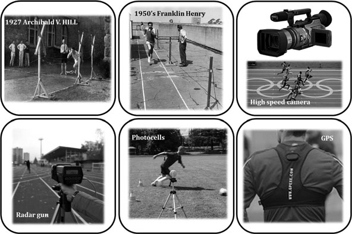

测量力、速度的简单方法……

（从 30 到 100 赫兹）。 即使运动学变量提供了有关冲刺表现的非常有趣的信息，但它们并没有提供有关运动员的力量和功率产生能力的见解，也没有提供有关“身体”和“技术”能力之间的区别的见解。 本章末尾将介绍典型示例，以展示除运动学评估之外的动力学评估的兴趣。 因此，一种在地面现实条件下、在实验室外、仅通过一次冲刺来确定 F-v 和 P-v 关系以及冲刺期间施力有效性的简单方法，对于推广用于训练或科学目的的冲刺力学评估似乎非常有趣。 本章将介绍我们提出的一种简单的现场方法，该方法可以通过在典型训练实践中很容易获得的少量数据输入来准确计算下肢的力、速度和功率能力。 然后将介绍和讨论验证协议和结果、局限性和实际应用。

## 11.2

理论基础和方程 至于本书中介绍的其他简单方法，用于测量冲刺跑步期间的力、速度和功率能力的简单冲刺方法基于应用于身体质心 (CM) 的动力学基本原理（更多详细信息，请参见 Samozino 等人，2016 年）。 这里使用的生物力学模型是使用宏观逆动力学方法对冲刺加速过程中跑步者 CM 的运动学和动力学进行分析，旨在成为图 11.1 过去和现在在实验室外分析冲刺运动学的主要设备

最简单的可能（Helene 和 Yamashita 2010；Furusawa 等人 1927；di Prampero 等人 2015）。 在这种方法中，与之前的方法一样，机械变量随着时间的推移进行建模，而不考虑步内变化，因此对应于步平均值（接触加空中时间）。 在跑步最大加速度期间，让我们考虑施加到运动员 CM 上的不同外力：体重、空气动力阻力和地面反作用力 (GRF) 及其水平和垂直分量（图 11.2）。 应用水平方向动力学的基本定律，应用于身体 CM 的净水平前后 GRF (FH) 可以随时间建模为：

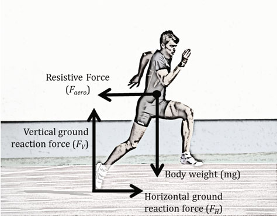

$$ FH t( ) = m.aH t( ) + Faero t( ) \quad (11.1) $$

其中 m 为跑步者的体重（单位为公斤），aH tð Þ CM 水平加速度和 Faero(t) 冲刺跑步期间要克服的空气动力阻力。 基本计算流体动力学原理表明，Faero(t) 与空气相对于转轮的速度的平方成正比，可以建模为： $Faero t( ) = k$ 。

$$ vH t( ) vw ( )2 \quad (11.2) $$

其中 vw 为风速（如果有），k 为跑步者的空气动力摩擦系数。 后者可以根据 Arsac 和 Locatelli (2002) 提出的空气密度值（q，单位为 kg·m−3）、跑步者的额面积（Af；单位为 m2）和阻力系数（Cd = 0.9，van Ingen Schenau 等人，1991 年）来估计： 图 11.2 短跑运动员在加速阶段所受外力的示意图：体重（mg）， 空气动力阻力 (Faero) 以及地面反作用力的垂直 (FV) 和水平 (FH) 分量

测量力、速度的简单方法……

k 1/

$$ 4 0:5:q.Af .Cd \quad (11.3) $$

与 q 1/4 q0。 铅760。

$$ 273 + T Af = 0:2025:h0:725.m0:425 :0:266 \quad (11.4) $$

其中 $q0 = 1:293 kg m$ −1 是 760 Torr 和 273K 下的 q，Pb 是大气压（以 Torr 为单位），T° 是空气温度（以 °C 为单位），h 是跑步者的身高（以 m 为单位）。 综上所述，除了了解运动员的身高和体重，以及环境温度和气压的近似值（对机械输出的影响可以忽略不计，请参见第 11.3 节）之外，aH tð Þ 是 FH 模型唯一需要的运动学输入变量。 在运行最大加速度期间，水平速度 (vH) 遵循单指数函数系统地增加。 这可以在休闲运动员、团队运动运动员、有史以来最好的短跑运动员、4 岁小男孩或 95 岁老人身上观察到，并且在科学文献中多次得到证实（图 11.3，（例如 Furusawa 等人 1927 年；di Prampero 等人 2005 年；Morin 等人 2006 年；Chelly 和 Denis 2001 年）： $vH t( ) = vHmax 1 e t$ =s ð11:6Þ 其中 vHmax 为加速结束时达到的最大速度，s 为加速时间常数 经过对 vH tð Þ 随时间的积分和推导后，图 11.3 一名 2 岁小男孩、一名世界级运动员和一名 95 岁老人在冲刺加速过程中获得的速度-时间曲线对应。 雷达枪数据中的噪声幅度差异与个人的年龄或水平无关，但与应用于这些典型原始数据的不同滤波器相关。

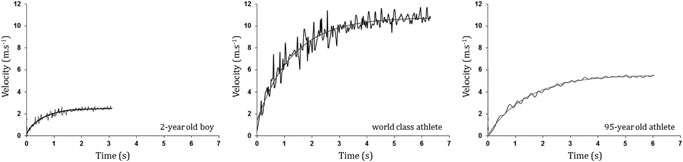

在加速阶段，身体CM的水平位置xH ð Þ和加速度aH ð Þ作为时间的函数可以表达如下：x tð Þ ¼ vHmax。 t ×

$$ s.et s vHmax:s aH t( ) = vHmax s .et s \quad (11.7) $$

因此，vHmax 和 s 值可以通过速度或位置/时间测量并使用最小二乘回归方法和方程来确定。 11.6 或 11.7。 然后，可以使用方程式在每个瞬间（例如，每 0.1 或 0.05 秒）计算 aH tð Þ 。 11.8，FH 可以使用式（11.8）获得。 11.1 和 vH 使用方程。 11.6 [如果初始测量为 x tð Þ]。 然后，可以在每个瞬间将施加到身体 CM 的平均净水平前后功率输出（以 W 为单位的 PH）建模为 FH 和 vH 的乘积。 绘制 FH 与 vH 的关系图，并通过线性方程对这种关系进行建模，得出 F-v 关系，可以外推该关系以获得最大力 (F0) 和速度 (v0) 值，分别作为力和速度轴的截距（图 11.4）。 P-v 关系可以使用 PH-vH 图上的二阶多项式回归来获得，后者的顶点对应于最大功率输出 ðPHmaxÞ。 然后，应用垂直方向动力学的基本定律，在每个完整步骤中应用于身体 CM 的 GRF 平均净垂直分量 (FV) 可以随着时间的推移建模为等于体重 (di Prampero et al. 2015)：

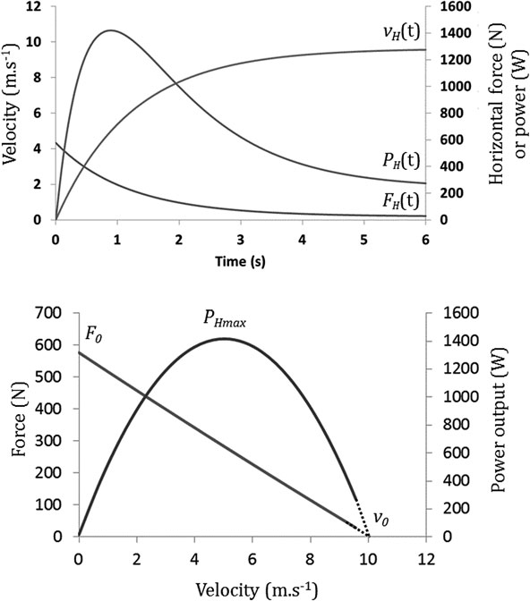

$$ FV t( ) = m.g \quad (11.9) $$

其中 g 是重力加速度 (9.81 m s−2)。 每个瞬间的力比（RF，以 % 表示）可以通过以下公式进行建模：

射频 1/ $4 FH F2 H$ ×

$$ F2 V p :100 \quad (11.10) $$

用线性回归绘制 RF 与 vH 的关系图后，该关系的斜率对应于整个加速阶段速度增加时 RF 的下降率（DRF，以 % s m−1 为单位）。 值得注意的是，由于起始块阶段（推出和后续腾空时间）持续 0.5 至 0.6 秒（Slawinski 等人，2010；Rabita 等人，2015），因此发生在平均时间 *0.3 秒，因此可以根据 t > 0.3 秒建模的 FH 和 FV 值合理地计算 RF 和 DRF。 这里提出的生物力学模型和相关方程允许通过简单的输入来估计单次冲刺跑步加速度期间运动矢状平面中的 GRF：人体测量（体重和身高）和时空（分段时间或瞬时跑步速度）数据。 然后，该模型可以用作评估冲刺跑步期间的力、速度和功率能力以及机械效率的简单方法。

测量力、速度的简单方法……

图11.4 冲刺加速阶段水平速度（vH）、水平前后力（FH）和功率（PH）随时间变化的建模，以及与最大力（F0）、速度（v0）和功率（PHmax）相关的建模力和功率-速度关系

## 11.3

该方法的局限性 上一节中介绍的生物力学模型是动力学基本原理的简单应用。 然而，对于所有模型来说，需要一些简化的假设来模拟跑步者在整个冲刺加速阶段对地面产生的水平力。 此外，模型的宏观水平（身体 CM 的运动学和动力学）导致这种方法可能的分析水平受到一些限制，在解释输出变量时必须考虑到这一点。 下面讨论这些不同点。 • 动力学原理应用于被视为一个系统并由其质心表示的整个身体（例如 Samozino 等人，2008、2010、2012；

卡瓦尼亚等人。 1971； 范·英根·舍瑙等人。 1991； 海伦和山下 2010； 拉比塔等人。 2015）。 仅考虑旨在移动 CM 的力。 • 生物力学模型仅关注运动矢状面（即垂直和前后）中的 GRF 分量，而忽略了内侧分量，该分量被证明在运动员产生的总力中构成可忽略不计的部分（Rabita 等人，2015）。 • 建议仅根据身高、体重和固定阻力系数来估计水平空气动力摩擦系数 k ð Þ（Arsac 和 Locatelli 2002）。 即使它不代表“黄金标准”过程，这也代表了一种在实验室外估计空气动力阻力的非常简单的方法。 此外，机械输出变量对锋面面积、空气密度或阻力系数估计中可能出现的误差的敏感性较低：这些输入估计中的 *10% 误差会导致输出变量中的误差低于 0.5%。 • 与之前冲刺跑期间的动力学测量相比，对每个支撑阶段的机械变量进行平均（Morin 等人，2010、2011a、2012；Lockie 等人，2013；Rabita 等人，2015；Kawamori 等人，2014），这里的计算导致整个步骤的建模值，即接触加上空中时间，这会导致较低的力或功率输出值。 步均变量更多地表征了整个冲刺跑推进力的机制，而不是每个接触阶段下肢神经肌肉系统的具体机械能力。 然而，这不会影响 RF（进而影响 DRF）值，因为它是在同一持续时间内平均的两个力分量之间的比率。 请注意，在完整步数上建模的此类值无法带来有关步间变异、步内分析或接触和空中时间探索、步长/频率以及冲刺跑期间的力脉冲和发展速率的信息。 • 需要进行机械效率计算，以将每一步的 GRF 垂直分量建模为等于跑步者的体重。 这需要假设冲刺加速阶段的 CM 垂直加速度准为零。 然而，无论是否使用起跑器（但在很大程度上更明显地使用起跑器），跑步者的身体 CM 在此阶段从起始蹲伏位置上升到站立跑位置，然后不会从一个完整的步骤到另一个完整的步骤。 由于 CM 的初始向上运动在相对较长的时间/距离内总体平滑（*20–40 m，Cavagna 等人 1971；Slawinski 等人 2010），因此我们可以认为它不需要任何大的垂直加速度，因此在整个冲刺加速阶段，CM 在每一步上的平均净垂直加速度是准零的。 这对于站立短跑起跑来说更正确，站立短跑起跑代表了除使用起跑器的田径短跑赛事之外的体育运动中的大多数情况。 上述简化假设是所有生物力学模型固有的假设。 重要的是量化这些引起的错误

测量力、速度的简单方法……

简化。 为此，与参考测力板测量结果相比，基于这些计算以及简单的人体测量和时空测量的简单方法得到了验证。

## 11.4

方法的验证 本章介绍的简单冲刺方法的有效性和可靠性通过 Samozino 等人详细报道的两种不同的实验方案进行了测试。 （2016）。

## 11.4.1

与测力台相比的并发有效性

测量通过将使用所提出的计算获得的建模机械值与冲刺的整个加速阶段期间的参考测力台测量值进行比较，测试了简单方法的并发有效性。 参考方法。 前后和垂直 GRF 分量、F-v、P-v 和 RF-v 关系以及相关变量

使用简单方法和 Rabita 等人最近提出的使用 6.60 米长力平台系统（KI 9067；奇石勒，温特图尔，瑞士，采样率为 1000 Hz）的方法，确定了 9 名精英或亚精英短跑运动员的 F0、v0、PHmax、SFV、DRF ð Þ。 （2015），更多细节见第 1 章。 10）。 简而言之，由于不存在 30 至 60 米长的测力台系统，该方法包括通过为每次冲刺设置相对于 6.60 米长测力台系统不同的起跑器位置，为每位运动员虚拟重建整个单次 40 米冲刺加速度的 GRF 信号。 因此，每位运动员在标准化的 45 分钟热身后，在室内体育场进行 7 次最大冲刺（2 次 10 m、2 次 15 m、20 m、30 m 和 40 m，每次试验之间休息 4 分钟）。 在每次冲刺期间，在测力台系统覆盖的 6.60 m 部分上收集 GRF 数据，测力台系统被放置在每次冲刺加速阶段的不同位置。 对每个步骤（接触+空中阶段）的垂直（FV）和水平前后（FH）GRF 分量的瞬时数据进行平均，以计算上述变量。 方法简单。 与测力台测量并行，使用位于不同冲刺终点线的一对光电管（Microgate，博尔扎诺，意大利）测量冲刺时间。 然后使用 10（两个试验中最好的一个）、15（同上）、20、30 和 40 m 处的 5 个分段时间来使用方程式确定 vHmax 和 s。 11.7 最小二乘回归法。 根据这两个参数，vH tð Þ 和 aH tð Þ 使用等式随时间（每 0.1 秒）进行建模。 分别为 11.6 和 11.8。 从 aH tð Þ、FH tð Þ、PH tð Þ 和 RF(t) 中，使用第 1 节中介绍的方程和数据处理进行计算。 11.2 以确定每个受试者的所有机械变量。

结果表明，建模的力（FH、FV、合成）、功率和 RF 值非常接近每一步测力台测量的值，估计标准误差分别较低，为 *30–50N、*230W 和 3.7%（如图 11.5 中的典型受试者所示）。 在最初的 20-30 m 内，用测力台测量的 FV 值并不是特别高于体重（图 11.5），并且在整个加速阶段平均时非常接近体重（平均差异低于 *2.40%）。 这支持了在此阶段 CM 的准零垂直加速度的假设（尽管使用了起跑器），并且反过来支持了阶跃平均 FV 建模值等于体重的有效性。 除了冲刺加速期间运动矢状面（水平、垂直和合力）的建模 GRF 具有非常好的一致性外，还观察到 F0、v0、PHmax、SFV 和 DRF 的确定存在低偏差：F0、v0 和 PHmax 低于 *5%； SFV 和 DRF 低于 8%（表 11.1）。 这些低偏差与跨越 0 的狭窄 95% 一致性限制相关，这支持所提出的确定 F-v、P-v 和 RF-v 关系及其相关机械变量的简单方法的高精度和有效性

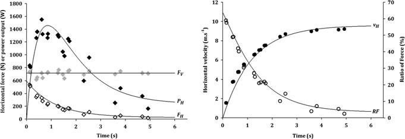

最大PH值； F0; v0; SFV； 冲刺跑中的 DRF ð Þ（图 11.6）。 图 11.5 典型短跑运动员在加速阶段的水平速度（vH，黑点）、水平（FH，空心菱形）和垂直（FV，灰色菱形）力分量、水平功率输出（PHmax，黑色菱形）和力比（RF，空心圆圈）的变化。 点表示通过测力板方法（来自五次冲刺）获得的每个步骤的平均值，线表示通过简单冲刺方法根据分段时间计算的模型值 表 11.1 证明简单冲刺方法同时有效性的变量的平均值±SD 值

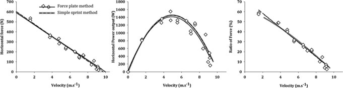

参考方法

提议的方法

偏差 95% 协议限制

绝对偏差

F0 (N) 654 ± 80 638 ± 84 −15.9 ± 25.7 [−66.3;34.5] 3.74 ± 2.69 v0 (m.s−1) 10.20 ± 0.36 10.51 ± 0.74 0.32 ± 0.52 [−0.7;1.3] 4.77 ± 3.26

PHmax (W) 1669 ± 253 1680 ± 280 10.56 ± 45.01 [−77.7;98.8] 1.88 ± 1.88

SFV (N·s·m−1) −64.06 ± 6.30 −60.8 ± 7.71 3.26 ± 5.22 [−6.97;13.49] 7.93 ± 5.32

DRF (%s·m−1) −6.80 ± 0.28 −6.80 ± 0.74 −0.002 ± 0.58 [−1.139;1.135] 6.04 ± 5.70

测量力、速度的简单方法……

本简单方法的运动学输入变量是时空数据：在一次冲刺期间的分割时间（如验证协议中使用的）或瞬时运行速度测量（可以从雷达枪（例如 di Prampero 等人，2005 年；Morin 等人，2006 年）或激光束（例如 Bezodis 等人，2012 年）获得。因此，简单冲刺方法也在 使用雷达测量的数据采用相同的协议（Stalker

ATS系统，

Radar Sales，美国明尼苏达州明尼阿波利斯，46.875 Hz）在 30 米和 40 米试验的最佳冲刺期间。 结果与分段时间获得的结果非常相似，但偏差值略高（绝对偏差从 3% 到 7%），因为这是使用简单方法从一次冲刺获得的机械变量与使用参考方法从 5 次冲刺获得的数据进行比较。 这可能会增加仅与验证协议本身相关的偏差，而与方法无关。

## 11.4.2

可靠性 在第二个方案中测试了简单方法的试验间可靠性，其中六名高水平短跑运动员进行了 3 次最大 50 米冲刺，每次试验之间休息 10 分钟。

不同的机械变量F0； v0; SFV； PHmax 和 DRF 是通过与之前提出的计算方法相同的数据处理获得的，除了 vHmax 和 s 是使用等式确定的。 11.6、最小二乘回归法和雷达系统测量的vH tð Þ（采样率46.875 Hz）。 后者被放置在受试者身后 10 m 处的三脚架上，高度为 1 m，大约相当于受试者的 CM 高度（di Prampero 等人，2005 年；Morin 等人，2012 年）。 对于所有机械变量，观察到两次最佳试验之间的变异系数和测量标准误差较低（<5%，表 11.2），并且与接近 0 的平均值变化相关。这表明系统误差和随机误差较低，进而表明测试间的可靠性较高。 图 11.6 通过两种方法获得的典型运动员的力功率和射频速度关系。 实心菱形表示从测力板方法获得的每个步骤的平均值，实线表示相关回归，灰线表示通过所提出的简单方法计算的建模值与相关回归（虚线）相混淆

通过这项研究（Samozino et al. 2016），我们清楚地表明，基于宏观生物力学模型和易于在实验室外获得的人体测量（体重和身高）和时空（分段时间或瞬时速度）变量的简单方法，可以准确、可靠和有效地评估冲刺跑期间的力、速度和功率能力以及机械有效性。

## 11.5

技术和输入测量对于本书中介绍的不同简单方法，当前简单冲刺方法的准确性和可靠性取决于用于获取模型机械输入（即此处的位置-时间或速度-时间数据）的设备的准确性。 请注意，必须使用测试期间使用的鞋子和衣服来测量体重。

## 11.5.1

分段时间 当使用分段时间作为简单冲刺方法（使用方程 11.7）的输入数据时，正如在上述验证协议中所做的那样，在加速阶段至少需要 4 或 5 个分段时间才能获得可靠的机械输出变量。 根据运动员的水平，不同分段时间的距离会有所不同，以覆盖所有加速阶段：从起跑线到30 m（对于非专业短跑运动员），直到50-60 m（对于田径短跑运动员）。 这些距离在加速阶段开始时必须比结束时更短，因为加速度幅度越高（因此在冲刺的前几米），需要更好地描述运动速度变化的分割时间数就越多。 例如，对于足球或橄榄球运动员，分段时间应为 5、10、15、20 和 30 m。 对于 100 米短跑运动员，他们可以是 5、10、15、30 和 40 m。 在现场条件下可以使用不同的设备来测量冲刺加速期间的分段时间，这里介绍了其中的主要设备。 表 11.2 变异系数 (CV) 的平均值 ± SD，2 次最佳试验之间的测量平均值和标准误差的变化

简历 （％）

均值变化

测量标准误差(%)

F0（牛）2.93±2.00-1.53​​±32.2

## 3.57 v0 (m·s−1) 1.11 ± 0.86 −0.171 ± 0.776

## 1.40

Pmax(W) 1.87±1.36-0.167±0.66

## 2.33

SFV (N·s·m−1) 4.04 ± 2.72 −0.20 ± 4.18

## 4.94

DRF（%s·m−1） 3.99 ± 2.80 −0.110 ± 0.45

## 4.86

测量力、速度的简单方法……

全自动计时系统。 在冲刺期间准确可靠地测量分段时间的黄金标准设备是全自动计时系统，包括静音枪和终点摄影相机（Haugen 和 Buchheit 2016）。 它们的计时分辨率高达 0.0005 秒，主要且几乎仅用于国际田径比赛。 对于体育从业者和科学家来说，它们太昂贵且不切实际。 然而，自 1987 年罗马世锦赛以来，国际田径联合会 (IAAF) 提供了生物力学报告，介绍了男子和女子 100 米比赛中每个 10 米或 20 米部分的分段时间。 通过分析这些数据，结合个人世界纪录比赛或奥运会期间获得的数据，以及上述简单计算，最近使我们能够探索世界上速度最快的男性和女性 100 米短跑表现的机械决定因素，以及人类短跑表现的极限（Slawinski 等人，2017 年，参见第 11.6.3 节）。 由于冲刺加速实际上是在地面产生的力首次上升时开始的，因此必须从不同的分段时间中去除反应时间，以便仅考虑 CM 运动学（而不是全局 100 米冲刺性能）来估计动力学变量。 光电管。 在冲刺测试或训练中，光电管是最常用的测量分段时间的系统，通常分辨率为 1 毫秒。 不同的光电计时系统具有不同的启动计时器的方法：一对电池放置在起跑线上运动员前方（20-50厘米）处，拇指下方地板上的手指荚用于三点起跑，或后脚下方的脚荚（Haugen和Buchheit 2016）。 如前所述，要使用分段时间作为简单冲刺方法的输入，必须根据地面上的第一力产生来测量它们。 我们确定估计这些分段时间的最佳方法是在运动员使用三点蹲伏起始位置以及使用拇指下方地板上的手指荚启动计时器的光电管测量的分段时间中添加 0.1 秒。 使用测力台和高速相机对几名短跑运动员量化了 0.1 秒的时间延迟（Samozino 等人，2016 年）。 其他方法，例如使用放置在起跑线前面的一对光电管，会高估通过简单方法计算的力和功率输出，即使如果光电管在不同的测试过程中始终设置在同一位置，可靠性仍然非常好。 高速摄像机。 随着高速摄像机的倍增和推广，提供高像素分辨率和高帧速率（在最新的智能手机和平板电脑中高达每秒 240 帧），使用视频测量分段时间提供了足够准确的信息，可以通过简单的冲刺方法可靠地计算机械变量。 帧率越高，精度越高。 我们认为帧速率必须至少为每秒 100 帧才能获得相关结果。 为了从视频分析中获取分段时间，需要在跑道上以 4-5 个不同距离放置多个标记，并确定运动员用臀部或肩膀越过标记的时间。 这可以通过使用与运动员以相同速度移动的移动摄像机从侧面拍摄冲刺来完成，或者使用放置在距离跑道给定距离处的固定摄像机上，标记位于加速目标距离的一半处（即在 15 或 15 处）。

30 米或 40 米加速分别为 20 m）。 在后一种情况下，视频视差被校正，以确保当运动员跨越不同的目标距离时正确测量不同的分段时间。 提出了一种简单的视差校正方法，详细说明如下

罗梅罗-弗朗哥等人。 （Romero-Franco 等人，2016 年的图 1）。 对于光电管，关键点是启动计时器的标准，即确定与冲刺开始相对应的帧，从机械角度来看，冲刺开始对应于力产生的开始。 我们建议运动员以三点起始位置开始，将拇指离开地面的帧视为第0帧，然后在每个分段时间添加0.1秒。 最近，Pedro Jimenez-Reyes 设计了一款智能手机应用程序（MySprint），使用当前简单的冲刺方法和最近 iPhone 或 Ipad 的 240 fps 相机测量的分段时间来计算所有冲刺机械变量（图 11.7）。 与参考设备（光电管和雷达）相比，性能输入（分割时间和速度-时间曲线）和机械输出（水平力和功率、机械效率）显示出非常高的可靠性（ICC > 0.99）和并发有效性（估计的标准误差 <1.3%）（Romero-Franco 等人，2016）。 我们认为，这种低成本系统（Iphone/Ipad + MySprint App）代表了当今成本、有效性/准确性/可靠性、直接反馈数据以及易于使用和现场携带之间的最佳折衷。

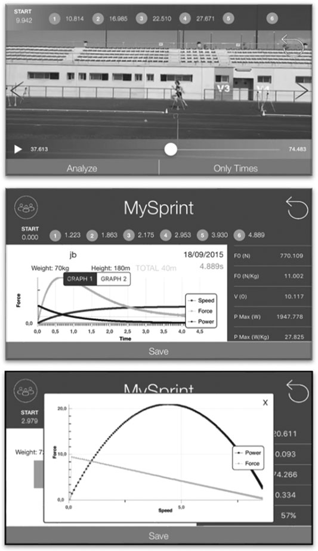

## 11.5.2

瞬时速度瞬时速度也可以用作简单冲刺方法的输入数据，并在冲刺加速期间表征力产生的机械变量的估计中产生类似的并发有效性（Samozino 等人，2016）。 以下是在这种全力以赴的努力中随时间推移获取速度信号的主要使用设备。 激光枪和雷达枪。 瞬时速度可以使用激光（例如 LAVEG Sport 激光测速枪，Jenoptik，耶拿，德国）或雷达（例如 Stalker ATS 雷达枪，Radar Sales，明尼阿波利斯，明尼苏达州，美国）系统获得，其采样率分别为 100 和 46.875 Hz，具有高可靠性和有效性（Haugen 和 Buchheit 2016）。 这两支枪通常放置在起跑线运动员身后 3-10 m 处，高度为 1 m（大约相当于受试者的质心高度）。 对于数据分析，仅需要加速阶段即可使用指数回归（方程 11.6）计算 vHmax 和 s。 因此，在实际冲刺开始之前和最大速度平台之后测量的所有速度值都必须删除（图 11.8）。 与每个数据取决于测量触发的分段时间相反，瞬时速度值独立于之前的速度值，这避免了由于测量开始的瞬间或方式而产生的任何偏差。 然而，速度数据上实际冲刺开始的检测常常受到速度信号上的噪声的影响，这是由于

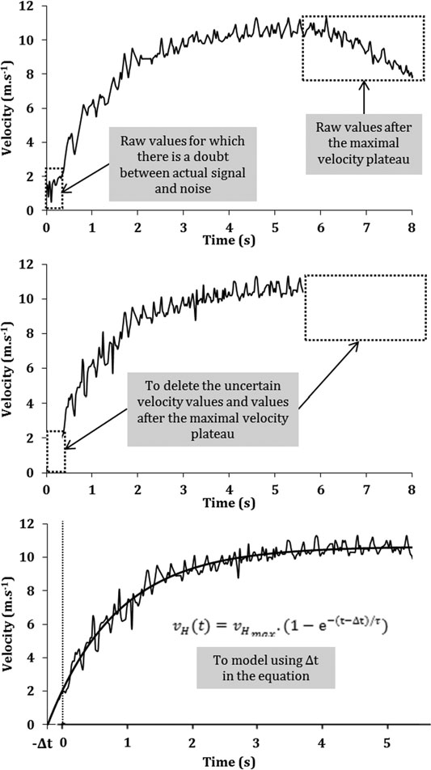

测量力、速度的简单方法……

图 11.7 iPhone 应用程序“Mysprint”使用高速视频慢动作模式（帧速率为 240 fps）来测量 30 米冲刺加速的分段时间，从而计算所有力-速度-功率曲线和机械效率变量

图11.8 雷达枪在冲刺加速过程中测量瞬时速度时的典型数据分析。 第一步是删除不确定的原始速度值，这些值在冲刺开始时的实际信号和噪声与冲刺结束时最大速度平台之后的值之间存在疑问。 然后，可以使用单指数回归对原始值进行建模，其中方程中包含时间延迟 (Dt)

测量力、速度的简单方法……

在冲刺开始之前测量枪场中其他物体的运动。 如果考虑的第一个非空速度值不是实际的第一个速度值（即运动员的速度），这可能会导致对力和功率变量的高估。 面对这个问题，我们建议删除所有实际信号和噪声之间有疑问的值，然后在数学指数函数中添加第三个参数（时间延迟，Dt，单位为s），以便将考虑的第一个速度值与真实时间相关联（图11.8）。 将 Dt 包含在方程中。 11.6 给出： $vH t( ) = vHmax$ 。 1 e t Dt ð Þ=s ð11:11Þ 这种数据分析方法可以提高速度值的可靠性和有效性，以及在加速阶段的前 5-10 m 中测量的相关计算距离和加速度数据（参见第 11.4 节），这在之前已被证明是这些设备的一个问题（Haugen 和 Buchheit 2016；Bezodis 等人 2012）。 例如，我们使用该方法进行的第一项研究的计算中并未包含此时间延迟（Buchheit 等人，2014b）：F0 显示可接受的绝对值（CV 7.8%），但不包括相对可靠性（ICC，0.64）（Simperingham 等人，2016 年；Buchheit 等人，2014b）。 使用此时间延迟后，可靠性得到了极大提高（Samozino et al. 2016）。 全球定位系统。 全球定位系统 (GPS) 设备在大型球类运动中已变得流行，用于评估运动员在比赛或训练期间的身体活动（Aughey 2011）。 它们的有效性和可靠性已经过测试，可用于测量场上运动员的运动学，特别是距离和速度（Aughey 2011；Barbero-Alvarez 等人，2010；Jennings 等人，2010；Rampinini 等人，2015），只有高采样率（>10 Hz）GPS 设备才能接受加速度（Buchheit 等人，2014a）。 最近，研究了使用简单方法获得冲刺机械性能的两个不同 GPS 单元（5 和 20 Hz 采样率）的并发有效性（基于雷达的方法是参考）（Nagahara 等人，2017）。 结果表明，GPS 设备使得获得一致的 FvP 曲线成为可能，但两个系统的百分比偏差都显示出大范围的高估或低估（5 赫兹 GPS 和 20 赫兹 GPS 分别为 -5.1 至 2.9% 和 -7.9 至 9.7%），即使 20 赫兹 GPS 的 90% 误差置信区间小于 5 赫兹 GPS 的误差。 因此，尽管高采样率系统的精度明显高于低采样率系统，但使用 GPS 装置计算冲刺加速期间机械输出的有效性（即使在高采样率下）仍达不到可接受的水平。 当改进的全球或本地定位系统技术可用时，这为在训练练习或比赛期间直接实际测量冲刺加速机械特性提供了有趣的可能性，而无需设置特定的测试。

## 11.6

实际应用

## 11.6.1

测试考虑除了用于测量速度或位置时间数据的设备的准确性之外，本简单冲刺方法的准确性和可靠性还取决于测试协议设置和数据分析的严格程度。 在这里，我们将使用简单的冲刺方法详细介绍典型测试会话的不同实际点，该方法有助于减少测量误差。 热身。 由于我们的目的是评估个人的最大冲刺能力，因此运动员必须进行特定于冲刺的热身，以便他在接下来的测试中达到最大表现。 例如，热身应包括 *5 至 10 分钟的低速跑步，然后是 3 分钟的下肢肌肉拉伸，5 分钟的冲刺特定训练，以及 3-5 次渐进的 30-40 m 冲刺，中间有 2 分钟的被动休息。 试验次数和冲刺距离。 热身后，每位运动员至少要进行两次最大努力的冲刺。 更多的试验（3-5）可以更好地确保测量运动员的最大能力，而试验之间的休息足以确保不会发生疲劳。 只有最佳表现（例如 30 m 处的时间）才会被考虑进行分析。 请注意，如果试验之间的性能或机械输出差异太大，数据的相关性就会改变。 如前所述，冲刺距离应根据运动员的水平而有所不同，以便涵盖所有加速阶段：*非专业短跑运动员（例如足球或橄榄球运动员）为 30 m，田径短跑运动员为 50-60 m。 起始位置。 如上一节所述，当使用分段时间（来自光电管或高速摄像机）作为输入测量时，起始位置应为三点蹲伏位置，当拇指离开地面时计时器开始，并且分时间必须添加 0.1 秒进行校正。 当测量速度（雷达或激光枪）时，可以根据体育活动的具体情况设置起始位置：起跑器、三点蹲伏位置、站立或其他。 必须做出选择，以便评估运动员在与比赛期间相似的身体配置下的发力能力。 鞋子和跑步表面。 由于地面类型（柏油路面、湿/干草地、格子呢®、木地板）和鞋外底的特性（经典跑鞋、鞋钉、防滑钉）会影响冲刺加速期间脚与地面之间的摩擦力，因此水平力的产生会受到这两者的影响。 显然，冲刺测试应在与比赛中使用的表面和鞋子条件相似的条件下进行。 因此，对于例行测试和后续测试，冲刺始终使用相同类型的鞋子在同一表面上进行非常重要。

测量力、速度的简单方法……

## 11.6.2

数据解释 除了准确性和可靠性之外，简单现场方法的兴趣还在于对机械输出的良好解释，每个输出都呈现出非常具体的含义，以及转换为用于培训目的的实用信息。 Morin 和 Samozino (2016) 以及本书的前一节/章节已经很好地介绍和讨论了在 sprint 中使用 FvP 分析时感兴趣的主要变量的定义和实际解释。 在这里，我们将按逻辑顺序简要总结表征运动员发力能力的主要指标，以便更好地理解并提高短跑力学（表11.3列出了典型运动员的此类指标的示例）。 请注意，这几个变量可以在使用最小二乘回归方法和方程从实验数据（速度、分流时间）确定 s 和 vHmax 后获得。 11.6或11.7，并在每个瞬间（每0.1秒或更短）aH计算； 跳频； vH; x; PH 和 RF（更多详细信息请参见第 11.2 节）。 冲刺加速性能指标。 代表运动员冲刺加速表现的变量是最重要的，因为它是运动员和教练想要提高的。 该指数的选择应考虑体育活动和团体运动中运动员在场上的位置。 例如，100米短跑运动员的表现可以用50 m的时间来表征，足球运动员或橄榄球后卫的20或30 m的时间以及足球守门员或橄榄球前锋的10或15 m的时间可以表征。 在某些情况下，给定时间（例如 2 或 4 秒）内的覆盖距离也很有意义。 对于以下变量，加速阶段要考虑的距离或持续时间也必须根据要提高的性能的具体情况以及应优化冲刺加速的距离（短或长冲刺加速）来确定。 加速过程中产生的水平功率和力的指数。 冲刺加速性能与加速阶段产生的平均水平功率输出直接相关（Morin 等人，2011a，2012），并且也与产生的平均水平力直接相关，因为跑步速度是水平力产生的结果。 因此，目标距离/时间内的平均水平功率和平均水平力（相对于体重表达或不相对于体重表达）是运动员在测试过程中实际机械产生的两个宏观指标，即使相关信息与加速性能指标所带来的信息非常接近。 水平力量和力量生产能力的指数。 冲刺加速阶段实际产生的水平功率和力取决于最大水平力产生能力。 后者可以分离成两种不同且独立的能力。 首先，在低速下产生非常高水平的水平力的能力以理论上运动员可以产生的最大FH（F0）为特征，主要指运动员在冲刺加速期间对地面的初始推力。 其次，以非常高的速度持续产生水平力的能力是通过理论最大速度（v0）来量化的，它代表运动员能够产生水平力的最大速度。 F0 和 v0 在平均力产生中的权重，以及在冲刺加速性能中的权重，取决于加速距离

覆盖。 最大功率输出ðPHmaxÞ是F0和v0的组合，反映了运动员的整体机械输出能力。 施力的机械有效性指标。 冲刺期间产生水平力的能力取决于下肢产生力的能力以及将其有效地（即水平地）定向到地面的能力。 运动员在冲刺加速过程中的整体机械效率可以通过目标距离/时间内的平均 RF 来很好地量化。 至于力的产生能力，整体机械效能可以分解为两种不同的能力。 首先，有效定向低速（即加速阶段的第一步）产生的力的能力可以通过最大 RF 值 (RFmax) 很好地表征。 其次，尽管速度增加，但仍保持高水平有效性的能力，可以通过 RF 随速度下降的比率 (DRF) 很好地量化。 对这些不同机械效能指标的分析以及之前与发力能力相关的指标的分析，使教练能够区分与运动员的“身体”素质（下肢肌肉发力能力）和“技术”能力（发力的机械效能）相关的内容，这可以帮助他们根据每个运动员的优势和/或弱点进行训练，以提高表现或防止某些肌肉损伤。 这将在以下两节中讨论。

## 11.6.3

冲刺加速表现的优化当训练计划旨在提高冲刺加速表现时，简单的冲刺方法和所有上述指标可用于将运动员与其他运动员或团队其他成员进行比较（例如Cross等人，2015），并在赛季内或赛季之间跟踪每位运动员。 训练内容可以因人而异，主要针对弱点，同时尽量将优势保持在相似水平，并规划冲刺加速度应优化的距离。 运动员之间的比较。 Morin 和 Samozino（2016）中的案例报告很好地说明了 FvP 分析对优化冲刺加速性能的兴趣，该案例报告涉及精英联盟队的两名橄榄球运动员（图 11.9）。 它们在 20 m 上具有相似的冲刺加速性能，但具有相反的力产生能力。 玩家 #1 在冲刺的第一个慢速步骤中表现出更高的水平力产生能力（即更高的 F0），但在高速（即 v0）时表现出比玩家 #2 更低的水平力产生能力。 水平力产生的这些差异主要是由于机械效率的差异造成的：球员 #1 在低跑速度下比球员 #2 (RFmax) 具有更高的机械效率，但当速度增加时（DRF = −7.7% s m-1，即速度每增加 1 m s−1 就会损失 7.7% 的效率），与球员 #2 相比，球员 #2 的效率在相同的速度增量下仅改变 5.8%。 如果这两名运动员的训练计划旨在提高冲刺成绩（例如，这里是 20 米时间），则应该针对不同的能力。 基于事实，向这些玩家提供了类似的计划

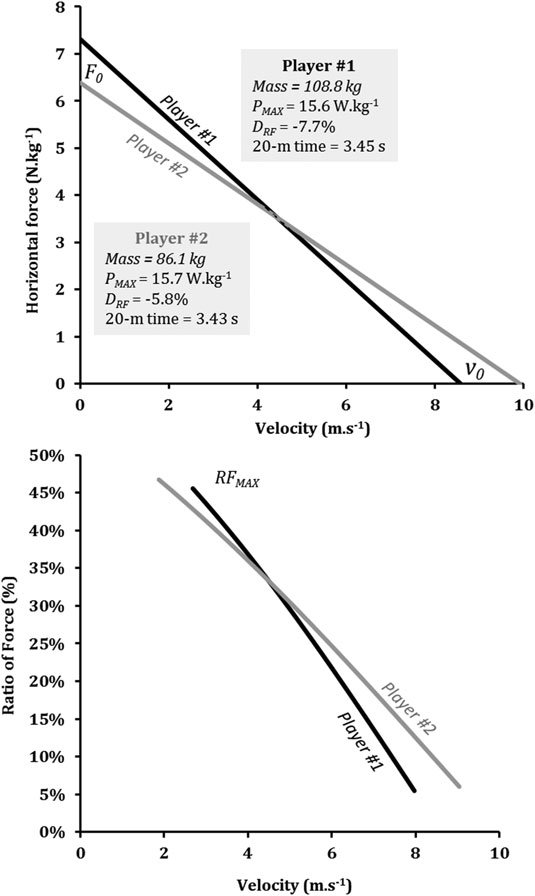

测量力、速度的简单方法……

他们的 20 米冲刺时间相似，很可能会导致他们的适应效果不佳。 玩家 #2 应通过增加 RFmax 和/或他的下肢肌肉力量（以增加产生的总力量）来发展 F0。 后者可以使用跳跃中的 FvP 分析进行评估，如图 11.9 所示。使用简单冲刺方法从最大 30 米冲刺中获得的 2 名精英橄榄球联盟运动员的水平力-速度剖面。 两位选手在 30 米大关前都达到了最大跑步速度

第一章 4. 相比之下，玩家 #1 必须增加 v0，特别是通过提高他在高速下的机械效率，以减少 DRF。 培训效果。 专注于 F0 或 v0 的训练计划非常不同，因为它们指的是与不同运动速度、产生的力量、身体位置或分段配置相关的相反训练方式。 例如，阻力雪橇训练代表了一种为水平力能力提供超负荷的特定方法，这是一种实用且具有成本效益的训练方式，并且可以被各个级别的足球运动员轻松使用（Petrakos 等人，2016）。 我们最近表明，使用比传统建议大得多的负荷进行极重雪橇训练（雪橇负荷为体重的 80%，Cross 等人，2017 年）明显增加了 F0 和 RFmax，对 v0 的影响微乎其微（Morin 等人，2017 年）。 相比之下，特别是在非常高的速度下（如超速条件下）训练水平力的产生，应该会改善 DRF 和 v0（目前正在进行的工作）。 最近，美国体能教练 Cameron Josse 的一份案例报告为 v0 对特定训练的敏感性提供了支持。 在为期 8 周的高速冲刺训练中，他与一名国家橄榄球联盟线卫一起使用 FvP 配置文件进行冲刺（使用 MySprint 应用程序）。 该训练包括长距离加速（从 20 到 50 m），其中大部分是在直立姿势下进行的，旨在强调直立跑步时的前侧力学的技术训练以及一些水平增强式训练（例如最大距离的力量跳跃）。 这种训练导致 F0、RFmax 和 PHmax 下降，但 v0、10 米平均 RF 和 DRF 增加（表 11.2）。 这导致实际达到的最大跑步速度 (*+6%) 和跑完 30 m 的时间 (*+3%) 得到改善，但 10 米和 20 米分段时间没有增加（表 11.2）。 本案例报告很好地支持了专注于提高表 11.3 NFL 后卫在 8 周的特定高速冲刺训练后冲刺加速性能、水平力量和力量产生能力以及机械效率的变化的训练练习的积极效果。

预训练

训练后百分比变化

冲刺加速性能指标10米时间(s)

## 1.93

## 1.96

## 1.6 20米时间（秒）

## 3.22

## 3.21 −0.3 30米时间（秒）

## 4.42

## 4.33−2.0

实际最大速度 (m s−1)

## 8.22

## 8.7

## 5.8

水平力量和力量生产能力指标

F0(N·kg−1)

## 10.2

## 9.2 −9.8 v0 (m s−1)

## 8.39

## 8.91

## 6.2

PHmax (W·kg−1)

## 21.5

## 20.5−4.7

SFV (N·s·m−1 kg-1) −1.22 −1.03 −15.1

施力机械效能指标

RFmean超过10 m (%)

## 31.9

## 33.1

## 3.8

RFMAX (%) −3.4

DRF (% s m−1) −11.1 −9.4 −15.3

测量力、速度的简单方法……

在 v0 和 DRF 上保持高速（以及直立位置）产生水平力的能力，进而实现长冲刺加速性能。 力-速度曲线与分割时间。 由于 5 米分跑和 30-40 米飞行分跑分别与 F0 或 v0（个人数据）密切相关，因此一些体能教练使用这些分跑时间或其比率（5 米/30-40 m）来了解有关运动员/运动员的力量和速度能力的信息。 这可以提供短跑中个体 F-v 曲线的整体良好视图，但有限且近似。 事实上，将表现（这里是冲刺分段时间）视为潜在神经肌肉特性或生理机制（即使它们之间存在良好相关性）的可互换信息可能会导致不准确，这对于休闲运动员来说是可以接受的，但对于高水平人群来说却存在风险。 这有点像认为跳跃高度是下肢最大力量的一个很好的指标，这与上一章关于最佳 F-v 曲线（第 5 章）中讨论的情况并不完全一样。 使用已发布的方程进行的个人模拟表明，两个玩家可能具有相同的 5 米分割和以不同 F0 为特征的不同 F-v 曲线（最多 10-15%）。 F-v 曲线很有趣，因为它提供了有关导致性能的原因的信息，而不是性能本身的信息（Buchheit 等人，2014b）。 后者不仅取决于机械性能，还取决于其他因素，如体重（两个不同体重的相同分段时间并不对应于相同的 F-v 曲线）或分时间的目标距离。 此外，分段时间并不区分部队生产能力和部队应用的有效性，这带来了非常有趣的附加信息，如之前的案例报告所示。 最后，我们不知道短/长分流比（5-m/30-40 m）应该趋向于哪个值，而冲刺中的 F-v 曲线的优化是可以想象的，因为它已经在使用最佳 F-v 曲线的跳跃中完成了（当前工作正在进行中）。

## 11.6.4

腿筋损伤预防和恢复运动监测 鉴于 (i) 髋部伸肌，特别是腿筋，在短跑期间产生水平力的作用（参见上一章中有关“髋部伸肌假说”的部分）和 (ii) 在短跑等高速和力量动作中，特别是在足球中，腿筋肌肉损伤的发生率很高（Woods 等人，2004 年），可以预期，腿筋肌肉功能的改变 （如受伤之前或之后）可能会影响短跑中的 FvP 曲线。 因此，通过 Jurdan Mendiguchia 领导的合作，我们最近研究了在腿筋受伤的情况下冲刺中的 FvP 曲线。

冲刺中的 FvP 概况以及腿筋受伤后重返运动的情况。 首先，我们发现，与未受伤的球员相比，最近从腿筋受伤中恢复并获准参加比赛的足球运动员的冲刺速度表现明显较低，并且机械水平性能降低，尤其是 F0（Mendiguchia 等，2014）。 恢复运动后进行大约两个月的常规足球训练，观察到冲刺速度（加速度）的显着改善，同时 F0 增加，直到与未受伤球员的水平相似，而 v0 保持不变（图 11.10）。 因此，练习者应考虑在足球运动员急性腿筋受伤后返回运动之前评估和训练冲刺跑过程中的水平力产生。 其次，在两个与腿筋拉伤管理相关的损伤案例研究中，短跑 FvP 特性的变化支持了 F0 对腿筋肌肉无力或改变的敏感性（Mendiguchia 等，2016）。 案例#1 涉及一名职业橄榄球运动员在重复冲刺任务（10 次 40 m 冲刺）时受伤（第 5 次冲刺）。 案例#2 是指一名职业足球运动员在急性腿筋损伤之前（8 天）和之后（33 天）。 结果显示，这两名精英运动员在腿筋受伤后恢复运动之前和之后，F0 都发生了变化，而 v0 几乎没有变化。 他们还强调，简单的场上冲刺方法足够灵敏，可以指示急性腿筋损伤之前水平力学性能的具体变化（在橄榄球运动员的案例中，观察到的机械输出变化与受伤之间的延迟可能短至一两次冲刺）。 因此，练习者应该考虑从表现和预防伤害的角度定期监测冲刺跑期间水平力的产生。 冲刺和腿筋损伤预防中的 FvP 曲线。 鉴于之前关于水平力能力和腿筋肌肉改变之间关联的结果，我们假设水平力推进的降低和/或减少可能揭示腿筋肌肉的功能弱点，这可能会使它们容易受到即将到来的伤害（Edouard等人提交的图11.10足球运动员在腿筋肌肉受伤后返回运动时和返回后2个月时的力量和功率-速度关系（以及相关的F0，v0和PHmax） 线条代表各组的平均曲线（出于清晰原因，未显示标准差）（来自 Mendiguchia 等人，2014 年）

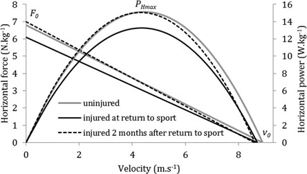

测量力、速度的简单方法……

过程）。 这是对 93 名日本大学足球运动员进行了整个赛季的测试，每三个月进行一次冲刺 FvP 档案测试。 结果显示，除了先前的腿筋损伤与新的腿筋损伤的较高风险相关（如之前报道的那样）之外，较低的 F0 在统计上与维持新的腿筋损伤的较高风险相关。 这些研究结果仅基于一个赛季的测试和 8 例腿筋损伤，必须通过目前正在进行的进一步前瞻性队列研究来证实。

## 11.6.5

更好地理解人类的极限

短跑表现除了作为一种用于优化表现和预防伤害的实用方法外，短跑简单方法还可以帮助人们对人类运动的极限产生新的认识，因为它可以估计地球上有史以来最快的男性和女性的短跑机械特性，而无需在实验室进行测试。 2017 年，我们根据国际田联生物力学报告在大多数比赛结束后提供的分段时间，比较了过去 30 年国际赛事（世锦赛和奥运会）100 米决赛中男女运动员的 FvP 数据1（Slawinski 等，2017）。 这种比较可以更好地了解男性和女性短跑表现差异的根源，特别是在加速阶段。 男性的所有短跑 FvP 曲线变量均大于女性。 男性 PHmax 值高出 *20%，F0（标准化为体重）和 v0 值高出 *10%（图 11.11）。 然而，当标准化为个体间差异时，男性和女性之间 v0 的差异极大（效应大小为 5.5），而 F0 的差异仅为中等（效应大小 = 0.88）。 此外，只有 v0 与 100 米表现相关，这意味着男性比女性具有更高的 100 米短跑表现，主要是因为他们能够以非常高的速度持续向地面产生水平力，从而持续加速。 当我们关注一些历史百米世界纪录的加速阶段时，我们可以大致了解人类短跑力学性能极限随时间的演变。 根据国际田联生物力学报告提供的分段时间和反应时间，我们对卡尔·刘易斯 1991 年（9.86 秒，东京）、莫里斯·格林 1999 年（9.79 秒，雅典）和尤塞恩·博尔特 2009 年（9.58 秒，柏林）的世界纪录估计了短跑 FvP 曲线，他们每个人都代表了短跑故事中的一个特定时代。 杰西·欧文斯 (Jesse Owens) 在 1936 年获得世界纪录（10.2 秒，芝加哥）时的 FvP 曲线的近似估计也已完成，但可靠性低于之前的估计。 图 11.12 显示了他们的 FvP 曲线，并显示 100 米性能的提高与 1http://www.iaaf.org/ 相关。

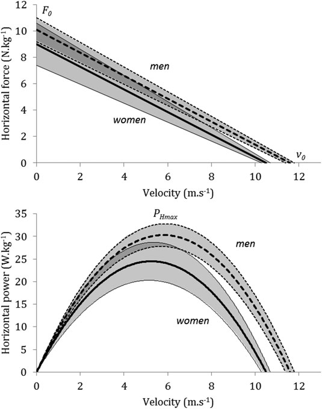

功率能力的增强以及 F-v 关系整体向左上方的转变。 这些变化主要是由于装备的变化（特别是从四十年代到九十年代的钉鞋和格子呢（R））、训练方法和负荷或运动员的职业化。 值得注意的是，莫里斯·格林和尤塞恩·博尔特在他们的世界纪录中表现出了相似的最大功率输出，但具有不同的 Fv 曲线：Fv 曲线更注重博尔特的速度能力。 即使博尔特在前 10 米跑得比格林慢（分别为 1.74 秒和 1.73 秒，不包括反应时间），他实际上也会领先格林*20 米（分别为 2.76 秒和 2.73 秒，不包括反应时间）到终点线。 这强调了图 11.11 过去 30 年国际赛事（世锦赛和奥运会）100 米决赛中世界级女子（实线）和男子（虚线）运动员的力量和功率-速度关系的平均值±标准差（Mean ± SD）在长距离冲刺表现中的重要性，基于国际田径联合会生物力学报告（来自 Slawinski 等人，2017 年）提供的分段时间

测量力、速度的简单方法……

在高速下持续产生水平力的能力比在低速下产生高水平力的能力强。 这种特定的能力似乎是人类高速双足运动的主要限制。

## 11.7

结论本章提出了一种准确可靠的简单方法来确定冲刺期间产生的力的机械特性。 该方法基于宏观生物力学模型，并与测力板测量相比在实验室条件下进行了验证，非常方便现场使用，因为它只需要人体测量（体重和身高）和时空（分段时间或瞬时速度）输入变量。 它提供了有关运动员水平力产生能力的不同信息：最大功率输出、最大水平力、可产生水平力的最大速度以及施加到地面上的力的机械效率。 这些信息为运动从业者提供了有趣的实际应用，以进行个性化训练，重点关注冲刺加速性能，但也从腿筋损伤预防的角度进行。 图 11.12 四位历史性 100 米世界纪录保持者的力与功率-速度关系估计：1936 年的杰西·欧文斯（10.2 秒，芝加哥）、1991 年的卡尔·刘易斯（9.86 秒，东京）、1999 年的莫里斯·格林（9.79 秒，雅典）、2009 年的尤塞恩·博尔特（9.58 秒， 柏林）。 这些短跑机械性能是根据国际田径协会提供的各自世界纪录跑步加速阶段的分段时间估算的

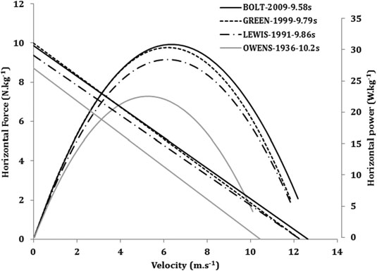

联合会生物力学报告

参考文献 Arsac LM、Locatelli E (2002) 使用世界冠军的速度曲线对 100 米跑步的能量进行建模。 应用生理学杂志 92(5):1781–1788。 https://doi.org/10.1152/japplphyol。

00754.2001 Aughey RJ (2011) GPS 技术在田径运动中的应用。 Int J Sports Physiol Perform 6 (3):295–310 Barbero-Alvarez JC, Coutts A, Granda J, Barbero-Alvarez V, Castagna C (2010) 全球定位卫星系统设备评估运动员速度和重复冲刺能力 (RSA) 的有效性和可靠性。 科学医学体育杂志 13(2):232–235。 https://doi.org/10.1016/j.jsams.2009。

02.005 Bezodis NE、Salo AI、Trewartha G (2012) 激光位移测量装置估计冲刺速度的测量误差。 国际运动医学杂志 33(6):439–444。 https://doi.org/10。 1055/s-0031-1301313

布赫海特 M，

铝

哈达德 H,

辛普森·BM，

宫殿D，

波登电脑，

从

Salvo V、Mendez-Villanueva A (2014a) 在足球比赛中使用 GPS 监测加速度：是时候放慢速度了吗？ 国际体育生理学杂志 9(3):442–445。 https://doi.org/10.1123/ijspp.2013-0187 Buchheit M、Samozino P、Glynn JA、Michael BS、Al Haddad H、Mendez-Villanueva A、Morin JB (2014b) 训练有素的年轻足球运动员的加速度和最大冲刺速度的机械决定因素。 体育科学杂志 32(20):1906–1913。 https://doi.org/10.1080/02640414.2014。 Cavagna GA、Komarek L、Mazzoleni S (1971) 短跑的力学。 J Physiol 217 (3):709–721 Chelly SM, Denis C (2001) 腿部力量和跳跃刚度：与冲刺跑表现的关系。 Med Sci Sports Exerc 33(2):326–333 Cross MR, Brughelli M, Brown SR, Samozino P, Gill ND, Cronin JB, Morin JB (2015) 精英橄榄球联盟和橄榄球联盟中冲刺的机械特性。 国际运动生理学杂志 10(6):695–702。 https://doi.org/10.1123/ijspp.2014-0151 Cross MR, Brughelli M, Samozino P, Brown SR, Morin JB (2017) 在雪橇阻力冲刺期间最大化功率的最佳负载。 Int J Sports Physiol Perform 1-25。 https://doi. org/10.1123/ijspp.2016-0362 di Prampero PE、Botter A、Osgnach C (2015) 短跑的能量成本以及代谢能力在创造最佳表现中的作用。 欧洲应用生理学杂志 115(3):451–469。 https://doi. org/10.1007/s00421-014-3086-4 di Prampero PE、Fusi S、Sepulcri L、Morin JB、Belli A、Antonutto G (2005) 冲刺跑：一种新的充满活力的方法。 J Exp Biol 208：2809–2816 Edouard P、Nagahara R、Samozino P、Rossi J、Brughelli M、Mendiguchia J、Morin J（正在审查）冲刺加速期间的最大水平力输出是否与足球中腿筋肌肉损伤风险增加相关：一项试点前瞻性研究？ Furusawa K，Hill AV，Parkinson JL (1927)“冲刺”跑步的动态。 Proc R Soc B 102:29–42 Haugen T, Buchheit M (2016) 冲刺跑步表现监控：方法和实践考虑。 运动医学46（5）：641–656。 https://doi.org/10.1007/s40279-0150446-0 Helene O, Yamashita MT (2010) 100 米短跑的力量、功率和能量。 美国物理学杂志 78：307–309

Henry FM (1954)“全力以赴”和“稳定配速”跑步的时间速度方程和氧气需求。 Res Q 25:164–177 Jaskolska A、Goossens P、Veenstra B、Jaskolski A、Skinner JS (1999) 不同最大跑步速度受试者的力-速度关系和功率输出的跑步机测量。 Sports Med Train Rehab 8：347–358 Jaskolski A、Veenstra B、Goossens P、Jaskolska A、Skinner JS (1996) 跑步机跑步期间最大功率的最佳阻力。 运动医学列车修复 7:17–30

测量力、速度的简单方法……

Jennings D、Cormack S、Coutts AJ、Boyd LJ、Aughey RJ (2010) 用于测量团队运动中距离的 GPS 单位的可变性。 Int J Sports Physiol Perform 5(4):565–569 Kawamori N, Newton R, Nosaka K (2014) 短跑加速阶段负重雪橇牵引对地面反作用力的影响。 体育科学杂志 32(12):1139–1145。 https://doi.org/10.1080/02640414.2014.886129 Lockie RG、Murphy AJ、Schultz AB、Jeffriess MD、Callaghan SJ (2013) 冲刺加速姿态动力学对田径运动员速度和迈步运动学的影响。 J 强度条件研究 27(9):2494–2503。 https://doi.org/10.1519/JSC.0b013e31827f5103 Mendiguchia J、Edouard P、Samozino P、Brughelli M、Cross M、Ross A、Gill N、Morin JB (2016) 腿筋损伤之前、期间和之后冲刺力量-力-速度曲线的现场监测：两个病例报告。 体育科学杂志 34(6):535–541。 https://doi.org/10.1080/02640414.2015。

门迪古奇亚 J，

萨莫津 P,

马丁内斯-鲁伊斯 E,

布鲁盖利中号，

施米克利小号，

Morin JB、Mendez-Villanueva A (2014) 足球运动员从腿筋肌肉损伤中恢复运动后，在场上冲刺跑期间机械性能的进展。 国际运动医学杂志35(8)：690–695。 https://doi.org/10.1055/s-0033-1363192 Morin JB、Bourdin M、Edouard P、Peyrot N、Samozino P、Lacour JR (2012) 100 米冲刺跑表现的机械决定因素。 欧洲应用生理学杂志 112(11):3921–3930。 Morin JB、Edouard P、Samozino P (2011a) 施力技术能力是冲刺表现的决定因素。 Med Sci Sports Exerc 43(9):1680–1688 Morin JB, Jeannin T, Chevallier B, Belli A (2006) 冲刺跑期间的弹簧质量模型特征：与表现和疲劳引起的变化的相关性。 国际运动医学杂志 27 (2):158–165。 https://doi.org/10.1055/s-2005-837569 Morin JB、Petrakos G、Jimenez-Reyes P、Brown SR、Samozino P、Cross MR (2017) 用于提高足球运动员水平力输出的超重雪橇训练。 国际运动生理学杂志 12(6):840–844。 https://doi.org/10.1123/ijspp.2016-0444 Morin JB, Samozino P (2016) 解释个性化和特定训练的功率-力-速度曲线。 Int J Sports Physiol Perform 11(2):267–272 Morin JB, Samozino P, Bonnefoy R, Edouard P, Belli A (2010) 在跑步机上单次冲刺期间直接测量功率。 J Biomech 43(10):1970–1975 Morin JB, Samozino P, Edouard P, Tomazin K (2011b) 重复冲刺期间疲劳对力量产生和力量应用技术的影响。 生物力学杂志 44(15):2719–2723。 https://doi. org/doi:10.1016/j.jbiomech.2011.07.020 (S0021-9290(11)00526-4 [pii]) Nagahara R, Botter A, Rejc E, Koido M, Shimizu T, Samozino P, Morin JB (2017) GPS 用于推导冲刺加速度机械特性的并发有效性。 国际运动生理学杂志 12(1):129–132。 https://doi.org/10.1123/ijspp.2015-0566 Petrakos G、Morin JB、Egan B (2016) 抵抗雪橇冲刺训练以提高冲刺表现：系统评价。 运动医学46（3）：381–400。 https://doi.org/10.1007/s40279-015-0422-8 Rabita G、Dorel S、Slawinski J、Saez de Villarreal E、Couturier A、Samozino P、Morin JB (2015) 世界级运动员的冲刺力学：对人类运动极限的新见解。 Scand J Med Sci Sports。 https://doi.org/10.1111/sms.12389 Rampinini E、Alberti G、Fiorenza M、Riggio M、Sassi R、Borges TO、Coutts AJ (2015) GPS 设备在田间团队运动中测量高强度跑步的准确性。 国际运动医学杂志36（1）：49-53。 https://doi.org/10.1055/s-0034-1385866 Romero-Franco N、Jimenez-Reyes P、Castano-Zambudio A、Capelo-Ramirez F、Rodriguez-Juan JJ、Gonzalez-Hernandez J、Toscano-Bendala FJ、Cuadrado-Penafiel V、Balsalobre-Fernandez C (2016) 使用 iPhone 应用程序计算的冲刺成绩和机械输出：与现有参考方法的比较。 欧洲运动科学杂志：1-7。 https://doi.org/10.1080/17461391.2016。 Samozino P、Morin JB、Hintzy F、Belli A (2008) 一种测量深蹲跳过程中的力、速度和功率输出的简单方法。 J Biomech 41(14):2940–2945 Samozino P, Morin JB, Hintzy F, Belli A (2010) 跳跃能力：理论综合方法。 理论生物学杂志 264(1):11–18

Samozino P、Rabita G、Dorel S、Slawinski J、Peyrot N、Saez de Villarreal E、Morin JB (2016) 一种测量冲刺跑中功率、力、速度特性和机械效率的简单方法。 扫描医学科学体育杂志26（6）：648–658。 https://doi.org/10.1111/sms.12490 Samozino P、Rejc E、Di Prampero PE、Belli A、Morin JB (2012) 弹道运动中的最佳力-速度曲线。 Altius：citius 还是 fortius？ Med Sci Sports Exerc 44(2):313–322 Simperingham KD、Cronin JB、Ross A (2016) 田间团队运动运动员冲刺加速分析的进展：实用性、可靠性、有效性和局限性。 运动医学 46 (11):1619–1645。 https://doi.org/10.1007/s40279-016-0508-y Slawinski J, Bonnefoy A, Ontanon G, Leveque JM, Miller C, Riquet A, Cheze L, Dumas R (2010) 冲刺起跑中的分段交互：精英短跑运动员的 3D 角速度和动能分析。 生物力学杂志 43(8):1494–1502。 https://doi.org/10.1016/j.jbiomech.2010.01.044 Slawinski J, Termoz N, Rabita G, Guilhem G, Dorel S, Morin JB, Samozino P (2017) 100米赛事分析如何提高我们对世界级男子和女子短跑表现的理解。 扫描医学科学体育杂志 27(1):45–54。 https://doi.org/10.1111/sms.12627 van Ingen Schenau GJ、Jacobs R、de Koning JJ (1991) 循环功率可以预测冲刺跑表现吗？ Eur J Appl Physiol Occup Physiol 63(3–4):255–260 Woods C, Hawkins RD, Maltby S, Hulse M, Thomas A, Hodson A, 足球协会医学研究 P (2004) 足球协会医学研究计划：职业足球腿筋损伤分析中的损伤审计。 Br J 运动医学 38(1):36–41

测量力、速度的简单方法……