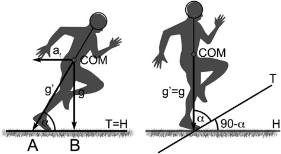
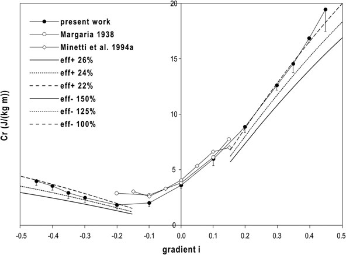
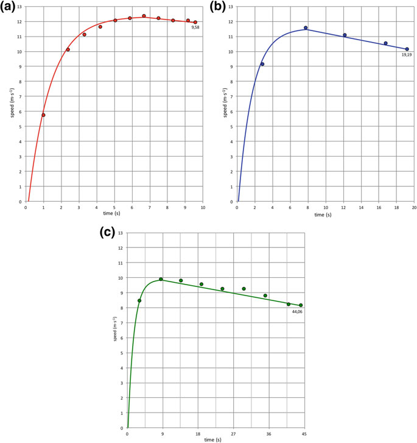
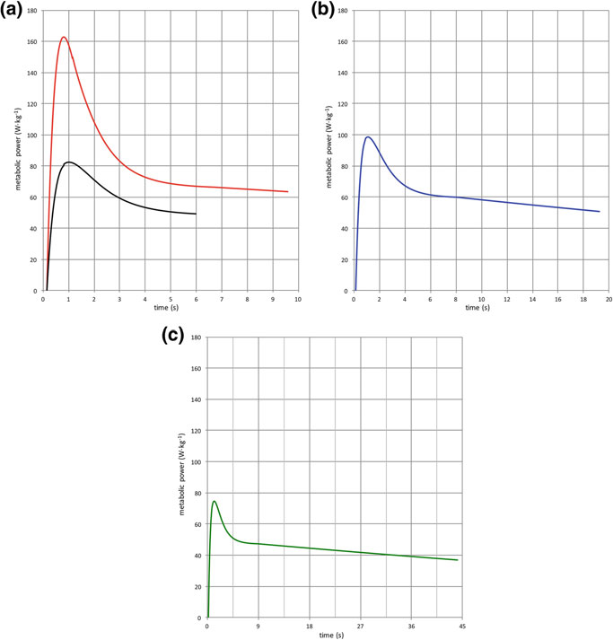
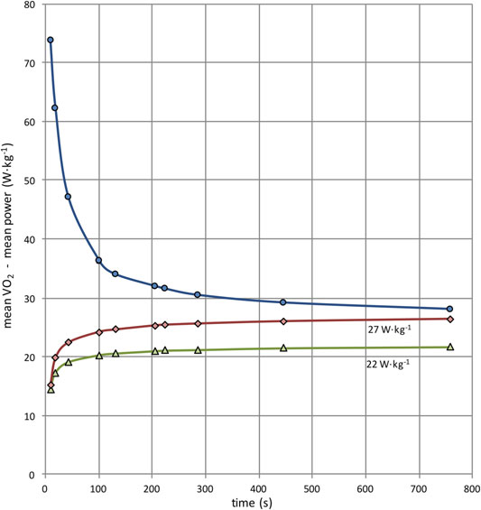
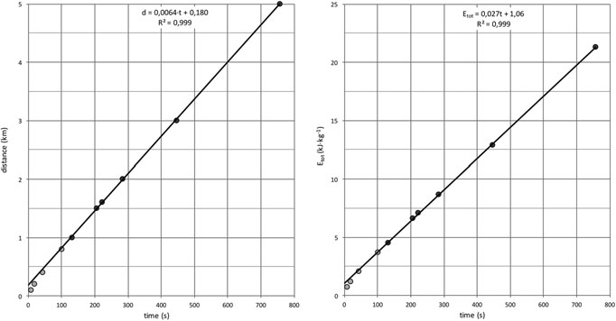
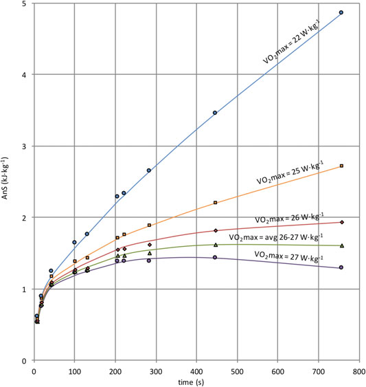
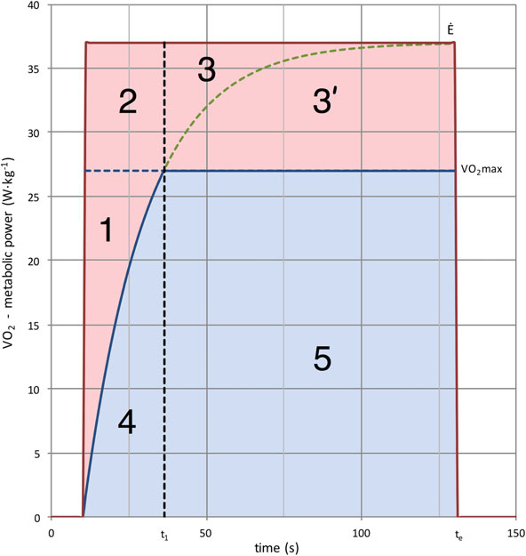

# 第12章：冲刺跑的能量消耗和能量平衡

短跑的能量消耗和当今世界的能量平衡

100米到5000米的记录

Pietro E. di Prampero 和 Cristian Osgnach 摘要：世界级运动员 100-400 m 顶级跑步表现期间代谢功率的时间过程是通过假设在平坦地形上加速跑步在生物力学上等同于匀速上坡跑步而估计的，坡度由向前加速度决定。 因此，由于上坡跑的能量消耗是已知的，只要确定了速度的时间进程，就可以获得加速跑的能量消耗和代谢功率。 目前的100和200 m世界纪录（9.58和19.19 s）以及400 m最高表现（44.06 s）期间的峰值代谢功率分别达到163、99和75 W kg−1。 目前世界纪录的跑步100-5000米期间的平均代谢功率和总能量消耗也估算如下。 加速阶段消耗的能量是根据机械动能（从平均速度获得）计算得出的，假设新陈代谢转化为机械能的效率为 25%，该能量被添加到恒速运行消耗的能量中（包括空气阻力）。 反过来，这被估计为：(3.8 + k′ v2) d，其中 3.8 J kg−1 m−1 是跑步机跑步的能量成本，k′ = 0.01 J s2 kg−1 m−3，v 是平均速度 (m s−1)，d (m) 是总距离。 随着距离从 100 米增加到 5000 米，平均代谢功率从 73.8 W kg−1 下降到 28.1 W kg−1。 对于三个较短的距离（100、200 和 400 m），这种方法产生的结果相当接近从上述更精细的分析中获得的平均代谢功率值。 对于 1000 至 5000 米的距离，总能量消耗随着相应的世界纪录时间线性增加。 假设回归的斜率和截距可产生当前世界纪录保持者的最大有氧功率和无氧储存的最大能量； 它们总计为 27 W kg−1（相当于静息状态下的最大 O2 消耗量为 77.5 ml O2 kg−1 min−1）和 1.6 kJ kg−1（76.5 ml O2 kg−1）。 最后一个值与完全利用可产生的最大能量处于同一数量级。

P. E. di Prampero (&) Department of Medical Sciences, University of Udine, 33100 Udine, Italy 电子邮件：pietro.prampero@uniud.it

C. Osgnach 运动科学系, Exelio srl, 33100 乌迪内, 意大利

活动肌肉中的磷酸肌酸和来自最大可耐受血乳酸积累的磷酸肌酸。 还对整个距离（100-5000 m）的无氧能量产量进行了估计，假设在工作开始时，氧气消耗率随着 20 秒的时间常数增加，趋于适当的代谢能力，但一旦达到最大氧气消耗就停止增加。 因此，总能量消耗可以分为有氧部分和无氧部分。 最后这个值从最短距离（100 m）的约 0.6 kJ kg−1 增加到接近上面估计的 1500 m 或更长距离的最大值（1.6 kJ kg−1）。

## 12.1

引言 自上世纪初以来，对世界纪录的分析一直让研究肌肉和运动生理学的科学家着迷（例如 Hill 1925），因为一方面，世界纪录代表了任何特定时间点的任何特定体育赛事中可能的最佳表现；另一方面， 另一方面，对世界纪录时间和速度的评估比任何可能的实验室测量准确几个数量级。 遵循这一历史悠久的传统，我们将在此对当前 100 至 5000 米跑步世界纪录进行积极分析。 所涉问题的必要先决条件是讨论最近开发的估算短跑能量成本的方法，这在处理较短距离时显然是至关重要的要求。 因此，本章的结构如下。 我们将首先描述 di Prampero 等人提出的模型。 （2005）其中，在平坦地形上加速/减速跑步在生物力学上被认为等同于匀速上坡/下坡跑步，坡度由前进加速度决定。 如果是这样，由于匀速上坡/下坡行驶的能量成本是相当清楚的，一旦确定了加速度，估计加速/减速行驶的能量成本就相当简单了。 这将使我们能够估计 100-400 m 距离的最佳跑步表现期间的峰值代谢功率和总体能量消耗。 然后，我们将讨论一个模型，该模型基于对比赛初始阶段加速跑步者身体所消耗能量的简化评估，来估计以当前世界纪录速度跑完 100-5000 m 所消耗的总能量。 我们将证明，对于三个较短的距离（100、200 和 400 m），其中由于整个比赛中速度的时间进程的可用性，可以应用上述更精细的分析，这两种方法对总体能量消耗和平均代谢能力产生相当接近的估计。 由此获得的 100 至 5000 m 距离内的总能量消耗将被绘制为相应世界纪录时间的函数。 对五个较长距离（1000-5000 m）获得的直线回归的斜率和截距将被解释为产生对

P. E. di Prampero 和 C. Osgnach

当前世界纪录保持者在这些距离上的最大有氧功率和最大无氧储存能量。 结果值为 27 W kg−1（对应于静息状态下的最大 O2 消耗量 77.5 ml O2 kg−1 min−1）和 1.6 kJ kg−1（76.5 ml O2 kg−1）。 公平地说，这种方法在概念上类似于 B. B. Lloyd 在 1966 年提出的评估最大有氧速度和以无氧能量为代价的最大距离的方法。 还将估计整个研究距离（100-5000 m）的无氧能量产量，假设在工作开始时，O2 消耗率随着 20 s 的时间常数增加，趋于适当的代谢能力，但一旦达到最大 O2 消耗就停止增加。 这将使我们能够估计从有氧源获得的能量总量，由于相应距离上消耗的总能量是已知的，因此很容易获得无氧源的能量产量； 它从最短距离 (100 m) 的约 0.6 kJ kg−1 增加到接近 1500 m 或更长距离（1 英里、2000、3000 和 5000 m）的上述估计值（1.6 kJ kg−1）的最大值。 因此可以得出结论，世界级运动员的无氧储备最大容量约为 1.6 kJ kg−1。 这与活动肌肉中磷酸肌酸的完全利用和最大可耐受血乳酸积累所产生的最大能量相一致。

## 12.2

冲刺跑的能量成本 直接测量冲刺跑期间的能量消耗是相当有问题的，因为大量利用无氧源，并且由于任何此类事件的持续时间短而阻碍了稳定状态的实现。 事实上，到目前为止，短跑跑的能量主要是根据假设的代谢能到机械能转化的总体效率，通过生物力学分析间接估计的（Cavagna et al. 1971; Fenn 1930a, b; Kersting 1998; Mero et al. 1992; Murase et al. 1976; Plamondon and Roy 1984），或者通过其他方法评估 (Arsac 2002; Arsac 和 Locatelli 2002; di Prampero 等人 1993; Summers 1997; van Ingen Schenau 等人 1991, 1994; Ward-Smith 和 Radford 2000)。 另一种方法是假设在平坦地形上的冲刺跑，在加速阶段在生物力学上相当于以恒定速度上坡跑，坡度由前进加速度决定，相反，在减速阶段，在生物力学上相当于下坡跑。 如果是这样的话，由于在相当大的坡度范围内匀速上坡（下坡）行驶的能量消耗是相当清楚的，所以一旦知道了加速度（减速度），估计加速（减速）行驶的能量消耗就相当简单了。 当前世界纪录的100至5000米能量平衡

## 12.3

理论 上述类比背后的理论在图 12.1 中以图形方式进行了总结，来自 di Prampero 等人的原始论文。 （2005）； di Prampero 等人最近对其进行了审查。 （2015）并简要概述如下，有兴趣的读者可以参考原始论文。 图 12.1（左图）显示，在平坦地形上加速的跑步者必须向前倾斜，使得他/她的平均身体轴线与地形之间的角度 a 越小，向前加速度 (af) 越大。 这种情况类似于以恒定速度跑上坡，前提是平均身体轴线与地形之间的角度 a 不变（图 12.1，右图）。 由此必然得出 a 的余数，即地形与水平面之间的角度 (90 a)，随着 af 的增加而增加。 地形的倾斜度一般用地形与水平面夹角（90°）的正切来表示。 如图 12.1（左图）所示，这是线段 AB 与重力加速度 (g) 的比率： $tan(90 a) = AB$ =g ð12:1Þ 反过来，由于线段 AB 的长度等于 af，方程 12.1 表示线段 AB 与重力加速度 (g) 的比值： (12.1) 可以重写为： $tan(90 a) = af$ =g ¼ ES ð12:2Þ 其中 ES 是角度的正切，使加速跑步（图 12.1，左图）在生物力学上等效于以恒定速度跑上相应的斜坡（图 12.1，右图），因此定义了等效坡度（ES）。 图12.1 受试者在平坦地形上跑步（左）或匀速上坡跑步（右）时加速向前。 COM，主体的质心； af，前进加速度； g，重力加速度； $g0 = p(a2 f + g2)$ ，af 加 g 的矢量和； T，地形； H，水平； a，跑步者在整个步幅中的平均身体轴线与 T 之间的角度； 90 a，T 和 H 之间的角度。详情请参阅文字

P. E. di Prampero 和 C. Osgnach

对图12.1的观察还表明，除了等同于上坡跑之外，加速跑与匀速跑相比还有另一个不同之处。 事实上，跑步者必须产生的力量（整个步幅的平均），由体重和加速度的乘积给出，在前一种情况下（= M g'）比后一种情况（= M g'）更大，因为 g' > g（图 12.1，左图）。 因此，加速跑步等同于上坡跑步，然而，其中体重与比率g'/g成正比地增加。 由于 g0 ¼ pða2 f × g2Þ，该比率（此处将被定义为“等效体重”（EM））描述为：

EM ¼ M g0= $M g = p(a2 f + g2)$ =g ¼ p½ða2 f =

$$ g2) + 1 \quad (12.3) $$

代入方程： （12.2）代入等式。 (12.3)，可得：

EM ¼ p½ða2 f =

$$ g2) + 1 = p(ES2 + 1) \quad (12.4) $$

还必须指出的是，在减速运行期间，相当于下坡运行，在这种情况下，等效斜率（ES）为负，但 EM 仍将呈现正值，因为等式（1）中的 ES 为正值。 将(12.4)式求2次方。可以得出，如果确定加减速运行时速度的时间过程，并计算出相应的瞬时加减速度，则可得： (12.2)和(12.4)可以得到合适的ES和EM值，从而将加速/减速运行转化为等效的恒速上坡/下坡运行。 因此，如果最后的能量成本也已知，则可以很容易地获得相应的加速/减速运行的能量成本。 自十九世纪下半叶以来，人们对匀速跑步、平地、上坡或下坡的能量学进行了广泛的研究（参考文献参见 Margaria 1938；di Prampero 1986）。 米内蒂等人。 (2002) 确定了迄今为止研究的最大范围的坡度（至少据我们所知）以恒定速度跑步的能量成本：从 -0.45 到 +0.45，并表明在整个坡度范围内，每单位体重和距离 (Cr) 跑步的能量成本与速度无关，并由以下多项式方程描述（图 12.2）： $Cr = 155:4 i5 30:4 i4 43:3 i3$ × 46:3 i2 × 19:5 i × 3:6 ð12:5Þ 其中 Cr 的单位为 J kg−1 m−1，i 为地形的坡度，即地形与水平面夹角的正切，最后一项 (3.6 J kg−1 m−1) 为在紧凑平坦地形上等速运行的能量消耗。 因此，用等效斜率（ES）代替i，将C0表示匀速水平跑步的能量消耗，并乘以等效体重（EM），式（1） (12.5) 可改写为： 当前世界纪录100至5000 m的能量平衡

图 12.2 匀速行驶的能量消耗 Cr (J kg−1 m−1)，作为地形坡度 (i) 的函数。 插值全点的函数由等式描述。 （12.5）。 从原点辐射的直线表示抵抗重力的净效率，其值如插图所示。 空心点和菱形是以前研究的数据（来自 Minetti 等人，2002） $Cr = (155:4 ES5 30:4 ES4 43:3 ES3$ × 46:3 ES2 × 19:5 ES ×

$$ C0) EM \quad (12.6) $$

方程（12.6）允许人们估计加速运行的能量成本，前提是瞬时速度、相应的加速度值、 因此 ES 和 EM 是已知的。 严格来说，C0 的个体值也应该是已知的； 然而，鉴于其个体间差异相对较小（Lacour 和 Bourdin 2015），利用文献中的平均值通常很方便，事实上它不太可能对最终结果产生太大影响。 该方法最初由 di Prampero 等人提出。 (2005) 并应用于 12 名中等水平短跑运动员 [100 m 以上最佳成绩时间: 11.30 s (±0.35, SD)]。 然后它被 Osgnach 等人利用。 （2010）确定精英足球运动员在正式比赛期间的代谢功率和能量消耗，最近扩展到评估 Usain Bolt 的 100 m 世界纪录表现（9.58 秒，柏林，2009）（di Prampero 等人，2015）。 在这些研究中，跑步的能量成本是通过等式获得的。 （12.6），由此获得代谢能力，由 Cr 和速度的乘积给出。 然而，应该指出的是，方程。 （12.6）仅适用于 Minetti 等人实际研究的倾斜范围内。 （2002）。 事实上，只要计算出的 ES 远离方程所基于的最大 (+0.45) 或最小 (−0.45) 斜率，获得的 Cr 值就会变得不合理地高，甚至

P. E. di Prampero 和 C. Osgnach

负（在大下坡的情况下）。 这种情况不太可能对中等水平短跑运动员或足球运动员获得的数据产生太大影响，在这种情况下，ES 的最大值很少超过 0.50，即使超过 0.50，相应的持续时间也大大小于 1 秒。 然而，就博尔特的 100 m 记录而言，比赛一开始就达到的 ES 最大值约为 0.85，即使它在第一秒内达到了标准值（di Prampero 等人，2015），正如论文中指出的那样，它也会导致 Cr 和最大代谢能力的值高得惊人。 考虑到这些因素，接下来的部分的目的是使用更保守的方法，重新计算中等水平短跑运动员和尤塞恩·博尔特在 100 m 短跑中的 Cr 值和代谢功率值，但仍然基于 Minetti 等人获得的数据。 (2002) 匀速上坡行驶时。 具体来说，等式。 只要计算出的 ES 位于方程所依据的倾斜范围内 (−0.45 ES +0.45)，则 (12.6) 将用于估计 Cr； 对于 ES > 0.45 Cr，将根据以下等式进行估算：

$$ Cr = (55:65 ES 5:61) EM \quad (12.7) $$

反过来，该方程描述了 Cr 的切线与图 12.2 中报告的斜率数据（i = +0.45）。 同样的方法也将用于计算尤塞恩·博尔特 (Usain Bolt) 的 200 m 世界纪录（19.19 秒，柏林，2009 年）和 L. S. Merritt（44.06 秒）在 2009 年柏林国际田联世界锦标赛上的 400 m 最高成绩的代谢功率的时间过程。

## 12.4

方法 在所有情况下，假设速度在加速阶段呈指数增加，如下所示： $v(t) = v(f ) (1 e t$ =sÞ ð12:8Þ 其中 v(t) 是时间 t 时的速度，v(f) 是峰值速度，s 是适当的时间常数，表 12.1 中报告了其值以及相应的 v(f)。 反过来，表 12.1 中报告的 100 m（MLS 和 U. Bolt）的 s 值是通过对雷达系统获得的速度数据进行插值计算得出的（di Prampero 等人，2005 年；Hernandez Gomez 等人，2013 年）。 对于 200 和 400 m（U. Bolt 和 L. S. Merritt），用于估计 s 的速度值是 Graubner 和 Nixdorf（2011）在 50 m 间隔内报告的速度值，直到达到最高速度。 速度值，根据方程式计算得出。 （12.8）和表 12.1，在图 12.3 中报告了博尔特和梅里特的性能，以及实际测量的性能。 当前世界纪录的100至5000米能量平衡

表 12.1 报告了 U. Bolt 的 100 和 200 m 当前世界纪录、L. S. Merritt 的 400 m 最高成绩（44.04 s，柏林，2009 年）和 12 名中级短跑运动员（MLS）（最佳时间 100 m = 11.30 秒 ± 0.30)

距离（米）

运动员 s (s) v(f) (m s−1)

MLS

## 1.42

## 9.46

螺栓

## 1.25

## 12.35

螺栓

## 1.60

## 11.57

梅里特

## 1.51

9.88 图 12.3 U. Bolt 创造的 100 和 200 m 世界纪录（A 和 B 组）以及 L. S. Merritt 创造的 400 m 最高成绩（C 组）（柏林，2009 年）期间速度的时间进程，根据公式 12.8 计算得出。 (12.8) 根据表 12.1 中报告的 s 和 v(f) 值（实线）。 全点：实际测量的速度。 达到 v(f) 后，对实际速度数据进行线性插值。

有关详细信息和参考文献，请参阅文本

P. E. di Prampero 和 C. Osgnach

然后从方程式的一阶导数获得加速度的时间过程。 (12.8) $: a(t) = (v(f ) v(t))$ =s ¼ ½ $v(f ) v(f ) (1 e t$ =sÞ =s ð12:9Þ 其中 a(t) 是时间 t 时的加速度，所有其他项已在上面定义。 方程（12.8）和（12.9）使我们能够估计运行的能量成本[如方程1所示]。 （12.6）和（12.7）]，以及加速阶段的瞬时代谢功率（由能量成本和速度的乘积给出）。 在 200 和 400 m 表现的情况下，对于大于对应峰值速度的倍数，假设跑步的能量成本等于 C0，即，在后一种情况以及方程 1 中。 （12.6），假设为 3.8 J kg−1 m−1。 在所有情况下，如此获得的 Cr 值都针对空气阻力消耗的能量（每单位体重和距离，J kg−1 m−1）进行了校正，如下所示：0.01 v(t)2，其中 v(t) 以 m s−1 表示（Pugh 1970；di Prampero 1986）。

## 12.5

代谢功率和总体能量消耗 图 12.4 报告了 Bolt（100 和 200 m）当前世界纪录和 Merritt 400 m 最高成绩的代谢功率时间过程，以及根据 di Prampero 等人的数据估计的中级短跑运动员（MLS）超过 100 m 的平均值。 （2005）。 图 12.4 中报告的如此获得的代谢功率的时间积分使我们能够估计覆盖所讨论距离的总能量消耗（包括空气阻力）以及相应的平均功率； 表 12.2 中报告了它们以及峰值功率值。 表 12.2 中报告的 U. Bolt 100 m 世界纪录的峰值代谢功率基本上等于 Beneke 和 Taylor (2010) 以及 di Prampero 等人为 Bolt 本人计算的值。 (2005) C. Lewis 在 1988 年首尔奥运会上以 9.92 秒的成绩获得相同距离金牌。 然而，它远低于 di Prampero 等人之前研究中估计的值。 (2015) 总计 197 W kg−1。 事实上，最后一个值是根据 Minetti 等人的多项式方程获得的。 （12.6），正如论文本身和上面简要讨论的那样，高估了等效坡度（ES）大于 0.5 时加速跑步的能量成本，而在本研究中，当 ES > 0.45 时，跑步的能量成本是通过等式（12.6）获得的。 （12.7）。 值得注意的是，中等水平短跑运动员在 100 m 冲刺开始时的峰值功率约为博尔特值的 50%（见图 12.4），而相同距离的平均表现时间为 11.3 秒，相当于平均速度仅比博尔特的记录慢约 15%。 这凸显了这样一个事实，即短距离的最佳表现需要在跑步的初始阶段有很大的加速度，这是实现这一壮举的先决条件，此外还有适当的人体测量和生物力学特征（Charles 和 Bejan 2009；Maćkała 和《当前世界纪录从 100 到 5000 米的能量平衡》）

图 12.4 U. Bolt 创造的 100 和 200 m 世界纪录（图 a 和 b）以及 L. S. Merritt 创造的 400 m 最高成绩（图 c）期间代谢功率的时间过程。 a 图中下方的曲线是 12 名中等水平短跑运动员在 100 m 短跑的前 6 秒内代谢功率的平均时间过程。 详细信息和参考文献请参阅文本 Mero 2013； Taylor 和 Beneke 2012），即在尽可能短的时间内产生非常大的代谢功率输出的能力。 表 12.2 中报告的估计总能量消耗和平均代谢功率值的程序需要了解速度的时间过程，从而了解加速度的时间过程。 这些数据并不总是可用，也不容易获得。 因此，接下来的段落致力于使用仅基于平均速度的替代方法，正如 di Prampero 等人最初提出的那样。 (1993)（另见 Hautier 等人，2010 年；Rittweger 等人，2009 年）。 将表明，这种方法产生的总能量消耗和平均代谢功率值相当接近基于上述更严格程序的估计值（对于 100-400 m 距离）。

P. E. di Prampero 和 C. Osgnach

表 12.2 总能量消耗（Etot*，kJ kg−1）、峰值和平均代谢功率（Pmet、W kg−1 或 ml O2 kg−1 min−1 在以（或接近）世界纪录速度行驶的指定距离上，从图 12.4 中报告的代谢功率曲线的时间积分获得）

距离（米）

时间（秒）

运动员

Etot* (kJ kg−1)

代谢力a

平均的

峰值 (W kg−1) (ml O2 kg−1 min−1) (W kg−1) (ml O2 kg−1 min−1)

## 9.58

螺栓

## 0.757

## 79.0

## 226.8

## 163.0

## 467.9

## 19.19

螺栓

## 1.143

## 59.6

## 171.1

## 99.9

## 286.8

## 44.06

梅里特

## 1.885

## 43.6

## 125.2

## 74.9

215.0 a高于静止高度 100 至 5000 m 的当前世界纪录的能量平衡

假设加速阶段消耗的额外能量 (Eacc)（超过恒速运行的能量）由下式描述： $Eacc = M v2 Mean$ =ð2 gÞ ð12:10Þ 其中 M 是受试者的体重，v 表示平均速度，g 是将代谢能转化为机械能的效率。 因此，表达每单位体重的 Eacc 并假设 g 1/4 0:25（Cavagna 和 Kaneko 1977；Cavagna 等人 1971），方程： (12.10) 可以重写为：

Eacc=M 1/4 v2 平均值=0:5 1/

$$ 4 Eaccsp \quad (12.11) $$

如果是这样，则每单位体重从静止开始走完任何给定距离 (d) 所消耗的总能量由下式给出： $Etot = (C0 + k0v2$ 平均值 $) d + Eaccsp = (C0 + k0v2$ 平均值Þ d þ v2 平均值=0:5 ð12:12Þ 所示为 C0 = 3.8 (J kg−1 m−1) 和 k′ = 0.01 (J s2 kg−1 m−3) 时如此获得的值（高于静止值） 在表 12.3 中，其中最后一列报告了获得的 Etot 值，替换了方程最后一项中的 Etot 值。 (12.12)，峰值速度平均值 (vpeak)： $Etot = (C0 + k0v2$ 平均值 $) d + Eaccsp = (C0 + k0v2$ 平均值Þ d þ v2 峰值=0:5 ð12:120Þ 表 12.3 显示，从代谢功率曲线的时间积分获得的 Etot 值与通过上述简化程序估算的 100-400 m 范围内的 Etot 值之间的比率为 如果 Etot 根据平均速度计算（方程 12.12），则为 1.07 至 0.93；如果根据峰值速度计算（方程 12.12'），则为 0.89 至 0.99。 鉴于平均速度很容易获得，而峰值速度并不总是如此，我们将使用式（1）描述的简化过程。 (12.12) 估计当前世界纪录在 100 至 5000 m 距离内消耗的总能量以及平均代谢功率需求； 表 12.4 中报告了它们。 表 12.3 从表 12.2 (Etot*) 开始，在以（或接近）当前世界纪录速度跑步的指定距离上的总能量消耗（Etot，kJ kg−1）与通过文本 [Etot°，如公式 12] 中描述的简化程序获得的相应值一起显示。 （12.12）； Etot^，如方程式所示。 (12.12′)]

距离（米）

运动员

Etot* (kJ kg−1)

Etot° (kJ kg−1)

Etot^ (方程 12.12′) (kJ kg−1)

螺栓

## 0.757

## 0.707

## 0.794

螺栓

## 1.143

## 1.195

## 1.246

梅里特

## 1.885

## 2.035

2.059 *代谢功率的时间积分； ° 来自方程式 （12.12）； ^ 来自等式。 (12.12′)

P. E. di Prampero 和 C. Osgnach

## 12.6

有氧与无氧能量消耗 表 12.4 的最后两列报告了整个比赛的平均值 _VO2，计算方法如其他地方详细描述（di Prampero 等人，2015）。 这里只要说一下，假设比赛开始时的 _VO2 以 20 秒的时间常数呈指数增加，趋于平均功率需求，一旦达到 _VO2max 就不再增加（Margaria 等人，1965）。 这个过程使我们能够估计整个比赛中任何给定 _VO2max 值的平均 _VO2（参见表 12.4 和图 12.5）。 代谢功率平均值与_VO2 平均值之间的差异必须由无氧储存来满足，因此可以从该差异与比赛时间的乘积中轻松获得其总体能量贡献； 图 12.6 中报告了两个选定的 _VO2max 值 22 和 27 W kg−1。 整个 100-400 m 世界纪录的平均 _VO2 也按照上述方法计算，但用实际时间过程代替平均代谢功率，如图 12.4 所示。 因此，对于这三个距离，无氧储存对总能量需求的贡献也可以根据代谢功率的时间积分与估计_VO2曲线之间的差异来计算； 它们与通过前面段落中描述的简化程序获得的结果没有本质上的不同。 图 12.6 显示无氧对总能量需求的贡献，对于 _VO2max 约为 26–27 W kg−1 (74.6–77.5 ml O2 kg−1 min−1) 表 12.4 总能量消耗（Etot，kJ kg−1），根据简化程序（公式 12.12）针对当前世界纪录（WR）时间内所覆盖的指定距离获得 (s) 与相应的平均代谢功率 (Pmet, W kg−1) 一起报告

距离（米）

Etot (kJ kg−1)

写入时间（秒）

平均功率 (W kg−1)

平均_VO2(W kg−1)

对于 _VO2max 22 W kg−1*

对于 _VO2max 27 W kg−1**

## 0.707

## 9.58

## 73.8

## 14.5

## 15.1

## 1.195

## 19.19

## 62.2

## 17.3

## 19.8

## 2.035

## 43.18

## 47.1

## 19.1

## 22.4

## 3.669

## 100.91

## 36.3

## 20.3

## 24.2

## 4.489

## 131.96

## 34.0

## 20.6

## 24.6

## 6.599

## 206.00

## 32.0

## 21.0

## 25.3 1 英里

## 7.057

## 223.13

## 31.6

## 21.1

## 25.4

## 8.685

## 284.79

## 30.5

## 21.2

## 25.6

## 12.883

## 446.67

## 29.2

## 21.5

## 26.0

## 21.266

## 757.35

## 28.1

## 21.7

26.4 最后两列是高于静息状态的平均 O2 消耗量 (W kg−1)，如文本中所述估计的 _VO2max 值 *63.2 ml O2 kg−1 min−1 高于静息状态； ** 77.5 ml O2 kg−1 min−1 高于静息状态。 1 英里 = 1609.35 m 当前世界纪录的 100 至 5000 m 的能量平衡

图 12.5 100-5000 米距离内的平均代谢功率（平均功率，W kg−1）与当前世界纪录时间（秒）的关系（蓝线和点）。 菱形和红线、三角形和绿线是按照文中所述计算的平均值 _VO2，其中 _VO2 最大值为 27（红线和菱形）或 22（绿线和三角形）W kg−1。 另请参见表 12.4（在线彩色图）（上面的静止状态）趋向于约 1.6 kJ kg−1 的平台，而对于较小的 _VO2max 值，它会持续增加而不会达到渐近线。 这表明，在 100 至 5000 m 距离比赛中，世界级男性跑步运动员的无氧储备最大容量约为 1.6 kJ kg−1（76.5 ml O2 kg−1）。 无氧储存的最大容量（AnSmax）也可以通过不同的方法进行评估，基本上等于劳埃德（1966）提出的估计跑步世界纪录的“最大有氧速度”和“无氧距离”的方法。 事实上，劳埃德提议将所覆盖的距离绘制为世界纪录时间的函数，并表明，对于大于 1000 米的距离，回归变成一条在 y 轴上具有正截距的直线（图 12.7，左图）。 因此，他建议，由此获得的直线的斜率得出有氧速度，即仅基于 _VO2max 维持的速度，而回归的 y 截距代表以无氧储存为代价所覆盖的距离。 需要指出的是，只有当直线斜率计算在使_VO2max在整个比赛过程中达到并保持在100%水平的距离范围内时，劳埃德的解释才是正确的，即对于世界级运动员来说，在1000至5000米（131.96-757.35秒）之间。

P. E. di Prampero 和 C. Osgnach

劳埃德方法可以应用于总体能量消耗，如上面计算的那样（见表 12.4），而不是应用于所覆盖的距离。 同样在这种情况下，对于 1000 到 5000 m 之间的距离，回归变为 y 轴上具有正截距的直线（图 12.7，右图），如下所述：

$$ Etot = 1:06 + 0:027 t Etot \quad (12.13) $$

单位为 kJ kg−1，t 单位为 s。 按照 Lloyd 提出的思路，该回归的斜率可以解释为参加这些赛事的运动员的平均 _VO2max，相当于 27 W kg−1，而其 y 截距是无氧储存能力的指数，如下文详细讨论。 超最大努力消耗的总能量 (Etot) 是有氧和无氧储存的能量之和，如下所示： Etot ¼ AnS þ _VO2max te _VO2max ð1 e te=sÞ s ð12:14Þ 其中 te 是力竭所需的时间，s 是工作开始时 _VO2 动力学的时间常数（Scherrer 和 莫诺 1960；威尔基 1980）。 方程的第三项。 (12.14) 图 12.6 无氧对总能量需求的贡献 (AnS, kJ kg−1) 作为 100-5000 m 距离内当前世界纪录时间 (s) 的函数，按照文本中描述的 _VO2max 指示值进行计算 当前世界纪录从 100 到 5000 m 的能量平衡

考虑到 _VO2max 并不是在锻炼一开始就达到的事实，而是按照时间常数 s 的指数函数达到的。 因此，为了产生正确的有氧能量，_VO2max te 的量必须相应减少。 如果到力竭的努力持续时间包含在完全利用无氧储存所需的最低限度（高能磷酸盐分解和乳酸积累）和允许 _VO2max 在整个努力持续时间（50 秒 15 分钟）内保持在 100% 水平的最大值之间（Wilkie 1980；di Prampero 等人 1993；di Prampero 2003）。 如果情况确实如此，则可以安全地将 AnS 和 _VO2max 假定为常数和最大值。 此外，由于 s 20 s（di Prampero et al. 1993；di Prampero 2003），如果 te 大于约 100 s，则量 e te=s 变得非常小； 因此，在这些条件下，方程的第三项也成立。 (12.14) 变为常数 ð _VO2 max sÞ。 因此，重新排列方程。 (12.14): Etot ¼ ½AnSmax _VO2max s þ _VO2max te ¼ 常量 þ _

$$ VO2max te \quad (12.15) $$

图 12.7 右图的回归是针对 1000 至 5000 m 距离内的世界纪录时间计算的，即在上述时间范围内 (131.96–757.35) s）。 如果还做出额外的简化假设：（1）参加这些距离比赛的世界级运动员的特征是图 12.7 距离（km，左图）和总能量消耗（kJ kg−1，右图）作为跑步（100-5000 m）中相应世界纪录时间（s）的函数。 从 1000 米到 5000 米计算并在图中报告的回归表明，对于世界级运动员： a 最大有氧速度为 6.4 m s−1 (23.04 km h−1)； b 高于静息时的最大有氧功率 27 W kg−1 (77.5 ml O2 kg−1 min−1)。 下图回归的 y 轴截距（1.06 kJ kg−1）允许人们估计这些运动员的最大无氧能力。 详情请见文字

P. E. di Prampero 和 C. Osgnach

等于 _VO2max 和 (2) 世界纪录时间可以用 te 来确定，从方程式 1 中。 (12.13) 至 (12.15): ½AnSmax _

$$ VO2max s = 1:06 \quad (12.16) $$

因此，设置 _VO2max = 0.027 (kW kg−1) 和 s ¼ 20 s，可得到：

$$ AnSmax = 1:06 + 0:027 20 = 1:6(kJ kg 1) \quad (12.17) $$

该值惊人地接近图 12.6 中估计的 _VO2max 为 26–27 W kg−1.1 的值 这些考虑因素不能应用于较短的距离，因为： (i) 图 12.7（右图）中的相应点往往会下降 低于 1000 至 5000 m 之间计算的回归值，并且 (ii) 不能合理地假设这些运动员的 _VO2max 等于参加较长距离比赛的运动员的 _VO2max。 它们也不能应用于更长的距离，在这种情况下，不能安全地假设 _VO2max 在整个比赛期间保持在 100% 的水平。 事实上，在 5000 米到 10,000 米之间计算的距离和记录时间之间的回归斜率下降到 6.09 m s−1，对于 10,000 米和马拉松比赛之间的距离，下降到 5.61 m s−1。 相应的 _VO2 值（对于 C0 = 3.8 J kg−1 m−1）和 k′ = 0.01 (J s2 kg−1 m−3) 变为 25.4 和 23.1 W kg−1，与 6.34 m s−1 的“最大有氧速度”和 27 W kg−1 的 _VO2（假定产生 _VO2max）的距离进行比较 1000 至 5000 m 之间，图 12.7。 对于两个 _VO2max 值（22 和 27 W kg−1）的当前世界记录时间，在 100 至 5000 m 之间的所有距离上估算了来自厌氧源 (FAnS) 的总能量消耗（Etot，见表 12.4）的比例。 如上所述，在所有情况下，都假设在比赛开始时，_VO2 以 20 秒的时间常数增加，趋向于适当的平均值 1 AnS 的估计，如方程式 1 所示。 方程（12.14）基于一个简化的假设，即方波超最大运动开始时的_VO2动力学（在所讨论的距离上创造世界纪录的表现必然是这种情况）随着时间常数s（20秒）向_VO2max呈指数增加。 然而，更现实的假设是，在工作开始时，_VO2 以相同的时间常数呈指数增加，达到代谢功率需求 (Ė)，但一旦达到 _VO2max，则突然停止增加（Margaria 等人，1965）。 如果是这种情况，则根据附录（公式 12.32）中的第一原则得出的更严格的 AnS 估计方法如下： AnS ¼ ð _E _VO2maxÞ te þ _VO2max s ½ ln(1 _VO2max= _E) s ð _E _

$$ VO2max) AnS \quad (12.32) $$

值计算 该方程的基础与图 12.6 中报告的方程相差不远； 对于 1000 至 5000 m 的世界纪录表现，假设 _VO2max = 27 W kg−1，它们平均为 1.35 kJ kg−1（范围：1.28–1.41），与 1.6 kJ kg−1 的值进行比较，根据公式 1 计算得出。 （12.14）和（12.17）。 因此，根据这种方法，厌氧菌库的最大容量将比上述估计值低约 15%。 当前世界纪录的100至5000米能量平衡

功率要求（见表 12.4），但一旦达到 _VO2max 就停止增加。 表 12.5 中报告了 FAnS 以及达到 _VO2max 的时间。 如此表所示，代谢功率要求越高，该长度越短；对于给定的代谢功率，_VO2max 越高，该长度越长。 应该指出的是，对于 1000 m 的距离，可以合理地假设 _VO2max 等于 27 W kg−1，而对于较短的距离，针对两个较小的 _VO2max 值 (22 W kg−1) 估计的 FAnS 值可能更接近“真相”。

## 12.7

讨论 本章前面的部分专门分析了当前 100 至 5000 m 距离跑步世界纪录的能量学。 这是沿着两条不同的路线进行的，如下所示。 对于三个较短距离（100、200 和 400 m），代谢功率的时间过程根据 di Prampero 等人提出的模型进行估计。 （2005）其中，在平坦地形上加速跑步被认为类似于以恒定速度上坡跑步，地形的倾斜度由前进加速度决定。 如此获得的代谢功率曲线的时间积分使我们能够评估走完所讨论的距离所消耗的总能量。 只有在整个跑步过程中速度的时间进程已知的情况下才能执行此方法，因此它不能应用于超过 400 m 的距离，在这种情况下这些数据不可用。 事实上，即使在 400 m 的情况下，速度数据 表 12.5 对于两个指示的 _VO2max 值，在当前世界纪录时间 (s) 内覆盖的 100-5000 m 距离中，来自无氧源 (FAnS) 的总能量的比例

距离（米）

对于 _VO2max 22 W kg−1*

对于 _VO2max 27 W kg−1** t @ _VO2max (s)

FAnS t @ _VO2max (s)

范斯

## 7.1

## 0.803

## 9.1

## 0.795

## 8.7

## 0.722

## 11.4

## 0.681

## 12.6

## 0.597

## 17.1

## 0.527

## 18.6

## 0.441

## 27.2

## 0.333

## 20.8

## 0.394

## 31.5

## 0.276

## 23.3

## 0.344

## 37.3

## 0.209 1 英里

## 24.0

## 0.332

## 38.5

## 0.196

## 25.5

## 0.305

## 43.2

## 0.161

## 28.0

## 0.264

## 52.0

## 0.110

## 30.5

## 0.228

## 64.7

0.060 还报告达到适当 _VO2max (t @ _VO2max) 所需的时间 (s)。 无氧对总能量需求的贡献的绝对值报告在

图 12.6 *63.2 ml O2 kg−1 min−1 高于静息状态； ** 77.5 ml O2 kg−1 min−1 高于静息状态。 1 英里 = 1609.35 m

P. E. di Prampero 和 C. Osgnach

仅在离散的 50 m 间隔内可用，从而削弱了代谢功率曲线的时间分辨率。 因此，对于较长的距离（800-5000 m），采用了不同的方法，[参见第 1 节]。 12.5 和等式。 （12.12）和（12.12'）]。 在考虑加速阶段消耗的总体能量的同时，我们无法估计整个比赛中代谢功率的时间进程，而只能估计其平均值。 即便如此，当将此简化程序应用于 100-400 m 距离时，所得的总能量消耗结果相当接近（至少对于 200 和 400 m 距离）根据代谢功率时间过程的时间积分估计的能量消耗（参见表 12.3）。 然后估计无氧对总能量消耗的贡献如下。 正如其他地方详细描述的那样（di Prampero 等人，2015 年），假设跑步开始时的 O2 消耗率随着时间常数 20 秒呈指数增加，趋向于代谢功率需求，但一旦达到 _VO2max，就会突然停止（Margaria 等人，1965 年）。 反过来，对于 1000 到 5000 m 之间的距离，假设比静止状态高 27 W kg−1（见图 12.7）。 然而，对于较短的距离，这个假设似乎不合理。 因此，在工作开始时的 _VO2 速率也是针对较小的 _VO2max 值 (22 W kg−1) 进行估计的。 然后从总能量消耗中减去如此获得的 _VO2 动力学的时间积分，以估计所讨论距离上的总体无氧产量，以获得适当的代谢功率和 _VO2max 值。 表 12.5 报告了所调查的世界记录占总能源消耗的比例。 如图 12.6 所示，世界级运动员在 1000 至 5000 m 距离比赛中的无氧储备最大容量，假设 _VO2max 为 26-27 W kg−1，结果约为 1.6 kJ kg−1。 无氧储备的最大容量也根据不同的方法进行评估，基本上等于劳埃德（1966）提出的估计跑步世界纪录的“最大有氧速度”和“无氧距离”的方法。 简而言之，100 至 5000 m 距离内的总能量消耗已绘制为当前世界纪录时间的函数（见表 12.4）。 对于 1000 到 5000 米之间的距离，所得回归结果是线性的（图 12.7），其斜率产生了当前世界纪录保持者在这些距离上的平均最大有氧功率，相当于静息状态下的 27 W kg−1 (77.5 ml O2 kg−1 min−1)。 反过来，同一回归的 y 截距使我们能够估计无氧储存的最大容量，对于 27 W kg−1 的 _VO2max，结果为 1.6 kJ kg−1，基本上等于图 12.6 中 _VO2max 约为 26-27 W kg−1 的运动员的数据估计的值。 因此可以得出结论，对于高水平的世界级运动员，无氧储存的最大容量确实约为1.6 kJ kg−1（76.5 ml O2 kg−1）。 当前世界纪录的100至5000米能量平衡

这与下面的考虑是一致的。 (i) 无氧储存能力是从高能磷酸盐（ATP + 磷酸肌酸（PCr））分解和乳酸（La）积累中获得的最大能量之和。 (ii) 当以世界纪录速度参加相关距离比赛时，世界级运动员最大限度地锻炼肌肉占体重的 20-25%。 (iii) 在静息肌肉中，ATP 和 PCr 浓度分别达到约 6 和 20 m-mol kg−1 新鲜组织（例如，参见 Francescato 等人，2003 年、2008 年），并且由于 (iv) ATP 不能大幅下降，而不极大地影响肌肉力量的产生（di Prampero 和 Piiper 2003），因此从休息到力竭仅可利用约 20 m-mol kg−1 的 PCr， 即 4–5 m-mol PCr kg−1 体重（参见上面第 ii 点）。 (v) 因此，假设 P/O2 比率为 6（mol/mol），在从休息到疲惫的过渡过程中，由于 PCr 的分裂而“节省”的 O2 量相当于 0.67–0.83 m-mol O2 kg−1 体重。 (vi) 进一步假设能量当量为 20.9 J ml−1 O2，并且由于 1 m-mol O2 = 22.4 ml，PCr 分裂产生的最大能量可估计在 0.31–0.39 kJ kg−1 体重范围内。 (vii) 在 400 m 距离上以最大速度比赛结束时达到的最大血液 La 浓度比静息状态高 15-20 mM 左右（Arcelli 等人，2014 年；Hanon 等人，1994 年；Hautier 等人，2010 年）； (viii) 积累 1 mM La 产生的能量相当于消耗约 3 ml O2 kg−1 体重（di Prampero 1981；di Prampero 和 Ferretti 1999），基于 20.9 J ml−1 的 O2 能量当量，这对应于 La 积累释放的最大能量为 0.94–1.25 kJ kg−1。 因此，无氧储存的最大容量（由 PCr 分解和 La 积累获得的最大能量给出）可估计在 1.25 (0.31 + 0.94) 至 1.64 (0.39 + 1.25) kJ kg−1 体重范围内，该值相当接近如上所述计算的值（见图 12.6 和 12.7）。

## 12.8

方法批判 上述世界记录能量分析的两个程序基于几个已在别处讨论过的简化假设（di Prampero 等人，1993、2005、2015 和 Rittweger 等人，2009），简要总结如下，感兴趣的读者可参考原始论文。 基于平坦地形上的加速跑和匀速上坡跑之间的类比（见图 12.1），对三个较短距离中代谢功率的时间过程的评估需要遵循以下内容。 (i) 跑步者的整体质量集中在他/她的质心。 这必然意味着步幅频率，以及由于内部工作表现（用于移动上部和下部）的能量消耗

P. E. di Prampero 和 C. Osgnach

在加速跑步期间和在相同等效坡度（ES）上以恒定速度上坡跑步期间，四肢相对于质心的位置）是相同的。 (ii) 对于任何给定的 ES，加速跑步期间代谢能转化为机械能的效率等于在相应斜坡上匀速跑步的效率。 这也意味着跑步的生物力学，在关节角度和扭矩方面，在两种情况下是相同的。 (iii) 在 100 和 200 m 跑开始时获得的最高 ES 值远大于 Minetti 等人实际研究的最高坡度。 （2002）； 因此还做出了隐含的假设，即当 ES > 0.45 时，Cr 与坡度之间的关系如式 (1) 所示。 （12.7）。 然而，即使对于博尔特的 100 m 世界纪录，大约 6 m 后，实际 ES 值也变得 <0.45，因此方程 1 所依据的假设： （12.7）的构造不太可能极大地影响能量消耗的总体估计，即使它确实可能影响运行最初阶段的相应时间过程。 (iv) 假设计算出的 ES 值超过在平坦地形上匀速跑步时观察到的值，在这种情况下，跑步者会稍微向前倾斜。 然而，这不能指望会引入大的误差，因为我们的参考值是在平坦地形上匀速行驶时测得的能量成本（C0）。 至于估计平均代谢功率的简化方法，加速阶段消耗的能量超过恒速跑步的能量的计算总结如下。 (v) 将跑步者的身体从零加速到平均（或峰值速度）所消耗的代谢能（每公斤体重）是根据机械动能（0.5 v2，其中 v 是平均或峰值速度）估算的，假设将代谢能转换为机械能 ðgÞ 的效率为 0.25（方程 12.10-12.12）。 这与在平坦地形上加速跑步和匀速上坡跑步之间的类比是一致的，因为在后一种情况下，对于 20% 到 40% 之间的坡度，g 约为 0.22–0.26（见图 12.2）。 此外，对于所有距离，还做出以下两个假设，与所使用的模型无关。 (vi) 每单位体重和距离的空气阻力能量消耗假设为：k′ v2，其中 v (m s−1) 是空气速度，整个研究中假设的常数 k′ (J s2 kg−1 m−3) 为 0.01（Pugh 1970；di Prampero 1986），该值低于 Arsac 和 Locatelli（2002）计算得出的值 生物力学数据，并且比 Tam 等人报道的数据还要多。 (2012) 分别为 0.017 和 0.019。 当前世界纪录的100至5000米能量平衡

(vii) 在忽略空气阻力（C0）的平坦紧凑地形上匀速奔跑时，每单位体重和距离的能量成本假设为=3.8 J kg−1 m−1。 文献中报道的相应值范围为 3.6，由 Minetti 等人在跑步机上测定。 (2002)，在跑步机上为 4.32 ± 0.42，在地形上为 4.18 ± 0.34，正如 Minetti 等人最近确定的那样。 (2012) 在 11 km h−1 时，到 4.39 ± 0.43 (n = 65)，由 Buglione 和 di Prampero (2013) 在跑步机上以 10 km h−1 的速度运行时确定，绝大多数数据聚集在 4 J kg−1 m−1 的值附近 (Lacour 和 Bourdin 2015)。 因此，一方面，了解每个运动员的个人 C0 是理想的，但在与世界纪录保持者打交道时，这是一种相当不现实的可能性；另一方面，假设 3.8 J kg−1 m−1 的共同值似乎不会对所获得的结果产生很大的偏差。 最后，总代谢能量消耗分为有氧部分和无氧部分，如下所示。 (viii) 如上所述计算开始工作时的 O2 消耗动力学，从而使我们能够估计整个跑步过程中的平均_VO2，从而估计总能量消耗的有氧和无氧部分。 这种方法得到了最近一系列实验的支持（di Prampero et al. 2015），其中通过便携式代谢车确定了 8 名受试者在一系列超过 25 m 的穿梭跑过程中的实际 O2 消耗量，每次跑的时间为 5 秒。 通过雷达系统不断评估速度，从而使我们能够估计瞬时能量成本，从而估计代谢功率，由最后一个和速度的乘积给出。 然后将实际 O2 消耗量与上述根据代谢功率曲线和受试者的 _VO2max 估计的 O2 消耗量进行比较。 两组数据相当接近，因此支持本研究中用于估计无氧和有氧对总能量消耗的贡献的方法。

## 12.9

结论和实践评论 训练和表现的数学模型在许多职业中变得越来越重要，从健康和体能训练到疾病或受伤的康复，更不用说运动表现了（Clarke 和 Skiba 2013）。 因此，我们认为有必要将前面的分析浓缩为一组简单的规则来估计：（1）总能量消耗，以及（2）以大于最大有氧速度跑步时的有氧和无氧贡献，前提是受试者的_VO2max、跑动距离（d）和跑步时间（te）已知。

P. E. di Prampero 和 C. Osgnach

方程（12.12）表明，如果恒速运行的能量成本（C0）、逆风能量消耗与速度平方的常数（k′）以及加速阶段新陈代谢到机械能转换的效率ðgÞ已知，则可以以合理的精度估计总能量消耗（Etot）。 因此，将 vmean 替换为数量 d/ te（其中 te 是执行时间），方程： (12.12) 可以重写为：

Etot ¼ ½C0 þ k0 ðd=teÞ2 d þ ðd=

$$ te)2(2g) 1 \quad (12.18) $$

反过来，方程的比率。 (12.18) 到表演时间产生整个距离的平均代谢功率 ( _E)： _E ¼ Etot=te ¼ ½C0 þ k0 ðd=teÞ2 d=te þ ½ðd=teÞ2ð2gÞ 1 =te ð12:19Þ 可以通过公式 (12.18) 获得相应的无氧能量产量 (AnS)。 （12.20），根据附录中的第一原则得出： AnS ¼ ð _E _VO2maxÞ te þ _VO2max s ½ lnð1 _VO2max= _EÞ s ð _E _

$$ VO2max) \quad (12.20) $$

因此，如果 _VO2max 和 s 已知，则估计有氧和有氧运动是一项容易的任务。 Etot 的厌氧成分。 就本研究而言，计算中使用的相关量如下：C0 = 3.8 J kg−1 m−1，k′ = 0.01 J s2 kg−1 m−3； 克=0:25； s 1/4 20 秒； d 和 te 是 100-5000 m 跑步距离和当前世界纪录时间，并且 _VO2max 22 或 27 W kg−1，如所示。 不言而喻，这些数量的选择有些随意，并且可以用更准确的估计（如果有）来代替。 最后，虽然这种简化的方法是为了在无风的情况下在平坦地形上的水平上跑步而构建的，但任何其他条件都可以很容易地结合起来，为 C0、k'、g 等分配适当的值，前提是在所考虑的距离和时间内这些量可以假设为常数。 最后，尽管对短跑和世界纪录的简短回顾不可避免地存在局限性，但我们确实希望读者能够将其视为进一步研究这个迷人领域的刺激和挑战。 致谢 衷心感谢“Fondo Bianca e Chiara Badoglio”的财政支持。 当前世界纪录的100至5000米能量平衡

附录 2 在本章前面的章节 (12.6) 中，假设超最大努力消耗的总能量 (Etot) 可以用下式描述： Etot ¼ AnS þ _VO2max te _VO2max ð1 e te=sÞ s ð12:21Þ 其中 AnS 是从无氧来源获得的能量，te 是力竭所需的时间，sð 20 sÞ 是工作开始时 _VO2 动力学的时间常数。 该方程的第三项考虑了这样一个事实：_VO2max 并不是在锻炼一开始就达到的，而是按照时间常数 s 的指数函数达到的（Wilkie 1980）。 因此： AnS ¼ Etot _VO2max te þ _VO2max ð1 e te=sÞ s ð12:22Þ 此外，如果 te 足够长（即 4s），则 e te=s 的量会变得非常小，方程的第三项会减少为 _VO2max s。 因此，在这个耗尽时间范围内，AnS 可以很容易地估计为：

AnS ¼ Etot _VO2max te þ _

$$ VO2max s \quad (12.220) $$

方程 (12.21) 和 (12.22) 基于以下隐含假设：_VO2 动力学是从工作开始时的普遍值到 _VO2max 的连续指数函数。 然而，正如其他地方详细讨论的那样（di Prampero 等人，2015），在超最大运动开始时[在这种情况下，代谢功率需求 (Ė) 大于受试者的 _VO2max]，_VO2 以指数方式向 Ė 增加，时间常数 ðs 20 sÞ，但在达到 _VO2max 的那一刻 (t1) 突然停止（Margaria 等人，2015）。 1965）。 如图 12.8 所示，其中 Ė（红色水平线）和 _VO2max（蓝色水平线）表示为运动时间的函数，以及达到 _VO2max 之前的 _VO2 时间过程（蓝色连续曲线）以及 _VO2 高于 _VO2max 的假设时间过程，其中 Ė = _VO2max（绿色虚线）。 检查该图可以立即看出，而等式： (12.22) 对于 Ė = _VO2max 是正确的，只要 Ė > _VO2max 就会导致 AnS 的高估，越是这样，Ė 和 _VO2max 之间的差异就越大。 以下段落的目的是描述一种方法，在已知受试者的 _VO2max、运动持续时间 (te) 和 s 的情况下，可以更准确地估计以超最大恒定代谢功率 (Ė) 跑步时的无氧能量产量 (AnS)。 事实上，一方面，这组数据允许人们估计 Ė，如方程 1 所描述的。 (12.18): 2本附录中出现的方程编号为 (12.21)–(12.33)，即使其中一些方程之前已在文本中提及。

P. E. di Prampero 和 C. Osgnach

_E ¼ Etot=te ¼ f½C0 þ k0 ðd=teÞ2 d þ ðd=teÞ2ð2gÞ 1g=te ð12:23Þ 其中所有术语均已预先定义（参见第 12.6 节）。 另一方面，如果 _VO2max、s 和 te 也已知，则图 12.8 可以让人们以图形方式理解无氧对总能量消耗的贡献由 Ė 和 _VO2 −_VO2max 曲线界定的面积表示，即面积 1、2、3 和 3' 的总和，而 _VO2 −_VO2max 下方的两个面积 4 和 5 的总和表示 曲线，代表有氧能量产量。 接下来的内容致力于定量评估由上面定义的面积总和给出的无氧能量产量，如图 12.8 中的数字所示。 图 12.8 在恒定强度和持续时间 te 的方波运动中，总体代谢功率需求（红色水平线，Ė）与时间 (t) 的函数关系。 受试者的最大 O2 消耗量 (_VO2max) 用蓝色水平线表示。 在工作开始时，_VO2 以指数方式向 Ė 方向增加，但在 t1 处突然停止，即达到 _VO2max 时。 t1之前的实际_VO2由连续的蓝色曲线表示，而t1之后_VO2 = _VO2max。 绿色虚线表示假设的 _VO2 时间过程，分别为 _VO2max。 无氧能量产量由面积 1 + 2 + 3 + 3′（红色）的总和给出； 有氧产量按面积 4 + 5 之和计算（蓝色）。 有关详细信息和计算，请参阅文本（在线彩色图） 当前世界记录的 100 至 5000 m 的能量平衡

工作开始时的 _VO2 动力学描述为： _VO2ðtÞ ¼ _E ð1 e t=sÞ ð12:24Þ 然而，如图 12.8 所示，_VO2 在时间 t1 处突然停止增加，即达到 _VO2max 时。 因此在 t1 处： _VO2ðtÞ ¼ _E ð1 e t1=sÞ ¼ _

$$ VO2max \quad (12.25) $$

重新排列方程。 (12.25)，可得： 1 _VO2max= _E ¼ e t1=s ð12:26Þ 或： lnð1 _VO2max= _EÞ ¼ t1=s ð12:27Þ 其中从 t1 最终可得出： t1 ¼ lnð1 _VO2max= _EÞ s ð12:28Þ 因此可以得出结论： 假设 _VO2max 本身以及 Ė 和 s 已知，则（12.28）可以估计达到 _VO2max 所需的时间。 现在可以按如下方式估计无氧能量产量。 图 12.8 中的矩形 ð2 × 3 × 30Þ 的面积可轻松计算为： 2 × 3 × 30 ¼ ð _E _

$$ VO2max) te \quad (12.29) $$

一旦达到 _VO2max (1 + 2)，对应于 O2 不足的面积可估算为： 1 × 2 ¼ _

$$ VO2max s \quad (12.30) $$

最后，矩形 2 的面积由时间 t1（方程 12.28）与 Ė 和 _VO2max 之间的垂直距离的乘积给出： 2 ¼ t1 ð _E _ $VO2max) = ln(1$ _VO2max= _EÞ s ð _E _

$$ VO2max) \quad (12.31) $$

总量 来自无氧储存（AnS）的能量最终由方程的代数和表示。 （12.29）、（12.30）和（12.31）：

P. E. di Prampero 和 $C. Osgnach AnS = 2 + 3 + 30 + 1 + 2 2 = ($ _E _VO2maxÞ te þ _VO2max s ½ lnð1 _VO2max= _EÞ s ð _E _

$$ VO2max) \quad (12.32) $$

最后需要指出的是，Eq. (12.32) 定义了当运动持续时间大于达到 _VO2max 所需的时间 (te > t1) 时的无氧能量产量。 每当 te t1 时，事情就会变得更加简单，因为在这种特定情况下，唯一来自无氧储存的能量 (AnS′) 对应于产生的 O2 赤字，如运动结束时获得的 _VO2 的乘积所示，ð _E ð1 e te=sÞÞ，方程 1。 (12.24) 和 _VO2 动力学的时间常数 (s)：

AnS0 ¼ _E ð1 e te=sÞ s ð12:33Þ 最后应该指出的是，每当 Ė = _VO2max 时，方程： (12.32) 和 (12.33) 简化为等式。 (12.22) 或 (12.22′) 取决于 te 是否足够长以达到 _VO2max。 可以得出结论，只要代谢功率需求（方程 12.23）以及受试者的 VO2max、运动持续时间 (te) 和工作开始时 _VO2 动力学的时间常数 (s) 已知，就可以轻松估计超最大恒定强度跑步时的无氧能量产量（方程 12.32 和 12.33）。

参考文献 Arcelli E、Cavaggioni L、Alberti G (2014) Il lattato ematico nelle corse dai 100 ai 1.500 metri。 面对 tra uomo e donna。 Scienza & Sport 21:48–53 Arsac LM (2002) 海拔高度对人类 100 米跑步最佳表现能量的影响：理论分析。 Eur J Appl Physiol 87:78–84 Arsac LM, Locatelli E (2002) 使用世界冠军的速度曲线对 100 米跑步的能量进行建模。 J Appl Physiol 92:1781–1788 Beneke R, Taylor MJD (2010) 是什么赋予了博尔特优势——A.V. 希尔已经知道了。 J Biomech 43:2241–2243 Buglione A, di Prampero PE (2013) 穿梭运行的能源成本。 Eur J Appl Physiol 113:1535–1543 Cavagna GA, Kaneko M (1977) 水平行走和跑步的机械功和效率。

J Physiol 268:467–481 Cavagna GA, Komarek L, Mazzoleni S (1971) 短跑的力学。 J Physiol 217:709–721 Charles JD, Bejan A (2009) 现代田径运动中速度、体型和形状的演变。 J Exp Biol 212:2419–2425 Clarke DC, Skiba PF (2013) 运动训练和表现数学建模教学的基本原理和资源。 Adv Physiol Educ 37:134–152 当前世界纪录 100 至 5000 m 的能量平衡

di Prampero PE (1981) 肌肉运动的能量。 Rev Physiol Biochem Pharmacol 89:143– di Prampero PE (1986) 人类在陆地和水中运动的能量成本。 国际体育

Med 7:55–72 di Prampero PE (2003) 限制人类最大表现的因素。 Eur J Appl Physiol 90:420–429 di Prampero PE, Ferretti G (1999) 无氧肌肉代谢的能量学：对旧的和新的概念的重新评估。 Respir Physiol 118:103–115 di Prampero PE, Piiper J (2003) 缩短速度和耗氧量对狗腓肠肌收缩效率的影响。 Eur J Appl Physiol 90:270–274 di Prampero PE, Capelli C, Pagliaro P, Antonutto G, Girardis M, Zamparo P, Soule RG (1993) 中长跑最佳表现的能量学。 J Appl Physiol 74:2318–2324 di Prampero PE, Fusi S, Sepulcri L, Morin JB, Belli A, Antonutto G (2005) 冲刺跑：一种新的充满活力的方法。 J Exp Biol 208:2809–2816 di Prampero PE, Botter A, Osgnach C (2015) 短跑的能量成本以及代谢能力在创造最佳表现中的作用。 Eur J Appl Physiol 115:451–469 Fenn WO (1930a) 冲刺跑工作中的摩擦和动力因素。 Am J Physiol 92:583–611 Fenn WO (1930b) 对抗重力做功以及跑步时因速度变化而做功。 杰姆

Physiol 93:433–462 Francescato MP, Cettolo V, di Prampero PE (2003) 人类小腿运动期间机械功率、O2 消耗、O2 缺乏和高能磷酸盐之间的关系。 普吕格人

Arch 93:433–462 Francescato MP, Cettolo V, di Prampero PE (2008) 磷酸原浓度对磷酸肌酸分解动力学的影响。 来自人类腓肠肌的数据。 J Appl Physiol 105:158–164 Graubner R, Nixdorf E (2011) 2009 年国际田联世界田径锦标赛冲刺和跨栏项目的生物力学分析。 NSA（新种马运动）26(1/2):19–53 Hanon C、Lepretre P-M、Bishop D、Thomas C (1994) 400 米的摄氧量和血液代谢反应。 Eur J Appl Physiol 109:233–240 Hautier CA, Wouassi D, Arsac LM, Bitanga E, Thiriet P, Lacour JR (2010) 100 米和 200 米比赛中赛后血乳酸浓度与平均跑步速度之间的关系。 Eur J Appl Physiol 68:508–513 Hernandez Gomez JJ、Marquina V、Gomez RW (2013) 关于尤塞恩·博尔特 (Usain Bolt) 在 100 米短跑中的表现。 Eur J Phys 34:1227–1233 Hill AV (1925) 运动记录的生理基础。 Nature 116:544–548 Kersting UG (1998) 短跑项目的生物力学分析。 见：Brüggemann G-P、Kszewski D、Müller H（编辑）雅典生物力学研究项目 1997 年。最终报告。 Meyer & Meyer Sport，牛津，第 12–61 页 Lacour JR, Bourdin M (2015) 影响次最大速度水平运行能量成本的因素。 Eur J Appl Physiol 115:651–673 Lloyd BB (1966) 跑步的能量学：文字记录分析。 Adv Sci 22:515–530 Maćkała K, Mero A (2013) 对三个最佳 100 m 表现的运动学分析。 胡姆

Kinet 36（第三节 - 运动训练）：149–160 Margaria R (1938) 关于生理学，特别是关于以各种速度和地形倾斜度行走和跑步的能量消耗。 Atti Acc Naz Lincei 6:299–368 Margaria R, Mangili F, Cuttica F, Cerretelli P (1965) 人类肌肉运动开始时的耗氧动力学。 人体工程学 8:49–54 Mero A、Komi PV、Gregor RJ (1992) 短跑的生物力学。 评论。 Sports Med 13:376–392 Minetti AE, Moia C, Roi GS, Susta D, Ferretti G (2002) 在极端上坡和下坡时行走和跑步的能量成本。 应用生理学杂志 93：1039–1046

P. E. di Prampero 和 C. Osgnach

Minetti AE, Gaudino P, Seminati E, Cazzola D (2012) 与步行一样，人类跑步的运输成本不会受到宽加速/减速周期的影响。 J Appl Physiol 114:498– Murase Y, Hoshikawa T, Yasuda N, Ikegami Y, Matsui H (1976) 100 米冲刺过程中渐进速度变化分析。 见：Komi PV（编辑）生物力学 V-B。 大学

Park Press，巴尔的摩，第 200–207 页 Osgnach C、Poser S、Bernardini R、Rinaldo R、di Prampero PE (2010) 精英足球中的能量成本和代谢能力：一种新的比赛分析方法。 Med Sci Sports Exerc 42:170–178 Plamondon A, Roy B (1984) 加速课程电影和电影。 Can J Appl Sport Sci 9:42–52 Pugh LGCE (1970) 田径和跑步机跑步中的氧气摄入量以及对空气阻力影响的观察。 J Physiol Lond 207:823–835 Rittweger J, di Prampero PE, Maffulli N, Narici MV (2009) 短跑和耐力力量与老化：对大师运动世界纪录的分析。 Proc R Soc B 276:683–689 Scherrer J, Monod H (1960) Le travail musculaire local et la pain chez l’homme。 J Physiol Paris 52:419–501 Summers RL (1997) 100 米短跑的生理学和生物物理学。 News Physiol Sci 12:131–136 Tam E, Rossi H, Moia C, Berardelli C, Rosa G, Capelli C, Ferretti G (2012) 肯尼亚顶级马拉松运动员的跑步能量。 欧洲应用生理学杂志。 https://doi.org/10.1007/s00421012-2357-1 Taylor MJD, Beneke R (2012) 地球上跑得最快的人的弹簧质量特征。 国际体育

Med 33:667–670 van Ingen Schenau GJ, Jacobs R, de Koning JJ (1991) 循环功率可以预测冲刺跑表现吗？ Eur J Appl Physiol 445:622–628 van Ingen Schenau GJ, de Koning JJ, de Groot G (1994) 跑步、自行车和速度滑冰中短跑表现的优化。 Sports Med 17:259–275 Ward-Smith AJ, Radford PF (2000) 通过分析优秀短跑运动员的表现来研究无氧代谢动力学。 J Biomech 33：997–1004 Wilkie DR (1980)。 将人类输入的功率描述为运动持续时间函数的方程。 见：Cerretelli P、Whipp BJ（编辑）运动生物能学和气体交换。 爱思唯尔。

阿姆斯特丹，第 75–80 页当前世界记录 100 至 5000 m 的能量平衡