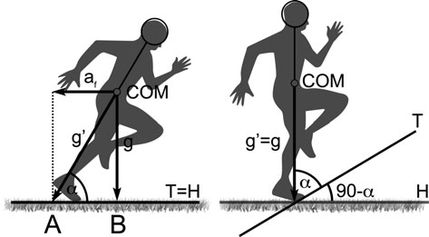
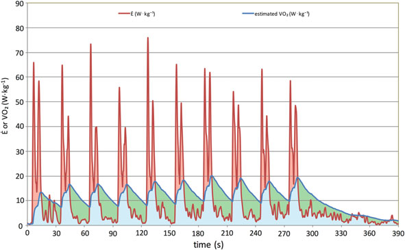
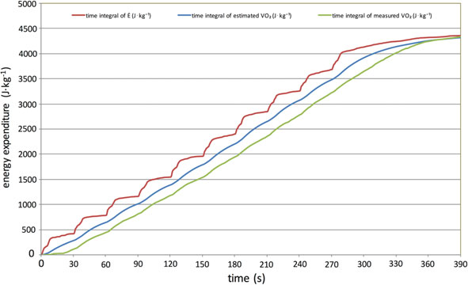
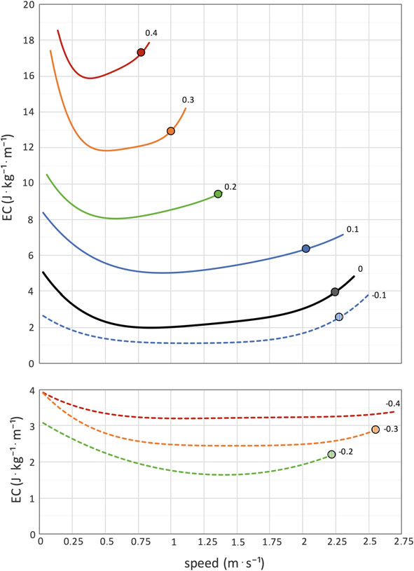

# 第 13 章：足球中的代谢能力和耗氧量

代谢力和氧气

足球消费：事实与理论

Cristian Osgnach 和 Pietro E. di Prampero 摘要 在简要概述了平坦地形上加速/减速跑步能量成本评估的基本原理之后，根据最后一次恒速跑步与上坡/下坡跑步之间的生物力学等效性获得，代谢功率和实际 O2 消耗量 (_VO2) 将在典型的训练演习和足球比赛的短暂时间内进行估计。 本练习将表明： (i) _VO2，根据假设单指数 _VO2 开/关响应在肌肉水平上的时间常数为 20 秒，根据代谢功率估算得出，基本上等于通过代谢车直接测量的值。 因此，(ii) 如果个体 _VO2max 也已知，则也可以估计来自有氧和无氧来源的总能量消耗的比例。 此外，代谢功率方法将得到更新，以便在步行期间也可以估计能量成本和代谢功率。 事实上，对于任何给定的坡度，跑步的能量成本与速度无关，而步行的能量成本在最佳速度之上和之下达到最小值，在该速度之上和之下它都会增加。 随着地形坡度的增加，能量消耗与步行速度的关系曲线保持这种一般的 U 形，但移动到更高的水平，最佳速度向更低的值降低。 此外，对于任何给定的坡度，都存在一个“过渡速度”，在该速度下步行的能量消耗大于跑步的能量消耗，并且该速度对应于受试者自发采取跑步步态的速度。 因此，更新的算法检测该转变速度，作为等效坡度的函数，并在后续计算中利用步行或跑步的适当能量成本。 最后的段落专门对代谢功率方法的主要假设进行了批判性讨论。 具体来说，我们将强调这种方法仅适用于向前行走或跑步。 因此，虽然其他特定的体育活动，例如跳跃，

C. Osgnach (&) P. E. di Prampero 运动科学系，Exelio srl, 33100 Udine, Italy 电子邮件：Christian.osgnach@gmail.com

P. E. di Prampero 乌迪内大学医学科学系，33100 乌迪内，意大利

向后、横向或带球移动，至少在广义上可以考虑在内，假设适当的校正因子（可能基于实际实验数据），其他活动，例如橄榄球、美式橄榄球中发生的活动，需要完全不同的方法，这一事实似乎常常没有得到适当的考虑。

## 13.1

简介 足球以及许多其他团队运动的特点是频繁出现加速和减速跑动。 与在平坦地形上以相同平均速度跑步的相似时期相比，这会导致足球训练或比赛的任何给定部分的总体能量成本大幅增加。 然而，传统上对足球运动负荷的评估是基于速度和距离（Carling et al. 2008；Sarmento et al. 2014），而不考虑干预速度变化的时间过程，因此明显忽略了经常发生的低运动强度和高运动强度之间的突然转变，反之亦然（Osgnach et al. 2010）。 然而，近年来，一方面由于 GPS 技术的进步，另一方面由于我们对加速和减速跑步能量学的理解，已经成为可能：(i) 估计任何给定运动员瞬时代谢功率需求的时间过程，以及 (ii) 由此推断实际 O2 消耗 (_VO2) 的时间过程（di Prampero 等人，2015）。 本章致力于回顾代谢功率估计的基本假设，及其生理意义及其与实际_VO2的关系，目的是在比赛或训练的任何给定时间段内，清晰地了解总体能量消耗及其分为有氧和无氧部分的情况。 此外，我们还将更新之前的方法，旨在分别考虑比赛或训练的任何给定时间段内的跑步或步行事件。 然而，在进一步讨论这些问题之前，总结一下代谢能力估计的主要原理似乎很有用，读者可以参考第 1 章。 12 进行更详细的讨论。

## 13.2

理论 在加速/减速跑步期间直接测量代谢功率是相当有问题的，因为任何此类事件的持续时间短且强度高，一方面妨碍了稳定状态的实现，另一方面意味着代谢功率需求可能大大超过受试者的_VO2max。

C. Osgnach 和 P. E. di Prampero

另一种方法是根据跑步的能量成本（估计）和速度（测量）的乘积来估计代谢功率（参见第 13.3 节）。 反过来，假设在平坦地形上加速/减速跑步在生物力学上相当于匀速上坡/下坡跑步，则可以估计跑步的能量成本。 上述类比背后的理论在图 13.1 中以图形方式进行了总结，来自我们小组的原始论文（di Prampero 等人，2005 年；Osgnach 等人，2010 年）； di Prampero 等人最近对其进行了审查。 （2015）并在下面和第 1 章中进行了简要概述。 12、有兴趣的读者可参阅原文。 图 13.1 显示，在平坦地形上加速跑步和以恒定速度上坡跑可以被认为是生物力学等效的，前提是平均身体轴线与地形之间的角度 (a) 在两种情况下相等。 由此必然得出结论，地形的坡度（由地形与水平面之间的角度给出）与 a 的补数 (90 -a) 成正比，如图 13.1 所示，a 的补数随着向前加速度 (af) 的增加而增加。 此外，地形的倾斜度通常表示为角度90-a的正切； 因此，可以通过前向加速度（af）与重力加速度（g）之间的比率轻松获得（图 13.1）： af =

$$ g = tan (90 a) = ES \quad (13.1) $$

根据计算，ES 是角度的正切，使加速跑步在生物力学上相当于以恒定速度跑上相应的斜坡，因此定义了“等效坡度”（ES）。 除了等同于上坡跑之外，加速跑与匀速跑相比还有另一个不同之处。 事实上，在前一种情况下，跑步者在整个跨步中必须产生的平均力是由跑步者的体重与前向加速度和重力加速度的矢量和的乘积给出的 $g0 = a2 f + g2 q$ 。 因此，它大于以恒定速度上坡跑步时施加的力，在这种情况下，跑步者产生的力由体重和重力加速度的乘积给出（见图 13.1）。 因此，为了考虑到这种影响，跑步者的体重必须乘以此处定义的“等效体重”（EM）因子，如下所示：

 $EM = a2 f$ × g2 q = g ¼ α2 f =

$$ g2 + 1 r \quad (13.2) $$

代入方程式： （13.1）代入等式。 （13.2）： $EM = a2 f$ = g2 × $1 r = ES2$ + 1 p ð13:3Þ 足球中的代谢功率和摄氧量：事实与理论

还必须指出的是，在减速运行期间，相当于下坡运行，在这种情况下，等效斜率（ES）为负，但 EM 仍将呈现正值，因为式（1）中的 ES 为正值。 (13.3) 的 2 次方。等效斜率 (ES) 和质量 (EM)，如从方程 1 中获得的。 （13.1）和（13.3），不考虑空气阻力的影响。 事实上，为了克服最后一个问题，在加速过程中，跑步者必须向前倾斜到比向前加速度本身所需的更大的程度。 相反，在减速期间，空气阻力“帮助”跑步者的制动动作，以便他/她向后倾斜的程度小于（负）向前加速度所需的程度。 这些影响虽然很小，但可以如下考虑。 空气阻力 (R) 随着空气速度 (v) 的平方而增加，如 (di Prampero 2015) 所述：

$$ R = k v2 \quad (13.4) $$

其中 k 是一个常数，每公斤体重且以 m s−1 表示 v 时，其值范围为 0.0025 至 0.0048 (J s2 kg−1 m−3) (Pugh 1970；Tam 等人 2012；di Prampero 等人 2015)。 在量纲上，R 是单位体重和单位距离 (J kg−1 m−1) 对抗空气阻力所做的机械功。 由于该量的分子是功（=质量加速距离），因此质量和距离相互抵消； 因此，在数值和维度上 R = 加速度 (m s−2)。 因此，为了考虑到空气阻力的（小）影响，可以计算 ES 和 EM 来代替等式中的 af/g。 (13.1) 和 (13.3) 的量为 af + R。如果是这样的话： 图 13.1 受试者在平坦地形上跑步（左图）或匀速上坡跑步（右图）时加速向前。 COM，主体的质心； af，前进加速度； g，重力加速度； $g0 = a2 f$ × g2 q ，af 加 g 的矢量和； T，地形； H，水平； a，跑步者在整个步幅中的平均身体轴线与 T 之间的角度； 90 −a，T 和 H 之间的角度。简单的几何表明，角度 A – COM – B 等于 90 −a。 因此，由于线段AB的长度等于af，因此角度90-a的正切由比率AB/g=af/g给出。 详情请参阅文字。 （根据 Osgnach 等人 2010 年修改）

C. Osgnach 和 P. E. di Prampero

ES 1/4 of þ R =g ð13:5Þ 和 $EM =$ $$ ES 2 + 1 ( ) p \quad (13.6) $$

其中星号表示已针对空气阻力校正了适当的量。 顺便说一句，等式。 (13.5) 可以估计，在无风的平坦地形上以 20 km h−1 (5.55 m s−1) 的速度跑步相当于在坡度约为 1% 的跑步机上上坡跑步 (ES* (0.0037 5.552) / 9.81 = 0.0115)。 这与让受试者在跑步机上以 1% 的坡度跑步来模拟有氧速度范围内遇到的空气阻力的常见做法是一致的。 可以得出，如果确定了加减速运行时速度的时间过程，并计算出相应的瞬时加减速度，则 式（13.5）和式（13.6）可以得到合适的ES*和EM*值，从而将加速/减速运行转化为等效的恒速上坡/下坡运行。 事实上，Minetti 等人描述了最后一个 (Cr) 的能量成本，作为 i = -0.45 到 i = + 0.45 范围内的斜率 (i) 的函数。 (2002) $: Cr = 155:4 i5 30:4 i4 43:3 i3$ + 46:3 i2 + 19:5 i + 3:6 ð13:7Þ 将 i 替换为等效斜率（ES*），表示 C0 为匀速水平运行的能量消耗，乘以等效体重（EM*），即为加速/减速时对应的能量消耗 运行可以很容易地获得： $Cr = (155:4 ES 5 30:4 ES 4 43:3 ES 3$ × 46:3 ES 2 ×

$$ 19:5 ES + C0) EM \quad (13.8) $$

有关更详细的讨论，读者可以参考第 1 章。 12.2，以及原始论文。

## 13.3

代谢功率和耗氧量 在跑步以及任何其他形式的运动中，瞬时速度 (v, m s−1) 与每单位体重和距离的相应能量消耗 (Cr, J kg−1 m−1) 的乘积得出以相关速度进行所需的瞬时代谢功率 (E , W kg-1)： 足球中的代谢功率和摄氧量：事实与理论

$$ E = v Cr \quad (13.9) $$

因此，代谢能力是衡量每单位时间重建用于工作表现的 ATP 所需能量总量的指标。 我们还想指出式中的 Cr。 (13.9) 是在确定 v 的那一刻应用的值。 因此，虽然在恒定速度下，无论是在平坦地形上还是在恒定坡度上（下），Cr 和 v（因此 E ）都是恒定的，但当地形坡度（以及相应的 Cr）和/或速度变化时，情况就不是这样了。 应该指出的是，在后一种情况下，速度变化对代谢功率有双重影响：一方面是因为 v 在设置 E 中的直接作用，另一方面是因为在加速（或减速）阶段 Cr 的增加（或减少）与加速（减速度）本身成正比。 还应该注意的是，前面的考虑因素以及方程式。 （13.9）如所写，适用于跑步。 然而，在足球比赛中，跑步过程中会穿插一些步行时间。 由于步行的能量成本 (Cw) 远低于跑步的能量成本，为了正确估计代谢能力，必须清楚地识别这些事件并应用适当的能量成本值，如下文详细讨论（第 13.4 节）。 与代谢能力不同，实际耗氧量 (_VO2) 是衡量以氧化过程为代价实际再合成的 ATP 量的指标。 因此，在任何给定时间，_VO2 可能等于、大于或小于代谢功率，因为​​： 与工作强度的变化率相比，氧化过程相当缓慢，因为它们按照指数过程适应所需的代谢能力，在肌肉水平上的时间常数约为 20 秒； 二. 在短时间的剧烈运动中（足球运动的一个常见特征），代谢功率需求可以达到大大超过受试者最大耗氧量（_VO2max）的值。 这些考虑表明，在典型的“方波”有氧运动中，大约 3 分钟后，实际_VO2 和代谢功率是一致的，而在足球以及许多其他团队运动中，由于发生了几次持续时间短的高强度回合，并且散布在低强度时段之间，_VO2 的时间进程与代谢功率需求的时间进程明显不同。 因此，在比赛或训练期间的任何给定时间，在强度（代谢功率）快速变化的过程中（图 13.2），实际 _VO2 可能小于、等于或大于瞬时代谢功率，具体取决于：(i) 代谢功率需求的时间曲线和 (ii) 受试者的 _VO2max。 正如其他地方详细讨论的那样（di Prampero 等人，2015 年），了解代谢功率需求的时间过程可以让人们估计

C. Osgnach 和 P. E. di Prampero

_VO2 的相应时间过程，假设代谢瞬态期间 _VO2 动力学的平均时间常数，如文献数据所示，基于个体 _VO2max。 如此获得的估计 _VO2 值基本上等于 9 名受试者在 5 秒内进行一系列超过 25 m 距离的穿梭跑的实际测量值。 每回合之后立即进行相反方向的同等跑动（同样是 5 秒内 25 m）。 任意两次比赛之间间隔20秒，整个循环重复10次（总跑距离为500m）。 然后，通过与 GPS 系统（GPEXE®，Exelio，乌迪内，意大利 1）中实现的相同方程组计算跑步速度、相应的瞬时加速度、能量成本和代谢功率，并在其他地方详细描述（di Prampero 等人，2005 年、2015 年；Osgnach 等人，2010 年）。 这使我们能够将消耗的 O2 总量（根据如上所述估计的 _VO2 时间过程的积分计算得出）与通过便携式代谢车（K4，Cosmed，罗马，意大利）获得的相应值进行比较，从而得出单次呼吸的实际 _VO2 消耗量。 如此获得的数据表示为图 13.3 中的典型受试者，报告了以下时间积分：

图 13.2 在一个受试者中，在一系列穿梭跑（25 m + 25 m，5 s + 5 s）和随后的 20 s 间隔期间，代谢功率（E，红线，尖峰）和 O2 消耗（_VO2，蓝线，平滑峰）（W kg−1）作为时间（s）的函数。 每个循环重复 10 次，总运行距离为 500 m。 红色区域（_VO2 以上且 Ė 以下）和蓝色区域（_VO2 以下）分别表示运动期间的无氧和有氧能量产量。 绿色区域（低于 _VO2 和高于 Ė）表示磷酸肌酸再合成（无乳酸 O2 债务支付）的恢复过程中消耗的 O2 量。 详细信息请参见文字（在线彩图） 1有关 GPEXE ® 系统（意大利乌迪内）的信息和进一步详细信息，读者可访问 www.gpexe.com。 足球中的代谢功率和摄氧量：事实与理论

我。 代谢功率需求（E，红线，上）； 二. _VO2 根据肌肉水平 20 秒的时间常数估算（蓝线，中）； 三. 实际测量的_VO2（绿线，较低）。 对该图的检查表明： i． 累积 _VO2 值（估计或测量）非常接近； 二. 它们相当好地遵循总能量消耗的时间进程（即代谢功率需求的时间积分）； 三. _VO2 动力学的时间常数，由两个函数（测量或估计的 _VO2 和代谢功率）之间的水平时间差给出，在测量部位（上呼吸道）结果比假设在肌肉水平保持的时间常数（20 秒）更长（35 秒）。 这些考虑因素为上述方法提供了实验支持。 具体来说，这种方法允许人们评估：(i) _VO2 曲线下方的面积（见图 13.2），从而得出实际从有氧来源获得的能量总量，以及 (ii) 报告代谢功率时间过程的曲线和报告 _VO2 时间过程的曲线之间的面积。 必须指出的是，这两条曲线之间的面积的生理意义主要取决于它们的相对位置。 事实上，当代谢功率大于 _VO2 时，相应的面积是图 13.3 时间积分 (J kg−1) 量的量度，作为时间 (s) 的函数： (i) 代谢功率需求（红色，上），由 GPS 确定（GPEXE®, Exelio, Udine, Italy）； (ii) 根据 20 s 时间常数估算的 _VO2（蓝色，中）； (iii) 在与图 13.2 相同的训练演习和同一科目中，通过便携式代谢车（K4，Cosmed，罗马，意大利）实际测量的 _VO2（绿色，下）。 详情请参阅文字。 （根据 di Prampero 等人 2015 年修改）（在线彩色图）

C. Osgnach 和 P. E. di Prampero

来自厌氧源的能量。 相反，当代谢功率小于_VO2时，相应的面积表示从有氧来源获得的能量以“偿还无乳酸O2债务”，即重新合成在运动的前一阶段分解的一定量的磷酸肌酸（PCr）。 这种状态允许人们在比赛或训练的任何给定时期得出完整的能量平衡。 事实上，如果 _VO2 曲线的总时间积分（包括恢复期）等于代谢功率曲线的总时间积分，则可以得出结论，整个运动周期中使用的能量来源完全是有氧的，到目前为止，高强度训练期间的 PCr 分裂量在训练之间的恢复期间完全重建。 相反，如果代谢功率曲线的时间积分大于_VO2曲线的时间积分，则可以得出一定量的能量来自净乳酸积累。 图 13.4 报告了在实际足球比赛的前几分钟应用这种方法的实际例子。 在这种特定情况下，在整个选定的时间窗口中，代谢功率远大于玩家的_VO2max，并且鉴于此高代谢功率阶段的持续时间相对较长，实际_VO2确实达到了玩家的_VO2max。 此外，在随后的代谢能力较温和（即低于 _VO2max）的时期，实际 _VO2 仍保持在最大水平几秒钟。 由于这种情况，实际的总体无氧能量产量（由所有红色区域（高于 _VO2 和低于 Ė）的总和给出）大于总体有氧产量（由高强度运动阶段低于实际 _VO2 的面积加上对应于乳酸 O2 债务支付的面积给出）。 这种情况的最终结果是必须产生一定量的乳酸来弥补总体能量需求（代谢功率曲线下方的区域）和总体有氧能量产量（_VO2 曲线下方的区域）之间的差异。 可以得出结论，上面简要描述的方法以及图 13.4 中的图形说明，允许人们在训练期或比赛的任何定义的时间间隔内绘制相当准确的总体能量平衡，前提是受试者的 _VO2max 也是已知的。

## 13.4

能量成本在设定代谢中的作用

功率估计与图 13.3 中报告的数据不同，最近的几项研究报告称，与便携式代谢车确定的实际 O2 消耗量相比，从 GPS 数据获得的代谢功率被大大低估（Buchheit 等人，2015 年；Brown 等人，2016 年；Highton 等人，2016 年；Stevens 等人，2015 年）。 然而，除了在其他地方简要讨论的数据收集和分析中存在一些不一致之处（Osgnach 等人，2016 年）之外，对这些研究的仔细检查表明足球中的代谢功率和摄氧量：事实与理论

代谢功率方法常常被“延伸”到包括沿着蜿蜒路径进行带球训练、橄榄球中的等距训练或任何其他无法轻易与代谢功率方法所依据的理论支柱相协调的情况等活动。 此外，在其中一些研究中，地形的影响和跑步能量成本的个体间差异常常被忽略或仅很少讨论或仅限于相当低的加速度/减速度值。 事实上，史蒂文斯等人。 （2015）最近报道称，航天飞机运行的平均估计能源成本比直接测量值小约 15%（即 4.95-5.73，相比之下为 5.73-6.71 J kg−1 m−1）。 这种差异虽然不是微不足道的，但很可能是由于往返跑技术的个体差异造成的。 此外，本研究研究了相对较小范围的加速度/减速度（可估计为 <1 m s−2），因此相应的 ES* 值位于加速度（上坡）影响与减速度（下坡）影响几乎相等且相反的范围内。 鉴于这些差异，以下段落的目的是回顾从 GPS 数据获得的代谢功率估计的基本假设，并指出这种方法的局限性。 正如原始论文中详细讨论的那样，读者可以参考该论文以获取更多详细信息，在平坦地形上匀速跑步 (C0) 的能量成本的选择对于设置加速/减速跑步的能量成本以及相应的代谢能力至关重要。 Minetti 等人在跑步机上测定，其净值（高于静止状态）(J kg−1 m−1) 范围为 3.6。

图 13.4 一名球员在实际足球比赛的第一分钟内的代谢功率（E，红线，尖峰）和估计的 O2 消耗量（_VO2，蓝线，平滑峰值）（W kg−1）作为时间（s）的函数，其 _VO2max 高于静息状态（18 W kg−1 52 ml O2 kg−1 min−1）由虚线水平线表示。 详细内容请参见文字，彩色区域的含义请参见图 13.3（在线彩图）

C. Osgnach 和 P. E. di Prampero

(2002)，在跑步机上为 4.32 ± 0.42，在地形上为 4.18 ± 0.34，正如 Minetti 等人最近确定的那样。 (2012) 在 11 km h−1 时，到 4.39 ± 0.43 (n = 65)，由 Buglione 和 di Prampero (2013) 在跑步机上以 10 km h−1 的速度运行时确定，绝大多数数据聚集在 4 J kg−1 m−1 的值附近 (Lacour 和 Bourdin 2015)。 因此，一方面建议确定每个受试者的 C0，另一方面通常可以方便地假设一个大约 4 J kg−1 m−1 的唯一值。 还应该指出的是，除了 C0 的个体差异外，它的值还取决于地形的类型（例如：人造草与天然草、紧凑地表与软地表等），因此，在选择其数值时必须持保留态度。 此外，还应该强调的是，所获得的能量成本和代谢功率的估计适用于向前奔跑，因此在足球或其他运动中的比赛或训练中出现的其他特定情况的代谢成本，例如向后奔跑、带球或无球奔跑、突然跳跃、改变方向、铲球等，不可避免地会引入一定程度的不确定性，必须进行相应处理。 然而，在现阶段，在文献中可获得的明确科学数据中，没有一个能够以合理的准确性考虑这种情况。 因此，我们认为最好接受这种不可避免地内置于系统算法中的不确定性，而不是依赖可疑的修正和假设。 这在橄榄球或美式足球等团队运动中尤其重要，在这些运动中，球员之间发生剧烈碰撞或用力推挤的众多场面的能量不容易适应前锋的跑动。 最后应该指出的是，这些一般考虑因素也适用于基于速度和/或加速度的方法，这些方法不能（也不会）产生有关上述运动特定活动的任何信息（Polgalze 等人，2015）。 此外，即使应用于向前跑步，这些方法也忽略了跑步能量成本的个体间差异以及地形类型的影响。 在处理跑步的能量消耗和代谢能力时需要考虑的另一点是，加速/减速和上坡/下坡跑步之间的等价性是基于 Minetti 等人获得的数据。 (2002) 的斜率范围在 -0.45 和 +0.45 之间。 对于超出此范围的斜率，我们的方法依赖于 Minetti 等人的数据的线性外推（参见 Giovanelli 等人，2016），而不是作者的多项式方程，显然，多项式方程不能扩展到实验观测范围之外 [参见方程 1]。 (13.7)]。 然而，如此高的加速度/减速度值的出现相当罕见，因此这种近似不会导致任何重大误差。 这些注意事项适用于跑步； 然而，在一场典型的足球比赛中，跑步比赛中会散布一些步行片段，这一事实可能确实导致了上述估计代谢功率与测量的耗氧量之间的一些差异。 事实上，对于任何给定的坡度，匀速跑步的能量消耗与足球中的代谢功率和摄氧量无关：事实与理论

就速度本身而言，步行的能量消耗在最佳速度下达到最低值，高于或低于该速度则能量消耗增加。 如图 13.5 所示： 对于水平行走，Cw 在约 4.5 km h−1 (1.25 m s−1) 时达到最小值约 2 J kg−1 m−1 （即约匀速水平跑步值的一半）； 二. 在较高速度下，Cw 增加到约等于水平运行的值 (4 J kg−1 m−1)，速度约为 8 km h−1 (2.22 m s−1)； 三. 随着地形坡度的增加，Cw与速度的曲线保持大致U形，但向更高的水平移动，最佳速度向更低的值减小； 四. 当下坡行走时，直到坡度约为 –20% 时，趋势相反：在任何给定速度下 Cw 较低，而最佳速度增加； v. 对于陡于-20% 的坡度，Cw 与速度曲线再次向上移动并趋于变得平坦，因此难以精确识别最佳速度。 据 Minetti 等人报道。 根据 (2002) 的研究，步行的最小能量消耗 (Cwmin, J kg−1 m−1) 与地形坡度 (i) 之间的关系可以用以下五阶多项式方程来适当描述： $Cwmin = 280:5 i5 58:7 i4 76:8 i3$ + 51:9 i2 + 19:6 i + 2:5 ð13:10Þ 其中最后一项 (2.5 J kg−1 m−1) 是在平坦地形上以最佳速度行走的能量消耗。 还应该指出的是，对于非常陡的坡度 (> ± 0.50)，该方程产生的 Cwmin 值相当接近从描述跑步能量成本与坡度之间关系的 5 阶多项式方程获得的值 [方程 1]。 (13.7)]。 这组作者认为，这表明在这些非常高的斜坡上行走和跑步“失去了钟摆和弹球机制”，因此在如此陡峭的斜坡上，将“行走”或“跑步”视为不同的步态可能是不合理的。 尽管如此，有趣的是，虽然跑步的能量消耗与速度无关，但在步行中（至少在 0 到 ± 0.40 之间的坡度范围内，可以合法地谈论步行与跑步），如上所述，情况并非如此。 事实上，在这个斜率范围内，存在一个速度，这里定义为“过渡速度”，在这个速度下，受试者自发地将步态从步行改变为跑步（图 13.5 中的点）。 在平坦地形上，过渡速度约为 8 km h−1 (2.22 m s−1)，就能量成本而言，基本上等于步行比跑步更昂贵的速度。 顺便说一句，这种情况在狗和马身上更为复杂，由于它们的四足运动，它们可以采取三种步态：步态、小跑和疾驰。 自发采取的步态始终与更经济的步态相对应（就能量成本而言）。 可以合理地假设，同样当上坡或下坡步行或跑步时，过渡速度对应于两种运动形式的能量成本变得相等的速度。 图 13.5 中报告的数据使我们能够估计 -0.30 和 +0.40 之间任何给定斜度（或 ES*）的过渡速度（vtr，m s−1），如下所述：

C. Osgnach 和 $P. E. di Prampero vtr = 107:1 ES 5$ × 113:1 ES 4 1:1 ES 3 15:8 ES 2 1:7 ES × 2:3 ð13:11Þ 应当注意的是，该等式仅适用于上述斜度或 ES* 值的范围内。 事实上，对于比 +0.40 更陡的坡度，步行的最小能量成本等于跑步的最小能量成本，而对于比 +0.40 更陡的坡度，图 13.5 步行的能量成本 (J kg−1 m−1) 作为指示坡度 (i) 处速度 (m s−1) 的函数。 空心点表示“过渡”速度，即步行和跑步的能量消耗相等的速度（见正文）。 （根据 Margaria 1938 年修改）足球中的代谢功率和摄氧量：事实与理论

−0.30，就很难确定清晰的过渡速度（见图 13.5）。 因此，对于在 -0.30 到 +0.40 范围内的任何给定 ES*，代谢功率计算中使用的能量成本是与步行或跑步相关的能量成本，具体取决于速度是低于还是高于上述方程描述的转换阈值。 在任何情况下，对于较陡的斜坡，选定的能量成本都是与跑步相关的能量成本。 还应该指出的是，这组计算基于隐含的假设，即平坦地形上的加速/减速跑步与匀速上坡/下坡跑步之间的类比可以应用于步行，因此估计等效坡度和质量的程序在两种运动形式中是相同的。

## 13.5

代谢能力评估的局限性 上面总结的模型基于下面简要报告的几个附加假设，有兴趣的读者可以参考原始论文以获取更多详细信息（di Prampero 等人，2005 年、2015 年；Osgnach 等人，2010 年）： 跑步者的整体质量集中在他/她的质心。 这必然意味着加速跑时和匀速上坡跑相同等效坡度时，由于内部做功（例如相对于质心移动上肢和下肢所需的能量）所消耗的能量是相同的（ES*）； 二. 假设 (i) 还意味着，对于任何给定的 ES* 值，加速跑步的步频等于在相应斜坡上匀速（上坡/下坡跑步）的步频； 三. 对于任何给定的 ES*，加速跑步期间新陈代谢到机械能的转换效率等于在相应斜坡上匀速跑步的效率。 这也意味着跑步的生物力学，在关节角度和扭矩等方面，在两种情况下是相同的； 四. 假设计算出的 ES* 值超过在平坦地形上匀速跑步期间观察到的值，在这种情况下，跑步者会稍微向前倾斜。 然而，不能期望这会引入大的误差，因为在所有情况下，参考值都是在平坦地形上匀速行驶的能量成本（C0）。

C. Osgnach 和 P. E. di Prampero

## 13.6

结论 我们想强调一个事实，即必须适当选择数据收集技术。 事实上，由于我们处理的是加速度，任何低于 10 Hz 的采样频率都是非常值得怀疑的。 此外，还必须适当考虑对信号进行滤波，以平滑与步幅频率同步的质心加速度/减速度，以减少噪声，而不丢失信息。 最后，经常提出的利用惯性传感器获得的机械量是值得怀疑的，因为到目前为止，还没有任何令人信服的实验数据将观察到的机械变量与相应的能量消耗联系起来。 总之，我们强烈支持所提出的模型的总体有效性，尽管在上述讨论的范围内，并且假设实际调查的体育活动主要包括（或合理地适合）向前跑步或步行。 致谢 衷心感谢“乌迪内大教堂狮子俱乐部”的财政支持。

参考文献 Brown DM、Dwyer DB、Robertson SJ、Gastin PB (2016) 代谢功率方法使用 GPS 跟踪系统低估了野外运动中的能量消耗。 国际运动生理学杂志

执行 11:1067–1073 Buchheit M、Manouvrier C、Cassiram J、Morin JB (2015) 监测足球运动负荷：新陈代谢能力强大吗？ Int J Sports Med 36:1149–1155 Buglione A, di Prampero PE (2013) 穿梭跑的能量成本。 Eur J Appl Physiol 113:1535–1543 Carling C、Bloomfield J、Nelsen L、Reilly T (2008) 运动分析在精英足球中的作用：当代表现测量技术和工作率数据。 Sports Med 38:839– di Prampero PE (2015) La Locomozione umana su Terra，位于 Acqua，位于 Aria。 法蒂和泰奥里。

Edi-Ermes，米兰，意大利，221 + IX。 第 108–112 页 di Prampero PE、Fusi S、Sepulcri L、Morin JB、Belli A、Antonutto G (2005) 冲刺跑：一种新的充满活力的方法。 J Exp Biol 208:2809–2816 di Prampero PE, Botter A, Osgnach C (2015) 短跑的能量成本以及代谢能力在创造最佳表现中的作用。 Eur J Appl Physiol 115:451–469 Giovanelli N, Ryan Ortiz AL, Henninger K, Kram R (2016) 垂直千米竞走的能量学； 越陡越便宜吗？ J Appl Physiol 120:370–375 Highton J, Mullen T, Norris J, Oxendale C, Twist C (2016) 微技术产生的能量消耗不适合评估基于碰撞的活动中的内部负载。 国际期刊

Sports Physiol Perform 20:957–961 Lacour JR, Bourdin M (2015) 影响次最大速度水平跑步能量成本的因素。 Eur J Appl Physiol 115:651–673 Margaria R (1938) 关于生理学，特别是关于以不同速度和地形倾斜度行走和跑步的能量消耗。 行为 Acc Naz Lincei。 6:299–368 足球中的代谢能力和摄氧量：事实与理论

Minetti AE、Moia C、Roi GS、Susta D、Ferretti G (2002) 在极端上坡和下坡时行走和跑步的能量成本。 J Appl Physiol 93:1039–1046 Minetti AE, Gaudino P, Seminati E, Cazzola D (2012) 与步行一样，人类跑步的运输成本不会受到宽加速/减速周期的影响。 J Appl Physiol 114:498– Osgnach C、Poser S、Bernardini R、Rinaldo R、di Prampero PE (2010) 精英足球中的能量成本和代谢能力：一种新的比赛分析方法。 Med Sci Sports Exerc 42:170–178 Osgnach C, Paolini E, Roberti V, Vettor M, di Prampero PE (2016) 团队运动中的代谢功率和耗氧量：对 Buchheit 等人的简要回应。 Int J Sports Med。 37:77–81 Polglaze T、Dawson B、Peeling P (2015) 金本位还是愚人金？ 排量变量作为团队运动中能量消耗指标的有效性。 Sports Med 46:657 – Pugh LG (1970) 田径和跑步机跑步中的氧气摄入量以及对空气阻力影响的观察。 J Physiol 207:823–835 Sarmento H, Marcelino R, Anguera MT, Campaniço J, Matos N, Leitão JC (2014) 足球比赛分析：系统评价。 J Sports Sci 32：1831–1843 Stevens TG、De Ruiter CJ、Van Maurik D、Van Lierop CJ、Savelsbergh GJ、Beek PJ (2015) 测量和估计足球运动员持续跑和往返跑的能量成本。 医学科学

Sports Exerc 47:1219–1224 Tam E, Rossi H, Moia C, Berardelli C, Rosa G, Capelli C, Ferretti G (2012) 肯尼亚顶级马拉松运动员的跑步能量。 欧洲应用生理学杂志 112：3797–3806

C. Osgnach 和 P. E. di Prampero